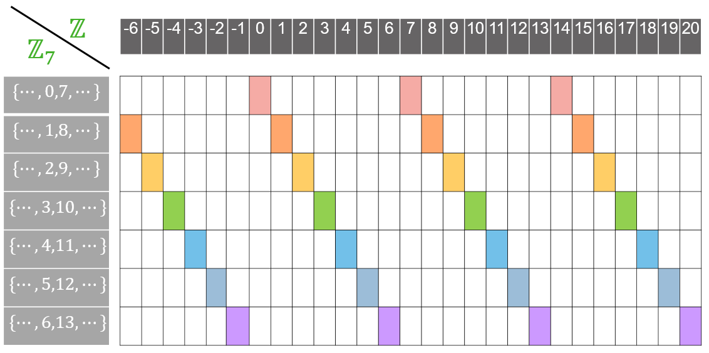

NMS Skaitļu teorija #2: Modulārā aritmētika
=================================================

Skaitļu teorijā daudzi rezultāti ir iegūstami galīgās atlikumu kopās. 
Tie izmanto kombinatoriskas metodes, jo bezgalīgi daudzo skaitļu vietā 
šķiro gadījumus. Piemēram, aplūkojot atlikumus, dalot ar :math:`2`, iegūstam 
divus gadījumus -- pāra skaitlis un nepāra skaitlis, kur rezultāta paritātei
vairs nevajag zināt pašu skaitli, bet tikai atlikumu.

Šādas idejas iespējams vispārināt arī atlikumiem, dalot ar lielākiem skaitļiem. 
Skaitļu teorijas algoritmus, kas uz skaitļiem raugās \"ar atlikumu brillēm\"
sauc par *modulāro aritmētiku*. Šajā nodaļā aplūkosim sekojošas tēmas:

* Kongruenču klases, modulārā aritmētika. 
* Dalāmības pazīmes ar :math:`3,9,2^k,5^k` kongruenču klašu atrašanai. 
* Mazā Fermā teorēma. Periodiskas decimāldaļas.
* Eilera funkcija un Eilera teorēma.
* Cikliski procesi . Periodiskas atlikumu virknes. 
* Periodi un priekšperiodi virknēs.

Ievaduzdevums
---------------

**Uzdevums (Valsts4Posms-2012.P1):** 
  Ar :math:`S(x)` apzīmēsim skaitļa :math:`x` ciparu summu. 
  Aprēķināt :math:`S(S(S(2012^{2012})))`.

**Risinājuma plāns:** 
  Skaitlis :math:`2012^{2012}` ir ļoti liels; aprēķināt visus šos ciparus ir 
  praktiski neiespējami. Toties skaitļa ciparu summa apmierina svarīgu invariantu 
  (atlikums, dalot ar :math:`9` saglabājas. 
  Risinājuma pirmajā daļā meklēsim vienīgi skaitļu :math:`S(S(S(2012^{2012})))`, 
  :math:`S(S(2012^{2012}))`, :math:`S(2012^{2012})` un :math:`2012^{2012}` atlikumu, 
  dalot ar :math:`9` (visiem tiem jābūt vienādiem). 
  Risinājuma otrajā daļā noskaidrosim, kurš no skaitļiem ar atrasto atlikumu 
  ir konkrēti :math:`S(S(S(2012^{2012})))` (novērtējot to ar nevienādībām). 

**Apgalvojums 1:**
  Ja :math:`n` ir naturāls skaitlis, tad tā ciparu summa :math:`S(n)`
  un pats skaitlis :math:`n` dod vienādus atlikumus, dalot ar :math:`9`. 
  (Šis apgalvojums pazīstams kā vispārināta dalāmības pazīme ar :math:`9`.) 
  
**Pierādījums:** 
  Skaitlis :math:`n = \overline{c_1c_2\ldots{}c_{k-1}c_k}`, kur :math:`c_i` ir decimālcipari, 
  ir pierakstāms kā polinoms, kur mainīgā vietā ir decimālsistēmas bāze :math:`x = 10`: 
  
  .. math:: 
  
    n = c_1 \cdot 10^{k-1} + c_2 \cdot 10^{k-2} + \ldots + c_{k-1} \cdot 10^{1} + c_k \cdot 10^{0}. 
    
  Ja aprēķinām ciparu summu :math:`S(n) = c_1 + c_2 + \ldots + c_{k-1} + c_k`, 
  tad tā atšķiras no :math:`n` ar to, ka saskaitāmo :math:`c_i \cdot 10^{k-i}` vietā 
  ir saskaitāmie :math:`c_i`. 
  Piemēram, ja ceturtais cipars no skaitļa beigām jeb *tūkstošu cipars* 
  ir :math:`c_{k-3} = 7`, tad vērtības :math:`7 \cdot 1000` vietā pieskaitām 
  vērtību :math:`7`.
  
  Starpība abām vērtībām ir :math:`c_i \cdot 10^{k-i} - c_i = c_i \cdot \overline{99\ldots99}`, kur
  cipars :math:`c_i` ir pareizināts ar skaitli kas sastāv no daudziem deviņniekiem. 
  Šis skaitlis, acīmredzot dalās ar :math:`9`. Tāpēc atlikums, dalot ar :math:`9` nemainās, 
  ja skaitli :math:`n` aizstāj ar :math:`S(n)` jeb katru ciparu 
  :math:`c_i` piesummē vienkārši, nevis reizina ar :math:`10` pakāpi 
  :math:`c_i \cdot 10^{k-i}`. :math:`\square`

  
**Apgalvojums 2:** 
  Pamatosim, ka :math:`2012^{2012}` dod atlikumu :math:`7`, dalot ar :math:`9`. 
  

**Pierādījums:** 
  Aplūkojot pakāpju :math:`a^b` atlikumus, dalot ar :math:`9`, 
  ievērojam, ka tie atkarīgi vienīgi
  no :math:`a` atlikuma, dalot ar :math:`9`, jo reizinot (un kāpinot)
  skaitļus ar vienādiem atlikumiem, arī rezultāti dos vienādus atlikumus. 
  Tātad :math:`a^b` atlikumi dalīšanā ar :math:`9`
  atkārtojas ar ciklu :math:`9`, ja pakāpes bāze :math:`a` aug.
  Izsakām :math:`(2012)^{2012} = (223 \cdot 9 + 5)^{2012}`. 
  Tātad jāmeklē atlikums, dalot :math:`5^{2012}` ar :math:`9`. 
  
  Otrs novērojums -- pakāpju :math:`a^b` atlikumi, dalot ar :math:`9`, 
  cikliski atkārtojas ik pēc :math:`6`, ja kāpinātājs :math:`b` aug.
  
  ================   ================   =====================
  :math:`n`          :math:`5^n`        Atlikums, dalot ar 9
  :math:`5^0`        :math:`1`          :math:`1`
  :math:`5^1`        :math:`5`          :math:`5`
  :math:`5^2`        :math:`25`         :math:`7`
  :math:`5^3`        :math:`125`        :math:`8`
  :math:`5^4`        :math:`625`        :math:`4`
  :math:`5^5`        :math:`3125`       :math:`2`
  :math:`5^6`        :math:`15625`      :math:`1`
  ================   ================   =====================

  Vēl lielākām pakāpēm atlikumi, dalot ar :math:`9` labajā kolonnā sāk atkārtoties: :math:`5^7` dod tādu pašu atlikumu kā :math:`5^1`, 
  :math:`5^8` dod tādu pašu atlikumu kā :math:`5^2`, utt. 
  Arī šīs tabulas aizpildīšanai var godīgi nekāpināt. Ja, teiksim, :math:`5^2 = 25` dod atlikumu :math:`7`, dalot ar :math:`9`, 
  tad nākamā atlikuma iegūšanai pietiek ar :math:`5` pareizināt nevis visu :math:`25`, bet gan tikai šo atlikumu :math:`7` -- rezultāts
  jeb atlikums skaitlim :math:`35` būs tas pats, kas atlikums skaitlim :math:`125`. 
  
  Tā kā :math:`5^6` dod atlikumu :math:`1`, dalot ar :math:`9`, 
  tad arī :math:`(5^6)^{335} = 5^{2010}` dod atlikumu :math:`1`. 

  Visbeidzot, :math:`5^{2012} = 5^{2010} \cdot 5^2 = 1 \cdot 25`, kas dod atlikumu :math:`7`, dalot ar :math:`9`.  
  :math:`\square`
  

**Secinājums:**
  Arī skaitlis :math:`S(S(S(2012^{2012})))` dod atlikumu :math:`7`, dalot ar :math:`9`. 
  :math:`\square`. (Apvienojam Apgalvojumu 1 un Apgalvojumu 2.) 

**Apgalvojums 3:** 
  :math:`S(S(S(2012^{2012}))) = 7`. 
  
**Pierādījums:** 
  Mums jāpārbauda, vai :math:`S(S(S(2012^{2012})))` nevar būt vienāds ar kādu citu skaitli, kas arī 
  dod atlikumu :math:`7`, dalot ar :math:`9`. Mazākais šāds skaitlis ir :math:`7+9 = 16`. 
  Pamatosim nevienādības: 
  
  .. math::
  
    \begin{array}{rl}
    (1) & S(S(S(2012^{2012}))) < 16,\\
    (2) & S(S(2012^{2012})) < 79,\\
    (3) & S(2012^{2012}) < 799999999.\\
    \end{array}

  Skaitlis :math:`79` ir mazākais, kurš dod atlikumu :math:`7` dalot ar :math:`9`, bet kura ciparu summa ir :math:`16`. 
  Skaitlis :math:`799999999` ir mazākais, kurš dod atlikumu :math:`7` dalot ar :math:`9`, bet kura ciparu summa ir :math:`79`. 
  Tāpēc :math:`(3) \rightarrow (2) \rightarrow (1)`. 
  
  Pierādīsim pašu pēdējo no minētajām nevienādībām, novērtējot pašu skaitli :math:`2012^{2012}`.
  
  .. math::
  
    2012^{2012} < 2100^{2100} = ((2.1)^3)^{700} \cdot (1000)^{2100} = (9.261)^{700} \cdot (1000)^{2100} < 10^{700} \cdot 10^{6300} = 10^{7000}.
    
  Iegūstam, ka skaitļa :math:`2012^{2012}` decimālpierakstā ir ne vairāk kā :math:`7000` cipari. 
  Pat ja tie visi būtu deviņnieki, tad to summa nepārsniedz :math:`63000`, kas ir mazāk nekā :math:`799999999`. 
  Tātad nevienādība (3) ir pierādīta (un tātad arī nevienādības (2) un (1)). :math:`\square`
    

Var pārbaudīt iegūto rezultātu (skaitli :math:`7`) ar aprēķinu valodā Python: 

.. code-block:: python

  def S(num):
      return sum(int(digit) for digit in str(num))

  S(S(S(2012**2012)))

  

Kongruenču klases
--------------------

Viena mēneša ietvaros var ievērot, ka datumi :math:`1,8,15,22,29` nonāk tanī pašā nedēļas dienā -- 
tādā ziņā tie ir ekvivalenti. Tāpat arī
datumi :math:`2,9,16,23,30` visi nonāk (citā) nedēļas dienā utml. 
Vispārīgāk -- visus veselos skaitļus (arī tos, kuri nevar būt kalendāra datumi) var 
sadalīt :math:`7` ekvivalences klasēs. 

**Apgalvojums:** 
  Dots naturāls skaitlis :math:`m`. 
  Tad katru veselu skaitli :math:`n` var vienā vienīgā veidā izteikt :math:`n = qm + r`, 
  kur :math:`q \in \mathbb{Z}`, bet :math:`r \in \{ 0, \ldots, m-1 \}`. 
  Šajā izteiksmē :math:`q` ir (veselo skaitļu dalīšanas) dalījums, bet 
  :math:`r \in \{ 0, 1, \ldots, m-1 \}` ir *atlikums*. 
  
**Definīcija:** 
  Ja divi veseli skaitļi :math:`n_1, n_2 \in \mathbb{Z}` dod vienādus atlikumus, dalot ar :math:`m`, 
  tad sauksim tos par *kongruentiem* pēc :math:`m` moduļa. Pieraksts: :math:`n_1 \equiv n_2 \pmod {m}`. 

**Piemērs:** 
  Kongruence pēc moduļa :math:`7` sadala visus veselos skaitļus :math:`n = 7` klasēs. 
  Katrā klasē ietilpst skaitļi, kas dod vienādus atlikumus pēc moduļa :math:`7`. Katru šādu klasi var aprakstīt šādi:

  .. math::
  
    \big\{ qk + r \,\mid\, q \in \mathbb{Z},\, r \in \{ 0,1,\ldots,6 \} \big\}.

   

**Definīcija:** 
  Dots vesels skaitlis :math:`m > 1`.
  Ar :math:`\mathbb{Z}_m` apzīmēsim skaitļu kopu ar :math:`m` elementiem
  :math:`\mathbb{Z}_m = \{ 0,1,2,\ldots,m-1\}`, kurā var veikt 
  saskaitīšanas, atņemšanas, reizināšanas un kāpināšanas darbības, kuru 
  rezultāti ir atlikumi, dalot ar :math:`m`.   

**Piemērs:** 
  :math:`a + b` šajā kopā dod rezultātu :math:`c`, ja :math:`c = (a + b)\,\text{mod}\,m`, kas
  ir atlikums, dalot :math:`(a+b)` ar :math:`m`.
  
**Apgalvojums:** 
  Veicot aritmētiskas darbības kopā :math:`\mathbb{Z}_m`, skaitļu :math:`a,b \in \mathbb{Z}_m`
  vietā var izvēlēties jebkurus veselus skaitļus :math:`a'` un :math:`b'`, 
  kuri dod atlikumus attiecīgi :math:`a` un :math:`b`, dalot ar :math:`m`. 
  
Šis apgalvojums ir spēkā, jo saskaitīšanas, atņemšanas un reizināšanas darbību atlikumu, dalot ar :math:`m`,
nosaka vienīgi operandu atlikumi, dalot ar :math:`m`. 
Šajā zīmējumā parādīts, kā var saskaitīt un sareizināt kopā :math:`\mathbb{Z}_7`. 
Saskaitāmo un reizinātāju :math:`3` un :math:`5` vietā var izvēlēties jebkuru 
pārstāvi no attiecīgās kongruenču klases. 

Citiem vārdiem, modulārā aritmētika kongruences klašu kopā 
:math:`\mathbb{Z}_7` izkrāso visus skaitļus
:math:`7` krāsās. Un balstās uz faktu, ka saskaitot divus skaitļus 
ar noteiktu krāsu, rezultāta krāsa arī būs viennozīmīgi noteikta.
  
.. image:: figs-ntjun02-modular-arithmetic/congruence-classes.png
   :width: 3.5in
   

.. figure:: figs-ntjun02-modular-arithmetic/multiplication-tables.png
   :width: 3.5in
   :alt: Saskaitīšanas un reizināšanas tabulas. 
   
   Saskaitīšanas un reizināšanas tabulas :math:`7` kongruenču klasēm no :math:`\mathbb{Z}_7`.

Paritāte
^^^^^^^^^^

Apakšgadījums kongruencēm pēc moduļa ir *paritāte*, kas visus veselos skaitļus iedala pāra 
skaitļos (:math:`\equiv 0 \pmod 2`) un nepāra skaitļos (:math:`\equiv 1 \pmod 2`).

.. code-block::

  p + p = p         p * p = p
  p + n = n         p * n = p
  n + p = n         n * p = p
  n + n = p         n * n = n
  

Šajos apzīmējumos :math:`\mathtt{p} = [0]_2` and :math:`\mathtt{n} = [1]_2` ir
abas ekvivalences klases pēc :math:`2` moduļa.

  

Lietojums mūzikas teorijā
^^^^^^^^^^^^^^^^^^^^^^^^^^^

Modulāro aritmētiku var viegli iztēloties kā aritmētiku uz pulksteņa 
ciparnīcas. Piemēram, :math:`14 \equiv 2 \pmod {12}` (pulksten ``2:00`` 
un ``14:00`` uz ciparnīcas izskatās vienādi). 
Savukārt, pieskaitot :math:`9` pie :math:`22` (pēc :math:`12` moduļa) 
iegūstam 7, jo :math:`22 + 9 \equiv 7 \pmod {12}`. 
Ja kopš laika momenta ``22:00`` paiet :math:`9` stundas, tad parasti saka, ka 
pulkstenis ir ``7:00``, nevis ``31:00``. Kaut arī ``31:00`` pauž to pašu
informāciju. 

.. figure:: figs-ntjun02-modular-arithmetic/kvintu-aplis.png
   :width: 2in
   :alt: Kvintu aplis zvaigznītes formā.
   
   "Kvintu aplis" zvaigznītes formā savieno "radniecīgus" nošu augstumus.

Līdzīgi \"pulksteņa ciparnīcas aritmētikai\" ir arī riņķošana pa nošu augstumiem,  
pārejot no vienas toņkārtas uz citu.
Zīmējumā dots mūzikas teorijā pazīstamais *kvintu aplis*. Apļa augšā atrodas skaņa DO (jeb C), 
kuras mažora gammā nav nevienas alterācijas zīmes (diēza vai bemola). Pārlecot par kvintu 
(jeb :math:`7` pustoņiem) uz priekšu, nonākam pie SOL (jeb G), kuras mažora gammā ir viens diēzs. 
Pēc sešiem pārlēcieniem par kvintu būsim nonākuši līdz FA diēzam (vienu pustoni uz augšu, salīdzinot ar C).
Virzoties pretējā virzienā, gammai nāk klāt pa vienam bemolam. 
Pašu FA diēza mažoru var uzrakstīt divos veidos -- vai nu kā FA diēza mažoru (kur sešas skaņas gammā ir paaugstinātas), 
vai arī kā SOL bemol minoru (kur sešas skaņas gammā ir pazeminātas).

   
   Kvintu aplis uz klavierēm, aptver :math:`7` oktāvas.

Kvintu aplis faktiski ir aritmētiska progresija ar diferenci :math:`7` pustoņi 
pēc moduļa :math:`12`. Šajā progresijā apzīmējam skaņas augstumu A(la) ar :math:`9`, jo tas ir 
:math:`9` pustoņus augstāk par C(do). Pēc divpadsmit soļiem virkne atgriežas sākumpunktā.

.. math::

  \textcolor{red}{9},\, 4,\, 11,\, 6,\, 1,\, 8,\, 3,\, 10,\, 5,\, 0,\, 7,\, 2,\, \textcolor{red}{9}\, \pmod {12}

Mūzikā skaitlim :math:`12` ir īpaša loma, jo oktāvu dala divpadsmit pustoņos. 
Savukārt skaitļu teorijas lietojumos modulārā aritmētika pēc :math:`12` moduļa
ir iespējama, bet bieži vien neērta, jo skaitļi, 
kuriem ir kopīgi dalītāji ar :math:`12` (pāru skaitļi, 
:math:`3` un :math:`9`) pēc šī moduļa uzvedas atšķirīgi no citiem skaitļiem. 
Minēto iemeslu dēļ matemātikā populārākā modulārā aritmētika ir :math:`\pmod p`, 
kur :math:`p` ir jebkurš pirmskaitlis. Dažos gadījumos arī :math:`\pmod {p^k}` -- 
kongruences pēc pirmskaitļu pakāpju moduļiem. 

Kongruenču īpašības
--------------------

**Apgalvojums:** 
  Saskaitīšanas, atņemšanas un reizināšanas izteiksmēs veseliem skaitļiem 
  rezultāta pēdējo ciparu nosaka izteiksmē ietilpstošo skaitļu pēdējie cipari.
  
**Piemērs:** 
  Ar kādu ciparu beidzas :math:`2022^{2022}``? 
  
**Risinājums:**
  Saskaņā ar apgalvojumu, pietiek atrast izteiksmes :math:`2^{2022}` pēdējo ciparu. 
  Izrakstot skaitļa :math:`2` pakāpes (:math:`1,2,4,8,16,32,64,\ldots`) secinām, 
  ka pakāpe vienmēr beidzas ar ciparu :math:`4` tad, ja kāpinātājs dod atlikumu 
  :math:`2`, dalot ar :math:`4`. (Piemēram, :math:`2^2 = 4`, :math:`2^6 = 64`, utt.)
  Tāpēc arī :math:`2^{2022}` beigsies ar ciparu :math:`4`. 

Modulārā kāpināšana
^^^^^^^^^^^^^^^^^^^^

Ja pakāpes bāze :math:`a` un kāpinātājs :math:`k` ir nelieli skaitļi 
tad pakāpes :math:`a^k` atlikumu dalot ar nelielu skaitli :math:`m`, aprēķinus bieži 
var veikt uz papīra -- pat ja skaitlis :math:`a^k` ir tik liels, lai 
to tieši izrēķināt nevarētu. 

**Piemērs 1:** 
  Atrast atlikumu, dalot :math:`2^{1000}` ar :math:`17`. 
  
**Risinājums:** 
  Ievērojam, ka :math:`2^4=16 \equiv -1 \pmod {17}`. 
  Tad :math:`2^{1000} = (2^4)^{250}  \equiv (-1)^{250} \equiv 1 \pmod {17}`. 

**Piemērs 2:** 
  Atrast atlikumu, dalot :math:`10^6=1000000` ar 7.
  
**Risinājums:**
  Pārveidojam šo pakāpi:
  
  .. math::
  
    10 \cdot 10 \cdot 10 \cdot 10 \cdot 10 \cdot 10 \equiv (3 \cdot 3) \cdot (3 \cdot 3) \cdot (3 \cdot 3) \equiv 2 \cdot 2 \cdot 2 \equiv 1 \pmod {7}.
    

**Piemērs 3:**
   Atrast atlikumu, dalot :math:`8^{1834}` ar :math:`7`.

**Piemērs 4:** 
  Atrast atlikumu, dalot :math:`6^{2022}` ar :math:`7`.

**Piemērs 5:** 
  Zināms, ka skaitlis :math:`1001` dalās ar :math:`13`. 
  Atrast atlikumu, dalot :math:`10^{100}` ar :math:`13`.

Visos šajos piemēros pakāpes var pārveidot, izmantojot kāpināšanas identitātes, 
izrēķināt dažas apakšizteiksmes, aizstāt lielākus skaitļus ar kongruentiem, bet mazākiem skaitļiem.

Augstāk aprakstītās metodes noder, risinot nelielus piemērus uz papīra. 
Tomēr izrādās, ka arī visai lieliem skaitļiem kāpināšanu pēc moduļa var veikt efektīvi uz datora --
un nepieciešamais darbību skaits ir nesalīdzināmi mazāks par to, kas būtu 
aprēķinot pašu pakāpi (nevis tās atlikumu) un arī nesalīdzināmi mazāks par to, kāds būtu, ja 
ar "godīgu ciklu" veiktu kāpināšanu -- pat ar modulāro aritmētiku. 

**Piemērs 6:** 
  Aprēķināt :math:`51188956640349341003^{48037453520941872361}` pēc moduļa 
  :math:`15522299127691416427`.
  
  
.. code-block:: python

  >>> a = 51188956640349341003
  >>> k = 48037453520941872361
  >>> m = 15522299127691416427
  >>> pow(a,k,m)
  1288083363532019064
  >>> bin(k)
  '0b101001101010100111010100010111011011000110000100111111010011101001'
  

Rezultātu :math:`1288083363532019064` Python programma izrēķina acumirklī -- tur nenotiek reizināšana 
:math:`k=48037453520941872361` reizes (pat pēc :math:`m` moduļa).
Tai vietā kāpinātāju :math:`k` pieraksta bināri - izsaka kā divnieka pakāpju summu; 
pēc tam skaitli :math:`a` atkārtoti kāpina kvadrātā, iegūstot :math:`a^0, a^1, a^2, a^4, a^8, a^{16},\ldots`. 
Un pēc tam sareizina tās pakāpes, kuras nepieciešamas, lai saliktu skaitli :math:`k`. 

Ja, piemēram, :math:`k` binārajā pierakstā ir :math:`66` cipari (un :math:`35` no tiem ir vieninieki), 
tad šādai kāpināšanai :math:`a^k \pmod{m}` vajag veikt tikai :math:`66 - 1 + 35 = 100` reizināšanas pēc moduļa :math:`m`. 
Ievērosim, ka :math:`100` reizināšanas darbības (pēc :math:`m` moduļa) 
ir liels uzlabojums, salīdzinot ar :math:`\approx 48 \cdot 10^{18}` jeb :math:`48` 
kvintiljoniem reizināšanas darbību, kas prasītu ievērojamu laiku arī uz ļoti ātra datora.
  

Atņemšana kongruenču klasēs
^^^^^^^^^^^^^^^^^^^^^^^^^^^^^^

Katram elementam no :math:`\mathbb{Z}_m` 
eksistē pretējais (saskaitot elementu ar tam pretējo, iegūstam :math:`0`).

.. math:: 

  \begin{array}{l}
  -1 \equiv 6 \pmod {7}\\
  -2 \equiv 5 \pmod {7}\\
  -3 \equiv 4 \pmod {7}\\
  -4 \equiv 3 \pmod {7}\\
  -5 \equiv 2 \pmod {7}\\
  -6 \equiv 1 \pmod {7}\\
  \end{array}
  
Pretējā elementa eksistēšana nozīmē, ka kongruencei var abām pusēm 
pieskaitīt un atņemt tādu pašu kongruences klasi: 

.. math:: 

  \mbox{Ja}\; x+a \equiv y+a \pmod {m},\; \mbox{tad}\; x \equiv y \pmod {m}. 
  
No abām kongruences pusēm var atņemt to pašu skaitli, noīsinot abus saskaitāmos. 
Jebkuram naturālam modulim :math:`m \in \mathbb{N}` var šādi īsināt. 

   
Saskaitīšanas tabula rāda, ka ikvienā rindiņā parādās visas iespējamās 
vērtības (tāpēc jebkura skaitļa pieskaitīšana pēc moduļa :math:`m` 
ir injektīva darbība -- tā saglabā informāciju un 
tātad var atņemt to pašu konstanti no abām pusēm).

Dalīšana kongruenču klasēs
^^^^^^^^^^^^^^^^^^^^^^^^^^^^^^^

Vai no :math:`ka \equiv kb \pmod {m}` seko, ka :math:`a \equiv b \pmod {m}`? 
Atbilde atkarīga no tā, vai reizināšana ar :math:`k` ir injektīva 
(t.i. "nesalipina" divus skaitļus) vai nē. Tikai injektīvām funkcijām eksistē inversās.
Reizināšanas tabulai pēc pirmskaitļa moduļa reizināšana ir injektīva
(reizināšanai eksistē inversā darbība). Vienīgais izņēmums ir reizināšana
ar kongruenču klasi :math:`0`. 

Savukārt reizināšanas tabula pēc salikta skaitļa satur tādas kongruenču klases
(tostarp atšķirīgas no :math:`0`)), kuras reizinot var iegūt atkārtotas vērtības. 
Reizināšanas tabula (mod :math:`6`) ar izsvītrotiem :math:`n`, kam :math:`\gcd(n,6)>1`.

   
Piemēram kongruenču klasēm (pēc moduļa :math:`6`) 
ir dažas klases (:math:`2,3,4`), kuras atšķiras no :math:`0`, 
bet reizināšanas tabula satur atkārtotas rindas. 

.. math:: 

  2 \cdot 3 \equiv 6 \equiv 0 \pmod {6}
    
Arī pēdējie cipari (atlikumi pēc :math:`10`) neveido injektīvu reizināšanas 
darbību. Piemēram, nevar viennozīmīgi atrisināt šādu kongruenču vienādojumu: 

.. math:: 

  4x \equiv 2 \pmod {10}. 
  
Eksistē divas saknes :math:`x \equiv 3 \pmod {10}` un 
:math:`x \equiv 8 \pmod {10}`. 

Mazā Fermā teorēma
---------------------

**Teorēma:**
  Ja :math:`p` ir pirmskaitlis, tad katram :math:`a`, 
  kurš nedalās ar :math:`p` ir spēkā sakarība:

  .. math::

    a^{p-1} \equiv 1 \pmod p

**Pierādījums:** 
  Aplūkojam visus skaitļus :math:`\{1,2,\ldots,p-1\}`. 
  Piereizinām tos visus ar :math:`a`. 
  Iegūsim :math:`\{1 \cdot a,2 \cdot a,\ldots,(p-1)\cdot a\}`. 
  
  Nav iespējams, ka diviem dažādiem :math:`i,j \in \{ 1,2,\ldots,p-1 \}`
  izpildās :math:`i \cdot a \equiv j \cdot a \pmod p`. 
  Citādi sanāktu, ka reizinājums :math:`a(i-j)` dalās ar :math:`p`, kur 
  :math:`a` nedalās ar :math:`p` un arī :math:`(i-j)<p`. 
  Tātad :math:`p` nebūtu pirmskaitlis -- pretruna.
  
  Tādēļ kopa :math:`\{ 1 \cdot a, 2 \cdot a, \ldots ,(p-1) \cdot a \}`  
  satur visas tās pašas kongruenču klases, ko 
  :math:`\{1,2,\ldots,p-1\}` 
  (tikai, iespējams, citā secībā). 
  Sareizinot visas šīs kongruenču klases, iegūsim 

  .. math::  

    (p-1)! a^{p-1} \equiv (p-1)! \pmod p
    
  Saīsinām abas kongruences puses ar faktoriālu
  (kurš nav kongruents ar :math:`0`, jo nevar dalīties ar :math:`p`)
  un iegūstam teorēmas apgalvojumu: 
  
  .. math::
  
    a^{p-1} \equiv 1 \pmod p

**Sekas:** 
  Jebkuram pirmskaitlim :math:`p>5`,
  skaitlis, kura decimālpieraksts sastāv no :math:`p-1` 
  deviņniekiem dalās ar :math:`p`. 

**Piemērs:** 
  Skaitlis no :math:`40` deviņniekiem 
  :math:`9999999999999999999999999999999999999999` 
  dalās ar :math:`41`. 
  (Faktiski, jau daudz īsāks skaitlis :math:`99999` 
  dalās ar :math:`41`, bet arī, uzrakstot šo piecu deviņnieku 
  grupu astoņas reizes, iegūstam četrdesmit deviņniekus un 
  arī tas dalās ar :math:`41`. )

**Piemērs:** 
  Pirmskaitlim :math:`p = 7` skaitlis :math:`999999` (skaitlis 
  no :math:`p-1 = 6` deviņniekiem) dalās ar :math:`7`. 
  (Un ar mazāku deviņnieku skaitu nepietiek.) 

**Teorēma:** 
  Ja :math:`p` ir nepāra pirmskaitlis un 
  :math:`a` ir jebkurš skaitlis, kas nedalās ar :math:`p`, tad 

  .. math::
    
    a^{\frac{p-1}{2}}  \equiv \pm 1 \pmod p. 

**Pierādījums.** 
  Zināms (M.Fermā teorēma), ka :math:`a^p - 1` dalās ar :math:`p`, jeb 
  
  .. math:: 
  
    \left( a^{\frac{p-1}{2}} \right)^2-1 \equiv 0 \pmod p. 

    \left( a^{\frac{p-1}{2}}-1 \right) \left( a^{\frac{p-1}{2}}+1 \right) \equiv 0 \pmod p.

  Ja reizinājums dalās ar :math:`p`, tad viens no reizinātājiem dalās ar :math:`p`. 
  Tātad izteiksme :math:`{\displaystyle a^{\frac{p-1}{2}}}` 
  ir kongruenta vai nu ar :math:`+1` vai ar :math:`-1` pēc :math:`p` moduļa.

**Piemērs:** 
  Aplūkojam :math:`p = 11` un visas kongruenču klases pēc šī moduļa: 

  ============================  ======  ======  ======  ======  ======  ======  ======  ======  ======  ======
  :math:`a`                     1       2       3       4       5       6       7       8       9       10
  :math:`a^5`                   1       32      243     1024    3125    7776    16807   32768   59049   100000
  :math:`a^5\ \text{mod}\ 11`   1       10      1       1       1       10      10      10      1       10      
  ============================  ======  ======  ======  ======  ======  ======  ======  ======  ======  ======
  

M.Fermā teorēma un periodiskas decimāldaļas
^^^^^^^^^^^^^^^^^^^^^^^^^^^^^^^^^^^^^^^^^^^^

Mazā Fermā teorēma nav tikai gari formulēts matemātikas 
rezultāts, kas lietojams īpašās situācijās. 
Tās izpausmes ir redzamas, piemēram, ikreiz, kad 
ar kalkulatoru dala divus veselus skaitļus. 

Vienkāršības dēļ aplūkosim daļas :math:`1/p`, kur skaitli 
:math:`1` dala ar pirmskaitli :math:`p`, bet 
atrastie daļu periodi der arī citām 
racionālām daļām ar to pašu saucēju. 

Tabulā attēlots novērojums, ka :math:`1/p` bezgalīgās decimāldaļas perioda 
garums sakrīt ar mazāko :math:`k`, kuram :math:`10^k - 1` (skaitlis, 
ko veido :math:`k` deviņnieki) dalās ar :math:`p`. 
Un pēc Mazās Fermā teorēmas -- vai nu :math:`k = p-1`, 
vai arī :math:`k` ir skaitļa :math:`p-1` dalītājs. 

===========  ====================================  ================================================
:math:`p`    Min.dalāmais formā :math:`10^k - 1`   :math:`1/p` kā decimāldaļa
:math:`3`    :math:`10^1 -1 = 9`                   :math:`1/3 = 0.(3)=0.33\ldots`
:math:`7`    :math:`10^6 - 1 = 999999`             :math:`1/7 = 0.(142857) =0.142857142857\ldots`
:math:`11`   :math:`10^2 - 1 = 99`                 :math:`1/11 = 0.(09) = 0.0909 \ldots`
:math:`13`   :math:`10^6 - 1 = 999999`             :math:`1/13 = 0.(076923)`
:math:`17`   :math:`10^{16} - 1`                   :math:`1/17 = 0.(0588235294117647)`
:math:`19`   :math:`10^{18} - 1`                   :math:`1/19 = 0.(052631578947368421)`
:math:`23`   :math:`10^{22} - 1`                   :math:`1/23 = 0.(0434782608695652173913)`
:math:`29`   :math:`10^{28} - 1`                   :math:`1/29 = 0.(0344827586206896551724137931)`
:math:`31`   :math:`10^{15} - 1`                   :math:`1/31 = 0.(032258064516129)`
:math:`37`   :math:`10^{3} - 1 = 999`              :math:`1/37 = 0.(027)= 0.027027\ldots`
:math:`41`   :math:`10^{5} - 1 = 99999`            :math:`1/41 = 0.(02439)`
:math:`43`   :math:`10^{21} - 1`                   :math:`1/43 = 0.(023255813953488372093)`
===========  ====================================  ================================================

Varam ar konkrētu piemēru aplūkot detalizēti, kā veidojas periodiski decimāldaļskaitļi. 

**Piemērs:**
  Aprēķinām :math:`1/13`, dalot stabiņā. 

  .. image:: figs-ntjun02-modular-arithmetic/school-division.png
     :width: 4in
  
  Aplūkojot šo dalīšanas algoritmu kā veselu skaitļu aritmētikas problēmu, 
  rēķinām virkni ar atlikumiem: 
  
  .. math::
  
    x_n = \left\{ \begin{array}{ll}
    1, & \mbox{if $n = 0$,}\\
    \left( 10 \cdot x_{n-1} \right)\ \text{mod}\ 13, & \mbox{if $n > 0$.}\\
    \end{array} \right.
    
  Pirmie šīs virknes locekļi: 
  
  .. math:: 
  
    1, 10, 9, 12, 3, 4, 1, \ldots

  Tā kā ikviens no šīs virknes locekļiem viennozīmīgi atkarīgs no iepriekšējā 
  (un iespējamo atlikumu ir tikai :math:`12`, jo dalīšanas rezultātā nevar rasties
  atlikums :math:`0`, bet var rasties citi atlikumi :math:`\{1,\ldots,12 \}`). 
  
  Redzot, ka šīs virknes periods ir tieši seši locekļi, 
  iegūstam, ka :math:`x_{n+6} \equiv \left( 10^6 \cdot x_n \right) \pmod {13}`. 
  No šejienes iegūstam, ka :math:`10^6 \equiv 1 \pmod {13}`. 
  

Lai no periodiskas decimāldaļas atgrieztos pie racionālas daļas, aplūkojam sekojošu 
piemēru (kas ļaus konstruēt jebkuru periodisku daļskaitli ar periodu :math:`6`): 

.. math:: 

  1:999999 = 0.000001000001000001000001\ldots = 0.(000001)
  
Par šo vienādību pārliecinās vai nu dalot stabiņā, vai arī summējot bezgalīgi 
dilstošu ģeometrisku progresiju, izmantojot formulu :math:`b_1/(1-q)`, kur 
:math:`b_1` ir progresijas pirmais loceklis, bet :math:`q` ir tās kvocients. 

.. math:: 

  0.(000001) = \frac{1}{10^6} + \frac{1}{10^12} + \frac{1}{10^18} + \frac{1}{10^24} + \ldots
  
  S = \frac{b_1}{1 - q} = \frac{\frac{1}{10^6}}{1 - \frac{1}{10^6}} = \frac{1}{10^6 - 1} = \frac{1}{999999}
  

Aplūkosim kādu citu periodisku daļskaitli ar periodu :math:`6`: 

.. math:: 

  0.076923076923076923076923\ldots = 76923 \cdot 0.000001000001000001\ldots = \frac{76923}{999999}

Pēc noīsināšanās iegūstam, ka 

.. math:: 

  \frac{76923}{999999} = \frac{1}{13}. 

**Apgalvojums (Pazīme, ka n/p periodā ir k cipari):**
  Dots pirmskaitlis :math:`p` un :math:`n` nedalās ar :math:`p`. 
  Skaitlis :math:`n/p` ir periodiska daļa ar periodu :math:`k` tad un tikai tad, 
  ja :math:`k` ir mazākais naturālais skaitlis, kam :math:`10^k - 1` dalās ar :math:`p`. 

  

Vingrinājumi par Mazo Fermā teorēmu
^^^^^^^^^^^^^^^^^^^^^^^^^^^^^^^^^^^^

**Piemērs:** 
  Pārveidot sekojošu periodisku decimāldaļskaitli par racionālu daļu: 
  :math:`0.(20221115)`.
  
**Piemērs:** 
  Uzrakstīt tādu :math:`1/p` 
  (:math:`p` ir pirmskaitlis), 
  kura decimālpierakstā ir periods tieši no :math:`4` cipariem.

**Piemērs:** 
  Kāds ir mazākais naturālu skaitļu kopas izmērs, lai no šīs kopas
  noteikti varētu izvēlēties tādus :math:`a,b` 
  kuru piekto pakāpju starpība :math:`a^5 - b^5` dalītos ar :math:`11`?

Pretrunas moduļa metode
-------------------------

Pretrunas moduļa metode parāda, ka vienādojumam nav atrisinājumu veselos
skaitļos (jo vienādojuma kreisā puse ir kongruenta ar citiem atlikumiem nekā labā puse, 
tātad tās nevar būt vienādas). 
Lietojot pretrunas moduli, svarīgi ievērot šādas vadlīnijas: 

* Izvēlamies tikai pirmskaitļus vai to pakāpes. 
* Ja vesela izteiksme satur mainīgos arī kāpinātājos, tad var iznākt, 
  ka pretruna parādās tikai moduļiem :math:`m`, 
  kas satur dažādus pirmreizinātājus. 
  Tomēr šo pretrunu var iegūt arī aplūkojot tikai pirmskaitļa pakāpes.
* Sākam ar maziem moduļiem :math:`2, 3, 4, 5, 7, 8, 9, 11,\ldots`.
* Izvēlamies moduļus, kas ir vienādojuma koeficientu dalītāji, 
  samazinot vienādojuma locekļu skaitu.
* Vienādojumos, kuros figurē skaitļu k-tās pakāpes, 
  aplūkojam moduļus :math:`k^2` un visus pirmskaitļus, kas izsakāmi formā :math:`mk+1`. 

**Piemēri:** 
  Pierādīt, ka sekojošiem vienādojumiem nav atrisinājumu veselos skaitļos:
  
  **(A)**
    :math:`y^2 - 5x^2 = 6`,

  **(B)**
    :math:`15x^2 - 7y^2 = 9`,
    
  **(C)**
    :math:`x^2 - 2y^2 + 8z = 9`, 
    
  **(D)**
    :math:`x^3 + y^3 + z^3 = 1969^2`. 
  

Eilera teorēma
------------------

Ja :math:`n` nav pirmskaitlis, tad arī iespējama
Mazajai Fermā teorēmai līdzīga analīze, ko drīz aplūkosim. 
Vispirms definējam jaunu funkciju. 

**Definīcija:**
  Funkciju :math:`\varphi(n)` no naturāliem skaitļiem uz naturālām vērtībām 
  saucam par *Eilera funkciju*, 
  ja tā saskaita, cik ir tādu naturālu skaitļu :math:`j` 
  intervālā :math:`[1;n]`, kas ir savstarpēji pirmskaitļi ar :math:`n`. 

Ja zināms skaitļa sadalījums pirmreizinātājos, Eilera funkcijas aprēķināšana
ir vienkārša.

**Apgalvojums:** 
  Ja :math:`n = p_1^{k_1}p_2^{k_2} \cdots p_m^{k_m}` 
  ir skaitļa :math:`n` sadalījums pirmskaitļa pakāpju reizinājumā 
  (sadalījums pirmreizinātājos), tad 
  Eilera funkcija: 
  
  .. math:: 
  
    \varphi(n) = n\left( 1 - \frac{1}{p_1} \right)\left( 1 - \frac{1}{p_2} \right) \cdots \left( 1 - \frac{1}{p_m} \right). 
    
Šo apgalvojumu pamatosim nodaļā *Multiplikatīvas funkcijas*. 
Pagaidām pieņemsim bez pierādījuma šo formulu, kas :math:`\varphi(n)` atrod, izmantojot :math:`n` pirmreizinātājus. 
  
  
**Apgalvojums:** 
  Par Eilera funkciju ir spēkā šādi apgalvojumi:

  * Ja :math:`p` ir pirmskaitlis, tad :math:`\varphi(p) = p-1`. 
  * Ja :math:`p^k` ir pirmskaitļa pakāpe, tad :math:`\varphi(p^k) = p^k - p^{k-1}`. 

  
**Piemērs:**
  Ja :math:`m = 70 = 2 \cdot 5 \cdot 7`, tad
  :math:`\varphi(70)=70 \cdot \frac{1}{2} \cdot \frac{4}{5} \cdot \frac{6}{7}=24`. 
  
**Piemērs:** 
  Ja :math:`m = 144 = 2^4 \cdot 3^2`. 
  Iegūstam, ka :math:`\varphi(144) = 144 \cdot \frac{1}{2} \cdot \frac{2}{3} = 48`. 
  

**Piemērs:** 
  Ja :math:`m = 2022 = 2^1 \cdot 3^1 \cdot 337^1`. 
  Iegūstam, ka :math:`\varphi(2022) = 2022 \cdot \frac{1}{2} \cdot \frac{2}{3} \cdot \frac{336}{337} = (2-1)(3-1)(337 - 1) = 672`. 
  

**Teorēma:** 
  Ja :math:`a` un `n` ir savstarpēji pirmskaitļi, tad 
  
  .. math::

    a^{\varphi(n)} \equiv 1 \pmod n. 

**Pierādījums:**
  Līdzīgi kā Mazajai Fermā teorēmai -- izraksta visas kongruenču klases: 
  
  .. math:: 
  
    S = \{ b_1, \ldots, b_{\varphi(n)} \}, \mbox{kam $\gcd(b_i, n) = 1$.}
    
  Pēc tam reizina tās visas ar kongruenču klasi :math:`a`. 
  Pārliecinās, ka šī reizināšana ir injektīva, tātad tas ir kopas :math:`S` bijektīvs attēlojums pašai 
  par sevi. Sareizinot visas kongruenču klases abās vienādībās, iegūsim 
  
  .. math:: 
  
    \prod_{i = 1}^{\varphi(n)} b_{i} \equiv \prod_{i = 1}^{\varphi(n)} (a \cdot b_{i}) \pmod {n}.
    
  Pēc noīsināšanas ar visu kongruenču klašu reizinājumu, iegūstam Eilera teorēmas identitāti. 
  :math:`\square`

**Piemērs.** 
  :math:`\varphi(10) = 4`, tādēļ katram no skaitļiem :math:`1,3,7,9` ir spēkā sakarība 
  :math:`a^4 \equiv 1\;(\operatorname{mod} 10)`. 
  Teiksim, skaitļa :math:`3` pakāpes ir :math:`1, 3, 9, 27, 81,\ldots`. 
  Iegūstam, ka :math:`3^4` beidzas ar to pašu ciparu, ar ko :math:`3^0 = 1`. 

  Protams, cikls var iestāties arī ātrāk. Piemēram, kāpinot skaitļus, kuri beidzas ar ciparu :math:`1`, 
  periods (pēdējā cipara atkārtošanās) vienāds ar :math:`1`. Bet tas nemaina faktu, ka :math:`a^4 \equiv 1 \pmod {10}`. 
  Pēdējā cipara periods var būt :math:`1`, :math:`2` vai :math:`4` 
  (jo Eilera teorēma neapgalvo, ka :math:`\varphi(n)` būs **mazākais** kāpinātājs :math:`k`, 
  kuram :math:`a^k` ir kontruents ar :math:`1`. 
  Toties Eilera teorēma apgalvo, ka mazākajam periodam ir jābūt :math:`\varphi(n)` dalītājam. 

**Piemērs:** 
  Zināms, ka :math:`\varphi(100)=\varphi(25) \cdot \varphi(4)=(25-5)(4-2)=40`. 
  Iedomāsimies, ka :math:`a` ir skaitlis, kas nedalās ne ar :math:`2`, ne ar :math:`5`, turklāt :math:`k` 
  ir mazākais naturālais skaitlis, kuram :math:`a^k` beidzas ar cipariem ":math:`\mathtt{01}`" . 
  Kāda noteikti nevar būt :math:`k` vērtība?
  
  Atbilžu varianti: **(A)** :math:`5`, **(B)** :math:`10`, **(C)** :math:`15`, **(D)** :math:`20`. 

Dalāmības pazīmes
--------------------

Kas ir pazīmes?
^^^^^^^^^^^^^^^^^^^^^^^

Matemātikā, medicīnā un citās jomās par *pazīmēm* 
sauc nosacījumus, kas ir nepieciešami un pietiekami kādam apgalvojumam 
(*necessary and sufficient conditions*). 
Tās atšķiramas no *īpašībām* (*necessary conditions*), 
kas ir nepieciešamas, bet var nebūt pietiekamas.

   

Pazīmes darbojas abos virzienos, tādēļ 
tās viegli lietot, lai "pārtulkotu" kādu apgalvojumu citā formā. 
Ģeometrijā sakarības starp malām vai leņķiem var norādīt uz 
kādas figūras speciālu īpašību. Arī skaitļu teorijā šāda tulkošana ir noderīga. 

===================================================  ==========================================
**Aprakstošs/kvalitatīvs apgalvojums**               **Ekvivalents/kvantitatīvs apgalvojums**
Skaitlis :math:`n` ir pāra skaitlis                  Var izteikt :math:`n = 2k`
Skaitlis :math:`n` ir nepāra skaitlis                Var izteikt :math:`n = 2k+1`
Skaitlis :math:`n` nedalās ar :math:`3`              :math:`n \equiv \pm 1 \pmod 3`
:math:`n` pieraksts beidzas ar :math:`37`            :math:`n \equiv 37 \pmod 100`
:math:`n` pieraksts ir :math:`\overline{abcabc}`     :math:`n = 1001 \cdot \overline{abc}`
:math:`a` un :math:`b` nav savstarpēji pirmskaitļi   :math:`\text{LKD}(a,b)>1`
Skaitlis :math:`n` ir pilns kvadrāts                 Var izteikt :math:`n = k^2`
Skaitlis :math:`x` ir racionāls                      :math:`x = \frac{p}{q}`
Skaitlis :math:`x` ir galīga decimāldaļa             :math:`x = \frac{p}{2^m \cdot 5^n}`
Skaitlis :math:`n` dalās ar :math:`9`                :math:`n` ciparu summa dalās ar :math:`9`
===================================================  ==========================================

Dalāmības pazīmes ar 2 un 5 pakāpēm
^^^^^^^^^^^^^^^^^^^^^^^^^^^^^^^^^^^^^

*Dalāmības pazīme* (*divisibility rule*) ir kāds paņēmiens, kas
ļauj noskaidrot skaitļa :math:`n` dalāmību ar kādu nelielu 
skaitli :math:`m`. Parasti dalāmības pazīme dod atbildi par dalāmību 
ātrāk nekā pilnvērtīga :math:`n` dalīšana ar :math:`m`, piemēram, stabiņā.

Aplūkosim tās dalāmības pazīmes, kuras pārveido :math:`n`
par kādu daudz mazāku skaitli :math:`f(n)`, kas dod tādu pašu atlikumu, 
dalot ar :math:`m` kā sākotnējais skaitlis :math:`n`. 
Tādēļ dalāmības pazīmes ne tikai paātrina aprēķinus, bet ļauj 
labāk saprast skaitļa decimālpierakstu.

**Teorēma (dalāmība ar 2 pakāpēm):** 
  Jebkuram naturālam skaitlim :math:`n` ir spēkā sekojoši apgalvojumi:
  
  * :math:`n` dalās ar :math:`2` tad un tikai tad, ja :math:`n` pēdējais cipars dalās ar :math:`2` . 
  * :math:`n` dalās ar :math:`2` tad un tikai tad, ja :math:`n` pēdējie divi cipari (kā skaitlis)
    dalās ar :math:`4` (:math:`n` beidzas ar :math:`00,04,08,12,\ldots,96`).
  * :math:`n` dalās ar :math:`8` tad un tikai tad, ja :math:`n` pēdējie trīs cipari (kā skaitlis) 
    dalās ar :math:`8` (:math:`n` beidzas ar :math:`000,008,016,\ldots,992`).

**Teorēma (dalāmība ar 5 pakāpēm):** 
  Jebkuram naturālam skaitlim :math:`n` ir spēkā sekojoši apgalvojumi:

  * Skaitlis dalās ar :math:`5` tad un tikai tad, ja tā pēdējais cipars dalās ar :math:`5` 
    (beidzas ar ciparu :math:`0` vai `5`). 
  * Skaitlis dalās ar :math:`25` tad un tikai tad, ja tā pēdējo divu ciparu veidotais skaitlis 
    dalās ar :math:`25` (beidzas ar :math:`00,25,50,75`).
  * Skaitlis dalās ar :math:`125` tad un tikai tad, ja tā pēdējo trīs ciparu veidotais skaitlis 
    dalās ar :math:`125` (beidzas ar :math:`000, 125, 250, 375, 500, 625, 750, 875`).

Visas šīs dalāmības pazīmes var vispārināt arī tiem gadījumiem, ja skaitlis :math:`n`
nedalās ar pārbaudāmo skaitli. 
Piemēram, var iegūt šādu apgalvojumu: 

**Sekas:** 
  Jebkuram naturālam skaitlim :math:`n` ir spēkā sekojošs apgalvojums:
  :math:`n` dod tādu pašu atlikumu dalot ar :math:`4` (vai ar :math:`25`) kādu 
  dod tā pēdējie divi cipari. Citiem vārdiem, ja :math:`n = \overline{d_kd_{k-1}\ldots{}d_1d_0}`,
  kur :math:`d_i` ir skaitļa :math:`n` decimālpieraksta cipari, tad 
  
  .. math::
  
    \begin{array}{l}
    n \equiv \overline{d_1d_0} \pmod {4}\\
    n \equiv \overline{d_1d_0} \pmod {25}\\
    \end{array}
    
Iemesls, kādēļ drīkst atmest visus pārējos ciparus ir tas, ka pilni simti (arī tūkstoši, 
desmittūkstoši utt.) dalās ar :math:`4` un ar :math:`25` bez atlikuma. Tie neizmaina
:math:`n` kongruences klasi. 
  

Minētos rezultātus var vispārināt arī dažiem citiem skaitļiem (piemēram, 
atrodot dalāmības pazīmi ar :math:`10, 20, 40, 50` utt.). 

Tabulā redzamas visas iespējamās kombinācijas ar skaitļu :math:`2` un :math:`5` 
pakāpēm un to reizinājumiem. 
Izceltajās tabulas šūnās ierakstīti skaitļi (:math:`16,80,400,2000, 10000, 
5000, 2500, 1250,625`), kuru dalāmības noskaidrošanai 
pietiek aplūkot skaitļa :math:`n` pēdējos :math:`4` ciparus. 
Visus desmittūkstošu (un vēl vecākus) ciparus var atmest, 
jo :math:`10000` dalās ar visiem nosauktajiem skaitļiem. 

   

Runājot par dalāmības pazīmēm, 
skaitļi :math:`k = 2^m5^n` ieņem īpašu vietu. Katram no tiem eksistē mazākā desmitnieka pakāpe, 
kas dalās ar :math:`k`. Dalāmības pazīme var atmest ciparus, 
kuru pozīcija (vieta decimālpierakstā no labās puses) ir lielāka par :math:`\max(m,n)`.

Dalāmības pazīmes ar 3, 9
^^^^^^^^^^^^^^^^^^^^^^^^^^^

**Teorēma:** 
  Ar :math:`S(n)` apzīmējam skaitļa :math:`n` ciparu summu. 
  Tad :math:`S(n) \equiv n \pmod {9}`. 

**Pierādījums:** 
  Sākotnējais skaitlis ir 
  
  .. math:: 
  
    n = \overline{d_kd_{k-1}d_{k-2}\ldots{}d_2d_1d_0} = 
    = d_k \cdot 10^k + a_{k-1} \cdot 10^{k-1} + \ldots + d_1 \cdot 10 + d_0
        
  Šeit :math:`d_i` apzīmē ciparus. 
  Ja šo skaitli aizstāj ar :math:`S(n) = d_k + d_{k-1} + \ldots + d_1 + d_0`, 
  tad reizinātājs pie jebkura cipara :math:`d_j` bija :math:`10^j`, bet kļuva :math:`1`. 
  No viena decimālpieraksta  ir samazinājums par šādu lielumu:
  
  .. math:: 
  
    \left( 10^j d_j - d_j \right) = \underbrace{\overline{9999\ldots{}9999}}_{\mbox{$j$ deviņnieki}}
  
  Skaitlim samazinoties par :math:`(10^j - 1)d_j`, atlikums, 
  dalot ar :math:`9`, nemainās.
  

**Sekas:** 
  Katram naturālam skaitlim ir spēkā kongruence :math:`n \equiv S(n) \pmod {3}`. 
  
**Sekas:** 
  Skaitlis :math:`n` dalās ar :math:`9` (vai ar :math:`3`) tad un tikai tad, ja 
  ciparu summa :math:`S(n)` dalās ar :math:`9` (vai ar :math:`3`). 
  

.. note:: 
  Citu skaitļu, izņemot 3 un 9) ar līdzīgu dalāmības pazīmi nav.  
  Šeit izmantojam faktu, ka veselie skaitļi $9, 99, 999, \ldots$ visi dalītos ar $3$ vai ar $9$.

Dalāmības pazīmes ar 11 kā arī 7 un 13
^^^^^^^^^^^^^^^^^^^^^^^^^^^^^^^^^^^^^^^

Naturāla skaitļa decimālpieraksts ir 
:math:`n = \overline{d_{2k-1}d_{2k-1}d_{2k-2}\ldots{}d_2d_1d_0}`.
(Ja skaitlī ir nepāra skaits ciparu, tad tam priekšā pieraksta nulli tā, lai 
ciparu skaits būtu tieši :math:`2k`.)
Apzīmējam atsevišķi pāru un nepāru ciparu summas šajā skaitlī.

.. math:: 

  S_0(n) = \sum_{j=0}^{k-1} d_{2j} = d_0 + d_2 + d_4 + \ldots + d_{2k-2}

  S_1(n) = \sum_{j=0}^{k-1} d_{2j+1} = d_1 + d_3 + d_5 + \ldots + d_{2k-1}

Tātad :math:`S_0(n)` apzīmē skaitļa :math:`n` vienu ciparu plus 
simtu ciparu plus desmittūkstošu ciparu, utt. 
Savukārt :math:`S_1(n)` apzīmē skaitļa :math:`n` 
desmitu ciparu plus tūkstošu ciparu plus simttūkstošu ciparu, utt. 
  

**Teorēma:** 
  Katram naturālam :math:`n`, :math:`S_0(n) - S_1(n) \equiv n \pmod {11}`. 

**Pierādījums:** 
  Sākotnējais skaitlis ir 
  
  .. math:: 
    
    n = \overline{d_{2k-1}d_{2k-1}d_{2k-2}\ldots{}d_2d_1d_0} = 
    
    = d_{2k-1} 10^{2k-1} a_{2k-2} 10^{2k-2} + \ldots + d_2 10^2 + d_1 10^1 + d_0. 

  Visas pāra pakāpes :math:`10^{2j}` dod atlikumu :math:`1`, dalot ar :math:`11`, 
  bet visas nepāra pakāpes :math:`10^{2j+1}` dod atlikumu :math:`-1`, dalot ar :math:`11`. 
  Tas seko no fakta, ka :math:`10 \equiv (-1) \pmod {11}`. 
  
  Tāpēc skaitlim :math:`n` spēkā šāda kongruence: 
  
  .. math:: 
  
    d_{2k-1} 10^{2k-1} + a_{2k-2} 10^{2k-2} + \ldots + d_2 10^2 + d_1 10^1 + d_0 \equiv
    
    \equiv d_{2k-1} \cdot (-1) + d_{2k-2} \cdot 1 + \ldots + d_2 \cdot 1 + d_1 \cdot (-1) + d_0 \cdot 1 \equiv
    
    \equiv \left(d_{2k-2} + d_{2k-4} + \ldots + d_2 + d_0 \right) + \left(d_{2k-1} + d_{2k-3} + \ldots + d_3 + d_1 \right) \equiv
    
    \equiv S_0(n) - S_1(n) \pmod {11}. 
  

**Sekas:** 
  Skaitlis dalās ar :math:`11` tad un tikai tad, ja tā ciparu summa, 
  kas atrodas pāra pozīcijās, mīnus ciparu summa, 
  kas atrodas nepāra pozīcijās, dalās ar :math:`11`.

**Teorēma:**
  Dots naturāls skaitlis :math:`n \in \mathbb{N}`; 
  :math:`n = \overline{d_{3k-1}d_{3k-2}d_{3k-3}\ldots{}d_2d_1d_0}`.   
  Grupējam tā ciparus pa trīs, skaitot no labās puses, un izveidojam 
  summu ar mainītām zīmēm :math:`1,-1,1,-1,\ldots`. 

  .. math:: 
      
    S_3(n) = \overline{d_2d_1d_0} - \overline{d_5d_4d_3} + \overline{d_8d_7d_6} - \ldots + (-1)^k \overline{d_{3k-1}d_{3k-2}d_{3k-3}}. 

  Skaitlis :math:`S_3(n)` apmierina kongruences :math:`S_3(n) \equiv n \pmod {m}`, kur 
  :math:`m = 7,11,13` vai :math:`m=1001`. 

**Piemērs:** 
  :math:`n = 62510448`. Papildinām to līdz deviņiem cipariem: :math:`n = (062)(510)(448)`. 
  Iegūstam :math:`S_3(62510448) = 448 - 510 + 062 = 0`.  
  Tā kā :math:`0` dalās ar jebko, tad :math:`n = 62510448` dalās ar :math:`7`, :math:`11`, :math:`13` 
  un arī :math:`1001`.

**Piemērs:**
  :math:`n = 729183`. Iegūstam :math:`S_3(n) = 183 - 729 = -546`. 
  Tā kā :math:`S_3(n) = -546` dalās ar :math:`7` un :math:`13`, 
  tad arī :math:`729183` dalās ar :math:`7` un :math:`13` (bet ne ar :math:`11`). 

Citas dalāmības pazīmes
^^^^^^^^^^^^^^^^^^^^^^^^^^^

Ir virkne tādu dalāmības pazīmju, kas ļauj pārbaudīt dalāmību ar kādu skaitli :math;`m`, 
bet lieto tādus pārveidojumus, kas nesaglabā kongruenci pēc :math:`m` moduļa. 
Sk. apkopojumu `<http://www.savory.de/maths1.htm>`_. 

**Teorēma:** 
  Naturāls skaitlis :math:`n` dalās ar :math:`7` tad un tikai tad, ja nosvītrojot pēdējo ciparu, 
  divkāršojot to un atņemot no "saīsinātā" skaitļa, rezultāts dalās ar :math:`7`.  
  Citiem vārdiem, ja :math:`n = 10a + b`, kur :math:`b` ir skaitļa pēdējais cipars, tad 
  
  .. math::
  
    7 \mid{} 10a+b\  \leftrightarrow\  7 \mid{} a - 2b.

Attēlā redzama dalāmības pazīmes ar :math:`7` lietošana lielam skaitlim: 

   

Vingrinājumi dalāmības pazīmēm
^^^^^^^^^^^^^^^^^^^^^^^^^^^^^^^^

**Piemērs:** 
  Atrast :math:`S_0(n)` un :math:`S_1(n)` dotajiem skaitļiem; pārbaudīt
  to dalāmību ar :math:`11`. 
  
  * :math:`n = 1331`. 
  * :math:`n = 14641`.
  * :math:`n = 1001`.
  * :math:`n = 979`. 
  * :math:`n = 16808`. 

**Definīcija:** 
  Skaitļa decimālpierakstu sauc par *palindromu*, ja ciparu virkne ir identiska, 
  to lasot no abiem galiem. Piemēram, :math:`44` un :math:`131` ir palindromi, 
  bet :math:`1431` nav, jo, lasot no otra gala, veidojas cits skaitlis :math:`1341`.

**Piemērs:** 
  Vai piecciparu palindroms var būt pirmskaitlis?
  Vai sešciparu palindroms var būt pirmskaitlis?
  
  
**Risinājums:** 
  Tā kā palindromā pastāv simetrija starp cipariem, kuri ir vienādi tālu no sākuma 
  un beigām, tad (izņemot skaitli :math:`11`) nebūs palindromu-pirmskaitļu, 
  kuros ir pāru skaits ciparu. Tas seko no dalāmības pazīmes ar :math:`11`. 
  Savukārt piecciparu palindromus atras nav grūti –- jau :math:`10001`, 
  :math:`10101`, :math:`10201` ir salikti skaitļi. 
  Bet jau :math:`10301` ir pirmskaitlis. 

**Piemērs:** 
  Autobusa biļetei ir sešciparu numurs no :math:`000000` līdz :math:`999999`. 
  Kādu biļešu ir vairāk: tādu, kuru numuru pirmo trīs ciparu summa ir vienāda 
  ar pēdējo trīs ciparu summu, vai tādu, kuru numurs dalās ar :math:`11`?

**Piemērs:** 
  Pēc kārtas izrakstīti visu naturālo skaitļu (no 1 līdz 2016) kubu decimālpierakstu cipari: 
  
  .. math:: 
  
    \textcolor{red}{1}8\textcolor{red}{27}64\textcolor{red}{125}216\textcolor{red}{343}512\textcolor{red}{729}1000\ldots{}8193540096
    
  (Pēdējie cipari apzīmē to, ka :math:`2016^3=8193540096`.) 
  Atrast atlikumu, šo garo skaitli dalot ar :math:`9`.

**Piemērs:** 
  Pamatot sekojošu dalāmības pazīmi ar :math:`13`:
  "Skaitlis dalās ar :math:`13` tad un tikai tad, ja šim skaitlim 
  nosvītrojot pēdējo ciparu, četrkāršojot to un pieskaitot "saīsinātajam" skaitlim,
  iegūtais rezultāts dalās ar :math:`13`. 
  Citiem vārdiem, ja :math:`n = 10a + b`, kur :math:`b` ir skaitļa pēdējais cipars, tad 
  
  .. math::
  
    13 \mid{} 10a+b\  \leftrightarrow\  13 \mid{} a + 4b.
    
  Vai skaitļa :math:`n = 10a + b` aizstāšana ar :math:`n' = a + 4b` saglabā skaitļa
  kongruences klasi? Citiem vārdiem, vai :math:`n \equiv n' \pmod {13}`?

Periodiski procesi
-------------------

Ja kādā sistēmā ir galīgs skaits stāvokļu un katru nākamo 
stāvokli viennozīmīgi nosaka viens vai daži iepriekšējie stāvokļi. 
tad sistēmas stāvokļi pēc kāda laika sāk periodiski atkārtoties. 

**Piemēri:** 

* Naturālu skaitļu aritmētisku progresiju atlikumi (mod :math:`m`). 
* Naturālu skaitļu ģeometrisku progresiju atlikumi (mod :math:`m`).
* Fibonači virknes locekļu atlikumi (piemēram, pēdējie :math:`2` cipari Fibonači virknes locekļiem).
* Ciparu virkne aiz komata skaitļa :math:`\frac{P}{Q}` decimālpierakstā.

Visi šie procesi ir periodiski. Dažreiz virkne ir *tīri periodiska* 
(periods sākas jau no paša sākuma), citreiz virknei ir priekšperiods (*prefix*)
un tā kļūst periodiska sākot ar kādu vietu, bezgalīgi atkārtojot 
vienu un to pašu periodu (*repetend*). Sk. `<https://bit.ly/3tHRQBv>`_

Kādos gadījumos rodas priekšperiods
^^^^^^^^^^^^^^^^^^^^^^^^^^^^^^^^^^^^^

Attēlā redzami trīs grafi ar stāvokļu pārejas bultiņām. 
Pirmajam no tiem nav priekšperioda (visas bultiņas ir sarkanas), 
pārējiem diviem ir priekšperiods (aiz zilajām bultiņām seko 
sarkanā bultiņa - stabils/bezgalīgs periods). 

Šie attēli ilustrē racionālu skaitļu izteikšanu bezgalīgu 
decimāldaļu veidā: 

.. math:: 

  \begin{array}{l}
  \frac{7}{13} = 0.\textcolor{red}{(538461)} = 0.\textcolor{red}{538461}53846153846\ldots\\[1ex]  
  \frac{7}{12} = 0.\textcolor{blue}{58}(3)\ldots = 0.\textcolor{blue}{58}\textcolor{red}{3}33\ldots\\[1ex]  
  \frac{2020}{5125} = 0.\textcolor{blue}{394}\textcolor{red}{14634}14634\ldots\\[1ex]  
  \end{array}

Dalot ar :math:`13` nav priekšperioda (skaitlis ir tīri periodisks ar sešu ciparu 
periodu). Dalot ar :math:`12` ir divu ciparu priekšperiods un tad periods no viena cipara. 
Dalot ar :math:`5125 = 125 \cdot 41` ir trīs ciparu priekšperiods un tad piecu ciparu periods. 

   
Kāpēc veselu skaitļu dalīšana var noved pie šiem atšķirīgajiem gadījumiem? 
Aplūkojam dalīšanu stabiņā kā stāvokļu pārejas starp atlikumiem. 

Dalot ar :math:`13` stāvokļu pārejas veido parastu, "tīru" ciklu. 
Savukārt, dalot ar :math:`12`, atlikumam :math:`4` "iedur" divas bultiņas. 
Ja :math:`10a \equiv 4 \pmod {12}`, tad iespējamas divas situācijas: 
vai nu :math:`a = 4`, vai arī :math:`a = 10`. 

**Jautājumi par periodiskām virknēm**
  Katrai no virknēm noteikt, vai tā ir tīri periodiska vai arī periodiska no kādas vietas (un ja ir, 
  tad atrast tās periodu un arī priekšperiodu). 

  **(A)** 
    Virknes :math:`1`; :math:`1+2`; :math:`1+2+3`; :math:`1+2+3+4`; :math:`\ldots`  pēdējais cipars? 

  **(B)**
    Katram naturālam :math:`n` definējam :math:`b_n`, kas ir virknes :math:`n!` pēdējais nenulles cipars.

  **(C)**
    Fibonači skaitļu virknes :math:`F(n)` pēdējie divi cipari (Fibonači skaitļa atlikums, dalot ar :math:`100`). 
    
  **(D)**
    Virkne, kas satur locekli :math:`+1`, ja 
    :math:`\sin\left( \frac{13\pi{}n}{7} \right) > 1`, bet :math:`-1` pretējā gadījumā. 
    Šeit :math:`n \in \mathbb{N}` ir patvaļīgs naturāls skaitlis. 
    
  **(E)**
    Atlikums, dalot :math:`a^n` ar :math:`b`, kur :math:`a,b` ir abi naturāli. 

  **(F)**
    Pēdējie :math:`4` cipari :math:`5^n` pierakstā?
    
  **(G)**
    Skaitļa :math:`\sin\left( \frac{n}{10} \right)`, :math:`n \in \mathbb{N}` zīme?

  **(H)**
    :math:`n`-tais cipars aiz komata skaitļa :math:`7/13` decimālpierakstā?

**Risinājumi:** 

  **(A)**
    Virkne ir periodiska – periods ir 20. 

  **(B)** 
    Faktoriālam katru nākamo elementu viennozīmīgi nosaka iepriekšējais, 
    Tomēr pēdējais nenulles cipars viennozīmīgi neizriet no iepriekšējā faktoriāla pēdējā nenulles cipara. 
    (Tas gan **nav** pierādījums, ka virkne nav periodiska, bet tajā neizpildās nepieciešamais periodiskuma nosacījums). 
    
  **(C)**
    Fibonači skaitļa pēdējie divi cipari viennozīmīgi nenosaka nākamā locekļa pēdējos divus ciparus. 
    Bet Fibonači skaitļu pārītis nosaka. Tādēļ ir periodiska.
    
  **(D)** 
    Ja :math:`n` pārlec :math:`14` vienības uz priekšu, tad sinusa zīme (un arī vērtība) nemainās.

**Piemērs:** 
  Vai eksistē Fibonači skaitlis, kura decimālpieraksts beidzas ar divām nullēm?
  

**Piemērs:** 
  Cik ir tādu :math:`n`, kam  :math:`5^n \equiv 25 \pmod {10000}` ?  

**Piemērs:**
  Cik ir tādu :math:`n`, kam :math:`17^n \equiv 1 \pmod {100000}`? 
  Citiem vārdiem, :math:`17^n` decimālpieraksts beidzas ar cipariem :math:`\mathtt{00001}`. 

**Ieteikumi:** 
  Visos gadījumos jānoskaidro, vai process, kurš ieciklojas, ir viennozīmīgi apvēršams. 
  
  Salīdzinām, teiksim :math:`7/41` decimālpierakstu ar :math:`{7}{12}` decimālpierakstu. 
  Pirmajam no skaitļiem nav pusperioda, tas uzreiz aiz komata sāk :math:`5` ciparu periodu. 
  Savukārt, dalot ar :math:`12`, rodas pusperiods.

Uzdevumi
---------

**1.jautājums (BW.2018.18):** 
  Dots tāds naturāls skaitlis :math:`n \geq 3`, ka :math:`4n+1` ir pirmskaitlis. 
  Pierādiet, ka :math:`n^{2n}-1` dalās ar :math:`4n+1`.

**Atrisinājums:**
  No Fermā teorēmas tieši seko, ka :math:`n^{4n} - 1` dalās ar :math:`4n+1`. 
  Jo :math:`n^{p-1} \equiv 1 \pmod p`. 

  Bet par kongruenču klasi :math:`n^{2n}` ir divas iespējas. 
  Ja šīs klases kvadrāts ir :math:`1`, tad pati klase varētu būt gan :math:`+1`, 
  gan arī :math:`-1`. 

**2.jautājums (BW.2016.1):** 
  Atrast visus pirmskaitļu pārus :math:`(p,q)`, kuriem
  
  .. math::
  
    p^3 - q^5 = (p+q)^2. 

**Atrisinājums:** 
  Izrakstām iespējamās starpības :math:`p^3 - q^5` un meklēsim tajā pilnus kvadrātus. 
  Šai izteiksmei jābūt nenegatīvai, lai tā būtu vienāda ar :math:`(p+q)^2`. 

  .. image:: figs-ntjun02-modular-arithmetic/cube-table.png
     :width: 3in
   
  Aplūkojam atlikumu pārīšus (pēc 3 moduļa)
  
  .. image:: figs-ntjun02-modular-arithmetic/table-mod3.png
     :width: 3in
     
  Pārliecināmies, ka skaitlim :math:`p` vai :math:`q` ir jādalās ar :math:`3`; 
  tātad kāds no tiem ir vienāds ar :math:`3` (jo ir pirmskaitlis). 
  Pārskatot nedaudzos gadījumus ar pirmskaitli :math:`3`, iegūsim, ka 
  :math:`(p,q) = (7,3)` ir vienīgais atrisinājums.
  
  
**3.jautājums (BWTST.2018.13):**
  Vai eksistē tāds pirmskaitlis :math:`q`, ka nevienam pirmskaitlim :math:`p` skaitlis 

  .. math:: 
   
    \sqrt[3]{p^2 + q}

  nav naturāls?

**Atrisinājums:** 
  Ja :math:`q=2`, tad nesanāk, jo :math:`5^2+2=3^3` ir pilns kubs.

  Ja :math:`q=3`, tad sanāk. Pierādījuma shēma – "pretrunas modulis"
  Atrodam tādu :math:`m`, ka :math:`p^2` dod nelielu atlikumu skaitu, dalot ar :math:`m`.
  Tad arī :math:`p^2+3` dod nedaudzus, paredzamus atlikumus.
  Vienlaikus var panākt, ka šādi atlikumi ir neiespējami naturāla skaitļa kubam :math:`a^3`. 

  Nepāru skaitļu pilniem kvadrātiem ir izdevīgi aplūkot atlikumus, 
  dalot ar :math:`8` –- tas arī būs mūsu pretrunas modulis.
  
  Ievērojam, ka jebkurš nepāru skaitļu kvadrāts :math:`n^2` 
  dod atlikumu :math:`1`, dalot ar :math:`8`.
  (Lai par to pārliecinātos, apzīmējam :math:`n = 2k+1`. 
  Tad :math:`(2k+1)^2=4k^2+4k+1=4k(k+1)+1`. 
  Tieši viens no :math:`k, k+1` ir pāru skaitlis, 
  tātad reizinājums :math:`4k(k+1)` dalās ar :math:`8`.)
  
  Esam pārbaudījuši, ka :math:`\sqrt[3]{p^2+3}` 
  nav vesels skaitlis, jo vai nu :math:`p^2 + 3 = 7` (ja :math:`p=2`), 
  vai arī :math:`p^2+3` dod atlikumu :math:`4`, dalot ar :math:`8` 
  Tas nav iespējams, jo visu pāru skaitļu kubi dalās ar :math:`8`.

