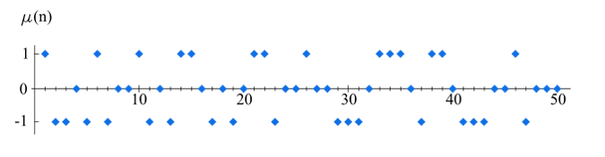

NMS Skaitļu teorija #4: Multiplikatīvas funkcijas
==================================================

Vidusskolas matemātikas kursā parasti runā par funkcijām, kas
vienam reālam skaitlim piekārto citu reālu skaitli. Piemēram, attēlo
skaitli :math:`x` par :math:`x^2 + px + q` (kvadrātfunkcija), vai
par :math:`\sqrt{x}` (kvadrātsakne, kas definēta, ja :math:`x \geq 0`),
vai kāda no trigonometriskajām funkcijām.

Vispārīgākā nozīmē funkcija ir jebkurš attēlojums, kas kopas :math:`A`
elementam :math:`x \in A` piekārto elementu no kopas :math:`B`, ko
pieraksta kā :math:`f(x) \in B`.

Šajā nodaļā aplūkosim funkcijas, kurām vai nu definīcijas apgabals
vai vērtību apgabals ir veselie (vai naturālie) skaitļi, ja šīs funkcijas
izmantojamas skaitļu teorijā.

Ievaduzdevumi
----------------

**Definīcija:**
  Apzīmēsim ar :math:`\lfloor x \rfloor` skaitļa :math:`x` apakšējo veselo daļu -- lielāko
  veselo skaitli, kas nepārsniedz :math:`x`.

1. Pieņemsim, ka reāls skaitlis :math:`x \in \mathbb{R}` ir nevesels.
   Atrast :math:`\lfloor -x \rfloor + \lfloor x \rfloor`.

2. Izteikt skaitļa :math:`n` dalāmo skaitu starp naturāliem skaitļiem intervālā :math:`(0;x)`, kur :math:`x` ir reāls pozitīvs skaitlis.
   (Var uzrakstīt formulu, kurā ietilpst veselā daļa.)

3. Dota augoša aritmētiska progresija ar pirmo locekli :math:`a` un diferenci :math:`d`.
   Cik daudzi šīs progresijas locekļi būs intervālā :math:`[b;c)`.
   (Var pieņemt, ka visi :math:`a,b,c,d` ir naturāli skaitļi un :math:`a < b < c`.)

4. Katriem diviem reāliem :math:`x,y` pierādīt nevienādības:

   .. math::

     \lfloor x \rfloor + \lfloor y \rfloor \;\leq\; \lfloor x + y \rfloor \;\leq\; \lfloor x \rfloor + \lfloor y \rfloor + 1

5. Pierādīt, ka jebkuram reālam :math:`x \in \mathbb{R}` un jebkuram naturālam :math:`n \in \mathbb{N}` ir spēkā vienādība

   .. math::

     \left\lfloor \frac{ \lfloor x \rfloor }{n} \right\rfloor = \left\lfloor \frac{x}{n} \right\rfloor.

6. Pierādīt, ka jebkuram reālam :math:`x \in \mathbb{R}` ir spēkā vienādības:

   .. math::

     \left\{
     \begin{array}{l}
     \lfloor 2x \rfloor = \lfloor x \rfloor + \lfloor x + \frac{1}{2} \rfloor. \\
     \lfloor 3x \rfloor = \lfloor x \rfloor + \lfloor x + \frac{1}{3} \rfloor + \lfloor x + \frac{2}{3} \rfloor.
     \end{array}
     \right.

7. Kādā skolā ir :math:`n = 600` skolēni. No viņiem :math:`n_{a} = 300` mācās angļu valodu,
   :math:`n_{v} = 200` mācās vācu valodu, bet :math:`n_{av}=100` mācās angļu **un** vācu valodas (šīs kopas var pārklāties).
   Cik ir tādu skolēnu, kuri nemācās nevienu no šīm valodām?

Mazā Fermā un Eilera Teorēma
------------------------------------

**Mazā Fermā teorēma:**
  Doti naturāli skaitļi :math:`a` un :math:`p`, kur :math:`p` ir pirmskaitlis.
  Ja :math:`a` nedalās ar :math:`p`, tad ir spēkā sakarība

  .. math:: a^{p-1} \equiv 1 \pmod p.

**Sekas:**
  Jebkuram naturālam skaitlim :math:`a` izteiksme :math:`a^p - a` dalās ar :math:`a`.
  (Iznesam :math:`a` pirms iekavām: :math:`a^p - a = a\cdot (a^{p-1} - 1)`.
  Ja pats :math:`a` dalās ar :math:`p`, tad pirmais reizinātājs dalīsies ar :math:`p`.
  Ja :math:`a` nedalās ar :math:`p`, tad pēc Fermā teorēmas otrais reizinātājs :math:`a^{p-1} - a` dalās ar :math:`p`.

**Piemēri:**

  * Ja :math:`a = 2`, bet :math:`p = 7`, tad :math:`2^{6} = 64 \equiv 1 \pmod 7`, jo :math:`63` dalās ar :math:`7` bez atlikuma.
  * Cik deviņnieki pēc kārtas jāuzraksta,  lai iegūtais skaitlis dalītos ar :math:`7`?
  * Cik deviņnieki pēc kārtas jāuzraksta, lai skaitlis dalītos ar :math:`41`?
    Kāds ir mazākais deviņnieku skaits, lai skaitlis dalītos ar :math:`41`?

Šo teorēmu nelieliem pirmskaitļiem var skaitliski pārbaudīt ar Python:

.. code-block:: python

  [x**2 for x in range(0,7)]
  [x**2 % 7 for x in range(0,7)]
  [x**3 % 7 for x in range(0,7)]
  [x**6 % 7 for x in range(0,7)]

Pēdējā no rindiņām parāda, ka visi iespējamie atlikumi jeb kongruenču klases (:math:`0,\ldots,6`), kāpinot 6.pakāpē
dod atlikumu :math:`1`, dalot ar :math:`7`. (Vienīgais izņēmums ir atlikums :math:`0`, kurš pats dalās ar :math:`7`.)

**Definīcija:**
  Ar :math:`\varphi(n)` apzīmējam *Eilera funkciju* -- to veselo skaitļu
  skaitu intervālā :math:`[1;n]`, kas ir savstarpēji pirmskaitļi ar :math:`n`.

**Piemēri:**

  * Ja :math:`p` ir pirmskaitlis, tad :math:`\varphi(p) = p-1`.
  * Ja :math:`p^k` ir pirmskaitļa pakāpe, tad :math:`\varphi(p^k) = p^k - p^{k-1} = p^k \cdot \left(1 = \frac{1}{p} \right)`.

**Eilera teorēma:**
  Ja :math:`a` un :math:`n` ir savstarpēji pirmskaitļi, tad

  .. math::

    a^{\varphi(n)} \equiv 1 \pmod n.

**Piemēri:**

  * Kuram :math:`n` skaitlis :math:`2^n - 1` noteikti dalīsies ar :math:`9`?
  * :math:`\varphi(10) = 4`, tādēļ katram no skaitļiem :math:`1,3,7,9` ir spēkā sakarība :math:`a^4 \equiv 1 \pmod {10}`.
    Teiksim, skaitļa :math:`3` pakāpes ir :math:`1, 3, 9, 27, 81,\ldots`.
    Iegūstam, ka :math:`3^4` beidzas ar to pašu ciparu, ar ko :math:`3^0 = 1`.

  .. note::
    Protams, cikls var iestāties arī ātrāk. Piemēram, kāpinot skaitļus, kuri beidzas ar ciparu :math:`1`,
    periods (pēdējā cipara atkārtošanās) notiek uzreiz.
    Ja skaitlis beidzas ar ciparu :math:`9`, tad pēdējā cipara atkārtošanās
    notiek katrā otrajā solī. Bet tas nemaina faktu, ka :math:`a^4 \equiv 1 \pmod {10}`.
    Pēdējā cipara periods tātad var būt :math:`1, 2, 4`,
    jo Eilera teorēma neapgalvo, ka :math:`\varphi(n)` būs *mazākais*
    kāpinātājs :math:`k`, kuram :math:`a^k` ir kontruents ar :math:`1`.
    Toties no Eilera teorēmas seko, ka arī mazākais periods ir skaitļa
    :math:`\varphi(n)` dalītājs.

Skaitliski piemēri
^^^^^^^^^^^^^^^^^^^

**1.Jautājums**
  Ar kādiem pēdējiem diviem cipariem var beigties naturāla skaitļa :math:`n` pakāpe :math:`n^{20}`?

**2.Jautājums**
  Aplūkojam naturālu skaitli :math:`n = 561`. Tas nav pirmskaitlis, jo :math:`n = 561 = 3 \cdot 11 \cdot 17`.
  Pierādīt, ka jebkuram naturālam :math:`a` skaitlis :math:`a^{n} - a` dalās ar :math:`n`.

  .. note::
    Šī pati īpašība piemīt arī visiem pirmskaitļiem -- tiešas sekas no Fermā teorēmas.
    Nepirmskaitļus, kam arī tā izpildās, sauc par Kārmaikla (*Carmichael*) skaitļiem. :math:`n = 561` ir mazākais no
    Kārmaikla skaitļiem.

Sacensību uzdevumi
^^^^^^^^^^^^^^^^^^^

**1.Jautājums**
  Aplūkojam virkni :math:`a_n = 2^n + 3^n + 6^n - 1`, kur :math:`n = 1,2,\ldots`.
  Pierādīt, ka jebkuram pirmskaitlim :math:`p` atradīsies tāds :math:`a_n`,
  ka :math:`a_n` dalās ar :math:`p`.

**2.Jautājums**
  Atrast tādu bezgalīgi augošu aritmētisku progresiju no naturāliem skaitļiem,
  ka neviens no tās locekļiem nav divu pilnu kubu summa.

**3.Jautājums**
  Naturālam skaitlim :math:`n` atrodam visus tos naturālos skaitļus :math:`a_i \in [1;n]`,
  kuri ir savstarpēji pirmskaitļi ar :math:`n`. Pamatot, ka visu šo :math:`a_i` summa

  .. math::

    a_1 + \ldots + a_k = \frac{n \cdot \varphi(n)}{2}.

**4.Jautājums**
  Katram naturālam skaitlim :math:`n` pierādīt vienādību:

  .. math::

    \sum\limits_{d\mid{}n} \varphi(d) = n.

Multiplikatīvas funkcijas
-----------------------------

Eilera funkcija :math:`\varphi(n)` ir tipisks piemērs vispārīgākai veselo skaitļu funkciju kopai,
ko sauc par *multiplikatīvām funkcijām*.

**Definīcija**
  Funkciju :math:`f\,:\,\mathbb{N} \rightarrow \mathbb{R}` sauc par multiplikatīvu,
  ja katriem diviem naturāliem :math:`a,b \in \mathbb{N}`, kuri ir savstarpēji pirmskaitļi,
  ir spēkā sakarība:

  .. math::

    f(ab) = f(a) \cdot f(b).

**Īpašības:**

  * Multiplikatīvām funkcijām jābūt spēkā: :math:`f(1) = 1`.
  * Multiplikatīvai funkcijai pietiek zināt vērtības :math:`f(p^k)`
    pirmskaitļu pakāpēm. Citas vērtības var iegūt ar reizināšanu.

**Piemēri:**

* :math:`\mbox{gcd}(n,k)`: divu skaitļu lielākais kopīgais dalītājs,
  kur :math:`n` ir arguments, bet :math:`k` ir konstante.
* :math:`\varphi(n)`: Eilera funkcija –- cik ir naturālu
  :math:`k \in [0;n]`, kas ir savstarpēji pirmskaitļi ar :math:`n`.
* :math:`\sigma_0(n) = d(n)` -- skaitļa :math:`n` dalītāju skaits.
* :math:`\sigma_1(n) = \sigma(n)` - skaitļa :math:`n` dalītāju summa.

Dalītāju skaita funkcija
^^^^^^^^^^^^^^^^^^^^^^^^^^

**Definīcija:** Naturālam skaitlim :math:`n` visu pozitīvo dalītāju skaitu apzīmējam ar

  .. math::

    d(n) = \sum\limits_{d \mid{} n} 1.

Attēlā parādīta dalītāju skaita funkcija :math:`\sigma_0(n) = d(n)` skaitļiem intervālā :math:`[1;250]`:

  .. image:: figs-ntjun04-multiplicative/divisor-function.png
     :width: 3in

Šajā grafikā redzama virkne ar naturāliem skaitļiem, kuri pirmo reizi sasniedz noteiktas dalītāju skaita vērtības:

=============  ===  ===  ===  ===  ===  ===  ===  ===  ===  ===  ===  ===  ===  ===  ===        
:math:`n`        1    2    4    6   12   16   24   36   48   60   64  120  144  180  240
:math:`d(n)`     1    2    3    4    6    5    8    9   10   12    7   16   15   18   20
=============  ===  ===  ===  ===  ===  ===  ===  ===  ===  ===  ===  ===  ===  ===  ===

**Teorēma:**
  Ja zināms skaitļa sadalījums pirmreizinātājos: :math:`n = p_1^{k_1}\cdots{}p_m^{k_m}`, tad dalītāju skaita
  funkciju nosaka ar formulu: 

.. math:: 
    
    d(n)=\prod_{i=1}^m (k_i+1) = \left( 1 + k_1 \right) \left( 1 + k_2 \right) \cdot \ldots \cdot \left( 1+ k_m \right).

**Pierādījums:** 
  Šī formula iegūstama no fakta, ka visi skaitļa :math:`n` dalītāji ir
  iekodējami ar veselu skaitļu vektoriņiem: :math:`(x_1, x_2, \cdots{}, x_m)`, kur 
  :math:`0 \leq x_i \leq k_i`, t.i. skaitļa :math:`n` dalītājam 
  :math:`d` var uzrakstīt līdzīgu sadalījumu pirmreizinātājos: :math:`d = p_1^{x_1}\cdots{}p_m^{x_m}`,
  kur katru no kāpinātājiem :math:`x_i` var izvēlēties :math:`(k_i + 1)` dažādos veidos.
  :math:`\square`

Dalītāju summas funkcija
^^^^^^^^^^^^^^^^^^^^^^^^^

**Piemērs:**
  Attēlā parādīta dalītāju summas funkcija :math:`\sigma_1(n) = \sigma(n)`  skaitļiem intervālā :math:`[1;250]`:

  .. image:: figs-ntjun04-multiplicative/divisor-sum-function.png
     :width: 3in

**Teorēma:**
  Ja zināms skaitļa sadalījums pirmreizinātājos: :math:`n = p_1^{k_1}\cdots{}p_m^{k_m}`, tad dalītāju skaita
  funkciju nosaka ar formulu: 
  
  .. math::
  
    \sigma(n)=\prod_{i=1}^m \left( 1 + p_i^1 + p_i^2 + \ldots + p_i^{k_1}\right) = \left( 1 + p_1 + \ldots p_1^{k_1} \right) 
    \left( 1 + p_2^1 + \ldots + p_2^{k_2} \right) \cdot \ldots \cdot \left( 1 + p_m^1 + \ldots + p_m^{k_m} \right).
  

**Pierādījums:** 
  Atverot iekavas pēdējā izteiksmē, iegūsim :math:`d(n)` saskaitāmos -- katrs izrādīsies kāds no :math:`n` dalītājiem.
  :math:`\square`

Ieslēgšanas-Izslēgšanas princips
^^^^^^^^^^^^^^^^^^^^^^^^^^^^^^^^^

**Piemērs:** 
  Skolā pavisam ir ap :math:`1000` bērni. 300 mācās vācu valodu, 250 mācās franču valodu, :math:`150` mācās abas.
  Cik daudzi nemācās nevienu?
  
**Pierādījums:** 
  Divām kopām var izmantot ieslēgšanas izslēgšanas principu: 
  
  .. image:: figs-ntjun04-multiplicative/two-set-inclusion-exclusion.png
     :width: 2in
     
  Divām kopām ieslēgšanas-izslēgšanas metode izskatītos sekojoši:
  
  .. math::
  
    |A \cup B| = |A| + |B| - |A \cap B|. 
    
  Ievietojam uzdevumā dotos skaitļus, lai atrastu, cik ir skolēnu, kuri mācās vismaz vienu svešvalodu (vācu vai franču): 
  
  .. math::
  
    |A \cup B| = 300 + 250 - 150 = 400. 

    
  Tātad to, kuri nemācās nevienu no šīm svešvalodām ir :math:`1000 - 400 = 600`.  :math:`\blacksquare`

**Piemērs:** 
  Zīmējumā attēlota kopa :math:`U` (universs) un trīs tā apakškopas :math:`A,B,C`. 
  Zināms elementu skaits katrā no kopām (un arī to šķēlumos pa divām vai trim).
  Atrast elementu skaitu visu trīs kopu apvienojumā.

  .. image:: figs-ntjun04-multiplicative/venn-diagram-3.png
     :width: 1.2in

**Risinājums:** 

  .. math::
  
    |A \cup B \cup C| = |A| + |B| + |C| - |A \cap B| - |A \cap C| - |B \cap C| + |A \cap B \cap C|.

Eilera funkcija
^^^^^^^^^^^^^^^^^

Skaitļu teorijā bieži ir vieglāk noteikt dažādu skaitļu kopu šķēlumu
nevis apvienojumu. Apvienojuma elementu saskaitīšanai
var noderēt ieslēgšanas-izslēgšanas princips.

**Piemērs:**
  Zīmējumā attēloti veselie skaitļi :math:`\{1,2,\ldots,210\}`. 
  Krāsaino ovālu iekšpusē ir skaitļi, kuri dalās attiecīgi ar
  :math:`2`, :math:`3`, :math:`5`, :math:`7`. 
  Skaitlis :math:`210 = 2 \cdot 3 \cdot 5 \cdot 7` 
  ir pirmo četru pirmskaitļu reizinājums.

  .. image:: figs-ntjun04-multiplicative/venn-diagam-4augmented.png
     :width: 2.4in
     
  * Atrast skaitļu piemērus apgabalā ar zilo bumbulīti. 
  * Cik ir pelēkā un zaļā ovāla šķēlumā?
  * Cik ir ārpus visiem ovāliem? Cik no veselajiem skaitļiem 
    intervālā :math:`[1;100]` ir tādi, kas nedalās ne ar :math:`2`, 
    ne ar :math:`3`, ne ar :math:`5`, ne ar :math:`7`?

**Risinājums:** 

  .. math::
  
    \begin{array}{rl}
      & 210 - \frac{210}{2} - \frac{210}{3} - \frac{210}{5} - \frac{210}{7} + 
    \frac{210}{2 \cdot 3} + \frac{210}{2 \cdot 5} + \frac{210}{2 \cdot 7} + \frac{210}{3 \cdot 5} + \frac{210}{3 \cdot 7} + \frac{210}{5 \cdot 7} - 
    \frac{210}{2 \cdot 3 \cdot 5} - \frac{210}{2 \cdot 3 \cdot 7} - \frac{210}{2 \cdot 5 \cdot 7} - \frac{210}{3 \cdot 5 \cdot 7} +
    \frac{210}{2 \cdot 3 \cdot 5 \cdot 7} = \\
    = & 210 \cdot \left( 1 - \frac{1}{2}\right) \cdot \left( 1 - \frac{1}{2}\right) \cdot \left( 1 - \frac{1}{5}\right) \cdot \left( 1 - \frac{1}{7}\right).\\
    \end{array}

     

**Piemērs:**
  Pieņemsim, ka skaitlim :math:`n` ir tikai :math:`3` pirmskaitļu dalītāji :math:`p,q,r`.
  Ar :math:`M_a` apzīmēsim, cik intervālā :math:`[1;n]` ir skaitļa :math:`a` daudzkārtņu.

  Iegūsim, šādu sakarību:

  .. math::

    \begin{array}{rl}
    \varphi(n) = & n - (M_p + M_q + M_r) + (M_{pq} + M_{pr} + M_{qr}) - M_{pqr} = \\
    = &  n - \left( \frac{n}{p} + \frac{n}{q} + \frac{n}{r} \right) +
    \left( \frac{n}{pq} + \frac{n}{pr} + \frac{n}{qr} \right) - \frac{n}{pqr} =
    n \left(1 - \frac{1}{p} \right) \left(1 - \frac{1}{q} \right) \left(1 - \frac{1}{r} \right).\\
    \end{array}

**Teorēma:**
  Eilera funkcija :math:`\varphi(n)` ir multiplikatīva.

**Piemēri:**
  Eilera funkcijas multiplikativitāti var izmantot, lai to praktiski aprēķinātu
  tad, ja zināms skaitļa :math:`n` sadalījums pirmreizinātājos:

  .. math::

    n = p_1^{k_1} \cdot p_2^{k_2} \cdot \ldots \cdot p_m^{k_m}.

  Tad Eilera funkciju aprēķina katra pirmskaitļa pakāpei atsevišķi un rezultātus sareizina:

  .. math::

    \varphi(n) = p_1^{k_1} \left(1 - \frac{1}{p_1} \right) \cdot \ldots \cdot p_m^{k_m} \left(1 - \frac{1}{p_m} \right) =
    n \cdot \left(1 - \frac{1}{p_1} \right) \cdot \ldots \cdot \left(1 - \frac{1}{p_m} \right).

  .. math::

    \begin{array}{l}
    \varphi(10) = \varphi(5) \cdot \varphi(2) = (5 - 1)(2-1) = 4. \\
    \varphi(70) = \varphi(2) \cdot \varphi(5) \cdot \varphi(7) = (2-1)(5-1)(7-1) = 24.\\
    \varphi(100) = \varphi(25) \cdot \varphi(4) = (25 - 5)(4-2) = 40. \\
    \varphi(2012)=\varphi(4) \cdot \varphi(503)=(2^2-2^1)(503-1)=2 \cdot 502=1004.
    \end{array}

**Piemērs:** 
  Attēlā dots Eilera funkcijas grafiks. 
  Tās īpašības analizētas arī `<https://mathworld.wolfram.com/TotientFunction.html>`_.
  
  .. image:: figs-ntjun04-multiplicative/euler-phi.png
     :width: 3in

Mēbiusa funkcija
^^^^^^^^^^^^^^^^^^

**Definīcija:**
  Mēbiusa (Möbius) funkciju definē šādi:

  * :math:`-1`, ja :math:`n` ir nepāra skaita pirmskaitļu reizinājums,
  * :math:`+1`, ja :math:`n` ir pāra skaita pirmskaitļu reizinājums,
  * :math:`0`, ja :math:`n` sadalījums pirmreizinātājos satur
    kāda pirmskaitļa pakāpi, kas augstāka par pirmo.

**Teorēma:**
  Mēbiusa funkcija ir multiplikatīva.

**Apgalvojums:**
  Katram naturālam :math:`n` ir spēkā sekojoša formula:

  .. math::

    \sum\limits_{d\mid{}n} \mu(d) = \left\{
    \begin{array}{l}
    1,\;\mbox{ja n=1}\\
    0,\;\mbox{ja n>1}\\
    \end{array}
    \right.

**Ieteikums:**
  Ja :math:`n > 1`, to izsaka kā pirmskaitļu reizinājumu (daži no pirmskaitļiem var arī sakrist):

  .. math::

    n = p_1p_2\cdots{}p_k.

  Jāpamato, ka šī izteiksme vienāda ar :math:`0`:

  .. math::

    \begin{array}{rl}
      & \mu(1) + \\
    + & \left( \mu(p_1) + \mu(p_2) + \ldots + \mbox(p_k) \right) + \\
    + & \left(\mu(p_1p_2) + \ldots + \mu(p_{k-1}p_k) \right) + \\
    + & \ldots + \\
    + & \mu(p_1 p_2 \cdots p_k).\\
    \end{array}

**Apgalvojums:**
  Ir spēkā izteiksme

  .. math::

    \varphi(n) = \sum\limits_{d\mid{}n} \mu(d)\frac{n}{d}.

**Pierādījums:**
  Šajā izteiksmē paliek pāri tikai nedaudzi reizinātāji --
  kur :math:`n` dala ar dažādiem pirmskaitļiem (vai atšķirīgu pirmskaitļu reizinājumiem),
  šo to pieskaita, šo to atņem.

Perfekti skaitļi
^^^^^^^^^^^^^^^^^^

Ar dalītāju summas funkciju saistīta neparasta skaitļu kategorija -- *perfekti skaitļi*.

**Definīcija:**
   Skaitļus :math:`n`, kas vienādi ar visu savu dalītāju
   summu (atskaitot pašu :math:`n`):

   .. math::

     n = \sum\limits_{d\mid{}n \wedge d < n} d

   sauc par *perfektiem skaitļiem*

**Piemēri:**
  Perfekti skaitļi ir: :math:`6=1+2+3`,
  :math:`28=1+2+4+7+14`, utt.

**Eiklīda teorēma:**
  Ja :math:`2^p - 1` ir pirmskaitlis,
  tad :math:`2^{p-1}(2^p-1)` ir perfekts.

**Piemēri:**
  * Ja :math:`p=2`, tad :math:`p^2 - 1 = 3` ir Mersenna pirmskaitlis.

  * :math:`2^p-1` var būt pirmskaitlis tikai tad, ja :math:`p` ir pirmskaitlis.
    Pirmskaitļus šādā formā :math:`2^p-1` sauc par Mersenna skaitļiem.
    (Zināmi :math:`50` šādi pirmskaitļi.)
    Nav zināms, vai Mersenna pirmskaitļu ir bezgalīgi daudz.
    Un arī nav zināms, vai neeksistē perfekti skaitļi kādā citā formā
    (tsk.\ vai ir iespējami nepāra perfekti skaitļi).

Skaitliski piemēri
^^^^^^^^^^^^^^^^^^^^^

**1.jautājums:**
  Pierādīt, ka neeksistē tāds :math:`n`, kuram Eilera funkcijas vērtība :math:`\varphi(n) = 14`.

**2.jautājums:**
  Atrisināt vienādojumu naturālos skaitļos:

  .. math::

    \varphi(2x) = \varphi(3x).

**3.jautājums:**
  Zināms, ka naturālam skaitlim :math:`A` ir tieši :math:`62` naturāli
  dalītāji. Pierādīt, ka :math:`A` nedalās ar :math:`36`.

**4.jautājums:**
  Atrast tādu naturālu :math:`n`, kuram visu dalītāju apgriezto
  lielumu summa ir :math:`2`. Citiem vārdiem, atrast skaitli :math:`n`, kuram

  .. math::

    \sum\limits_{d\mid{}n} \frac{1}{d} = 2.

**5.jautājums:**
  Atrast tādu :math:`n`, kuram

  .. math::

    \mu(n) + \mu(n+1) + \mu(n+2) = 3.

Sacensību uzdevumi
--------------------

**1.Uzdevums:**
  Parādīt, ka

  .. math::

    d(1) + d(2) + \ldots + d(n) = \left\lfloor \frac{n}{1} \right\rfloor +
    \left\lfloor \frac{n}{2} \right\rfloor + \ldots + \left\lfloor \frac{n}{n} \right\rfloor.

**2.Uzdevums:**
  Parādīt, ka

  .. math::

    \sigma(1) + \sigma(2) + \ldots + \sigma(n) = 1\cdot \left\lfloor \frac{n}{1} \right\rfloor +
    2 \cdot \left\lfloor \frac{n}{2} \right\rfloor + \ldots + n \cdot \left\lfloor \frac{n}{n} \right\rfloor.

**3.Uzdevums:**
  Dots naturāls skaitlis :math:`n`. Noteikt atkarībā no :math:`n`, 
  cik ir skaitļu :math:`x \in \{ 1, 2, \ldots, n\}`, kuriem :math:`x^2 \equiv x \pmod {n}`. 

**Ieteikumi:**
  Meklēto atrisinājumu skaitu var vispirms atrast vienkāršākajiem gadījumiem.
  Apzīmējam meklēto atrisinājumu skaitu vienādojumam :math:`x^2 \equiv x \pmod {n}` (no kopas
  :math:`\{ 1,\ldots{},n \}`  ar :math:`f(n)`. Atradīsim to sekojošiem :math:`n`:

  * :math:`n=1`.
  * :math:`n = p`, kur :math:`p` ir pirmskaitlis. 
  * :math:`n = p^k`, kur :math:`p^k` ir pirmskaitļa pakāpe. 
  * :math:`n = pq`, kas ir divu pirmskaitļu reizinājums. 
 

  Hipotēze: :math:`f(n) = 2^{\omega(n)}`, kur ar :math:`\omega(n)` apzīmē skaitļa :math:`n`
  dažādo pirmskaitļu dalītāju skaitu, neņemot vērā to, kādā pakāpē tie ietilpst skaitlī :math:`n`. 

.. only:: Internal

  **Atbilde:**

    Divi atrisinājumi acīmredzami der arī ja :math:`n` ir pirmskaitlis: 
  
    .. math::
  
      \left\{ \begin{array}{l}
      1^2 \equiv 1 \pmod {n}\\
      n^2 \equiv n \pmod {n}\\
      \end{array}
      \right.
    
    Ja :math:`n=10`, tad ir četri atrisinājumi: 
  
    .. math::

      \left\{ \begin{array}{l}
      1^2 \equiv 1 \pmod {10}\\
      5^2 \equiv 5 \pmod {10}\\
      6^2 \equiv 6 \pmod {10}\\
      10^2 \equiv 10 \pmod {10}\\
      \end{array}
      \right.

  :math:`\square`

