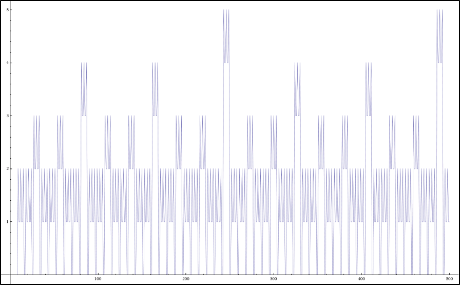

NMS Skaitļu teorija #5: Valuācijas
=====================================

Valuāciju jēdziens
-----------------------

Valuācijas apraksta augstāko pirmskaitļa pakāpi, ar kuru dalās dotais skaitlis. 

* Skaitļu teorijā dažreiz pietiek analizēt situāciju terminos "dalās" vai "nedalās" (no šejienes ir termini  
  *pirmskaitlis*, *savstarpēji pirmskaitļi*, *LKD*, *MKD*). 
* Dažreiz jāaplūko arī moduļi jeb kongruenču klases pēc kāda pirmskaitļa vai pirmskaitļa pakāpes moduļa (par to ir modulārā aritmētika)
* Vēl detalizētāk var aplūkot atlikumus, dalot ar dažādiem pirmskaitļiem (vai dažādu pirmskaitļu pakāpēm) -- ķīniešu atlikumu teorēma. 
* Visbeidzot, valuācijas ir vēl precīzāks instruments -- aplūko "cik laba ir dalāmība" ar kādu pirmskaitli. 

**Definīcija:** 
  Ar :math:`n` apzīmējam jebkuru naturālu skaitli un ar :math:`p` -- kādu pirmskaitli. 
  Par skaitļa :math:`n` :math:`p`-valuāciju sauc tādu skaitli :math:`k`, ka 
  :math:`n` dalās ar :math:`p^k`, bet nedalās ar :math:`p^{k+1}`. 
  Šo faktu pieraksta, izmantojot grieķu burtu "nī": 
  
  .. math:: 
  
    \nu_p(n) = k. 
    
    
  .. figure:: figs-ntjun05-valuations/greek-alphabet.png
     :width: 2in
     :alt: Greek alphabet
     
     Grieķu alfabēts
  
**Piemēri:**
  Ja pirmskaitlis :math:`p = 3`, tad 
  
  .. math::
    
    \left\{
    \begin{array}{l}
    \nu_3(1) = \nu_3(2) = \nu_3(4) = \nu_3(5) = \ldots = 0\\
    \nu_3(3) = \nu_3(6) = \nu_3(12) = \nu_3(15) = \ldots = 1\\
    \nu_3(9) = \nu_3(18) = \nu_3(36) = \nu_3(45) = \ldots = 2\\
    \nu_3(27) = \nu_3(54) = \ldots = 3\\
    \nu_3{81} = \ldots = 4\\
    \ldots
    \end{array}
    \right.

Funkcijas :math:`f(n) = \nu_3(n)` grafiks redzams zīmējumā -- 
tā ir zāģveidīga trepīte, kurā ar regulārām atstarpēm rodas arvien garāki 
"zāģa zobi". 

.. image:: figs-ntjun05-valuations/valuations-by-3-all-naturals.png
   :width: 4in

**Valuāciju īpašības:** 
  Iedomāsimies, ka :math:`p` ir jebkurš fiksēts pirmskaitlis. 

  * :math:`\nu_p(a) = \infty` tad un tikai tad, ja :math:`a = 0`. (Visiem citiem veseliem skaitļiem 
    atrodas tik augsta pirmskaitļa :math:`p` pakāpe :math:`p^{k+1}`, ka :math:`a` vairs nedalās ar :math:`p^{k+1}`.)
  * :math:`\nu_p(ab) = \nu_p(a) + \nu_p(b)`. (Augstākās pakāpes saskaitās, ja abus skaitļus :math:`a` un :math:`b` reizina.)
  * :math:`\nu_p(a + b) \geq \min(\nu_p(a), \nu_p(b))`. Šajā izteiksmē pastāv vienādība, ja :math:`\nu_p(a) \neq \nu_p(b)`. 

Valuāciju funkcijas :math:`\nu_2(n)`, :math:`\nu_3(n)` un citas nevar būt periodiskas, jo laiku pa laikam 
parādās arvien lielākas vērtības, piemēram, :math:`\nu_2(2^k) = k`. No otras puses, to 
grafikiem piemīt savdabīga simetrija. Arī katrai konstantei :math:`C>0` funkcija :math:`f(n) = \min(C, \nu_2(n))` ir periodiska
(periodiskumu var panākt, ja lielās vērtības \"apgriež\" tā, lai tās nepārsniegtu :math:`C`).

   Funkcijas :math:`\nu_2(n)` grafiks (lokālie maksimumi pie :math:`n=64` un :math:`n=128`).

Valuācijas kombinatorikā
----------------------------

Ležandra teorēma
^^^^^^^^^^^^^^^^^^

**Teorēma (Adrien-Marie Legendre):**
  Katram pirmskaitlim :math:`p` un katram naturālam :math:`n` :math:`p`-valuācija ir aprēķināma pēc formulas

  .. math:: 
  
    \nu_p(n!) = \sum_{i=1}^{\infty} \left\lfloor \frac{n}{p^i} \right\rfloor, 
    
  kur :math:`\lfloor x \rfloor` apzīmē apakšējo veselo daļu. 
  (Izskatās, ka šajā vienādībā ir bezgalīga summa, bet jebkurām :math:`n` un :math:`p` vērtībām 
  šajā summā ir tikai galīgs skaits nenulles saskaitāmo.)

  .. figure:: figs-ntjun05-valuations/legendre-example-2.png
     :width: 2.5in

     Funkcijas :math:`\nu_2(n!)` tabula.

**Apgalvojums:** 
  Lielākā :math:`2` pakāpe, ar ko dalās :math:`n!` ir 
  :math:`n - S_2(n)`, kur ar :math:`S_2(n)` apzīmēta :math:`n` ciparu summa divnieku pierakstā. 
  
  
**Piemērs:** 
  Skaitļa :math:`100` divnieku pieraksts ir :math:`\mathtt{1100100}_2`, tādēļ ciparu summa ir 
  :math:`S_2(100) = S_2(\mathtt{1100100}_2) = 3`. 
  Iegūstam, ka :math:`\nu_2(100!) = 100 - 3 = 97`. 

**Lemma:** 
  Starp pirmajiem :math:`m` naturālajiem skaitļiem ir tieši 
  :math:`\lfloor m/n \rfloor` skaitļa :math:`n` daudzkārtņu.
  
  (Ar :math:`\lfloor x \rfloor` apzīmē skaitļa apakšējo veselo daļu -- 
  vislielāko veselo skaitli, kas nepārsniedz :math:`x`.) 

**Piemērs:** 
  Ar kādu lielāko :math:`2` pakāpi dalās skaitlis :math:`36!`? 
  
  .. image:: figs-ntjun05-valuations/legendre-36-factorial.png
     :width: 3in
     

  Pārformulēsim šo citādi: Iztēlosimies, ka :math:`36!` sadalīts pirmreizinātājos: 

  .. math:: 
  
    36! = 2^{k_2} \cdot 3^{k_3} \cdot 5^{k_5} \cdot 7^{k_7} \cdot \ldots \cdot 31^{k_{31}}. 

  Atradīsim :math:`k_2` jeb kāpinātāju pie pirmskaitļa :math:`2` šajā izteiksmē.
  (Kāpēc :math:`36!` dalās tikai ar pirmajiem :math:`11` pirmskaitļiem no :math:`2` līdz :math:`31`?)

  Zīmējumā redzami visi reizinātāji, kuri veido :math:`36!`. 
  Tie, kuri dalās ar :math:`2`, attēloti ar klucīšu stabiņu, kas
  rāda, cik divniekus (kā pirmreizinātājus) šis skaitlis pievienojis
  faktoriālam. 
  
  .. image:: figs-ntjun05-valuations/legendre-36-expression.png
     :width: 3in
     
  Rēķinot faktoriālu, klucīši summējas pa kolonnām. 
  Ležandra formula tos saskaita pa rindiņām (vispirms sarkanos, tad oranžos, 
  utt.)
  
  Šī diagramma ilustrē svarīgu metodi: Ja ir jānovērtē veselu skaitļu summa, ko var 
  saskaitīt divos dažādos veidos (piemēram, krāsaino klucīšu zīmējumā gan pa kolonnām, gan pa rindiņām), 
  to bieži ir vērts mēģināt darīt, lai iegūtu ērtāku izteiksmi. 
  Šoreiz ietaupījums ir acīmredzams – tai vietā lai saskaitītu :math:`18` stabiņos esošos klucīšus, 
  pietiek (rindiņās) summēt tikai piecus skaitļus, kurus turklāt vieglāk izrēķināt precīzi.
  Lielākiem :math:`n` Ležandra formulas ietaupījums ir vēl lielāks:
  Ja :math:`n = 1000`, tad saskaitāmo skaits samazinās no :math:`500` līdz :math:`10`, 
  jo jau :math:`1000/2^{10} < 1`. 

  Lietojot Ležandra formulu arī citiem pirmskaitļiem, :math:`p>2`, iegūstam šādu sadalījumu pirmreizinātājos:
  
  .. math::
  
    36! = 2^{34} \cdot 3^{17} \cdot 5^{8} \cdot 7^{5} \cdot 11^{3} \cdot 13^{2} \cdot 17^2 \cdot 19^1 \cdot 23^1 \cdot 29^1 \cdot 31^1.
    
  Šis skaitlis beidzas ar :math:`\min(\nu_2(36!), \nu_5(36!)) = \min(34,8) = 8` nullēm -- katra nulle decimālpierakstā rodas, sareizinoties 
  pirmreizinātājam :math:`2` ar pirmreizinātāju :math:`5`. 
  Skaitļa :math:`36!` tiešs aprēķins, sareizinot pirmos :math:`36` naturālos skaitļus, rāda to pašu:
  
  
  .. code-block:: python
  
    >>> from functools import reduce
    >>> reduce(lambda a, b: a*b, range(1,37))
    371993326789901217467999448150835200000000

**Piemērs:** 
  Atrast robežas (skaitļus, kuriem neierobežoti tuvojas izteiksme zem robežas tad, ja :math:`n` kļūst ļoti liels):
  
  * :math:`{\displaystyle \lim_{n \rightarrow \infty} \frac{\nu_2(n!)}{n}}`.
  * :math:`{\displaystyle \lim_{n \rightarrow \infty} \frac{\nu_3(n!)}{n}}`.
  * :math:`{\displaystyle \lim_{n \rightarrow \infty} \frac{\nu_5(n!)}{n}}`.

Kummera teorēma
^^^^^^^^^^^^^^^^

**Teorēma (Ernst Kummer)**
  Doti skaitļi :math:`n` un :math:`m`, kas apmierina nevienādības :math:`n \geq m \geq 0` un 
  arī pirmskaitlis :math:`p`. Tad binomiālajam koeficientam :math:`C_n^m` :math:`p`-valuācija 
  sakrīt ar pārnesumu skaitu, ja :math:`m` saskaita ar :math:`n-m` skaitīšanas sistēmā ar bāzi :math:`p`. 
  
Šo teorēmu var pierādīt, izsakot binomiālo koeficientu: 

.. math::

  C_n^m = \frac{n!}{m! (n-m)!}
  
un izmantojot Ležandra teorēmu. 

.. note:: 
  Par kombināciju jeb bionmiālo koeficientu skaitļu teorijas īpašībām ir 
  vēl arī citi derīgi rezultāti (sal. Lūkas teorēmu `<https://bit.ly/3Frc1pT>`_), bet 
  tie neattiecas uz veselo skaitļu funkciju tēmu.  

**Piemērs:** 
  Zīmējumā attēlots Paskāla trijstūris, kurā iepelēkotas visas nepāru šūnas. 
  Pēc Kummera teorēmas tās ir visas tās kombinācijas pa :math:`m` no :math:`n`, 
  kam :math:`m` var saskaitīt :math:`n-m` binārajā pierakstā pilnīgi bez pārnesumiem.
  
  

**Apgalvojums:** 
  Dots naturāls skaitlis :math:`n`. Pierādīt, ka jebkuru :math:`n` pēc kārtas ņemtu naturālu 
  skaitļu reizinājums dalās ar :math:`n!`. 
  
**Pierādījums:** 
  Apzīmēsim lielāko no reizinātajiem skaitļiem ar :math:`m`. Tad jāpierāda, ka

  .. math::
  
    \frac{m(m-1)(m-2)\cdots{}(m-n+1)}{n!} \in \mathbb{N}.

  Pierakstītā izteiksme sakrīt ar :math:`C_m^n = \frac{m!}{n!(m-n)!}`. 
  Tā kā kombinācijas (pie :math:`n\leq m`) apzīmē, cik veidos no :math:`m` elementiem 
  var izvēlēties nesakārtotu izlasi ar :math:`n` elementiem, kombinācijas 
  vienmēr ir naturāli skaitļi.

**Piemērs:** 
  Zīmējumā attēlots funkcijas :math:`f(n) = \nu_3(C_n^7)` grafiks. 
  Vairumam skaitļu kombinācija pa :math:`7` no :math:`n` dalās ar 
  nelielām :math:`3` pakāpēm. 

Lūkas teorēma
^^^^^^^^^^^^^^^

**Teorēma (Lucas):** 
  Visiem nenegatīviem :math:`m` un :math:`n`, un jebkuram pirmskaitlim :math:`p`, ir spēkā šāda sakarība:

  .. math::
  
    \binom{m}{n} \equiv \prod_{i = 0}^k \binom{m_i}{n_i} \pmod {p},
    
  kur :math:`n = n_k p^k + n_{k-1} p^{k-1} + \ldots + n_1 p + n_0`, 
  bet  :math:`m = m_k p^k + m_{k-1} p^{k-1} + \ldots + m_1 p + m_0`.

**Piemērs:**
  Attēlā dots Paskāla trijstūris (:math:`k`-tais elements šī trijstūra :math:`n`-tajā rindiņā
  attēlo, cik dažādos veidos var izvēlēties :math:`k` elementus no :math:`n` elementu kopas). 
  Šis Paskāla trijstūris
  izkrāsots :math:`3` krāsās (aplītis ir sarkans, ja tajā vietā ierakstītais skaitlis dalās ar :math:`3`; 
  aplītis ir melns, ja dod atlikumu :math:`1`, dalot ar :math:`3`, aplītis ir zaļš, 
  ja dod atlikumu :math:`2`, dalot ar :math:`3`).
  Atrast, cik ir melno aplīšu šī Paskāla trijstūra :math:`1000` rindiņā: Cik daudzi no 
  visiem :math:`1001` skaitļiem šajā rindiņā dod atlikumu :math:`1`, dalot ar :math:`3`.

  

**Risinājums:** 
  :math:`\mathtt{16}`. 
  
  Pierakstām skaitli :math:`1000 = 729 + 243 + 27 + 1 = 3^6 + 3^5 + 3^3 + 1 = \mathtt{1101001}_3` 
  trijnieku skaitīšanas sistēmā. 

  Aplūkosim vispirms kombinācijas :math:`C_{999}^k`. 
  Pamatosim, ka ir tieši :math:`8` vērtības, kurām :math:`C_{999}^k \equiv 1 \pmod{3}` 
  jeb rodas melni aplīši (visām pārējām :math:`C_{999}^k` dalās ar :math:`3`: šie aplīši ir sarkani).

  .. math::

    C_{999}^0 \equiv C_{999}^{27} \equiv C_{999}^{243} \equiv C_{999}^{270} \equiv C_{999}^{729} \equiv C_{999}^{756} \equiv C_{999}^{972} \equiv C_{999}^{999} \equiv 1 \pmod{3}.

  Izmantojot Kummera teorēmu var pamatot, ka visiem citiem :math:`k`, 
  :math:`C_{999}^k \equiv 0 \pmod{3}`. 
  Tas ir tāpēc, ka visos citos gadījumos iegūt skaitli, kura decimālpieraksts ir :math:`999` 
  (:math:`999_{10} = \mathtt{1101000}_3`)
  var tikai saskaitot :math:`k` un :math:`999-k` tā, 
  ka rodas pārnesums (saskaitot stabiņā trijnieku skaitīšanas sistēmā). 
  Ir tikai :math:`8` veidi kā sadalīt trīs vieniniekus no :math:`\mathtt{1101000}_3` pa 
  abiem saskaitāmajiem tā, lai nerastos neviens pārnesums.

  Savukārt visas astoņas vērtības, kas minētas kongruencē (sk. vienādojumu augstāk) ir vienādas ar :math:`1` (nevis ar :math:`2`)
  saskaņā ar Lūkas teorēmu. 

  Zem Paskāla trijstūra rindiņas, kurā ir visi :math:`C_{999}^k`, 
  ir nākamā rindiņa, kurā ir visi :math:`C_{1000}^k`. Šajā 
  rindiņā melno elementu būs divreiz vairāk, jo katrs no astoņiem melnajiem, 
  kas minēti (augšējā vienādojumā) 
  saskaitīsies ar sarkano kaimiņu kreisajā un arī labajā pusē. Kopā būs :math:`16` melni elementi
  (bet zaļo - tādu :math:`C_{1000}^k`, kas kongruenti ar :math:`2` pēc moduļa :math:`3`) nebūs. 
  To secina vai nu no iepriekšējās rindiņas, vai arī tieši izmantojot Lūkas teorēmu.

Kāpinātāja pacelšanas lemmas
-------------------------------

Kāpinātāja pacelšanas lemmas (Lifting the Exponent Lemmas) ir vairāki savstarpēji 
saistīti rezultāti, kuri ļauj atrast :math:`p`-valuācijas divu skaitļu pakāpju 
starpībai vai summai. 

Valuācijas nepāra pirmskaitļiem
^^^^^^^^^^^^^^^^^^^^^^^^^^^^^^^^^^

Šajā nodaļā aplūkosim vienkāršāko gadījumu, ja :math:`p` ir nepāra skaitlis. 

**Piemērs (UKMO2013):**
  Skaitlis pierakstīts decimālās sistēmas bāzē satur :math:`3^{2013}` ciparus :math:`3`; 
  citu ciparu skaitļa pierakstā nav. Atrast augstāko skaitļa :math:`3` pakāpi, kas dala šo skaitli.

**Ieteikums:**
  Var aplūkot iesākumā mazāku skaitli, kura decimālpierakstā ir :math:`27` trijnieki (jeb :math:`3^3`): 
  
  .. math::
  
    N = 333\,333\,333\,\,333\,333\,333\,\,333\,333\,333
    
  Šo skaitli var sadalīt vairākos reizinātājos (katrs reizinātājs dalās ar :math:`3`, bet nedalās ar :math:`9`
  (var pārbaudīt ar ciparu summām). Tas ļauj droši noskaidrot, ar kādu :math:`3` pakāpi dalās :math:`N`.

**Piemērs:** 
  Zīmējam grafiku veselu skaitļu funkcijai :math:`f(k) = \nu_3(10^k - 1)`, kur :math:`k \in \mathbb{N}`.

  .. math::  
  
    \begin{array}{ll}
    9 = 3 \cdot 3, & f(1) = 2,\\
    99 = 9 \cdot 11, & f(2) = 2,\\
    999 = 9 \cdot 111, & f(3) = 3,\\
    9999 = 9 \cdot 1111, & f(4) = 2,\\
    99999 = 9 \cdot 11111, & f(5) = 2,\\
    999999 = 9 \cdot 1001 \cdot 111, & f(6) = 3,\\
    9999999 = 9 \cdot 1111111, & f(7) = 2,\\
    99999999 = 9 \cdot 11111111, & f(8) = 2,\\
    999999999 = 9 \cdot 1001001 \cdot 111, & f(9) = 4.\\
    \end{array}

  Katru no skaitļiem, kas uzrakstīti ar visiem deviņniekiem, mēģinām dalīt reizinātājos tā, 
  lai katram reizinātājam (:math:`111` utml.) būtu viegli atrodama :math:`3`-valuācija.

**Apgalvojums 1:**
  Doti divi veseli skaitļi :math:`x` un :math:`y` un arī naturāls 
  skaitlis :math:`n \in \mathbb{N}`. 
  Dots arī pirmskaitlis :math:`p` (var būt arī :math:`p = 2`). 
  Izpildās šādi nosacījumi: 
  
  * :math:`n` nedalās ar :math:`p`. 
  * :math:`x,y` nedalās ar :math:`p`. 
  * :math:`x - y` dalās ar :math:`p`. 
  
  Tad izpildās vienādība: 
  
  .. math::
   
    \nu_p(x^n - y^n) = \nu_p(x - y). 
  
**Piemērs 1:** 
  :math:`x = 10`, :math:`y = 1`, :math:`n = 7`, bet :math:`p = 3`. 
  Tad skaitlis :math:`x^7 - y^7 = 10^7 - 1^7 = 9999999` dalās ar :math:`3^2 = 9`, 
  bet nedalās ar :math:`3^3 = 27`. (Tāpat kā skaitlis :math:`x - y = 10-1=9`.) 

**Pierādījums:** Apgalvojumu 1 pierāda, sadalot :math:`x^n - y^n` 
reizinātājos. Un tad pamatojot, ka summa 

.. math::

  x^{n-1} + x^{n-2}y + \ldots + xy^{n-2} + y^{n-1} \equiv nx^{n-1}
  
nedalās ar :math:`p`. :math:`\square`

**Apgalvojums 2:**
  Doti divi veseli skaitļi :math:`x` un :math:`y` un arī naturāls 
  skaitlis :math:`n \in \mathbb{N}`. 
  Dots arī pirmskaitlis :math:`p` (var būt arī :math:`p = 2`). 
  Izpildās šādi nosacījumi: 
  
  * :math:`n` ir nepāra skaitlis.
  * :math:`n` nedalās ar :math:`p`. 
  * :math:`x,y` nedalās ar :math:`p`. 
  * :math:`x - y` dalās ar :math:`p`.
  
  
  Tad izpildās vienādība: 
  
  .. math::
   
    \nu_p(x^n + y^n) = \nu_p(x + y). 

**Piemērs 2:** 
  :math:`x = 10`, :math:`y = 1`, :math:`n = 7`, bet :math:`p = 11`. 
  Tad skaitlis :math:`x^7 + y^7 = 10^7 + 1^7 = 10000001` dalās ar :math:`11^1 = 11`, 
  bet nedalās ar :math:`11^2 = 121`. (Tāpat kā skaitlis :math:`x + y = 11`.)
  
Turpmākajos piemēros nometam prasību, ka :math:`n` nedalās ar :math:`p`. 
Toties papildus prasām, lai pirmskaitlis :math:`p` būtu nepāra skaitlis.
Ir spēkā vairākas kāpinātāja pacelšanas lemmas: 

**Pierādījums:** Apgalvojumu 2 pierāda, ievietojot :math:`y` vietā 
:math:`-y` un lietojot iepriekšējo Apgalvojumu 1.  :math:`\square`

**Lemma 1 (Lifting the Exponent, LTE):** 
  Doti divi veseli skaitļi :math:`x` un :math:`y` un arī naturāls 
  skaitlis :math:`n \in \mathbb{N}`. 
  Dots arī **nepāra** pirmskaitlis :math:`p`. 
  Izpildās šādi nosacījumi: 
  
  * :math:`x,y` nedalās ar :math:`p`. 
  * :math:`x - y` dalās ar :math:`p`. 
  
  Tad izpildās vienādība: 
  
  .. math::
   
    \nu_p(x^n - y^n) = \nu_p(x - y) + \nu_p(n). 

**Piemērs 3:** 
  :math:`x = 10`, :math:`y = 1`, :math:`n = 27`, bet :math:`p = 3`. 
  Tad skaitlis 
  
  .. math::
  
    x^{27} - y^{27} = 10^7 - 1^7 = 999999999\,999999999\,999999999

  dalās ar :math:`3^k` pie :math:`k = \nu_3(10-1) + \nu_3(27) = 2 + 3 = 5`
  (t.i. dalās ar  :math:`3^6 = 243`). 
  Bet šis skaitlis nedalās ar :math:`3^{k+1}` (t.i. ar :math:`3^6 = 729`). 

Aplūkojot jebkādas :math:`n` vērtības, iegūstam grafiku funkcijai 
:math:`f(n) = \nu_3(10^n - 1)`, t.i. ar kādu augstāko trijnieka
pakāpi dalās skaitlis ":math:`n` deviņnieki": 

**Pierādījums:** Lemmu 1 pierāda, atkārtoti dalot reizinātājos 
izteiksmi :math:`x^n - y^n`, kur var izteikt :math:`n = k \cdot p^m`
(kur :math:`k` nedalās ar :math:`p`):

.. image:: figs-ntjun05-valuations/lte-lemma-proof.png
   :width: 4in

**Piemērs:** 
  Ar kādu lielāko skaitļa :math:`41` pakāpi dalās šāds skaitlis:
  
  .. math::
  
    \underbrace{9999\ldots{}9999}_{\mbox{$8405$ deviņnieki}}. 

**Risinājums:** 
  Citiem vārdiem, mums jāatrod :math:`\nu_{41}(10^{8405} - 1)`. 
  Dalām reizinātājos :math:`8405 = 5 \cdot 41^2`. 
  
  Lemmu 1 nevar pielietot uzreiz izteiksmei :math:`10^{5 \cdot 41^2} - 1^{5 \cdot 41^2}`, jo :math:`10-1` nedalās ar :math:`41`.   
  Par laimi, jau :math:`99999 = 10^5 - 1` dalās ar :math:`41`. Pārveidojam izteiksmi: 
  
  .. math::
  
    \nu_{41} (10^{5 \cdot 41^2} - 1^{5 \cdot 41^2}) = (100000^{41^2} - 1^{5 \cdot 41^2}) = 
    \nu_{41} (10000 -1) + \nu_{41} (41^2) = 3. 
    
  Tātad minētais skaitlis dalās ar :math:`41^3` (bet nedalās ar lielāku :math:`41` pakāpi).

**Piemērs:**
  Katram dotajam naturālam skaitlim :math:`k>0`
  atrast iespējami mazu :math:`n` vērtību, kurai :math:`10^n - 1` dalās ar :math:`3^k`, izmantojot 
  divas dažādas metodes: 
  
  * Eilera teorēmu
  * LTE Lemmu 1
  
**Risinājums:**
  Ievērosim, ka dotajam :math:`3^k` Eilera funkcijas vērtība ir :math:`\varphi(3^k) = 3^k - 3^{k-1}`. 
  Pēc Eilera teorēmas, skaitlis :math:`10^{\varphi(3^k)} - 1` garantēti dalīsies ar :math:`3^k`. 
  Savukārt pēc kāpinātāja pacelšanas lemmas mums vajag lai :math:`\nu_3(10-1) + \nu_3(n)`. 
  
  Apkoposim iegūtās vērtības tabulā (skaitļus formā :math:`10^n-1`, kas dalās ar vajadzīgo :math:`3` pakāpi): 
  
  ================  ================  ================  ===================  ===================  ===================  ===================
  :math:`k`         :math:`1`         :math:`2`         :math:`3`            :math:`4`            :math:`5`            :math:`5`
  Eilera teorēma    :math:`10^1-1`    :math:`10^6-1`    :math:`10^{18}-1`    :math:`10^{54}-1`    :math:`10^{162}-1`   :math:`10^{486}-1`
  LTE Lemma         :math:`10^1-1`    :math:`10^1-1`    :math:`10^3-1`       :math:`10^9-1`       :math:`10^{27}-1`    :math:`10^{81}-1`
  ================  ================  ================  ===================  ===================  ===================  ===================
  
  Kā redzam tabulā, LTE Lemma dod daudz precīzāku novērtējumu; atrastās :math:`n` vērtības tiešām ir minimālās, 
  kam :math:`10^n - 1`. Savukārt Eilera teorēma piedāvā sešreiz lielāku skaitli, kurš arī der un :math:`10^n - 1` dalās ar :math:`3^k`, bet 
  tas var nebūt mazākais. Šajā piemērā tas pat vienmēr ir sešreiz lielāks nekā LTE dotais novērtējums.
  
   

**Lemma 2 (Lifting the Exponent, LTE):** 
  Doti divi veseli skaitļi :math:`x` un :math:`y` un arī naturāls 
  skaitlis :math:`n \in \mathbb{N}`. 
  Dots arī **nepāra** pirmskaitlis :math:`p`. 
  Izpildās šādi nosacījumi: 
  
  * :math:`n` ir nepāra skaitlis.
  * :math:`x,y` nedalās ar :math:`p`. 
  * :math:`x + y` dalās ar :math:`p`. 
  
  Tad izpildās vienādība: 
  
  .. math::
   
    \nu_p(x^n + y^n) = \nu_p(x + y) + \nu_p(n). 

**Piemērs 4:** 
  :math:`x = 10`, :math:`y = 1`, :math:`n = 121`, bet :math:`p = 11`. 
  Tad skaitlis 
  
  .. math::
  
    x^{121} + y^{27} = 10^{121} + 1^{121} = 1\underbrace{00\ldots00}_{\mbox{\footnotesize $120$ nulles}}1

  dalās ar :math:`11^k` pie :math:`k = \nu_{11}(10+1) + \nu_{11}(121) = 1+2 = 3`
  (t.i. dalās ar  :math:`11^3 = 1331`). 
  Bet šis skaitlis nedalās ar :math:`{11}^{k+1}` (t.i. ar :math:`11^4 = 14641`). 

**Pierādījums:** 
  Lemmu 2 pierāda, aizstājot :math:`y` ar :math:`(-y)` un izmantojot iepriekšējo 
  Lemmu 1. (Šeit ir būtiski, lai :math:`n` ir nepāra; lai gan pats 
  :math:`y`, gan arī :math:`(-y)^{n}` maina zīmi. :math:`\square`

Valuācijas pirmskaitlim 2
^^^^^^^^^^^^^^^^^^^^^^^^^^^^^^^^^^

**Uzdevums (Valsts4Posms-1993.9-12.2):** 
  Dots naturāls skaitlis :math:`a>2`. 
  Pierādīt, ka eksistē tikai galīgs skaits tādu naturālu :math:`n`, ka :math:`a^n - 1` dalās ar :math:`2^n`.

Izvēlamies \"patvaļīgu\" naturālu skaitli :math:`a=17`. Apskatīsim :math:`17^n-1` dalāmību ar :math:`2` pakāpēm -- 
ieviešam funkciju :math:`{\displaystyle f(n) = \nu_2\left(17^n-1 \right)}`.

Salīdzināsim šo ar citu naturālu skaitli :math:`a =15`.
Līdzīgi kā iepriekš apskatām funkciju :math:`{\displaystyle f(n) = \nu_2\left(15^n-1 \right)}`.

Ievērosim, ka abi grafiki izturas līdzīgi nepāra vērtībām :math:`n`. Tie sakrīt ar :math:`\nu_2(n)` grafiku, 
kas pabīdīts :math:`4` vienības uz augšu. 
Toties pie nepāra :math:`n` uzvedības atšķiras: :math:`{\displaystyle \nu_2\left(17^n-1 \right) = 4}`
un :math:`{\displaystyle \nu_2\left(15^n-1 \right) = 1}`.

**Lemma 3 (Lifting the Exponent, LTE):** 
  Skaitļi :math:`x` un :math:`y` ir divi veseli nepāra skaitļi 
  un :math:`n` ir pozitīvs **pāra** skaitlis. Tad 
  
  .. math::
  
    \nu_2 (x^n - y^n) = \nu_2(x - y) + \nu(x+y) + \nu_2(n) - 1.

  Ja savukārt :math:`n` ir pozitīvs **nepāra** skaitlis, tad 
  
  .. math::

    \nu_2 (x^n - y^n) = \nu_2(x - y).

Skaitliski piemēri
^^^^^^^^^^^^^^^^^^^^

**1.jautājums:**
  Ar cik nullēm beidzas skaitlis :math:`2022!` (:math:`2022` faktoriāls, t.i. visu skaitļu no :math:`1` līdz :math:`2022` reizinājums)?
  
**2.jautājums:**  
  Ar kādu lielāko skaitļa :math:`2` pakāpi dalās kombinācija :math:`C^{415}_{2022}`? 

**3.jautājums:** 
  Atrast mazāko :math:`k` vērtību, kurai :math:`11^{k} - 1` beidzas ar :math:`4` nullēm. 
  
**4.jautājums:**
  Atrast :math:`5`-valuāciju reizinājumam
  
  .. math::
  
     (2-1) \cdot (2^2-1) \cdot (2^3 - 1) \cdot \ldots \cdot (2^{1000} - 1).
     
**5.jautājums:**
  Atrast :math:`7`-valuāciju reizinājumam
  
  .. math::
  
     (2-1) \cdot (2^2-1) \cdot (2^3 - 1) \cdot \ldots \cdot (2^{1000} - 1).
     

**6.jautājums:** 
  Neizmantojot Kummera teorēmu (bet izmantojot interpretāciju) 
  pamatot, ka :math:`C_{2012}^{17}`: dalās ar :math:`2012`. 
  (**Ieteikums:** Izmantot faktu, ka :math:`17` un :math:`2012` ir 
  savstarpēji pirmskaitļi un tādēļ kombinācijām :math:`C_{2012}^{17}`, 
  ko iztēlojas kā pa apli izvietotas :math:`2012` krellītes, no kurām 
  tieši :math:`17` ir nokrāsotas - būs simetriskas attiecībā pret 
  :math:`2012` pagriezieniem ap apļa centru.)
  
Diemžēl, šo nevar izspriest otrādi. No tā, ka :math:`k` un :math:`2012` 
ir kopīgi dalītāji vēl neseko, ka :math:`C_{2012}^{17}` nedalās ar :math:`2012`. 
  
     

   
   

Sacensību uzdevumi
^^^^^^^^^^^^^^^^^^^

**1.uzdevums:**
  Pamatot, ka harmoniskas rindas pirmo :math:`n` locekļu summa: 
  
  .. math:: 
  
    1 + \frac{1}{2} + \frac{1}{3} + \frac{1}{4} + \ldots + \frac{1}{n}
    
  nevar būt vesels skaitlis, ja :math:`n > 1`. 
  

**2.uzdevums (CGMO2012.8)**
  Cik kopā :math:`\{0,1,2,\ldots,2012\}` ir elementu :math:`k`, kam :math:`C_{2012}^k`: dalās ar :math:`2012`?
  Ar :math:`C_n^k` apzīmējam kombinācijas no :math:`n` pa :math:`k` jeb
  
  .. math:: 
  
    C_n^k = \frac{n!}{k!(n-k)!}
    

**Ieteikumi:** 

  * Sadalām reizinātājos: :math:`2012 =2^2 \cdot 503`
  * Ievērojam, ka :math:`503 \mid C_{2012}^k` tad un tikai tad, ja :math:`503` nedala :math:`k`.
  * Ievērojam, ka :math:`4 \mid C_{2012}^k` tad un tikai tad, ja saskaitot binārajā pierakstā :math:`k` un :math:`2012-k`
    rodas vismaz divi pārnesumi (Kummera teorēma). 

    
**3.uzdevums (IMO2019.P4)**
  Atrast visus naturālo skaitļu :math:`(k,n)` pārus, kuriem izpildās
  
  .. math::
  
    k! = (2^n - 1)(2^n - 2)(2^n - 4)\cdots(2^n - 2^{n-1}).
    
**4.uzdevums (IMO2000.5):**
  Vai eksistē naturāls :math:`n`, ka skaitlim :math:`n` ir tieši :math:`2000` dalītāji, kuri ir pirmskaitļi, un 
  :math:`2^n+1` dalās ar :math:`n`. (Skaitlis :math:`n` drīkst dalīties arī ar pirmskaitļu pakāpēm.)

**5.uzdevums (APMO1997.2):**
  Atrast veselu skaitli :math:`n`, kam :math:`100 \leq n \leq 1997`, ka :math:`n` dala :math:`2^n + 2`. 

**6.uzdevums (Sierpinski):**
  Pierādīt, ka nevienam :math:`n > 1` neizpildās 
  
  .. math:: 
  
    n \mid 2^{n-1} + 1. 
    
    
**7.uzdevums (IMO1990.3):**
  Noteikt visus veselos skaitļus :math:`n>1`, kam :math:`\frac{2^n + 1}{n^2}` ir vesels skaitlis. 

**8.uzdevums (BW2015.16):**
  Ar :math:`P(n)` apzīmējam lielāko pirmskaitli, ar ko dalās :math:`n`. Atrast
  visus naturālos skaitļus :math:`n \geq 2`, kam

  .. math::
  
    P(n) + \left\lfloor \sqrt{n} \right\rfloor = P(n+1) + \left\lfloor \sqrt{n+1} \right\rfloor.

**9.uzdevums (BW2015.17):**
  Atrast visus naturālos skaitļus :math:`n`, kuriem :math:`n^{n-1} - 1` dalās ar :math:`2^{2015}`, 
  bet nedalās ar :math:`2^{2016}`. 
  
**Ieteikumi:** 
  Apzīmēsim virkni :math:`a_n = \nu_2(n^{n-1} - 1)`. 
  Pamatot, ka :math:`a_n = 2\nu_2(n-1) + \nu_2(n+1) - 1`. 

  

**10.uzdevums (Valsts4Posms-1992.12.1):**
  Pierādīt, ka eksistē bezgalīgi daudz naturālu skaitļu kvadrātu, 
  kurus var iegūt, divas reizes pēc kārtas uzrakstot kādu naturālu skaitli.

**Ieteikumi:** 
  Divreiz uzrakstāmos skaitļus var mērķtiecīgāk meklēt, ja mēģina dalīt reizinātājos izteiksmi :math:`10^n + 1`.
  Dalītāji :math:`101`, :math:`1001`, :math:`10001` utt. parādās tad, ja aplūko 
  divreiz pēc kārtas uzrakstītus skaitļus, piemēram, :math:`1212`,  :math:`123123`,  :math:`12341234`.
  Savukārt, :math:`10^n + 1` labi dalās reizinātājos, ja aplūko, teiksim, :math:`\nu_{11}(10^n + 1)`.
  Atkārtojamo ciparu skaitu :math:`n` var pielāgot tā, lai :math:`10^n + 1` dalītos ar to, ko mums vajag.

  .. figure:: figs-ntjun05-valuations/11-valuations.png
     :width: 4in
     :alt: 11-valuation graph

     Grafiks funkcijai :math:`f(n) = \nu_{11}(10^n + 1)` (Kāpinātāja Pacelšanas Lemma 2)

Atsauces
----------

1. `<https://cp4space.hatsya.com/2014/04/13/lifting-the-exponent/>`_. 
2. `<https://bit.ly/3KdtxBH>`_. 
3. `<http://artofproblemsolving.com/articles/files/SatoNT.pdf>`_.
4. `<http://www.aquatutoring.org/KummerTheoremLucasTheorem.pdf>`_.
5. `<http://reu.dimacs.rutgers.edu/~mslusky/>`_.

