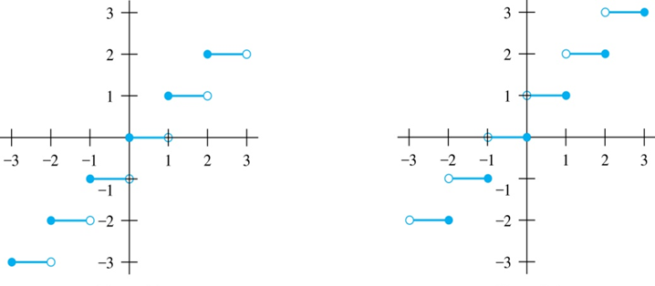
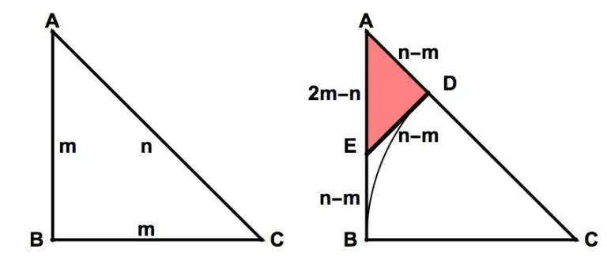
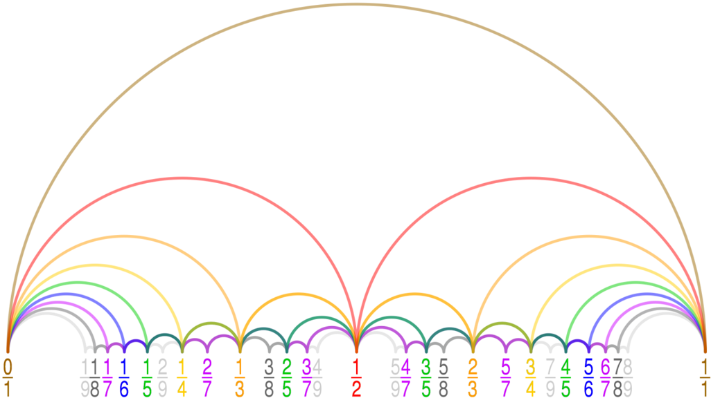

NMS Skaitļu teorija #6: Racionāli un iracionāli skaitļi
========================================================

**Veselā daļa:** 
  Apakšējās veselās daļas funkcija :math:`f(x) = \lfloor x \rfloor`, tās īpašības. 

**Iracionalitātes pierādījumi:**
  Sakņu un logaritmu iracionalitāte, skaitļa :math:`e` iracionalitāte, skaitļa 
  decimālpieraksta aplūkošana, algebriskas metodes.
  Tuī-Morzes virkne. 

**Iracionāli skaitļi kā robežas:** 
  Piemēri, kad racionālas izteiksmes robežpārejā dod iracionālus rezultātus. 
  Permutāciju skaitīšanas uzdevums; rekurentu virkņu attiecības.
  Ķēžu daļas.
  
**Iracionālu izteiksmju vienkāršošanās:** 
  Kad iracionalitāte ļauj atrast racionālus rezultātus. 
  
**Fareja virknes un tuvinājumi:**
  Konstruēt Fareja virknes; racionālu skaitļu mediānas.
  Iracionālu skaitļu tuvināšana. 

Veselā daļa
------------

Kā ievadmateriālu pirms racionālajiem/iracionālajiem 
skaitļiem aplūkojam skaitļu teorijā svarīgu funkciju: apakšējo 
veselo daļu un tai radniecīgas funkcijas. 

**Definīcija:**
  Katram :math:`x \in \mathbb{R}` *apakšējā veselā daļa* (floor function) 
  ir lielākais veselais skaitlis, kas nepārsniedz :math:`x`. 
  To apzīmē :math:`\lfloor x \rfloor`. 
  
  
.. note:: 
  Dažreiz literatūrā izmanto arī apzīmējumu :math:`[x]`; 
  to dažreiz izmanto, jo kvadrātiekavas ir ērtāk ievadīt 
  datorā nekā speciālos simbolus :math:`\lfloor \ldots \rfloor`, 
  bet šajā tekstā to neizmantojam, jo kvadrātiekavas 
  bieži lietojamas citiem apzīmējumiem.

**Definīcija:** 
  Par skaitļa :math:`x \in \mathbb{R}` *daļveida daļu* (*fractional part*) sauc 
  vērtību, par kuru skaitlis :math:`x` pārsniedz savu veselo daļu:

  .. math:: 
    \{x\} = x - \lfloor x \rfloor. 
    
**Definīcija:** 
  Par skaitļa *augšējo veselo daļu* (*ceiling function*) sauc mazāko veselo skaitli, 
  kas nav mazāks par :math:`x`. To apzīmē ar :math:`\lceil x \rceil`. 
  

   Grafikos attēlotās funkcijas :math:`y = \lfloor x \rfloor` un :math:`y = \lceil x \rceil` un 

**Piemēri:**

  .. math::
    
    \lceil 3.5 \rceil = 4,\;\;\lfloor 3.5 \rfloor = 4,
    
    \lceil -1.5 \rceil = -1,\;\;\lfloor 3.5 \rfloor = -2,
    
    \lceil 17 \rceil = 17,\;\;\lfloor 17 \rfloor = 17,
    
    \{ 3.14 \} = 0.14,\;\; \{ -3.14 \} = 0.86,\;\; \{ 17 \} = 0,
    
    \lceil 0.9999\ldots \rceil = 1,\;\;\lfloor 0.9999\ldots \rfloor = 1,
    
  Pēdējā piemērā skaitlis :math:`0.9999\ldots = 0.(9) = 1` ir vesels, 
  tāpēc tā veselā un daļveida daļa sakrīt. 
  

**Teorēma:** 
  Patvaļīgam reālam skaitlim :math:`x \in \mathbb{R}` un veselam skaitlim 
  :math:`n \in \mathbb{Z}` ir spēkā šādi apgalvojumi: 
  
  1. Ir spēkā loģiskas ekvivalences (var secināt abos virzienos): 
  
    * :math:`\lfloor x \rfloor = n` tad un tikai tad, ja :math:`n \leq x < n+1`.
    * :math:`\lceil x \rceil = n` tad un tikai tad, ja :math:`n-1 < x \leq n`.
    * :math:`\lfloor x \rfloor = n` tad un tikai tad, ja :math:`x-1 < n \leq x`.
    * :math:`\lceil x \rceil = n` tad un tikai tad, ja :math:`x \leq n < x+1`.

  2. :math:`x - 1 < \lfloor x \rfloor \leq x \leq \lceil x \rceil < x + 1`.
  
  3. :math:`\lfloor -x \rfloor = - \lceil x \rceil` un 
     :math:`\lceil -x \rceil = - \lfloor x \rfloor`. 
     
  4. :math:`\lfloor x+n \rfloor = \lfloor x \rfloor + n`
     un :math:`\lceil x+n \rceil = \lceil x \rceil + n`. 

  5. Ja :math:`a = qb+r` ir veselu skaitļu :math:`a` un :math:`b` dalījums ar 
     atlikumu un :math:`b > 0`, tad šo skaitļu dalījums
     :math:`{\displaystyle q = \left\lfloor \frac{a}{b} \right\rfloor}` un atlikums
     :math:`{\displaystyle r = \left\{ \frac{a}{b} \right\} \cdot b}`. 

  6. Funkcija :math:`{\displaystyle f(x) = \left\lfloor x + \frac{1}{2} \right\rfloor}` 
     izsaka reāla skaitļa :math:`x \in \mathbb{R}` noapaļošanu pēc skolas 
     algoritma -- noapaļo līdz tuvākajam veselajam skaitlim (un tad, ja 
     daļveida daļa ir precīzi puse, tad apaļo uz augšu). 
  
  7. :math:`\lfloor x \rfloor + \lfloor y \rfloor \leq \lfloor x + y \rfloor \leq 
     \lfloor x \rfloor + \lfloor y \rfloor + 1`.

  8. Skaitļa :math:`n` pozitīvo daudzkārtņu skaits, kas nepārsniedz :math:`x`, 
     ir :math:`{\displaystyle \left\lfloor \frac{x}{n} \right\rfloor{}}`. 

  9. :math:`{\displaystyle \left\lfloor \frac{\lfloor x \rfloor}{n} \right\rfloor = 
     \left\lfloor \frac{x}{n} \right\rfloor}`. 

**Piemērs:** 
  Dots reāls skaitlis :math:`x`. Pierādīt, ka 
  :math:`\lfloor 2x \rfloor = \lfloor x \rfloor + \lfloor x + \frac{1}{2} \rfloor`.

**Pierādījums:** 
  Apzīmējam :math:`x = n + \varepsilon`, kur :math:`n` ir vesels skaitlis un 
  :math:`0 \leq \varepsilon < 1`.   

  **1.gadījums:**
    :math:`\varepsilon < \frac{1}{2}`. 
    Tad :math:`2x = 2n + 2\varepsilon` un 
    :math:`\lfloor 2x \rfloor = 2n`, jo :math:`0 \leq 2\varepsilon < 1`.
    
    Savukārt :math:`\lfloor x \rfloor = \lfloor x + \frac{1}{2} \rfloor = n`,  
    jo :math:`x + \frac{1}{2} = n + (\frac{1}{2} + \varepsilon)` un 
    :math:`0 \leq \frac{1}{2}+\varepsilon < 1`. 
    
    Tātad, :math:`\lfloor 2x \rfloor = 2n` un 
    :math:`\lfloor x \rfloor + \lfloor x + \frac{1}{2} \rfloor = n + n  = 2n`.

  **2.gadījums:** 
    :math:`\varepsilon  \geq \frac{1}{2}`. 

    Tad :math:`2x = 2n + 2\varepsilon = (2n + 1) +(2\varepsilon - 1)` un 
    :math:`\lfloor 2x \rfloor = 2n + 1`, jo :math:`0 \leq 2\varepsilon - 1 < 1`. 
    
    Savukārt :math:`\lfloor x \rfloor = n`, bet 
    :math:`\lfloor x + \frac{1}{2} \rfloor = \lfloor n + (1/2 + \varepsilon) \rfloor = 
    \lfloor n+1+(\varepsilon – \frac{1}{2}) \rfloor = n + 1`. 
    Tātad,  :math:`\lfloor 2x \rfloor = 2n + 1` and 
    :math:`\lfloor x \rfloor + \lfloor x + \frac{1}{2} \rfloor = n + (n + 1) = 2n + 1`.

**Piemērs (Ermīta identitāte, Hermite identity):**
  Pierādīt, ka ikvienam reālam skaitlim :math:`x \in \mathbb{R}` ir spēkā vienādība
  
  .. math:: 
  
    \lfloor x \rfloor + \left\lfloor x + \frac{1}{3} \right\rfloor + \left\lfloor x + \frac{2}{3} \right\rfloor = \lfloor 3x \rfloor.
    
    
**Piemērs (Gauss):** 
  Divi naturāli skaitļi :math:`p` un :math:`q` ir savstarpēji pirmskaitļi. Pierādīt sekojošu sakarību: 
  
  .. math:: 
  
    \left\lfloor \frac{p}{q} \right\rfloor + \left\lfloor \frac{2p}{q} \right\rfloor + \ldots 
    + \left\lfloor \frac{(q-1)p}{q} \right\rfloor  = \frac{(p-1)(q-1)}{2}. 
    

**Risinājums:** 
  Varam novilkt taisni :math:`y = \frac{p}{q} \cdot x`. 
  Šī taisne iet caur diviem punktiem :math:`(0;0)` un :math:`(q;p)`, 
  bet tā kā :math:`p,q` ir savstarpēji pirmskaitļi, uz tās nav citu punktu ar 
  abām veselām koordinātēm. 
  
  .. image:: figs-ntjun06-rational/gaussian-sum.png
     :width: 1.6in
  
  
  Tad katrs saskaitāmais :math:`\left\lfloor \frac{k \cdot p}{q} \right\rfloor` 
  izsaka veselo punktu skaitu zem šīs taisnes, bet virs :math:`x` ass. 
  Visu šādu punktu skaitu var noteikt vai nu izmantojot Pīka 
  formulu, sk. `<https://bit.ly/3JL3scm>`_, vai arī uzliekot 
  trijstūra formas režģim virsū otrādi apgrieztu identisku trijstūri un 
  saskaitot punktus abos trijstūros kopā. 
  
  
  
  
  
  
  
.. note:: 
  Šo identitāti var vispārināt arī citām vērtībām; 

**Piemērs:**
  Atrast mazāko naturālo skaitli :math:`k`, pie kura vienādojumam 

  .. math::
  
    \left\lfloor \frac{2021}{n} \right\rfloor = k 

  nav atrisinājuma veselos skaitļos.
  

.. Ieteikums: Risinām nevienādību: 2021/n−2021/(n+1)>1

**Piemērs:**
  Reāls skaitlis :math:`r` apmierina attēlā doto vienādību.

  .. math:: 

    \left\lfloor r + \frac{19}{100} \right\rfloor + 
    \left\lfloor r + \frac{20}{100} \right\rfloor +  
    \left\lfloor r + \frac{21}{100} \right\rfloor + 
    \ldots + 
    \left\lfloor r + \frac{91}{100} \right\rfloor = 546.

  Atrast :math:`\lfloor 100 r \rfloor`.

**Piemērs:** 
  Definējam augošu virkni :math:`a_1,a_2,\ldots`, kas satur visus tos naturālos skaitļus, kas nav pilni kvadrāti: 
  
  .. math:: 
  
    a_1 = 2,\; a_2 = 3,\; a_3 = 5,\; a_4 = 6,\; a_5 = 7,\; a_6 = 8,\; a_7 = 10, \ldots
    
  Pierādīt, ka šīs virknes locekļus var aprēķināt ar formulu
  
  .. math:: 
  
    a_n = n + \left\lfloor \sqrt{n} + \frac{1}{2} \right\lfloor.
    

**Piemērs:** 
  Definējam virkni :math:`b_1,b_2,\ldots`:

  .. math:: 
  
    b_1 = 1,\; b_2 = 2,\; b_3 = 2,\; b_4 = 3,\; b_5 = 3,\; b_6 = 3,\; b_7 = 4, \ldots
    
  Šo virkni konstruē, iekļaujot tajā naturālu skaitli :math:`k = 1,2,3,\ldots` precīzi :math:`k` reizes
  (:math:`1,2,2,3,3,3,4,4,4,4,5,5,5,5,5,6,6,6,6,6,6,\ldots`). Pierādīt, ka šīs virknes locekļus var 
  aprēķināt ar formulu: 
  
  .. math:: 
  
    b_n = \left\lfloor \sqrt{2n} + \frac{1}{2} \right\rfloor.
    

Virknes sākuma aprēķina paraugs: 

.. code-block:: python

  >>> import math
  >>> [math.floor(math.sqrt(2*n) + 1/2) for n in range(1,29)]
  [1, 2, 2, 3, 3, 3, 4, 4, 4, 4, 5, 5, 5, 5, 5, 6, 6, 6, 6, 6, 6, 7, 7, 7, 7, 7, 7, 7]

Iracionāli skaitļi
--------------------

Atkārtojums par skaitļu kopām
^^^^^^^^^^^^^^^^^^^^^^^^^^^^^^^

**Definīcija:** 
  Aprakstām šādas skaitļu kopas: :math:`\mathbb{Z}^{0+}` (veselie nenegatīvie skaitļi); 
  :math:`\mathbb{N}` (naturālie skaitļi); 
  :math:`\mathbb{Z}` (veselie skaitļi); 
  :math:`\mathbb{Q}` (racionālie skaitļi).

  * Veselie nenegatīvie skaitļi :math:`\mathbb{Z}^{0+} = \{ 0, 1, 2, \ldots \}` satur skaitļus :math:`0`, :math:`1`, šajā 
    kopā vienmēr var veikt saskaitīšanu un reizināšanu.
    Naturālie skaitļi :math:`\mathbb{N} = \mathbb{Z}^{+}` nesatur nulli. 
  * Veselie skaitļi :math:`\mathbb{Z} = \{ \ldots, -3, -2, -1, 0, 1, 2, 3, \ldots \}` var veikt 
    saskaitīšanu, reizināšanu un atņemšanu. 
  * Racionālie skaitļi :math:`\mathbb{Q} = \{ p/q\ \mid p \in \mathbb{Z} \wedge q \in \mathbb{N} \}`. 
    Tā ir mazākā skaitļu kopa, kas satur skaitļus :math:`0` un :math:`1`, 
    kurā var veikt visas četras aritmētiskās darbības (izņēmums: nevar dalīt ar :math:`0`, jo reizināšana ar nulli 
    zaudē informāciju -- šī darbība nav injektīva.).

  
Racionālie skaitļi ir praktiska un ērta skaitļu kopa: 

* Ar efektīviem algoritmiem racionālus skaitļus var saskaitīt, atņemt, reizināt, dalīt, salīdzināt. 
* Racionāliem skaitļiem eksistē ērts galīgs pieraksts, tos viegli glabāt datora atmiņā (jāvar saīsināt daļas; nereti glabājas tuvinājumi)

Reālie skaitļi
^^^^^^^^^^^^^^^^

Vēl viena svarīga skaitļu kopa ir :math:`\mathbb{R}` -- reālie skaitļi. 
To parsti saista ar ģeometriskiem objektiem. 
piemēram, atzīmējot uz taisnes divus punktus -- sākumpunktu un vienības nogriezni -- 
jebkurš punkts uz šīs taisnes ir reāls skaitlis. 

Bez visiem racionālajiem skaitļiem reālo skaitļu taisne satur arī iracionālus skaitļus. 
Kādēļ vajadzīgi arī iracionālie skaitļi?

* Ģeometrijā daudzi svarīgi attālumi nav racionāli, bet izsakāmi, piemēram, ar kvadrātsaknēm.
* Arī algebrā saknes, eksponentfunkcijas, logaritmi, trigonometriskās funkcijas visbiežāk pieņem iracionālas vērtības.
* Racionālu skaitļu virkņu robežas mēdz būt iracionālas. 

**Piemērs:**
  Veidosim virkni, ko veido skaitļa :math:`\pi` decimālpieraksta sākumgabali: 

  .. math:: 

    3,\; 3.1,\;\; 3.14,\;\; 3.141,\;\; 3.1415,\;\; 3.14159, \;\;
  
  Katrs loceklis šajā virknē ir racionals skaitlis: :math:`\frac{3}{1}, \frac{31}{10}, \frac{314}{100}, \ldots`, 
  bet pati virknes robeža ir iracionāls skaitlis. 

Racionālu skaitli parasti attēlo kā racionālu daļu :math:`\frac{p}{q}`. 
Dažreiz ir vairāki pieraksti, bet var pārveidot saīsinātā formā un veikt visas darbības. 

Savukārt iracionāla skaitļa attēlošana ir krietni sarežģītāks jautājums. 
Ko nozīmē, ka mūsdienu matemātikā pazīstamas iracionālas konstantes :math:`\pi = 3.1415926535\ldots`, :math:`\sqrt{2} = 1.4142135\ldots` 
vai :math:`e = 2.7182818284\ldots`? Vai šīs konstantes kāds ir precīzi izrēķinājis? Vai tās vispār var izrēķināt?

**Konstruējami reālie skaitļi:**
  Reālus skaitļus :math:`\alpha` reizēm var definēt, norādot algoritmu, kas saņemot ciparu skaitu :math:`n`, izrēķina 
  racionālu tuvinājumu: :math:`a_n \in \mathbb{Q}`, kuram :math:`|a_n - \alpha| < 10^{-n}`.

Matemātikā pazīstamās konstantes (:math:`e`, :math:`\sqrt{2}` utml.) ir šādi konstruējamas. No otras puses, 
var pamatot, ka lielais vairums iracionālo skaitļu nav konstruējami (bezgalīgi tuvināmi ar kaut kādu algoritmu). 

Ir iespējamas arī "nekonstruktīvas" definīcijas, kas definē reālus skaitļus kā 
bezgalīgas decimālas vai racionālu skaitļu Košī virknes. 
(Ir pazīstami arī reālu skaitļu apraksti, izmantojot ts. Dedekinda šķēlumus, bet tos šajā kursā neaplūkojam). 

Ja reālus skaitļus pieraksta kā decimāldaļas, ir vienkāršs un praktisks
kritērijs, kā atšķirt racionālos no iracionālajiem. 

**Teorēma:** 
  Skaitlis :math:`\alpha \in [0;1)` 
  ir racionāls tad un tikai tad, ja tā decimālpieraksts bezgalīgas
  daļas veidā ir periodisks, sākot no kaut kādas vietas.
  Formāli runājot, skaitli pierakstot kā bezgalīgu decimāldaļu
  
  .. math::
  
    \alpha = 0.d_1d_2d_3d_4d_5d_6\ldots

  eksistē priekšperioda garums :math:`k \in \mathbb{Z}^{0+}` 
  un eksistē periods :math:`T \in \mathbb{N}`, ka 
  visiem :math:`n > k` ir spēkā :math:`d_{n+T} = d_n`. 
  
.. note:: 
  Priekšperioda garums var būt arī :math:`0`. Tad bezgalīgo decimāldaļu
  sauc par *tīri periodisku*: Tūlīt aiz decimālpunkta sākas
  pirmais periods. 
  
.. note:: 
  Dažus racionālus skaitļus var pierakstīt kā galīgas 
  decimāldaļas. Bet arī uz tām attiecas augšminētā teorēma. 
  Piemēram, galīgu decimāldaļu :math:`0.5` var pārveidot 
  par bezgalīgu decimāldaļu -- turklāt pat divos dažādos veidos: 
  
  .. math:: 
  
    0.5 = 0.50000000000\ldots = 0.49999999999\ldots
    
  Abām šīm daļām priekšperioda garums :math:`k=1` un arī 
  perioda garums ir :math:`T = 1`. 
  Vidusskolas matemātikas kursā deviņniekus periodā parasti neraksta, 
  jo šāds pieraksts var radīt pārpratumus. Piemēram, 
  apraujot bezgalīgo ciparu virkni, var rasties aplams priekšstats, ka 
  :math:`0.4999999\ldots < \frac{1}{2}`, pat ja patiesībā abas daļas ir 
  skaitliski vienādas.

**Apgalvojums:** 
  Racionālam skaitlim :math:`\frac{p}{q}` 
  bezgalīgajā decimālpierakstā nav priekšperioda tad un tikai tad, ja
  daļas saucējs :math:`q` nesatur pirmreizinātājus :math:`2` vai :math:`5`. 
  
**Apgalvojums:** 
  Racionālu skaitli :math:`\frac{p}{q}`  pieraksta kā galīgu decimāldaļu 
  (citiem vārdiem, kā bezgalīgu decimāldaļu ar periodu, kas sastāv tikai no 
  nullēm vai tikai no deviņniekiem) tad un tikai tad, ja daļas saucējs 
  :math:`q = 2^a 5^b`, t.i. saucējs satur tikai pirmreizinātājus 
  :math:`2` vai :math:`5`. 

Iracionalitātes pierādījumi
^^^^^^^^^^^^^^^^^^^^^^^^^^^^

Saknes
^^^^^^^^

**Apgalvojums:** 
  Jebkuriem naturāliem skaitļiem :math:`a` un :math:`n` 
  vai nu :math:`\sqrt[n]{a}` ir naturāls skaitlis, vai arī tas ir iracionāls skaitlis.
  
  
**Pierādījums:** 
  Pietiek pārbaudīt, ka neviena sakne nevar būt racionāla daļa, kas nav vesela. 
  No pretējā: Pieņemam, ka :math:`\sqrt[n]{a} = \frac{P}{Q}`. 
  Ja daļa :math:`\frac{P}{Q}` ir nesaīsināma, tad kāpinot katru skaitli 
  :math:`n`-tajā pakāpē, arī daļa :math:`a = \frac{P^n}{Q^n}` 
  būs nesaīsināma, turklāt :math:`Q^n \neq 1`, jo arī 
  :math:`Q \neq 1`. Pretruna, jo ir dots, ka :math:`a` ir vesels.

**Secinājums:** 
  Kvadrātsaknes :math:`\sqrt{2}, \sqrt{3}, \sqrt{5}, \sqrt{6}, \ldots` 
  (no skaitļiem, kuri nav pilni kvadrāti) visas ir iracionāli skaitļi.
  
  
  
Kvadrātsakņu iracionalitātei iespējami arī ģeometriski pierādījumi (pagaidām nav 
zināms labs piemērs, kad iracionalitāti vieglāk pierādīt, izmantojot ģeometrisku
konstrukciju nevis algebras vai skaitļu teorijas metodes par pirmreizinātājiem utml.)

**Apgalvojums:** 
  Skaitlis :math:`\sqrt{2}` ir iracionāls. 
 
**Pierādījums:** 
  Pieņemsim, ka :math:`\sqrt{2} = \frac{n}{m}`. 
  Tādā gadījumā :math:`m^2 + m^2 = n^2` un pēc Pitagora teorēmas eksistē 
  vienādsānu taisnleņķa trijstūris ar katešu garumiem :math:`m` un hipotenūzu :math:`|AC| = n`. 
  Pieņemsim, ka skaitļi :math:`m` un :math:`n` ir mazākie veselie skaitļi, kuriem 
  var izveidot šādu trijstūri. 

  Ap punktu :math:`C` ar rādiusu :math:`m` velkam riņķa līniju, kas krusto hipotenūzu :math:`AC`
  punktā :math:`D`. Šajā punktā velkam pieskari riņķa līnijai - tā ir perpendikulāra 
  nogrieznim :math:`AC` (riņķa rādiusam), un krusto kateti :math:`AB` punktā :math:E`. 

  Nogriežņu garumi :math:`|AD| = n-m` (jo no hipotenūzas :math:`n` atšķelts nogrieznis 
  :math:`CD` garumā :math:`m`). 
  Sarkanais trijstūrītis arī ir vienādsānu taisnleņķa, 
  tāpēc arī :math:`|ED| = n-m`. 
  Arī :math:`EB = n-m`, jo 
  :math:`EB,ED` ir divas pieskares tai pašai riņķa līnijai. 

  Visbeidzot :math:`|AE| = m - (n-m) = 2m-n`. 
  Esam ieguvuši sarkano trijstūrīti :math:`\bigtriangleup ADE` ar veseliem 
  malu garumiem, kam arī hipotenūzas attiecība pret kateti ir :math:`\sqrt{2}`, 
  bet malu garumi ir mazāki nekā sākotnējā trijstūrī :math:`ABC`. Pretruna
  ar pieņēmumu, ka :math:`n` un :math:`m` ir mazākās veselās katetes, kuru 
  attiecība ir :math:`\sqrt{2}`. :math:`\square`. 

  Sk. pierādījuma publikāciju *American Mathematical Monthly* `<https://bit.ly/3ug0Uwp>`_
  (Tom M. Apostol. Vol. 107, No. 9 (Nov., 2000), pp. 841-842)
  
  
Logaritmi
^^^^^^^^^^^
  

**Apgalvojums:** 
  :math:`\log_2 3` ir iracionāls skaitlis. 
  
  

**Piemērs:** 
  Pamatot, ka :math:`\log_2 10 \approx 3.321928\ldots` ir iracionāls.
  
  .. code-block:: python
    
    >>> import math
    >>> math.log2(10)
    3.321928094887362

**Pierādījums:** 
  Pieņemsim no pretējā, ka :math:`\log_2 10 = \frac{P}{Q}`, kur 
  :math:`P,Q` ir naturāli skaitļi un daļa ir nesaīsināma. 
  Pēc logaritma definīcijas: 
  

  .. math::
  
    2^{P/Q} = 10\;\;\mbox{jeb}\;\; 2^P = 10^Q. 
    
  Pēdējā vienādība nevar izpildīties, ja :math:`P,Q>0`, 
  jo skaitļa :math:`10` pozitīvas pakāpes dalās ar :math:`5`, 
  bet skaitļa :math:`2` pakāpes ar :math:`5` nedalās.
  
  

**Piemērs:**     
  Vērtība :math:`\log_2 10` 
  rāda, par cik jāpalielina kāpinātājs, 
  lai pakāpe :math:`2^n` palielinātos :math:`10` reizes.

  .. image:: figs-ntjun06-rational/powers-of-two.png
     :width: 1.2in
     
     
  Šī logaritma :math:`\log_2 10 \in (3;4)` 
  iracionalitāte parāda, ka reizēm trīs, reizēm četras divnieka pakāpes
  ir ar vienu un to pašu ciparu skaitu, bet ciparu skaita pieaugums
  neveido "prognozējamu ritmu". 
   

**Apgalvojums:**
  Naturālā skaitļa :math:`n` decimālpierakstā ciparu 
  skaits ir tieši :math:`\lfloor \log_{10} n \rfloor + 1`. 
  
  
**Piemērs:** 
  Atrast skaitļa :math:`2` pakāpes, kuru decimālpierakstā 
  ir tieši :math:`300` cipari.

**Atrisinājums:** 
  Šīs pakāpes ir :math:`2^{994}`, :math:`2^{995}` 
  un :math:`2^{996}`. 

  .. code-block:: python
  
    >>> import math
    >>> math.floor(math.log10(2**994))
    300
    >>> math.floor(math.log10(2**995))
    300
    >>> math.floor(math.log10(2**996))
    300

  
**Piemērs:** 
  Pamatot, ka logaritms :math:`\log_{32} 8` ir racionāls skaitlis.

**Apgalvojums:** 
  Jebkuriem naturāliem :math:`a,b` (:math:`a>1`) logaritms
  :math:`{\displaystyle \log_a b }` ir 
  iracionāls, ja vien :math:`a` un :math:`b`
  nav tā paša skaitļa divas veselas pakāpes. 

**Piemērs:** 
  Uzrakstīt attēlā redzamās izteiksmes vērtību kā racionālu skaitli :math:`\frac{p}{q}`.

  .. math:: 
  
    \frac{2}{\log_4 2000^6} + \frac{3}{\log_5 2000^6}. 

.. Ieteikums: Gan daļas skaitītājā, gan saucējā var panākt 
.. vienādas bāzes logaritmus un lietot logaritma bāzes maiņas formulu.

Iracionalitātes pierādījumi no pretējā
^^^^^^^^^^^^^^^^^^^^^^^^^^^^^^^^^^^^^^^^

**Piemērs:**
  Skaitļa :math:`a` decimālpierakstu veido, 
  izrakstot aiz komata visu naturālo skaitļu ciparus:
  
  .. math::
  
    \alpha=0.12345678910111213141516171819\ldots    

  Pierādīt, ka :math:`\alpha` ir iracionāls.

**Definīcija:** 
  Skaitlis :math:`e` (saukts arī *eksponente* vai *naturālo logaritmu bāze*)
  apzīmē šādas rindas summu: 
  
  .. math:: 
  
    e = \frac{1}{0!} + \frac{1}{1!} + \frac{1}{2!} + \frac{1}{3!} + \ldots = 
    \frac{1}{1} + \frac{1}{1} + \frac{1}{2} + \frac{1}{6} + \ldots = 2.71828\,{}18284\,{}59045\,{}23536\ldots

**Apgalvojums:** 
  Skaitlis :math:`e` ir iracionāls.

**Pierādījums:**
  No pretējā. Pieņemam, ka :math:`e = \frac{a}{b}`. Aplūkojam izteiksmi:

  .. math:: 

    E = b! \left( e - \left( 1 + 1 + \frac{1}{2!}+\ldots+\frac{1}{b!} \right) \right). 
    
    
  Pēc pieņēmuma šis skaitlis ir vesels, jo skaitlis :math:`e` ir pareizināts ar
  :math:`b` daudzkārtni; un arī visi faktoriāli, kas ir mazāki par :math:`b!` ir noīsinājušies.
  
  
  No otras puses, šī starpība ir visa atlikusī rinda, kas ir :math:`e` definīcijā:

  .. math:: 
  
    \frac{b!}{(b+1)!} + \frac{b!}{(b+2)!} + \frac{b!}{(b+3)!} + \ldots =
    
    = \frac{1}{b+1} + \frac{1}{(b+1)(b+2)} + \frac{1}{(b+1)(b+2)(b+3)} + \ldots < 

    < \frac{1}{b+1} + \frac{1}{(b+1)^2} + \frac{1}{(b+1)^3} + \ldots = \frac{1}{b}. 
    
  Pēdējā rindiņā lietojām bezgalīgas ģeometriskas progresijas summas formulu. 
  Šis skaitlis ir pozitīvs, bet mazāks par :math:`1`, tātad tas ir daļskaitlis 
  un izteiksme :math:`E` (agrāk minētajā formulā) nevar būt vesela. Iegūta pretruna. 

Algebriski pārveidojumi
^^^^^^^^^^^^^^^^^^^^^^^^^^^

**Uzdevums:**
  Vai sekojošs skaitlis ir racionāls vai iracionāls?

  .. math::

    \left( \sqrt{5} + \sqrt{6} + \sqrt{7} \right) \left( - \sqrt{5} + \sqrt{6} + \sqrt{7} \right)
    \left( \sqrt{5} - \sqrt{6} + \sqrt{7} \right) \left( \sqrt{5} + \sqrt{6} - \sqrt{7} \right)

**Atrisinājums:** 
  Vienkāršojam reizinājumu ar kvadrātsaknēm. Algebriskās identitātes labākas lasāmības dēļ skaitļus aizstājam ar burtiem:
  
  .. math:: 
  
    \left( \sqrt{a} + \sqrt{b} + \sqrt{c} \right) \left( - \sqrt{a} + \sqrt{b} + \sqrt{c} \right)
    \left( \sqrt{a} - \sqrt{b} + \sqrt{c} \right) \left( \sqrt{a} + \sqrt{b} - \sqrt{c} \right) = 
    
    = \left( \sqrt{a} + (\sqrt{b} + \sqrt{c}) \right) \left( - \sqrt{a} + (\sqrt{b} + \sqrt{c}) \right)
    \left( \sqrt{a} - (\sqrt{b} - \sqrt{c}) \right) \left( \sqrt{a} + (\sqrt{b} - \sqrt{c}) \right) = 
    
    = \left( (\sqrt{b} + \sqrt{c})^2 - (\sqrt{a})^2 \right) \left( (\sqrt{a})^2 - (\sqrt{b} - \sqrt{c})^2 \right) =     
    \left( (\sqrt{b} + \sqrt{c})^2 - a \right) \left( a - (\sqrt{b} - \sqrt{c})^2 \right) = 
    
    = a (\sqrt{b} + \sqrt{c})^2 + a (\sqrt{b} - \sqrt{c})^2 - a^2 - (\sqrt{b} + \sqrt{c})^2 (\sqrt{b} - \sqrt{c})^2  = 
    
    = a \left( (\sqrt{b} + \sqrt{c})^2 + (\sqrt{b} - \sqrt{c})^2 \right) - a^2 - \left((\sqrt{b} + \sqrt{c}) (\sqrt{b} - \sqrt{c}) \right)^2  = 

    = a \left( b + 2\sqrt{b}\sqrt{c} + c + b - 2\sqrt{b}\sqrt{c} + c \right) - a^2 - (b - c)^2 = 
    
    = a (2b + 2c) - a^2 -  (b^2 - 2bc + c^2) = 2ab + 2ac + 2bc - a^2 - b^2 - c^2. 
    
    
  Ievietojot vērtības :math:`a= 5`, :math:`b= 6`, :math:`c= 7`, iegūstam, ka izteiksmes vērtība ir 
  
  .. math:: 
  
    2 \cdot 5 \cdot 6 + 2 \cdot 5 \cdot 7 + 2 \cdot 6 \cdot 7 - 5^2 - 6^2 - 7^2 = 60 + 70 + 84 - 25 - 36 - 49 = 104. 

**Uzdevums:** 
  Visos sekojošajos piemēros pierādīt vai apgāzt apgalvojumus par racionāliem un iracionāliem skaitļiem. 
  
  **(A)**
    Vai eksistē pozitīvi iracionāli skaitļi :math:`\alpha,\beta`, kuriem 
    :math:`\alpha+\beta \in \mathbb{Q}` un  :math:`\alpha \cdot \beta \in \mathbb{Q}`? 

  **(B)** 
    Vai eksistē pozitīvs reāls :math:`a \in \mathbb{R}`, kuram 
    :math:`a^2 \not\in \mathbb{Q}`, bet :math:`a^3 \in \mathbb{Q}`?

  **(C)**
    Vai eksistē pozitīvi iracionāli skaitļi :math:`\alpha,\beta`, kuriem 
    :math:`\alpha - \beta \in \mathbb{Q}` un :math:`\alpha^2 - \beta^2 \in \mathbb{Q}`?

  **(D)**
    Vai eksistē pozitīvi iracionāli skaitļi :math:`\alpha, \beta`, kuriem 
    :math:`\alpha + \beta \in \mathbb{Q}` un :math:`\alpha^3 + \beta^3 \in \mathbb{Q}`? 

Dažas iracionālu skaitļu īpašības
-----------------------------------

Ķēžu daļas
^^^^^^^^^^^^

Uzrakstām algebrisku pārveidojumu skaitlim :math:`\sqrt{2}`: 

.. math:: 

  \sqrt{2} = 1 + \left( \sqrt{2} - 1 \right) = 1 + \frac{1}{1 + \sqrt{2}}. 
  
Varam lietot šo identitāti atkārtoti un iegūt arvien garāku virkni:

.. math:: 

  \sqrt{2} = 1 + \dfrac{1}{1 + \sqrt{2}} = 
  
  = 1 + \dfrac{1}{1 + 1 + \dfrac{1}{1 + \sqrt{2}}} = 
  
  = 1 + \dfrac{1}{1 + 1 + \dfrac{1}{1 + 1 + \dfrac{1}{1 + \sqrt{2}}}} = 
  
  = 1 + \dfrac{1}{1 + 1 + \dfrac{1}{1 + 1 + \dfrac{1}{1 + 1 + \dfrac{1}{1 + \sqrt{2}}}}} = \ldots  
  

Savelkot kopā vieniniekus un turpinot neierobežoti ilgi, iegūstam izteiksmi: 

.. math:: 

  \sqrt{2} = 1 + \dfrac{1}{2 + \dfrac{1}{2 + \dfrac{1}{2 + \dfrac{1}{2 + \dfrac{1}{2 + \ddots}}}}}.  

Jebkuru pozitīvu reālu skaitli :math:`x \in \mathbb{R}^+` var pārveidot kā šādu bezgalīgu *ķēžu daļu*. Atkārto sekojošus soļus: 

1. Atrod :math:`x` veselo daļu :math:`\lfloor x \rfloor`. 
2. Atņem no :math:`x` šo veselo daļu: :math:`x - \lfloor x \rfloor`. 
3. Atrod skaitlim :math:`x - \lfloor x \rfloor` apgriezto :math:`\frac{1}{x - \lfloor x \rfloor}`. 

Ja skaitlis :math:`x` ir racionāls, tad šie pārveidojumi reiz beidzas, jo pēc kāda laika izrādās, ka 
viens no apgrieztajiem lielumiem (kas iegūts solī #3) ir vesels skaitlis. 
Ja savukārt skaitlis :math:`x` ir iracionāls, tad izveidojas bezgalīga ķēžu daļa. 

Šeit ir piemērs, kā pārveidojas divu blakusesošu Fibonači skaitļu dalījums: 

.. math:: 

  \frac{13}{8} = 1 + \dfrac{5}{8} = 1 + \dfrac{1}{\dfrac{8}{5}} = 1 + \dfrac{1}{1 + \dfrac{3}{5}} = 1 + \dfrac{1}{1 + \dfrac{1}{1 + \dfrac{2}{3}}} = 
  1 + \dfrac{1}{1 + \dfrac{1}{1 + \dfrac{1}{1 + \dfrac{1}{2}}}}.

Savukārt divu blakusesošu Fibonači skaitļu :math:`F_n` un :math:`F_{n-1}` attiecības robeža, ja :math:`n \rightarrow \infty`
ir zelta attiecība, kurai ir šāda viegli iegaumējama ķēžu daļa: 

.. math:: 

  \phi = \frac{1 + \sqrt{5}}{2} = 1 + \dfrac{1}{1 + \dfrac{1}{1 + \dfrac{1}{1 + \dfrac{1}{1 + \ddots}}}}.
  

Kompaktā ķēžu daļu pierakstā nelieto daļsvītras, bet tikai pieskaitāmos skaitļus. Daži piemēri: 

* :math:`\sqrt{19} = [4;2,1,3,1,2,8,2,1,3,1,2,8,...]`. Pēc pirmā skaitļa :math:`4` bezgalīgi atkārtojas sešu ciparu periods :math:`2,1,3,1,2,8`. 
* :math:`e = [2;1,2,1,1,4,1,1,6,1,1,8,...]`. Skaitļi nav periodiski, bet ik pēc trim skaitļiem tur ir pāra skaitlis, kas ir par divi lielāks nekā iepriekšējais
  pāra skaitlis. 
* :math:`\pi = [3;7,15,1,292,1,1,1,2,1,3,1,...]`. Skaitļi šajā virknē ir tikuši padziļināti pētīti, bet nekāda viegli aprakstāma likumsakarība 
  nav konstatēta. 
* :math:`\phi = [1;1,1,1,1,1,1,1,1,1,1,1,...]`. Zelta attiecībai, kā jau redzējām, ķēžu daļa sastāv tikai no vieniniekiem.
* :math:`\frac{13}{8} = [1;1,1,1,2]`. Visiem racionāliem skaitļiem atbilst galīgas ķēžu daļas. 

Var pamatot, ka ikviena periodiska ķēžu daļa ir izteiksme ar kvadrātsaknēm (kāda kvadrātvienādojuma ar racionāliem koeficientiem atrisinājums). 
Augstākas pakāpes saknēm un citiem iracionāliem skaitļiem dažas ķēžu daļas ir izpētītas, bet vispārīgu likumsakarību ir maz.

Tuī-Morzes virkne
^^^^^^^^^^^^^^^^^^

**Definīcija:**
  Tuī-Morzes virkni apraksta, definējot pa soļiem sekojošā veidā. 
  Sākotnējais gabals :math:`T_0` sastāv tikai no viena cipara "0". 
  Katru nākamo gabalu iegūst, pierakstot galā iepriekšējam kopiju, kurā visas nulles pārvērstas
  par vieniniekiem, bet visi vieninieki pārvērsti par nullēm. 
  Tiek iegūti sekojoši gabali:

  .. math:: 

    \begin{array}{l}
    T_0 = 0,\\
    T_1 = 01.\\
    T_2 = 0110.\\
    T_3 = 01101001.\\
    T_4 = 0110100110010110.\\
    T_5 = 01101001100101101001011001101001.\\
    \end{array}
  
  Virknes gabalam :math:`T_n` ir :math:`2^n` cipari. 
  Pati Tuī-Morzes virkne ir bezgalīga -- to turpina, pierakstot arvien garākus gabalus 
  augstākminētajā veidā. 

**Piemērs:** 
  Tuī-Morzes virknei ir saistīta ar ciparu summām skaitļu binārajā pierakstā. 

  .. image:: figs-ntjun06-rational/binary-notation.png
     :width: 2in 
   
  Virknes :math:`n`-tais loceklis :math:`t_n` sakrīt ar skaitļa :math:`n` binārā pieraksta
  ciparu summas atlikumu, dalot ar :math:`2`. 

**Piemērs:** 
  Tuī-Morzes virkni var ģenerēt, pārveidojot ciparus par ciparu pāriem. 
  
  .. image:: figs-ntjun06-rational/thue-productions.png
     :width: 2in

**Piemērs:**
  Izrakstām kopai :math:`\{ 0,1,2,\ldots,n-1 \}` 
  visas iespējamās apakškopas (leksikogrāfiski sakārtotas no beigām). 
  Iekrāsojam rūtiņu t.t.t. ja kopu :math:`A` un :math:`B` simetriskā starpība 
  satur nepāru skaitu elementu: :math:`|A \oplus B| \equiv 1 \pmod 2`. 

  .. image:: figs-ntjun06-rational/thue-morse-2d.png
     :width: 5in

**Uzdevums:** 
  Pamatot, ka augšminētajā veidā iegūtajos 2D attēlos iegūstam 
  Tuī-Morzes virkni :math:`T_{2n}`, ja kvadrāta attēlu izraksta pa rindiņām. 

  

**Uzdevums:** 
  Pamatot, ka Tuī-Morzes virkne nevar būt periodiska (tsk. periodiska, sākot no kādas vietas). 
  Citiem vārdiem, skaitlis, kura binārais pieraksts ir 
  :math:`\mathtt{0.0110100110010110\ldots}_2`
  ir iracionāls.

  

Racionāli tuvinājumi 
-----------------------

Tuvinājumi un Dirihlē princips
^^^^^^^^^^^^^^^^^^^^^^^^^^^^^^^^

Zināms, ka :math:`\sqrt{2} \approx 1.4142135623731`. Iracionālajam skaitlim :math:`\sqrt{2}` viegli 
iedomāties racionālus tuvinājumus. Piemēram, 

* :math:`\sqrt{2} \approx 1` ar kļūdu :math:`0.41421\ldots`; 
* :math:`\sqrt{2} \approx 1.4` ar kļūdu :math:`0.01421\ldots`; 
* :math:`1.41` ar kļūdu :math:`0.00421\ldots`; utt.

Bet :math:`141/100` nav optimāls racionālais tuvinājums, jo citām daļām kļūda ir vēl mazāka. Piemēram, 

.. math::
  \left| \sqrt{2} - \frac{17}{12} \right| \approx 0.00245

Nākmajā nodaļā aplūkosim, kā labus tuvinājumus var atrast un cik labi vispār var tuvināt.

Labākie racionālie tuvinājumi
^^^^^^^^^^^^^^^^^^^^^^^^^^^^^^^^

**Teorēma:**
  Katram pozitīvam reālam skaitlim :math:`x` var atrast bezgalīgi daudzus racionālus tuvinājumus 
  :math:`\frac{p}{q}` (visas tās ir nesaīsināmas daļas), kam visām izpildās nevienādība: 
  
  .. math:: 

    \left| x - \frac{p}{q} \right| \leq \frac{1}{q^2}. 
    
    
.. note:: 
  Šie tuvinājumi ir daudz labāki nekā, piemēram, noapaļotas decimāldaļas, 
  jo :math:`1.414` jeb :math:`\frac{1414}{1000}` tuvina :math:`\sqrt{2}` 
  ar kļūdu, kas var sasniegt :math:`\frac{1}{2000} = 0.0005` (puse no pēdējā zīmīgā cipara vērtības). 
  Savukārt minētā teorēma, ja pareizi izvēlas daļu saucējus, ļauj atrast 
  daudz labākus tuvinājumus, kam precizitāte ir nevis :math:`\frac{1}{2q}`, bet gan 
  :math:`\frac{1}{q^2}`; ja saucējā ir skaitlis :math:`1000`, tad 
  labs tuvinājums atšķiras no paša skaitļa ne vairāk kā par :math:`\frac{1}{q^2}` jeb par 
  :math:`\frac{1}{1000^2} = \frac{1}{1000000}`. 

**Definīcija:**
  Par :math:`n`-to Fareja virkni intervālā :math:`[0;1]` saucam 
  visu to racionālo skaitļu virkni :math:`r_0,r_1,\ldots,r_N \in [0;1]` kas
  uzrakstāmas nesaīsināmu daļu veidā :math:`\frac{p}{q}`, kam saucējs :math:`q \leq n`.
  Fareja virknes locekļus attēlo sakārtotus augošā secībā. 

  
Dažas pirmās Fareja virknes:

.. math:: 

  
  \begin{array}{rccccccccccccccccccccccc}
  F_1: & \frac{0}{1} &             &             &             &             &             &             &             &             &             &             & 
              &             &             &             &             &             &              &             &             &             &             & \frac{1}{1} \\[1ex]
  F_2: & \frac{0}{1} &             &             &             &             &             &             &             &             &             &             & 
  \frac{1}{2} &             &             &             &             &             &              &             &             &             &             & \frac{1}{1} \\[1ex]
  F_3: & \frac{0}{1} &             &             &             &             &             &             & \frac{1}{3} &             &             &             & 
  \frac{1}{2} &             &             &             & \frac{2}{3} &             &              &             &             &             &             & \frac{1}{1} \\[1ex]
  F_4: & \frac{0}{1} &             &             &             &             & \frac{1}{4} &             & \frac{1}{3} &             &             &             & 
  \frac{1}{2} &             &             &             & \frac{2}{3} &             &  \frac{3}{4} &             &             &             &             & \frac{1}{1} \\[1ex]
  F_5: & \frac{0}{1} &             &             &             & \frac{1}{5} & \frac{1}{4} &             & \frac{1}{3} &             & \frac{2}{5} &             & 
  \frac{1}{2} &             & \frac{3}{5} &             & \frac{2}{3} &             &  \frac{3}{4} & \frac{4}{5} &             &             &             & \frac{1}{1} \\[1ex]
  F_6: & \frac{0}{1} &             &             & \frac{1}{6} & \frac{1}{5} & \frac{1}{4} &             & \frac{1}{3} &             & \frac{2}{5} &             & 
  \frac{1}{2} &             & \frac{3}{5} &             & \frac{2}{3} &             &  \frac{3}{4} & \frac{4}{5} & \frac{5}{6} &             &             & \frac{1}{1} \\[1ex]
  F_7: & \frac{0}{1} &             & \frac{1}{7} & \frac{1}{6} & \frac{1}{5} & \frac{1}{4} & \frac{2}{7} & \frac{1}{3} &             & \frac{2}{5} & \frac{3}{7} & 
  \frac{1}{2} & \frac{4}{7} & \frac{3}{5} &             & \frac{2}{3} & \frac{5}{7} &  \frac{3}{4} & \frac{4}{5} & \frac{5}{6} & \frac{6}{7} &             & \frac{1}{1} \\[1ex]
  F_8: & \frac{0}{1} & \frac{1}{8} & \frac{1}{7} & \frac{1}{6} & \frac{1}{5} & \frac{1}{4} & \frac{2}{7} & \frac{1}{3} & \frac{3}{8} & \frac{2}{5} & \frac{3}{7} & 
  \frac{1}{2} & \frac{4}{7} & \frac{3}{5} & \frac{5}{8} & \frac{2}{3} & \frac{5}{7} &  \frac{3}{4} & \frac{4}{5} & \frac{5}{6} & \frac{6}{7} & \frac{7}{8} & \frac{1}{1} \\[1ex]
  \end{array}
  
  
  

**Teorēma:**
  Dotam naturālam :math:`n` un Fareja virknei :math:`F_n`
  aplūkosim divas racionālas daļas :math:`{\displaystyle \frac{a}{b},\frac{c}{d} \in [0;1]}`, 
  kuras ir kaimiņi virknē :math:`F_n` un pieņemsim ka :math:`\frac{a}{b} < \frac{c}{d}`. 
  Tad izpildās sekojoši apgalvojumi: 

  1. Izpildās vienādības :math:`{\displaystyle \frac{c}{d} - \frac{a}{b} = \frac{1}{bd}}` un :math:`bc - ad = 1`. 
  2. Pirmais skaitlis (skaitlis ar vismazāko saucēju :math:`m`), kuru kādā vēlākā Fareja virknē :math:`F_m` iesprauž starp 
     abām "kaimiņu" daļām :math:`{\displaystyle \frac{a}{b},\frac{c}{d}}` ir abu 
     šo daļu *mediāna*: :math:`{\displaystyle \frac{a}{b} < \frac{a + c}{b+d} < \frac{c}{d}}`. 
  

**Jautājums:**
  Kā iegūt vislabākos (ar mazāko saucēju) racionālos tuvinājumus skaitļiem :math:`\sqrt{2}` un :math:`\sqrt{5}`? 
  Skaitļiem :math:`\pi` un :math:`e`. 
  Kādi ir labi optimāli tuvinājumi no augšas un no apakšas?

**Uzdevums:** 
  Pierādīt, ka eksistē tāds naturāls skaitlis :math:`n`, 
  ka :math:`2^n` decimālais pieraksts sākas ar cipariem :math:`2022\ldots`. 

**Risinājums:**
  Aplūkosim šādu risinājuma plānu:   
  Uzrakstīsim nevienādības, kas izsaka uzdevuma nosacījumu,
  ko apmierina skaitļi, kas sākas ar vajadzīgajiem cipariem. 
  Skaitļa :math:`2` piereizināšanu pakāpei :math:`2^n`, lai 
  iegūtu nākamo pakāpi :math:`2^{n+1}` var uztvert kā 
  (iracionāla) skaitļa pieskaitīšanu decimāllogaritma 
  daļveida daļai.
   
  (Risinājums nav pabeigts.)
  

Sacensību uzdevumi
-------------------

**1.Uzdevums:**
  Atrast naturālu skaitli :math:`n`, kuram izpildās attēlā dotā vienādība.
  (Formulā ar :math:`\lfloor x \rfloor` apzīmēta skaitļa :math:`x` veselā daļa.)

  .. math::
  
    \left\lfloor \log_2 1 \right\rfloor + 
    \left\lfloor \log_2 2 \right\rfloor + 
    \left\lfloor \log_2 3 \right\rfloor + \ldots 
    \left\lfloor \log_2 n \right\rfloor = 1898.

.. Ieteikums: Vajag sasummēt līdz pilnām divnieka pakāpēm. 
.. Pēc tam atrast, cik saskaitāmo pietrūkst līdz 1898.

**2.Uzdevums:**
  Cik daudzi no pirmajiem :math:`100` naturālajiem skaitļiem 
  :math:`(1,\ldots,100)` ir izsakāmi ar attēlā redzamo izteiksmi, 
  kur :math:`x` ir reāls skaitlis.

  .. math::
  
    \lfloor 2x \rfloor + \lfloor 4x \rfloor + \lfloor 6x \rfloor + \lfloor 8x \rfloor.

.. :math:`[1;10]` ir :math:`6` vērtības.
.. Simetrijas dēļ – citur ir tāpat. 
.. 60 vērtības, kuras var dabūt.

.. Ieteikums 1: Funkcijas 
.. f(x)= [2x] + [4x] + [6x] + [8x].
.. grafiks simetrisks pret paralēlajām pārnesēm.
.. Ieteikums 2: Pietiek aplūkot tās vērtības, kurām saucējā ir LKD(2,4,6,8).

**3.Uzdevums:** 
  Dots pozitīvs skaitlis :math:`a`, kam :math:`\{ a^{-1} \} = \{ a^2 \}` 
  un :math:`2 < a^2 < 3`. 
  Atrast izteiksmes :math:`a^{12} - 144a^{-1}` vērtību.

.. Ieteikums: Izteikt a ar kubisku vienādojumu, minēt saknes.
.. Ieteikums: Kāpināt zelta attiecību kvadrātā.
.. Ieteikums: Vienkāršot izteiksmi ar Ņūtona binoma formulu.

**4.Uzdevums:**
  Pierādīt, ka eksistē tāds naturāls skaitlis :math:`n`, 
  ka vienlaicīgi :math:`2^n` sākas ar cipariem :math:`1995\ldots`, 
  bet :math:`3^n` sākas ar cipariem :math:`5991\ldots`. 

**5.Uzdevums:** 
  Pierādīt, ka funkcija :math:`y = \sin x + \sin \sqrt{3}x` nav periodiska.

**6.Uzdevums:**
  Pierādīt, ka :math:`\sqrt[3]{2}` nevar izteikt formā :math:`a+b\sqrt{r}`, 
  kur :math:`a,b,r` ir racionāli skaitļi. 

**7.Uzdevums:**
  Definējam sekojošu virkni:

  .. math::

    1000, x, 1000-x, \ldots

  Tajā pirmie divi locekļi ir :math:`1000` un :math:`x`, bet katru nākamo 
  :math:`a_n` iegūst atņemot iepriekšējo no tam iepriekšējā: :math:`a_n=a_{n-2} - a_{n-1}`.
  Virknes pēdējais loceklis ir pirmais negatīvais skaitlis, kas parādās šajā procesā. 
  Kura naturāla :math:`x` vērtība rada visgarāko virkni?

.. IMO1968

**8.Uzdevums:** 
  Dots reāls skaitlis :math:`x \in \mathbb{R}`. Pierādīt identitāti: 
  
  .. math:: 
  
    \sum\limits_{k = 0}^{\infty} \left\lfloor \frac{x + 2^k}{2^{k+1}} \right\rfloor = \lfloor x \rfloor.
    
  