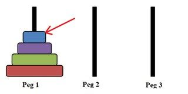

# Kombinatorika: Reizināšanas likums {-}

## 1.uzdevums {-}

Tipisks telefona numurs Latvijā izskatās šādi: `+371 DDDD DDDD`
(valsts kods, kam seko kaut kādi 8 cipari).  
Kāds ir lielākais telefona numuru skaits, ko var šādi pierakstīt?

::: solution
**Atbilde:** `100000000`

**Atrisinājums:**  
Saskaņā ar reizināšanas likumu, katru nākamo ciparu var izvēlēties 
$10$ veidos - tāpēc telefona numuru skaits ir $10^8=100000000$ 
($100$ miljoni jeb aptuveni $55$ reizes vairāk nekā 
Latvijas iedzīvotāju skaits $1.8$ miljoni).  
Valsts kods šo skaitu neiespaido, jo pirmie cipari vienmēr ir 
"371" (noteiktā secībā), tāpēc tos var izvēlēties tieši $1$ veidā.
:::

## 2.uzdevums {-}

Cik daudzos veidos četri cilvēki $A,B,C,D$ var iesēsties divos 
auto (zilajā un sarkanajā) tā, lai katrā auto būtu vismaz viens cilvēks? 

::: solution
**Atbilde:** `14`

**Atrisinājums:**  
Ja mums neinteresē, vai katrā auto sēž vismaz viens cilvēks, 
tad katram no četriem cilvēkiem ir divas izvēles - pavisam būtu 
$2^4=16$ veidi kā sasēsties. Bet starp šiem veidiem ir divi "slikti" 
veidi (ja visi sasēžas zilajā vai visi sasēžas sarkanajā). 
Tāpēc tie jāatņem. Iegūstam, ka derīgo veidu ir $16-2=14$.
:::

## 3.uzdevums {-}

Fibonači virkni $F_i$ definē šādi:  
$F_0=0$, $F_1=1$ un $F_n=F_{n-1}+F_{n-2}$ (ja $n \geq 2$). 
Tās pirmie locekļi ir šādi:  

$$0, 1, 1, 2, 3, 5, 8, 13, 21, 34, 55, 89, 144, \ldots$$

Ievērosim, ka katrs trešais loceklis šajā virknē ir pāra 
skaitlis. Katrs piektais loceklis dalās ar $5$.
Atrast mazāko $n>0$, kuram $F_n$ beidzas ar ciparu $0$.  
Ierakstīt atbildē locekļa kārtas numuru $n$.

::: solution
**Atbilde:** `15`

**Atrisinājums:**  
Fibonači virknē visi $F_{3k}$ dalās ar $2$, un visi 
$F_{5m}$ dalās ar $5$.  
Mazākais kārtas numurs $n$, kuram vienlaikus $n=3k$ un $n=5m$ 
(t.i. mazākais skaitlis, kas dalās gan ar $3$, gan ar $5$) ir $n=15$.  
Tādēļ katrs piecpadsmitais Fibonači virknes loceklis dalīsies gan ar $2$, 
gan ar $5$ jeb ar $2 \cdot 5=10$. 
Mazākais šāds loceklis ir $F_{15}=610$. 
:::

## 4.uzdevums {-}

Pieņemsim, ka Jums jākāpj lejup 6 pakāpieni - vienā solī var kāpt 
lejup $1$ pakāpienu vai $2$ pakāpienus. Secība, kādā to dara ir 
svarīga (piemēram, $1+1+1+1+2$ un $1+1+1+2+1$ ir divi atšķirīgi 
veidi). Atrast, cik veidos var nokāpt pa šiem pakāpieniem 
(Ir zināms, ka tas ir Fibonači skaitlis.)

::: solution
**Atbilde:** `13`

**Atrisinājums:**  
Vienu pakāpienu var nokāpt vienā veidā, bet divus pakāpienus - 
divos veidos (vai nu kā $1+1$ vai uzreiz kā $2$). Apzīmējam ar 
$a_n$ virkni, kas pasaka, cik veidos var nokāpt lejup $n$ pakāpienus.  
Zinām, ka $a_1=1$ un $a_2=2$.  
Ja $n \geq 2$, tad mums jau pašā sākumā ir divas alternatīvas:  
**(A)** Kāpt lejup vienu soli, un atlikušos $n−1$ pakāpienus pārvarēt 
$a_{n−1}$ veidos.  
**(B)** Kāpt lejup vienu soli, un atlikušos $n−2$ pakāpienus pārvarēt
$a_{n−2}$ veidos.  
Saskaitot abas iespējas, iegūstam $a_n = a_{n−1} + a_{n−2}$. 
Izrakstām virknes locekļus:  

$$a_1=1,\; a_2=2,\; a_3=3,\; a_4=5,\; a_5=8,\; a_6=13.$$ 

Tātad atbilde ir $13$.  
Starp citu, virkne $a_n$ ir līdzīga Fibonači skaitļu virknei, 
vienīgi $a_n=F_{n+1}$, jo Fibonači virknē $F_0=0$, $F_1=1$, 
$F_2=1$, bet tālāk - tāpat katru nākamo locekli iegūst, 
saskaitot divus iepriekšējos.
:::

## 5.uzdevums {-}

Hanojas tornī diskus atļauts pārcelt pa vienam - tos var pārvietot 
starp visiem stieņiem (#1, #2, un #3), bet ir ierobežojums - 
nedrīkst lielāku disku likt virsū mazākam diskam. 
Kā zināms, lai pārvietotu $4$ diskus no Stieņa #1 uz Stieni #3 vajag 
$15$ gājienus. 

Cik daudzi no šiem gājieniem tiek izdarīti ar pašu augšējo disku 
(zilo disku - sk. zīmējumā)?

{ width=144pt }

Detalizētāku Hanojas torņa spēles aprakstu sk. 
[Vikipēdijā](https://en.wikipedia.org/wiki/Tower_of_Hanoi).

::: solution
**Atbilde:** `8`

**Atrisinājums:**  
Augšējais disks pārvietojas 8 reizes, nākamais disks - 4 reizes, 
nākamais disks - 2 reizes, bet disks pašā apakšā tikai 1 reizi.
:::

## 6.uzdevums {-}

Cik daudzas virknītes var uzrakstīt no $5$ burtiem "A" un "B", 
ja katrai virknītei ir jāsākas ar "A" vai jābeidzas ar "B"?  
(Tā kā jautājumā rakstīts "**vai**" nevis "**vai nu**", tad der 
arī virknītes ar abiem nosacījumiem - kas gan sākas ar "A", gan beidzas ar "B").

Ierakstīt atbildē derīgo virknīšu skaitu.

::: solution
**Atbilde:** `24`

**Atrisinājums:**  
$16$ virknītes sākas ar "A", jo pēc reizināšanas likuma
to ir $1 \cdot 2 \cdot 2 \cdot 2 \cdot 2$.  
$16$ virknītes beidzas ar "B", jo pēc reizināšanas likuma to ir 
$2 \cdot 2 \cdot 2 \cdot 2 \cdot 1=16$. 

Varētu abas iespējas saskaitīt kā $16+16$, bet mums ir arī tādas 
virknītes, kas gan sākas ar "A", gan beidzas ar "B. 
Tādu ir pavisam $1 \cdot 2 \cdot 2 \cdot 2 \cdot 1=8$ 
(abus malējos burtus var izvēlēties tikai vienā veidā; 
citus burtus divos veidos). 

Tā kā šīs virknītes tika pieskaitītas divreiz, tad tās ir vienreiz jāatņem.
Iegūstam $16+16−8=24$. 
:::

## 7.uzdevums {-}

Cik daudzos veidos var uz gredzena malas izkārtot četrus burtus 
(E,L,Z,A)? Pieņemam, ka tie varianti, kas iegūstami ar gredzena 
pagriešanu (jeb burtu ciklisku pārkārtošanu) ir uzskatāmi 
par vienādiem: `AELZ`=`ELZA`=`LZAE`=`ZAEL`.

::: solution
**Atbilde:** `6`

**Atrisinājums:**  
Ir pavisam $4!=24$ veidi, kā izkārtot burtus vārdā "ELZA". Bet rotāciju dēļ, 
katrs no pagrieztajiem variantiem tiek ieskaitīts četras reizes. 
Tāpēc iegūstam tikai $24/4 = 6$ iespējas.

Varam, teiksim, pieņemt, ka gredzens tiek vienmēr pagriezts tā, 
lai lasīšana sāktos ar burtu "E". Tad atšķirīgie veidi (kas vairs 
nav iegūstami cits no cita ar pagriešanu) ir šādi:  
EALZ, EAZL, ELAZ, ELZA, EZAL, EZLA.
:::

## 8.uzdevums {-}

Cik daudzus 5 burtu vārdus var izveidot, izmantojot $5$ klucīšus, 
uz kuriem rakstītie burti K, A, N, S, A, S.  
Abi klucīši ar burtu "A" un arī abi klucīši ar burtu "S" ir neatšķirami: 
ja tos samaina, tad vārds nemainās.

::: solution
**Atbilde:** `30`

**Atrisinājums:**  
Pavisam būtu $5!=120$ veidi, kā izkārtot $5$ dažādus burtus.  
Katrs vārds, kas atšķiras tikai ar burtu "A" secību tad tiek ieskaitīts 
divreiz. Bet tā kā var apmainīt vietām arī klucīšus ar burtu "S", 
tad būtiski atšķirīgos variantus iegūst $120$ dalot ar $2 \cdot 2=4$. 
Iegūstam $120/4=30$. 

Piemēram, visi šie vārdi ir vienādi (tāpēc "KANSAS" tika pieskaitīts 
izteiksmē 5!=120 tieši 4 reizes):

$$KA_1NS_1A_2S_2,\;\;KA_1NS_2A_2S_1,\;\;KA_2NS_1A_1S_2,\;\;KA_2NS_2A_1S_1.$$
:::

## 9.uzdevums {-}

Dota skaitļu virkne $1; 1; 2; 5; 9; 6; \ldots$. To veido šādi: 
$a_1=1$, $a_2=1$, bet katrs nākamais loceklis ir divu iepriekšējo 
virknes locekļu kvadrātu summas pēdējo ciparu.  
Atrast $a_{1000}$ - virknes 1000.locekli. 

::: solution
**Atbilde:** `5`

**Atrisinājums:**  
Tā kā ciparu ir galīgs skaits (un katru nākamo ciparu nosaka divi iepriekšējie), tad pēc kāda laika divi cipari virknē atkārtosies un no tās vietas virkne kļūs periodiska.
Turpinot virkni tālāk, iegūsim, ka tā ir šāda: 

$$1; \mathbf{1}; \mathbf{2}; 5; 9; 6; 7; 5; 4; 1; 7; 0; 9; \mathbf{1}; \mathbf{2}; 5; \ldots$$

Redzam, ka virknē cipari 1 un 2 atkārtojas - un sākot no tās vietas virkne 
ir periodiska, jo katru nākamo locekli nosaka divi iepriekšējie. 
Tās periods ir $12$ (tik daudzi locekļi jāizraksta, kamēr sākas 
kārtējais identiskais virknes posms). 

Skaitli $1000$ dala ar $12$ un iegūst atlikumu $4$, tāpēc 
$a_4 = a_{16} = a_{28} = a_{40} = a_{1000}$.  
Virknes ceturtais loceklis ir "5" (un periods šajā virknes vietā jau 
ir sācies), tāpēc arī 1000.loceklis $a_{1000}=5$. 
:::

## 10.uzdevums {-}

Starp kādas ģimnāzijas skolēniem  
**(1)** tieši $1/2$ no viņiem apgūst vācu valodu,  
**(2)** tieši $1/3$ no viņiem dzied korī,  
**(3)** tieši $1/12$ no viņiem gan apgūst vācu valodu, gan dzied korī.

Atrast, kāda daļa no visiem skolēniem ir tādi, kuri apgūst vismaz 
vienu no šiem priekšmetiem (vācu valodu vai kori).
Ierakstīt Jūsu atbildi kā saīsinātu parastu daļskaitli `K/N`. 

::: solution
**Atbilde:** `3/4`

**Atrisinājums:**  
Ar $N$ apzīmējam visu skolēnu skaitu, kas ir ģimnāzijā.  
Ar $A$ apzīmējam to skolēnu skaitu, kas apgūst vācu valodu, 
bet ar $B$ apzīmējam to skolēnu skaitu, kas dzied korī. 

Pēc ieslēgšanas/izslēgšanas principa, iegūstam šādu izteiksmi 
abu kopu $A$ un $B$ apvienojumam (tiem, kuri dara vismaz vienu lietu): 

$$\frac{1}{2} \cdot N + \frac{1}{3} \cdot N - \frac{1}{12} \cdot N = \frac{9}{12} \cdot N.$$ 

Izteiksmē atņēmām $\frac{1}{12} \cdot N$, jo tie, kuri piedalās abās aktivitātēs, 
tika pieskaitīti divreiz.
Tādēļ to skolēnu daļa, kuri apgūst vismaz vienu no priekšmetiem ir 
$\frac{9}{12} = \frac{3}{4}$. 
:::

