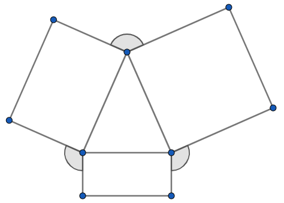

# Ģeometrija: Trijstūri un leņķi {-}

## 1.uzdevums {-}

Uz vienādsānu trijstūra $ABC$ pamata $BC$ izvēlas punktu $D$, bet uz
malas $AC$ pagarinājuma aiz punkta $C$ izvēlas punktu $E$ tā, lai $CD=CE$. 
Atrast $\sphericalangle BAC$, ja $\sphericalangle CED = 25^{\circ}$. 

{ width=250px }

*Ierakstīt veselu skaitli - leņķa $BAC$ lielumu grādos.*

**Atbilde:** `80`

<!--
Sal. [EE.PK.2010TEST.7.6](EE.PK.2010TEST.7.6)
-->

**Ieteikums:**  
Var izteikt vispirms $\sphericalangle DCB$, tad tā blakusleņķi 
$\sphericalangle ACB$.

**Atrisinājums:**  
Trijstūra $CDE$ leņķu summa ir $180^{\circ}$ un divi no tā leņķiem 
ir $25^{\circ}$. Tāpēc $\sphericalangle DCE = 180^{\circ} - 25^{\circ} - 25^{\circ} = 130^{\circ}$. 

Blakusleņķis $\sphericalangle DCA = 180^{\circ} - 130^{\circ} = 50^{\circ}$. 
Atkārtojam līdzīgu spriedumu vienādsānu trijstūrim $ABC$, kam viens leņķis pie 
pamata ir $50^{\circ}$. Arī otrs leņķis pie pamata $\sphericalangle ABC = 50^{\circ}$
un leņķis pie virsotnes: $\sphericalangle BAC = 180^{\circ} - 50^{\circ} - 50^{\circ} = 80^{\circ}$. 

## 2.uzdevums {-}

No vienādsānu trijstūra uz ārpusi konstruēti taisnstūri. 
Aprēķināt to leņķu lielumu summu, kas apzīmēti ar lociņiem.

{ width=250px }

*Ierakstīt veselu skaitli - leņķu summu grādos.*

**Atbilde:** `360`

<!--
Sal. [EE.PK.2010TEST.8.6](EE.PK.2010TEST.8.6)
-->

**Atrisinājums:**  
Trijstūra iekšējos leņķus apzīmējam ar $\alpha$, $\alpha$ un $180^{\circ} - 2\alpha$.  
Divi no leņķiem, kas apzīmēti ar lociņu ir $360^{\circ} - (90^{\circ} + 90^{\circ} + \alpha) = 180 - \alpha$.  
Pie virsotnes ar lociņu apzīmētais leņķis ir $360^{\circ} - (90^{\circ} + 90^{\circ} + (180^{\circ}-2\alpha) = 2\alpha$. 

Tāpēc visu trīs leņķu summa:    
$(180^{\circ} - \alpha) + (180^{\circ} - \alpha) + 2\alpha = 360^{\circ}$. 

## 3.uzdevums {-}

Zīmējumā attēloti divi vienādsānu trijstūri, kuriem leņķi pie virsotnes ir attiecīgi 
$40^{\circ}$ un $50^{\circ}$, un kuru pamati ir uz vienas taisnes. 
Aprēķināt leņķi $x$.

{ width=250px }

*Ierakstīt veselu skaitli - leņķa $x$ lielumu grādos.*

**Atbilde:** `45`

<!--
Sal. [EE.PK.2011TEST.7.7](EE.PK.2011TEST.7.7)
-->

**Ieteikums:**  
Var vispirms izteikt leņķus abās pusēs leņķim $x$.

**Atrisinājums:**  
Leņķi pie vienādsānu trijstūru pamata ir attiecīgi $(180^{\circ} - 40^{\circ})/2 = 70^{\circ}$ un 
$(180^{\circ} - 50^{\circ})/2 = 65^{\circ}$.  
Iegūstam, ka $x = 180^{\circ} - (70^{\circ} + 65^{\circ}) = 45^{\circ}$. 

## 4.uzdevums {-}

Aprēķināt leņķu lielumu summu, kas zīmējumā apzīmēti ar $x$ un $y$. 

{ width=200px }

*Ierakstīt veselu skaitli - leņķu summu grādos.*

**Atbilde:** `150`

<!--
Sal. [EE.PK.2011TEST.9.7](EE.PK.2011TEST.9.7)
-->

**Atrisinājums:**  
Zīmējumā dots ieliekts piecstūris. Leņķis, kas papildina $60^{\circ}$  
līdz pilnam leņķim ir $360^{\circ} - 60^{\circ} = 300^{\circ}$. Tā kā piecstūra 
iekšējo leņķu summa ir $180^{\circ} \cdot (5-2) = 540^{\circ}$, tad iegūstam 
vienādojumu:  
$x + y + 40^{\circ} + 300^{\circ} + 50^{\circ} = 540^{\circ}$.  
$x + y = 540^{\circ} - (40^{\circ} + 300^{\circ} + 50^{\circ}) = 150^{\circ}$. 

## 5.uzdevums {-}

Uz vienas no taisnstūra malām konstruēts vienādmalu trijstūris. Vienu no 
šī trijstūra malām pagarināja, kā parādīts zīmējumā. 
Atrast platā leņķa $\alpha$ lielumu, kas rodas starp trijstūra pagarināto malu un 
taisnstūra malu. 

{ width=200px }

*Ierakstīt veselu skaitli - leņķa $\alpha$ lielumu grādos.*

**Atbilde:** `120`

<!--
Sal. [EE.PK.2012TEST.7.8](EE.PK.2012TEST.7.8)
-->

**Ieteikums:**  
Vienādmalu trijstūra iekšējie leņķi ir $60^{\circ}$. Leņķi $\alpha$ var ar to izteikt.

**Atrisinājums:**  
Taisnstūrī pretējās malas ir paralēlas, tāpēc 
iekšējo vienpusleņķu summa $60^{\circ} + \alpha = 180^{\circ}$.  
Iegūstam, ka $\alpha = 120^{\circ}$. 

{ width=200px }

## 6.uzdevums {-}

Atrast $\sphericalangle BAC$ lielumu $\alpha$, ja $BD$ un
$CD$ ir šī trijstūra iekšējo leņķu bisektrises, un $\sphericalangle BDC$ lielums ir $5\alpha$.

{ width=300px }

*Ierakstīt veselu skaitli - leņķa $\alpha$ lielumu grādos.*

**Atbilde:** `20`

<!--
Sal. [EE.PK.2012TEST.8.6](EE.PK.2012TEST.8.6)
-->

**Atrisinājums:**  
Trijstūra $BCD$ iekšējo leņķu summa ir $180^{\circ}$ tāpēc
$\sphericalangle DCB + \sphericalangle DBC = 180^{\circ} - 5\alpha$, 
bet $\sphericalangle ACB + \sphericalangle ABC$ summa ir divreiz lielāka - tātad $360^{\circ} - 10\alpha$.  
$\sphericalangle ACB + \sphericalangle ABC = 180^{\circ} - \alpha$ 
(trijstūra $ABC$ iekšējo leņķu summa). 
Tāpēc $360^{\circ} - 10\alpha = 180^{\circ} - \alpha$ un $\alpha = 20^{\circ}$. 

## 7.uzdevums {-}

Dots taisnstūris $ABCD$, kurā
$\sphericalangle CBD = 25^{\circ}$. 
Uz malas $BC$ izvēlas punktu $E$ tā, lai $CE = CD$. 
Atrast leņķa $BDE$ lielumu.

{ width=250px }

*Ierakstīt veselu skaitli - leņķa lielumu grādos.*

**Atbilde:** `20`

<!--
Sal. [EE.PK.2013TEST.8.6](EE.PK.2013TEST.8.6)
-->

**Ieteikums:**  
Vispirms izsaka $\sphericalangle BED$, tad izmanto trijstūra $BDE$ iekšējo leņķu summu.

**Atrisinājums:**  
$\sphericalangle DEC = 45^{\circ}$, jo tas ir leņķis vienādsānu taisnleņķa trijstūrī 
$EDC$. Tāpēc tā blakusleņķis $\sphericalangle BED = 180^{\circ} - 45^{\circ} = 135^{\circ}$.  
Trijstūrī $BDE$ divi leņķi jau ir zināmi (attiecīgi $25^{\circ}$ un $135^{\circ}$). 
Tādēļ trešais leņķis ir $180^{\circ} - 25^{\circ} - 135^{\circ} = 20^{\circ}$. 

## 8.uzdevums {-}

Zīmējumā attēlotajā četrstūrī 
$AB = CD$. Atrast leņķa $\sphericalangle ABC$ lielumu. 

{ width=250px }

*Ierakstīt veselu skaitli - leņķa $ABC$ lielumu grādos.*

**Atbilde:** `65`

<!--
Sal. [EE.PK.2014TEST.7.8](EE.PK.2014TEST.7.8)
-->

**Atrisinājums:**  
Trijstūrī $ACD$ trešais leņķis ir 
$180^{\circ} - 30^{\circ} - 75^{\circ} = 75^{\circ}$. 
Tāpēc trijstūris $ACD$ ir vienādsānu un $CD = CA$.
Zināms arī, ka $CD = AB$. 

Tādēļ $AB = AC$ un arī trijstūris $ABC$ ir vienādsānu. 
Tāpēc $\sphericalangle ABC = \sphericalangle ACB = (180^{\circ} - 50^{\circ})/2 = 65^{\circ}$. 

## 9.uzdevums {-}

$ABC$ ir taisnleņķa trijstūris, $\sphericalangle B = 90^{\circ}$. Punkts $K$
atrodas uz hipotenūzas $AC$ un $KB = 15\,\text{cm}$. Atrast
malas $AC$ garumu.

{ width=300px }

*Ierakstīt veselu skaitli - malas $AC$ garumu centimetros.*

**Atbilde:** `30`

</small>

<!--
Sal. [EE.PK.2014TEST.8.7](EE.PK.2014TEST.8.7)
-->

**Ieteikums:**  
Izsakot leņķus, var pamanīt vienādsānu trijstūrus. Un tad izmantot tajos malu vienādības.

**Atrisinājums:**  
Tā kā $ABC$ ir taisnleņķa trijstūris, tad 
$\sphericalangle ACB = 90^{\circ} - 50^{\circ} = 40^{\circ}$.  
Trijstūrī $BKC$ izsakām trešo leņķi, jo divi leņķi ir zināmi:  
$\sphericalangle KBC = 180^{\circ} - 100^{\circ} - 40^{\circ} = 40^{\circ}$. 
Tādēļ $KBC$ ir vienādsānu trijstūris un $KB = KC$. 

$\sphericalangle ABK = 90^{\circ} - 40^{\circ} = 50^{\circ}$. 
Tādēļ arī trijstūris $AKB$ ir vienādsānu un $KB = KA$. 
Iegūstam, ka $AC = AK + KC = 2KB = 2 \cdot 15 = 30$ centimetri.  

## 10.uzdevums {-}

Trijstūrī $ABC$ malu $AB$ un $AC$ garumi ir vienādi un 
$\sphericalangle ACB = 70^{\circ}$. 
Uz malas $AC$ atzīmēja punktu $P$ tā, lai nogriežņi $BP$ un
$BC$ būtu vienādi. Aprēķināt ar $x$ apzīmēto leņķi. 

{ width=200px }

*Ierakstīt veselu skaitli - leņķa $x$ lielumu grādos.*

**Atbilde:** `30`

<!--
Sal. [EE.PK.2015TEST.7.6](EE.PK.2015TEST.7.6)
-->

**Atrisinājums:**  
Tā kā $PBC$ ir vienādsānu trijstūris, tad $\sphericalangle PCB = \sphericalangle CPB = 70^{\circ}$ 
un $\sphericalangle PBC = 180^{\circ} - 70^{\circ} - 70^{\circ} = 40^{\circ}$.

Vienādsānu trijstūrī $\sphericalangle CAB = 180^{\circ} - 70^{\circ} - 70^{\circ} = 40^{\circ}$. 
Trijstūra $ABC$ iekšējo leņķu summa (zaļie lociņi zīmējumā) 
$x + 40^{\circ} + 70^{\circ} + 40^{\circ} = 180^{\circ}$ un $x = 30^{\circ}$. 

{ width=200px }

