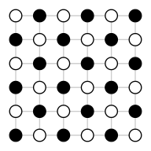
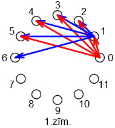
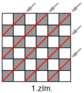
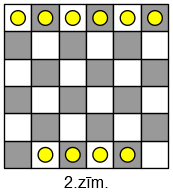
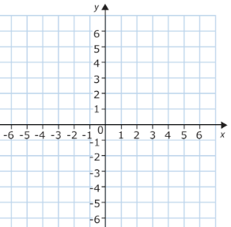

# Dirihlē princips - 2 {-}

## 1.uzdevums {-}

Klasē mācās $20$ skolēni. Katram skolēnam ir tieši divi vectētiņi; 
turklāt katriem diviem skolēniem vismaz viens vectētiņš ir kopīgs. 
(Zināms arī, ka neeksistē visiem skolēniem kopīgs vectētiņš.) 
Kāds ir lielākais iespējamais šīs klases skolēnu vectētiņu skaits?

::: solution
**Atbilde:** `3`

**Atrisinājums:**  
Trīs vectētiņi $A,B,C$, acīmredzot, ir iespējami - ja katram skolēnam 
vectētiņu pāris ir vai nu $(A,B)$, vai $(A,C)$, vai $(B,C)$, 
tad katriem diviem skolēniem kāds no vectētiņiem sakritīs.

Visi vectētiņu pāri $(A,B), (A,C), (B,C)$ noteikti tiek izmantoti 
(eksistē bērni, kam ir pāris $(A,B)$, un arī $(A,C)$ un arī $(B,C)$), 
jo ir zināms, ka nevar būt visiem kopīgais vectētiņš. 
Bet ceturto vectētiņu pievienot vairs nav iespējams, jo tad, 
ja parādās vēl kāds bērns, tad viņam nevar piešķirt jaunu vectētiņu 
$D$, jo tad viņam var būt ne vairāk kā viens vectētiņš no saraksta 
$(A,B,C)$ -- un tātad ar kādu no bērniem viņam nebūs kopīga vectētiņa.
:::

## 2.uzdevums {-}

Katrs no 36 punktiem kvadrātiskā režģī 6×6, nejauši izvēloties, 
nokrāsots vai nu melns vai balts.  Kāds mazākais punktu skaits 
jānokrāso melni, lai noteikti atrastos horizontāla vai vertikāla 
taisne, uz kuras ir vismaz 4 melni punkti?

::: solution
**Atbilde:** `19`

**Atrisinājums:**  
Ja  19 punkti ir melni, tad tos kaut kā sazīmējot uz 6 paralēlām taisnēm 
režģī (piemēram, horizontālajām) atradīsies $\lceil 19/6 \rceil =4$ 
punkti uz vienas horizontālās taisnes (19/6 noapaļojam uz augšu.)  
Ja izvēlas tikai $18$ baltos punktus, tad arī melno būs 18 un tos režģī 
$6 \times 6$ varēs iekrāsot pārmaiņus līdzīgi šaha galdiņa krāsojumam. 
Uz katras horizontālas vai vertikālas taisnes nonāks tikai $3$ melni punkti.

{ width=96pt }
:::

## 3.uzdevums {-}

Klasē ir $12$ skolēni. Katrs no viņiem kaut kā izvēlas $n$ klasesbiedrus un 
nosūta katram no viņiem Jaungada apsveikumu. Kādam mazākajam $n$ var apgalvot,
ka noteikti atradīsies divi tādi klasesbiedri, kas nosūtījuši 
apsveikumus viens otram?

::: solution
**Atbilde:** `6`

**Atrisinājums:**  
Attēlosim klasesbiedrus kā punktus, kas izvietoti uz riņķa līnijas. 
Pavisam tos savieno $C_{12}^2 = \frac{12 \cdot 11}{2} = 66$
šķautnes jeb vēstuļu sūtīšanas "kanāli". 
(Tik daudz diagonāļu ir 12-stūrī, kas savieno kaut kādas divas virsotnes).

Ja tiek sūtītas $12 \cdot 6=72$ vēstules, tad katrai vēstulei 
nepietiek sava "kanāla"; divām jātiek sūtītām starp tām pašām 
virsotnēm - t.i. klasesbiedri nosūta vēstules viens otram.

Ja katrs sūta tikai $5$ apsveikumus, tad savstarpēju apsveikumu 
var arī nebūt. Pretpiemēra veidošanai iztēlosimies, ka skolēni 
izrakstīti pa apli un katrs sūta vēstules pieciem nākamajiem 
skolēniem, skaitot pa apli pretēji pulksteņa rādītāju virzienam 
(sk. zīmējumu, kur divu skolēnu izsūtītie apsveikumi atzīmēti 
attiecīgi ar zilām un sarkanā bultiņām). Šādā gadījumā uz 
apļa neatradīsies divi skolēni, kurus savieno bultiņas 
abos virzienos vienlaikus.

{ width=96pt }
:::

## 4.uzdevums {-}

Istabā ir $10$ cilvēki; katri divi vai nu pazīst viens 
otru vai arī nepazīst. (Pazīšanās ir simetriska: ja $A$ 
pazīst $B$, tad arī $B$ pazīst $A$.)  Izvēlamies cilvēku 
$X$ starp šiem $10$ cilvēkiem.  
Kāds ir lielākais skaits cilvēku, kas vai nu visi 
pazīst $X$, vai arī visi nepazīst $X$?

::: solution
**Atbilde:** `5`

**Atrisinājums:**  
Cilvēkam $X$ ir pavisam $9$ dažādi citi cilvēki.  Katru no 
tiem var pazīt vai nepazīt. Vismaz $5$ no šiem cilvēkiem 
būs attiecībā "pazīst" vai arī attiecībā "nepazīst". $9$ 
cilvēkus dala divu veidu "būrīšos" - un vismaz pieciem 
jābūt savstarpēji vienādiem.
:::

## 5.uzdevums {-}

Vecmāmiņa kāpj pa trepēm $49$ pakāpienus, ar vienu soli 
pārvarot vienu, divus vai trīs pakāpienus. Pavisam viņai
nepieciešami $30$ soļi augšup. Ja vecmāmiņa piecreiz uzkāpj 
pa šīm trepēm, cik reižu viņa bijusi uz tā pakāpiena, uz 
kura viņa bijusi visbiežāk  
(neskaitot pašu apakšējo - $0$-to un pašu augšējo - $49$-to)?

::: solution
**Atbilde:** `4`

**Atrisinājums:**  
Pavisam ir 48 pakāpieni (neskaitot apakšējo un augšējo). 
$0$-tajā solī vecmāmiņa ir uz apakšējā pakāpiena, bet $30$-tajā solī - 
uz augšējā. Tādēļ viņai katrā uzkāpšanas reizē ir $29$ soļi uz 
pakāpieniem kaut kur pa vidu. Iegūstam, $29 \cdot 5=145$. 
Sadalot $145$ uz $48$ "būrīšiem" iegūstam, ka vismaz vienā 
būrītī būs vismaz 
$\lceil 145/48 \rceil = \lceil 3.02 \rceil =4$ objekti. (Noapaļo uz augšu.)
 
*Piezīme:* Spēja kāpt tieši pa 1, 2 vai 3 pakāpieniem nav būtiska - 
varētu atļaut kāpt arī lielāku skaitu pakāpienu, saglabājot tieši 30 soļus
augšup. Atbilde no tā nemainītos.
:::

# 6.uzdevums {-}

Kādu lielāko skaitu laidņu var izvietot uz šaha galdiņa $6 \times 6$ tā, 
lai tie viens otru neapdraud (t.i. neatrodas uz vienas diagonāles)? 
Laidņu gājienus sk. zīmējumā - ja tie pārvietojas pa melnajiem 
lauciņiem. Ir arī laidņi, kas pārvietojas pa baltajiem lauciņiem.

{ width=100pt }

::: solution
**Atbilde:** `4`

**Atrisinājums:**  
Ir divu veidu laidņi - uz melnajām un uz baltajām diagonālēm. 
Ja aplūkojam melnās diagonāles, tad tām eksistē divi virzieni 
(no kreisā augšējā uz labo apakšējo stūri un no labā augšējā 
uz kreiso apakšējo). Dirihlē principa lietošanai izdevīgāks 
tas virziens uz kura ir mazāk diagonāļu ($5$ diagonāles nevis $6$). 
Uz katras no $5$ diagonālēm var novietot ne vairāk par vienu laidni. 

Tas pats sakāms arī par baltajām diagonālēm. Tādēļ laidņu nevar būt 
vairāk par $5+5=10$. 
Viens piemērs, kā novietot tieši $10$ laidņus tā, lai tie viens otru 
neapdraud, attēlots zīmējumā.

{ width=100pt }
:::

# 7.uzdevums {-}

Uz 36 kartītēm uzrakstīti naturāli skaitļi ($1$, $3$ vai $9$) un tās saliktas 
lielā taisnstūrī $4 \times 9$, kur katrā rindā skaitļu summa ir $27$, 
bet katrā kolonnā skaitļu summa ir $12$ - sk. zīmējumu. 
Pasjansa cienītājs Pāvils vēlas šīs pašas kartītes izkārtot 
taisnstūrī $6 \times 6$ tā, lai visās rindās skaitļu summas būtu vienādas, 
bet viņam tas neizdodas.

Kāda ir vismazākā iespējamā skaitļu summa "maksimālajā rindā" 
(t.i. rindā, par kuru nav lielāka neviena cita rinda)?

::: solution
**Atbilde:** `22`

**Atrisinājums:**  
Tabulā ir astoņas kartītes ar skaitli "9". Ja tās sadala 6 rindās, 
tad vismaz vienā no tām atradīsies vismaz divi skaitļi "9". 
Tā kā katrā rindā ir tieši 6 kartītes, tad "maksimālajā rindā" 
(kurā ir divi deviņnieki) ir jāliek vēl četras kartītes ar 
skaitli "1", jo mazāku skaitļu uz kartītēm nav. Iegūstam mazāko 
iespējamo summu rindā ar diviem deviņniekiem: $9+9+1+1+1+1=22$. 
To var sasniegt, ja izkārto skaitļus šādi: 

$9+9+1+1+1+1=22$;  
$9+9+1+1+1+1=22$;  
$9+3+1+1+1+1=16$;  
$9+3+1+1+1+1=16$;  
$9+3+1+1+1+1=16$;  
$9+3+1+1+1+1=16$.
:::

# 8.uzdevums {-}

Naturālo skaitļu kubi no $1$ līdz $7$ ir $1, 8, 27, 64, 125, 216, 343$, 
bet to atlikumi, dalot ar $7$ ir attiecīgi $1, 1, 6, 1, 6, 6, 0$. 

Cik skaitļu no $1$ līdz $100$ ir jāuzraksta uz tāfeles, lai 
starp tiem noteikti atrastos divi skaitļi, kuru kubu 
starpība dalās ar $7$?

::: solution
**Atbilde:** `4`

**Atrisinājums:**  
Ja drīkst uzrakstīt tikai 3 skaitļus, tad var izvēlēties, piemēram, 
$1$, $3$ un $7$. Visu skaitļu kubi dod dažādus atlikumus, dalot ar $7$ un 
tātad neviena kubu starpība 
$3^3 - 1^3 = 26$, vai $7^3 - 1^3 = 342$, vai $7%3 - 3^3 = 316$ 
nedalās ar $7$. 

Ja, savukārt, izvēlas četrus skaitļus (jebkurus naturālus skaitļus no 
$1$ līdz $100$ vai pat vēl lielākus), tad vismaz diviem no tiem kubi 
dos vienādus atlikumus, dalot ar 7. Jo iespējamie kubu atlikumi, 
dalot ar 7 ir tikai trīs: 0, 1 vai 6 (un pēc Dirihlē principa vismaz 
viens no šiem atlikumiem atkārtosies).
:::

# 9.uzdevums {-}

Latviešu alfabētā ir $33$ burti. Kādā skolā katrs skolēns parakstās ar 
iniciāļiem - tieši diviem latviešu alfabēta burtiem (abi burti var 
būt arī vienādi, piemēram, "A.A." vai "Ž.Ž"). Kāds var būt vismazākais 
skolēnu skaits skolā, lai noteikti atrastos divi skolēni ar vienādiem 
iniciāļiem, kurus viņi raksta tieši tanī pašā secībā?

::: solution
**Atbilde:** `1090`

**Atrisinājums:**  
Iespējamo iniciāļu pāru (t.i. Dirihlē principa "būrīšu") 
ir $33 \cdot 33=1089$. Ja skolēnu būs par vienu vairāk, tad diviem 
no viņiem būs jānonāk vienā "būrītī", t.i. jāizmanto tie paši 
iniciāļi tanī pašā secībā.

Ja skolēnu ir $1089$ vai mazāk, tad katram var būt cits iniciāļu pāris.
:::

# 10.uzdevums {-}

Koordinātu plaknē atzīmēti vairāki punkti ar veselām koordinātēm 
(tie atrodas rūtiņu režģa virsotnēs - sk. zīmējumu). Kāds 
mazākais skaits punktu jāatzīmē, lai starp tiem noteikti 
atrastos divi tādi punkti $A,B$, ka nogriežņa $AB$ viduspunkts 
arī ir punkts ar veselām koordinātēm?

{ width=150pt }

::: solution
**Atbilde:** `1090`

**Atrisinājums:**  
Punktus ar koordinātēm $(x,y)$ var iedalīt četrās kategorijās 
atkarībā no tā, vai $x$ un $y$ ir pāra vai nepāra skaitļi -- 
apzīmēsim šīs kategorijas ar $\{(n,n)\}$, $\{(n,p)\}$, 
$\{(p,n)\}$ un $\{(p,p)\}$. Piemēram, $(1,2) \in \{(n,p)\}$, 
jo $1$ ir nepāra, bet $2$ ir pāra skaitlis. 

Saliekot piecus punktus šajās četrās kategorijās, pēc Dirihlē 
principa iegūsim, ka vismaz divi punkti nonāk tajā pašā kategorijā. 
Piemēram, $(1,2) \in \{(n,p)\}$ un arī $(3,8) \in \{(n,p)\}$. 
Bet tad arī to viduspunkts $((1+3)/2; (2+8)/2) = (2;5)$
būs punkts ar abām veselām koordinātēm.

Ar $4$ punktiem nepietiek: Ja, piemēram, tos izvēlas kā 
viena mazā kvadrātiņa virsotnes $((0,0), (1,0), (1,1), (0,1))$, 
tad visi to viduspunkti saturēs vismaz vienu skaitli, kas nav vesels.
:::
