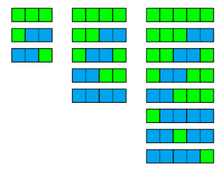

# Algebra: Rekurentas virknes

## 1.uzdevums {-}

Fibonači virkne definēta ar sakarībām $F_0 = 0$, $F_1 = 1$, 
$F_n = F_{n-1} + F_{n-2}$ (ja $n \geq 2$) -- katru nākamo 
locekli iegūst, saskaitot divus iepriekšējos.  
Šīs virknes locekļi no $F_0$ līdz $F_{35}$ apkopoti tabulā (sk. zīmējumu). 

Zināms, ka Fibonači skaitļu atlikumu virkne, dalot ar $5$, ir periodiska:
Katru nākamo atlikumu viennozīmīgi nosaka divi iepriekšējie atlikumi -- 
tāpēc tie sāks atkārtoties. Daži pirmie atlikumu virknes locekļi ir 
$0,1,1,2,3,0,3,3,1,4,\ldots$. 
Kāds ir šīs atlikumu virknes periods?

{ width=250px }

::: solution
**Atbilde:** `20`

**Atrisinājums:**   
Ievērojam, ka $F_{20} = 6765$ (atlikums, dalot ar $5$ ir $0$),  
$F_{21}=10946$ (atlikums $1$),  
$F_{22}=17711$ (atlikums $1$),  
$F_{23} = 28657$ (atlikums $2$).  
Kā redzam, sākot no $F_{20}$ Fibonači virknes atlikumi (pēc $5$ moduļa) sāk uzvesties tāpat kā atlikumi, sākot no $F_{0}$. 
Tātad visi atlikumi, dalot ar $5$, atkārtojas ik pēc $20$ Fibonači virknes skaitļiem.

*Piezīme:*
Ievērojam, ka katrs piektais Fibonači skaitlis dalās ar 5 (atlikums ir 0), bet ar to vēl nepietiek, lai būtu periods, jo, teiksim, virkne 5,8,13,21,34... dod atlikumus 0,3,3,1,4,... kas atšķiras no tiem atlikumiem, kuri ir virknes pašā sākumā (0,1,1,2,3,...).
:::

## 2.uzdevums {-}

Kādam valdniekam bija $n$ kvadrātiski lauciņi. 
Uz pirmā lauciņa viņš uzlika $1$ rīsu graudu, uz otrā lauciņa 
viņš uzlika divreiz vairāk ($2$ rīsu graudus), uz nākamā 
viņš uzlika vēl divreiz vairāk ($4$ rīsu graudus) utt. 

Lai varētu vieglāk saprast, cik graudi nepieciešami uz $k$-tā lauciņa, 
viņš definēja rekurentu virkni: $a_1 = 1$, $a_2 = 2$, $a_n = 2 \cdot a_{n-1}$ (ja $n \geq 3$). 
Cik rīsu graudiņu nepieciešami, lai noklātu pirmos $8$ lauciņus šajā virknē?

{ width=150px }

::: solution
**Atbilde:** `255`

**Atrisinājums:**  
Mums jāatrod summa $a_1 + a_2 + \ldots + a_{8}$. 
Varam saskaitīt $2^0 + 2^1 + 2^2 + 2^3 + 2^4 + 2^5 + 2^6 + 2^7$ jeb 
$1 + 2 + 4 + 8 + 16 + 32 + 64 + 128$. Šī summa ir $255$. 

Var ievērot arī, ka ģeometriskas progresijas summa $2^0 + \ldots +2^{k-1} = 2^{k}-1$
(t.i. rīsu graudu skaits uz pirmajiem $k$ kvadrātiņiem ir par vienu mazāks 
nekā jāliek uz nākamā kvadrātiņa). Pie $k=8$ iegūstam $2^8 - 1 = 256 - 1 = 255$. 
:::

## 3.uzdevums {-}

Kosmiskie ceļotāji aizlidoja uz planētu, uz kuras gravitācija līdzīga Zemei 
(brīvās krišanas paātrinājums ir $10~m/s^2$), bet nav gaisa pretestības. 
Ja no šīs planētas debesskrāpja jumta palaiž vaļā ķieģeli, tad pirmajā sekundē tas 
nolido $5$ metrus uz leju, otrajā sekundē $15$ metrus, trešajā sekundē $25$ metrus utt. 

Ķieģeļa nolidotais ceļš $k$-tajā sekundē ir $a_k$, kur $a_1 = 5$, $a_n = a_{n-1} + 10$
(ja $n \geq 2$). Zināms, ka tieši pēc $10$ sekunžu lidojuma, ķieģelis atsitas 
pret planētas virsmu. Cik metru augsts bija debesskrāpis? 
(*Ierakstīt tikai skaitli bez mērvienības.*)

::: solution
**Atbilde:** `500`

**Atrisinājums:**  
Ķieģeļa krišanas attālumi veido aritmētisku progresiju ar pirmo locekli $5$ un diferenci $10$. 
Tāpēc pēdējais (desmitais) loceklis būs $5 + 9 \cdot 10 = 95$. 

Visu pirmo desmit locekļu summa $a_1 + a_2 + \ldots + a_{10}$ ir pirmā un pēdējā locekļa
aritmētiskais vidējais ($(5 + 95)/2 = 50$) reizināts ar locekļu skaitu $10$. 
Tāpēc debesskrāpis tur bija $50 \cdot 10 = 500$ metrus augsts.
:::

## 4.uzdevums {-}

No mājām līdz ieejai dzīvoklī ir $10$ pakāpieni. Naoko ar vienu soli  
uzkāpj $2$ vai $3$ pakāpienus (vienu pakāpienu ar vienu soli viņa nekad nekāpj). 
Cik dažādos veidos var uzkāpt līdz dzīvoklim no ieejas? 
(Veidus uzskata par atšķirīgiem, ja atšķiras izdarīto soļu secība: $2 + 3$ 
ir cita secība nekā $3+2$.)

::: solution
**Atbilde:** `7`

**Atrisinājums:**  
Apzīmēsim ar $a_k$ to veidu skaitu, kuros Naoko var uzkāpt tieši $k$ pakāpienus.  
$a_1 = 0$ (ar atļautajiem gājieniem nevar uzkāpt pa trepēm, ja jākāpj tieši viens pakāpiens), 
$a_2 = 1$ (divus pakāpienus var pārvarēt tieši vienā veidā), $a_3 = 1$ (arī 
trīs pakāpienus var pārvarēt tieši vienā veidā).

Ja jākāpj $n \geq 4$ pakāpieni, tad vai nu vispirms vienā solī uzkāpj $2$ pakāpienus 
un atlikušos $n-2$ varēs uzkāpt $a_{n-2}$ veidos. Vai nu arī vispirms uzkāpj 
$3$ pakāpienus vienā solī un atlikušos pārvar $a_{n-3}$ veidos. 
Iegūstam $a_n = a_{n-2} + a_{n-3}$ (katru nākamo locekli iegūst 
summējot otro un trešo, skatoties no virknes beigām). 

Virknes pirmie locekļi ir šādi:  
$a_1 = 0$, $a_2 = 1$, $a_3 = 1$, $a_4 = a_2 + a_1 = 1+0 =1$, $a_5 = 1+1 = 2$.

Tālākie locekļi:  
$a_6 = 1+1 = 2$, $a_7 = 2+1=3$, $a_8 =2+2= 4$, $a_9 = 3+2= 5$, $a_{10} = 4+3 = 7$. 
:::

## 5.uzdevums {-}

Mums jāaizpilda ar krāsainām flīzēm taisnstūris $1 \times 7$. 
Ir pieejamas flīzes ar izmēru $1 \times 1$ (zaļas) un 
arī flīzes ar izmēru $1 \times 2$ (zilas). 
Dažādie veidi, kā aizpildīt taisnstūrus $1 \times 3$, $1 \times 4$ un $1 \times 5$
redzami zīmējumā. 

Cik veidos ar šīm flīzēm var aizpildīt taisnstūri $1 \times 7$ 
(zilo un zaļo flīžu skaits un secība ir svarīgi).

{ width=300px }

::: solution
**Atbilde:** `21`

**Atrisinājums:**  
Flīžu aizpildījumi veido Fibonači virkni. Taisnstūri $1 \times 4$ 
var aizpildīt $5$ veidos, bet taisnstūri $1 \times 5$ jau $8$ veidos. 
Katru nākamo var iegūt, saskaitot abus iepriekšējos (jo $a_n$ var dabūt 
vai nu ieliekot vienu zaļo flīzi un atlikumu aizpildot $a_{n-1}$ veidos 
vai arī ieliekot vienu zilo flīzi un atlikušo $1 \times (n-2)$ gabalu 
aizpildot $a_{n-2}$ veidos). 

Iegūstam, ka $a_6 = 8+5 = 13$ un $a_7 = 13 + 8 = 21$. 
:::

## 6.uzdevums {-}

Zīmējumā attēlota riņķa līnija, uz kuras atzīmēti $n$ 
punkti. Starp visiem atzīmētajiem punktiem ir novilkti 
nogriežņi (riņķa hordas). 
Zināms, ka nekādas trīs hordas nekrustojas vienā punktā.
Ar $a_n$ apzīmējam gabalu skaitu, kurās hordas sadala riņķi. 
Piemēram,  
$a_1 = 1,\;a_2=2,\;a_3=4;\;a_4=8$. 

Atrast $a_6$ vērtību. 

{ width=200px }

::: solution
**Atbilde:** `31`

**Atrisinājums:**  

Saskaitot reģionus zīmējumā (labajā apakšējā stūrī), 
iegūstam, ka $a_6 = 31$.
Šo skaitu var atrast arī rekurenti - pievienojot sesto punktu un 
saskaitot, cik daudzus gabalus sadala jaunizveidotās diagonāles.

Šis uzdevums ar apļa dalīšanu pazīstams kā Leo Mozera uzdevums. 
Tas ievērojams ar to, ka pirmās dažas vērtības veido 
ģeometrisku progresiju $1,2,4,8,16$, bet tālākie virknes locekļi 
vairs neseko šādai likumsakarībai.
:::

## 7.uzdevums {-}

Ar $a_n$ (kur $n \geq 0$) apzīmējam atlikumu, 
kuru dod $3^n$, dalot ar $7$. 
Atrast virknes $a_n$ periodu. 

::: solution
**Atbilde:** `6`

**Atrisinājums:**  

Skaitļa $3$ pakāpes (sākot ar 0-to pakāpi) ir $1,3,9,27,81,243,729,\ldots$. 
To atlikumi, dalot ar $7$ ir attiecīgi $1,3,2,6,4,5,1,\ldots$. 
Tā kā katru nākamo atlikumu viennozīmīgi nosaka iepriekšējais atlikums (kuram jāpiereizina $3$), 
šī virkne kļūst periodiska tiklīdz kā tajā parādās divi vienādi locekļi. 
Mūsu gadījumā periods ir $6$, jo $3^0=1$ un $3^6=729$ dod vienādus atlikumus, 
dalot ar $7$.
:::

## 8.uzdevums {-}

Ar $b_n$ (kur $n \geq 0$) apzīmējam atlikumu, 
kuru dod $12n$, dalot ar $27$. 
Atrast virknes $b_n$ periodu. 

::: solution
**Atbilde:** `9`

**Atrisinājums:**  
Pirmie virknes locekļi ir $0, 12, 24, 9, 21, 6, 18, 3, 15, 0, 12, 24,\ldots$. 
Kā redzam, tie sāk atkārtoties ik pēc $9$ (jo $12 \cdot 9$ dalās ar $27$). 
Tā kā katru nākamo atlikumu viennozīmīgi nosaka iepriekšējais atlikums (kuram 
jāpieskaita $12$), tad virkne ir periodiska. 
:::

## 9.uzdevums {-}

Ar $c_n$ (kur $n \geq 0$) apzīmējam atlikumu, 
kuru dod $12n$, dalot ar $29$. 
Atrast virknes $c_n$ periodu. 

::: solution
**Atbilde:** `17`

**Atrisinājums:**  
Tā kā $12$ un $17$ ir savstarpēji pirmskaitļi, tad būs jāgaida 
$17$ locekļi (un jāiziet visi iespējamie atlikumi, dalot ar $17$)
pirms iestāsies periods. 

Šie ir locekļi virknē $c_n$:  
0, 12, 7, 2, 14, 9, 4, 16, 11, 6, 1, 13, 8, 3, 15, 10, 5, 0, ...

Tā kā katru nākamo atlikumu viennozīmīgi nosaka iepriekšējais atlikums (kuram 
jāpieskaita $12$), tad virkne ir periodiska. 
:::

## 10.uzdevums {-}

Definējam rekurentu virkni $a_{n} = 2a_{n-1} + 3$ ($n \geq 1$), bet nenorādām 
tās pirmo locekli $a_0$. Var viegli izteikt dažus nākamos locekļus: 

$a_1 = 2a_0 + 3$ un $a_2 = 2a_1 + 3 = 2(2a_0 + 3) + 3 = 4a_0 + 9$. 

Ja mēs izsakām $a_4$ ar $a_0$ šādi: $a_4= 16a_0 + C$, tad cik ir $C$?

::: solution
**Atbilde:** `45`

**Atrisinājums:**  
Izsakām $a_3$ un $a_4$:  
$a_3 = 2a_2 + 3 = 2(4a_0+9) + 3 = 8a_0 + 18+3 = 8a_0+21$.  
$a_4 = 2a_3 + 3 = 2(8a_0+21) + 3 = 16a_0 + 42+3 = 16a_0+45$.  
:::

