# Ģeometrija: Līdzīgi trijstūri {-}

## 1.uzdevums {-} 

Zīmējumā attēlots trijstūris $FHG$, kur $FH=6$, $GH=8$ un $FG=10$. 
Punkts $I$ ir $FG$ viduspunkts un $HIJK$ ir kvadrāts. 
Nogriežņi $IJ$ un $GH$ krustojas punktā $L$. Cik liels ir iekrāsotā četrstūra laukums?
**(A)** 124/8, **(B)** 125/8, **(C)** 126/8, **(D)** 127/8, **(E)** 128/8.

{ width=108pt }

::: solution
**Atbilde:** `B`

**Atrisinājums:**  
Trijstūris ar malu garumiem $6,8,10$ ir taisnleņķa, jo $6^2 + 8^2 = 10^2$. 
No taisnā leņķa virsotnes $H$ vilkta mediāna $HI$ -- un tā sadala 
taisnleņķa trijstūri divos vienādsānu trijstūros jeb mediānas garums ir 
puse no hipotenūzas. 

*Pierādījums apgalvojumam par taisnleņķa trijstūra mediānu:* Taisnleņķa 
trijstūrim $FGH$ piezīmējam klāt otru tādu pašu simetriski pret centru $I$, 
iegūstam taisnstūri. Taisnstūrī abas diagonāles ir vienāda garuma, 
tās krustpunktā dalās uz pusēm. Tāpēc $HI$ ir puse no 
taisnstūra diagonāles un $HI = HG/2 = 5$.

Kvadrāta $HIJK$ laukums ir $5 \cdot 5 = 25$. No tā jāatņem $\triangle HIL$ 
laukums. Ievērojam, ka šie trijstūri ir līdzīgi: $\triangle FGH \sim \triangle LHI$ 
(abi ir taisnleņķa trijstūri un šaurie leņķi $\sphericalangle IHL = \sphericalangle HGF$, 
jo trijstūris $HGI$ ir vienādsānu).
$\triangle LHI$ un $\triangle FGH$ līdzības koeficients ir $k = 5/8$, 
jo $LHI$ garākā katete $HI = 5$, bet $FGH$ garākā katete $GH=8$.

Izsakām abu trijstūru laukumus, izmantojot līdzības koeficientu:
$S_{FGH} = \frac{1}{2} \cdot 6 \cdot 8 = 24$ un  
$S_{LHI} = 24 \cdot k^2 = 24 \cdot \frac{25}{64} = \frac{75}{8}$. 

Visbeidzot iekrāsotās figūras laukums:  
$S_{HKJL} = 25 - \frac{75}{8} = \frac{200 - 75}{8} = \frac{125}{8}$, 
kas ir atbilde **(B)**.
:::

<!--
EU.PinkKangaroo.2014.24

The diagram shows a triangle $FHG$ with $FH=6$, $GH=8$ and $FG=10$. 
The point $I$ is the midpoint of $FG$ and $HIJK$ is a square. 
The line segment $IJ$ intersects $GH$ at $L$. What is the area 
of the shaded quadrilateral?
**(A)** 124/8, **(B)** 125/8, **(C)** 126/8, **(D)** 127/8, **(E)** 128/8.
-->

## 2.uzdevums {-} 

Attēlā dots taisnstūris $PQRS$, kurā $PQ:QR = 1:2$. Punkts $T$ 
atrodas uz $PR$ tā, ka $ST$ ir perpendikulārs taisnei $PR$. 
Kāda ir trijstūra $RST$ laukuma un taisnstūra $PQRS$ laukuma attiecība?
**(A)** $1:(4\sqrt{2})$, **(B)** $1:6$, **(C)** $1:8$, **(D)** $1:10$, **(E)** $1:12$. 

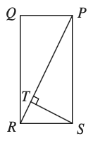{ width=54pt }

::: solution
**Atbilde:** `D`

**Atrisinājums.** Pēc Pitagora teorēmas, taisnstūra 
diagonāle $PR = \sqrt{1^2 + 2^2} = \sqrt{5}$. 
Tā ir hipotenūza taisnleņķa trijstūrim $\triangle PQR$. 
Trijstūris $\triangle RST$ ir līdzīgs $\triangle PRQ$ un tam hipotenūza 
ir $1$. Tādēļ $\triangle RST$ līdzības koeficients attiecībā 
pret $\triangle PRQ$ ir $\frac{1}{\sqrt{5}}$ -- trijstūra 
$\triangle RST$ elementi (malas, augstumi) ir $\sqrt{5} \approx 2.236$ reizes īsāki par 
atbilstošajiem elementiem trijstūrī $PRQ$.

Laukumu attiecība abiem trijstūriem:   
$$\frac{S_{RST}}{S_{PRQ}} = \left( \frac{1}{\sqrt{5}} \right)^2 = \frac{1}{5}.$$

Tā kā taisnstūra laukums $S_{PQRS}$ ir divreiz lielāks nekā 
trijstūra laukums $S_{PRQ}$, tad $\triangle RST$ laukuma attiecība pret taisnstūra 
laukumu ir puse no $1/5$ jeb $\frac{1}{10}$, kas ir atbilde **(D)**. 
:::

<!--
UK.SMC.2014.14

The diagram shows a rectangle PQRS in which PQ : QR = 1 : 2. The point T on PR is such that ST is perpendicular to PR. What is the ratio of the area of the triangle RST to the area of the rectangle PQRS?
-->

## 3.uzdevums {-} 

Uz katras trijstūra malas ir atzīmēts punkts, kas atrodas vienu ceturtdaļu no malas garuma (sk. attēlu).
Kāda daļa no trijstūra laukuma ir iekrāsota? **(A)** $\dfrac{7}{16}$, **(B)** $\dfrac{1}{2}$, **(C)** $\dfrac{9}{16}$, **(D)** $\dfrac{5}{8}$, **(E)** $\dfrac{11}{16}$.

{ width=108pt }

::: solution
**Atbilde:** `D`

**Atrisinājums:**  
Katram no abiem baltajiem trijstūriem pamats ir $3/4$ no sākotnējā trijstūra pamata, 
bet augstums ir četrreiz īsāks par sākotnējā trijstūra augstumu. Šo pēdējo faktu 
var pamatot, aplūkojot līdzīgus trijstūrus (piemēram, $\triangle BDJ$ un 
$\triangle BCK$ zīmējumā).  

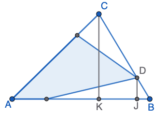{ width=108pt }

Ja sākotnējā trijstūra laukumu apzīmē ar $S = \frac{1}{2}ah$, tad katram no baltajiem 
trijstūriem laukums:  
$$S' = \frac{1}{2} \left(\frac{3}{4} a \right) \left( \frac{1}{4}h \right) = \frac{3}{16}S.$$

Atņemot divus šādus trijstūrus, iegūstam $S - \frac{3}{16}S - \frac{3}{16}S = \frac{5}{8}S$, 
kas ir atbilde **(D)**.

*Piezīme:* Ja izmanto trijstūra laukuma formulu $S = \frac{1}{2}ab \sin \gamma$, tad 
balto trijstūrīšu laukumus var izteikt uzreiz (pamatot, ka tie ir $3/16$ no sākotnējā trijstūra laukuma), 
neizmantojot spriedumus par līdzīgiem trijstūriem.
:::

<!--
UK.IMC.2015.25

A point is marked one quarter of the way along each side of a triangle, as shown.
What fraction of the area of the triangle is shaded?

**(A)** $\dfrac{7}{16}$, **(B)** $\dfrac{1}{2}$, **(C)** $\dfrac{9}{16}$, **(D)** $\dfrac{5}{8}$, **(E)** $\dfrac{11}{16}$.
-->

## 4.uzdevums {-}

Trijstūrī $FGH$ var novilkt taisni, kas ir paralēla tā pamatam 
$FG$, gan caur punktu $X$, gan caur $Y$. Ieēnoto daļu laukumi abos gadījumos ir vienādi. 
Zināms, ka attiecība $HX : XF = 4 : 1$. Kāda ir attiecība $HY : YF$?  
**(A)** $1 : 1$, **(B)** $2 : 1$, **(C)** $3 : 1$, **(D)** $3 : 2$, **(E)** $4 : 3$

{ width=180pt }

::: solution
**Atbilde:** `D`

**Atrisinājums:**  
Apzīmējam trijstūra pamata malu ar $a$ un augstumu ar $h$. 
Tad kreisā attēla trapecei apakšējais pamats ir $a$, bet augšējais pamats ir $\frac{4}{5} a$; trapeces augstums ir $\frac{1}{5}h$. Tad trapeces laukums:  
$$S = \frac{a + \frac{4}{5}a}{2} \cdot \left( \frac{1}{5} h \right) = \left( 1 + \frac{4}{5} \right) \cdot \frac{1}{5} \cdot \frac{ah}{2} = \frac{9}{25} \cdot \frac{ah}{2}.$$

Iekrāsotās trapeces laukums ir $\frac{9}{25}$ no trijstūra laukuma. 
Lai labajā pusē iekrāsotajam trijstūrim arī būtu tāds laukums, vajag, 
lai līdzības koeficients būtu $\frac{3}{5}$. Tad $\frac{HY}{HF}=\frac{3}{5}$, 
un līdz ar to $\frac{HY}{YF} = \frac{3}{2}$, kas ir atbilde **(D)**. 
:::

<!--
EU.PinkKangaroo.2015.20

In the triangle $FGH$, we can draw a line parallel to its base $FG$, 
through point $X$ or $Y$. The areas of the shaded regions are the same. 
The ratio $HX : XF = 4 : 1$. What is the ratio $HY : YF$?

A $1 : 1$   B $2 : 1$   C $3 : 1$   D $3 : 2$   E $4 : 3$

In the triangle on the left, the unshaded triangle is similar to triangle $FGH$, and is obtained from it by a scale factor of $\frac{4}{5}$. Hence its area is $\left(\frac{4}{5}\right)^2 = \frac{16}{25}$ of the area of $FGH$. The shaded area is therefore $\frac{9}{25}$ of the area of $FGH$. Hence $HY : HF = 3 : 5$ and so $HY : YF = 3 : 2$.
-->

## 5.uzdevums {-}

Zīmējumā dots kvadrāts ar diagonāli un nogriezni, kas savieno 
virsotni ar malas viduspunktu. Kāda ir figūru $P$ un $Q$ laukumu attiecība?
**(A)** $1 : \sqrt{2}$,
**(B)** $2 : 3$,
**(C)** $1 : 2$,
**(D)** $2 : 5$,
**(E)** $1 : 3$.

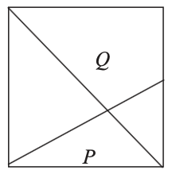{ width=72pt }

::: solution
**Atbilde:** `D`

**Atrisinājums-1:**  
Apzīmējam kvadrāta malu ar $1$.
Novelkam $GE$ -- trijstūra $ABC$ viduslīniju; tās garums ir $1/2$. 
Trapeces $ABEG$ laukums ir viduslīnijas un augstuma reizinājums: 

$$S_{ABEG} = \frac{1 + 1/2}{2} \cdot \frac{1}{2} = \frac{3}{8}.$$

Trijstūri $CDF$ un $GEF$ ir līdzīgi, jo tiem visi leņķi ir pa pāriem vienādi. 
Līdzības koeficients ir $2$, jo $CD$ ir divreiz garāks nogrieznis nekā $GE$. 
Abu šo trijstūru vertikālajiem augstumiem jābūt $1/3$ un $1/6$
(vienīgie skaitļi, kuru summa ir $1/2$ un pirmais ir divreiz lielāks kā otrais). 
Trijstūra $FDC$ laukums -- puse no pamata un augstuma reizinājuma:

$$S_{CDF} = \frac{DC \cdot \frac{1}{3}}{2} = \frac{1}{6}.$$

Savukārt $S_{GEF} = \frac{1}{24}$, jo tas ir četras reizes mazāks. 
Meklējamā laukumu attiecība: 

$$\frac{P}{Q} = \frac{S_{CDF}}{S_{ABEG} + S_{GEF}} = \frac{\frac{1}{6}}{\frac{3}{8} + \frac{1}{24}} = \frac{\frac{1}{6}}{\frac{10}{24}} = \frac{24}{60} = \frac{2}{5}.$$

Tā ir atbilde **(D)**

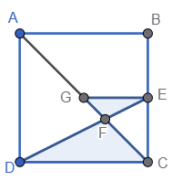{ width=90pt }

**Atrisinājums-2:**  
Apzīmējam trijstūra $CEF$ laukumu ar $S$. Ievērojam, ka $\sphericalangle AFD = \sphericalangle CFE$ (krustleņķi) un 
$\sphericalangle DAF = \sphericalangle ECF$ (iekšējie šķērsleņķi), tādēļ trijstūri $ADF$ un $CEF$ ir līdzīgi.
Līdzības koeficients $k=2$, jo mala $AD$ ir divreiz garāka par atbilstošo malu $CE$. Tātad:

i. trijstūrim $ADF$ ir laukums $k^2 \cdot S = 4S$,
ii. mala $AF$ ir divreiz garāka nekā attiecīgā mala $CF$.

Apskatām $AF$ un $CF$ kā trijstūru $ADF$ un $CDF$ pamatus (tiem ir vienāds augstums). Saskaņā ar (ii), 
trijstūrim $ADF$ ir divreiz lielāks laukums nekā trijstūrim $CDF$ (laukums $P$), tātad tas ir $2S$.

Trijstūra $ACD$ laukums ir $6S$; tātad arī trijstūra $ABC$ laukums ir $6S$, bet $Q$ ir $6S-S = 5S$. 
Tātad meklētā attiecība ir $2 : 5$, 
kas ir atbilde **(D)**.

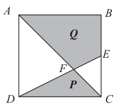{ width=90pt }
:::

<!--
UK.IMC.2011.25

The diagram shows a square, a diagonal and a line joining a vertex
to the midpoint of a side. What is the ratio of area to area ? P Q
A B 2 : 3 C 1 : 2 D 2 : 5 E 1 : 3 
-->

## 6.uzdevums {-}

Zīmējumā attēlotajā taisnleņķa trijstūrī malu garumi 
ir $5~\mathrm{cm}$, 
$12~\mathrm{cm}$ un $13~\mathrm{cm}$.
Kāds ir ievilktā pusriņķa rādiuss centimetros, ja tā 
diametrs atrodas uz malas ar garumu $12~\mathrm{cm}$?  
**(A)** $8/3$, **(B)** $10/3$, **(C)** $11/3$, **(D)** $4$,
**(E)** $13/3$.

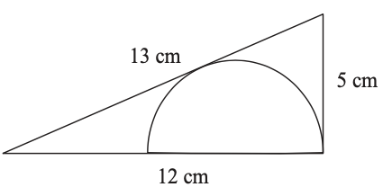{ width=162pt }

*Ieteikums:* Ja neesat pazīstami ar formulu $S=pr$ (laukums 
ir pusperimetrs reiz ievilktā riņķa rādiuss), 
var savienot riņķa centru ar pieskaršanās
punktu uz hipotenūzas un aplūkot līdzīgus trijstūrus.

<!--
UK.PinkKangaroo.2012.13

The right-angled triangle shown has sides of length $5~\mathrm{cm}$, 
$12~\mathrm{cm}$ and $13~\mathrm{cm}$. What, in cm, is the 
radius of the inscribed semicircle whose diameter lies on the side 
of length $12~\mathrm{cm}$? 

**(A)** $8/3$, **(B)** $10/3$, **(C)** $11/3$, **(D)** $4$,
**(E)** $13/3$.

Let $H$, $I$, $J$ be the vertices of the triangle, $C$ the centre of the circle, and $K$ the point where the semicircle touches the edge $HI$ as shown. The angle $\sphericalangle CKH$ is a right angle because $HI$ is tangent to the circle and so perpendicular to the radius $CK$. The two triangles $HKC$ and $HJI$ are similar since they each have a right angle and they share the angle at $H$. Let $r$ be the radius of the semicircle, then $CK = r$ and $CH = 12 - r$. Then by similar triangles we have
$\dfrac{12 - r}{r} = \dfrac{13}{5}$.

So $5(12 - r) = 13r$.

Then $60 - 5r = 13r$.

So $18r = 60$ hence $r = \dfrac{10}{3}$.
-->

::: solution
**Atbilde:** `B`

**Atrisinājums-1:**  
Apzīmējam trijstūra virsotnes ar $H$, $I$, $J$, ar $C$ – riņķa centru un $K$ ir punkts, kur pusriņķis 
pieskaras malai $HI$, kā redzams zīmējumā. Leņķis $\sphericalangle CKH$ ir taisns, 
jo nogrieznis $HI$ pieskaras riņķim un tādēļ ir perpendikulārs rādiusam $CK$. 
Trijstūri $HKC$ un $HJI$ ir līdzīgi, jo tiem ir katram taisns leņķis un arī kopīgs leņķis virsotnē $H$. 
Apzīmējam pusriņķa rādiusu ar $r$; tad $CK = r$ un $CH = 12 - r$. No trijstūru līdzības iegūstam
$\dfrac{12 - r}{r} = \dfrac{13}{5}$.

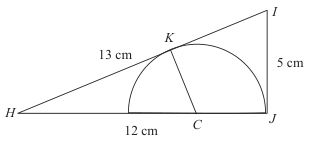{ width=162pt }

Tātad $5(12 - r) = 13r$ un $60 - 5r = 13r$.
No šejienes $18r = 60$, tātad $r = \dfrac{10}{3}$, kas ir atbilde **(B)**.

**Atrisinājums-2:**  
Simetriski pret kateti garumā $12$ uzzīmējam otru taisnleņķa trijstūri. 
Esam ieguvuši jaunu vienādsānu trijstūri $HIJ$, kurā ievilkta riņķa līnija. 
Šī trijstūra laukums ir divkāršots $\frac{1}{2} \cdot 5 \cdot 12 = 30$, 
tātad $60$. 

No otras puses, trijstūra laukumu var izteikt ar formulu $S = pr$, kur 
$p$ ir pusperimetrs un $r$ - ievilktā riņķa līnija. 
Trijstūra $HIJ$ pusperimetrs ir $(13 + 13 + 10)/2 = 18$. Tāpēc pielīdzinām:
$$S = pr,\;\;60 = 18r,\;\;r = 60/18 = 10/3.$$

Tā ir atbilde **(B)**.

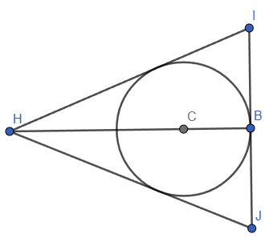{ width=180pt }
:::

## 7.uzdevums {-}

Trīs apļi un taisnes $PQ$ un $QR$ savstarpēji pieskaras, 
kā attēlots zīmējumā. Attālums starp mazākā un lielākā
riņķa centriem ir $16$ reizes lielāks par mazā riņķa 
rādiusu. Kāds ir leņķis $\sphericalangle PQR$?
**(A)** $45^{\circ}$, **(B)** $60^{\circ}$, **(C)** $75^{\circ}$,
**(D)** $90^{\circ}$, **(E)** $135^{\circ}$.

<!--
UK.SMC.2011.24

Three circles and the lines $PQ$ and $QR$ touch as shown.
The distance between the centres of the smallest and
the biggest circles is $16$ times the radius of the smallest
circle. What is the size of $\sphericalangle PQR$?  
**(A)** $45^{\circ}$, **(B)** $60^{\circ}$, **(C)** $75^{\circ}$,
**(D)** $90^{\circ}$, **(E)** $135^{\circ}$.

24. **B** Let the radii of the circles from smallest to largest be $r_1$, $r_2$ and $r_3$ respectively. Hence
$$
16r_1=r_3+2r_2+r_1,\ \text{thus } r_3=15r_1-2r_2\ldots\ (1).
$$
Let $r_1+x$ be the distance from $Q$ to the centre of the smallest circle. By similar triangles,
$$
\frac{r_1}{r_1+x}=\frac{r_2}{x+2r_1+r_2}=\frac{r_3}{16r_1+r_1+x}\ldots\ (2).
$$

Thus $r_1(x+2r_1+r_2)=r_2(r_1+x)$. Hence
$$
r_2=\frac{r_1x+2r_1^2}{r_1}\ldots\ (3).
$$
From (1) and (2)
$$
\frac{r_1x}{r_1+x}=\frac{(15r_1-2r_2)x}{17r_1+x}
\ \text{hence}\
\frac{r_1x}{r_1+x}=\frac{15r_1x-2(r_1x+2r_1^2)}{17r_1+x}.
$$
Dividing throughout by $r_1$ and simplifying gives $12x^2-8r_1x-4r_1^2=0$. Hence $(3x+r_1)(x-r_1)=0$ so, as $r_1>0$, $x=r_1$. Thus
$$
\sin\frac{\sphericalangle PQR}{2}=\frac{r_1}{r_1+x}=\frac{r_1}{2r_1}=\frac12.
$$
Hence $\frac12\sphericalangle PQR=30^\circ$ so $\sphericalangle PQR=60^\circ$.
-->

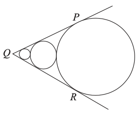{ width=128pt }

::: solution
**Atbilde:** `B`

**Atrisinājums:**  
Apļu rādiusus no mazākā līdz lielākajam apzīmējam attiecīgi ar 
$r_1$, $r_2$ un $r_3$. Tātad

$$16r_1=r_3+2r_2+r_1,\ \text{tāpēc } r_3=15r_1-2r_2 \quad\quad (1).$$

Ar $r_1+x$ apzīmē attālumu no $Q$ līdz mazākā apļa centram. Trijstūru līdzības dēļ

$$\frac{r_1}{r_1+x}=\frac{r_2}{x+2r_1+r_2}=\frac{r_3}{16r_1+r_1+x}\quad\quad (2).$$

Tad $r_1(x+2r_1+r_2)=r_2(r_1+x)$. Tāpēc

$$r_2=\frac{r_1x+2r_1^2}{r_1}\quad\quad (3).$$

No (1) un (2)

$$\frac{r_1x}{r_1+x}=\frac{(15r_1-2r_2)x}{17r_1+x}
\ \text{tātad}\
\frac{r_1x}{r_1+x}=\frac{15r_1x-2(r_1x+2r_1^2)}{17r_1+x}.$$

Izdalot visur ar $r_1$ un vienkāršojot, iegūst $12x^2-8r_1x-4r_1^2=0$. 
Tātad $(3x+r_1)(x-r_1)=0$, un, tā kā $r_1>0$, $x=r_1$. Tāpēc

$$\sin\frac{\sphericalangle PQR}{2}=\frac{r_1}{r_1+x}=\frac{r_1}{2r_1}=\frac12.$$

Tātad $\frac12\sphericalangle PQR=30^\circ$, līdz ar to $\sphericalangle PQR=60^\circ$, 
kas ir atbilde **(B)**.
:::

## 8.uzdevums {-}

Zīmējumā attēloti divi kvadrāti: Vienam malas 
garums ir $20$, un otram malas garums ir $10$. 
Kāds ir ieēnotā apgabala laukums?

*Ierakstīt atbildē veselu skaitli vai parastu noīsinātu daļu P/Q.*

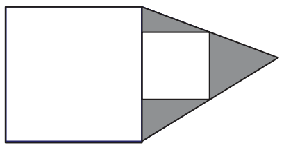{ width=108pt }

<!--
UK.SeniorKangaroo.2011.4

The diagram below includes two squares: one has sides
of length 20 and the other has sides of length 10.
What is the area of the shaded region?

**100** Using the labelling shown, we see that 
$\triangle ACE$ and $\triangle BCD$ are similar and have lengths 
in the ratio $2:1$. Because the height of $\triangle ACE$ is 
$10$ + the height of $\triangle BCD$, the height of 
$\triangle ACE$ is $20$ and its area is 
$\frac12 \times 20 \times 20 = 200$. The area of the smaller 
square is $100$ so the shaded area is $200 - 100 = 100$.
-->

::: solution
**Atbilde:** `100`

**Atrisinājums:**  
Ieviešot burtu apzīmējumus, redzam, 
ka $\triangle ACE$ un $\triangle BCD$ ir līdzīgi un to 
garumu attiecība ir $2:1$. Tā kā $\triangle ACE$ augstums ir 
$10$ plus trijstūra $BCD$ augstums, $\triangle ACE$ augstums ir 
$20$, un tā laukums ir $\frac12 \cdot 20 \cdot 20 = 200$. 
Mazākā kvadrāta laukums ir $100$, tāpēc iekrāsotās daļas 
laukums ir $200 - 100 = 100$.

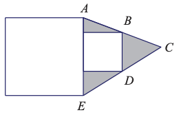{ width=126pt }
:::

## 9.uzdevums {-}

Attēlā redzams taisnstūris $ABCD$, kam $AB=16$ un
$BC=12$.  $\sphericalangle ACE$ ir taisns leņķis un 
$CE=15$. Nogriežņi $AE$ un $CD$ krustojas punktā $F$.
Kāds ir $\triangle ACF$ laukums?

*Ierakstīt atbildē veselu skaitli vai parastu noīsinātu daļu P/Q.*

<!--
UK.SeniorKangaroo.2011.14

The diagram shows a rectangle $ABCD$ with $AB=16$ and
$BC=12$. Angle $ACE$ is a right angle and $CE=15$. The
line segments $AE$ and $CD$ meet at $F$.
What is the area of triangle ACF?

**75** 

Using Pythagoras' theorem firstly in $\triangle ABC$ and then in $\triangle ACE$ we get $AC=20$ and $AE=25$. It follows that $\triangle ABC$ is similar to $\triangle ACE$ as the corresponding sides are in the same ratio. Therefore, $\sphericalangle BAC=\sphericalangle CAE$. Also $\sphericalangle BAC=\sphericalangle ACF$, using alternate angles, so $\sphericalangle CAF=\sphericalangle ACF$ and $\triangle AFC$ is isosceles. Let $M$ be the mid-point of $AC$ and join $M$ to $F$. This gives two more right-angled triangles, $\triangle AMF$ and $\triangle CMF$, also similar to $\triangle ABC$. Thus
$$
\frac{MF}{MA}=\frac{BC}{BA}
$$
which gives $MF=\frac{15}{2}$. Therefore the area of $\triangle ACF$ is $\frac12\times\frac{15}{2}\times 20=75$.
-->

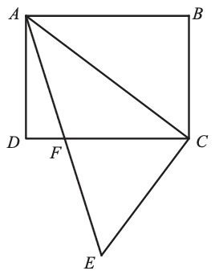{ width=90pt }

::: solution
**Atbilde:** `75`

**Atrisinājums:**  
Izmantojot Pitagora teorēmu vispirms $\triangle ABC$ un pēc tam 
$\triangle ACE$, iegūstam $AC=20$ un $AE=25$. No tā izriet, ka $\triangle ABC$ 
ir līdzīgs $\triangle ACE$, jo atbilstošo malu attiecība abos trijstūros ir $3:4:5$ (pazīme $mmm$). 
Tāpēc $\sphericalangle BAC=\sphericalangle CAE$. Arī $\sphericalangle BAC=\sphericalangle ACF$, izmantojot 
iekšējos šķērsleņķus, tātad $\sphericalangle CAF=\sphericalangle ACF$ un $\triangle AFC$ ir vienādsānu. 
Lai $M$ ir nogriežņa $AC$ viduspunkts un savienojam $M$ ar $F$. 
Tas dod vēl divus taisnleņķa trijstūrus, $\triangle AMF$ un $\triangle CMF$, 
kas arī ir līdzīgi $\triangle ABC$. Tātad

$$\frac{MF}{MA}=\frac{BC}{BA}$$

no kurienes $MF=\frac{MA \cdot BC}{BA} = \frac{10 \cdot 12}{16} = \frac{15}{2}$. Tāpēc $S_{ACF} = \frac12\cdot\frac{15}{2}\cdot 20=75$.
:::

## 10.uzdevums {-}

Riņķa diametra $AD$ garums ir $4$. Punkti 
$B$ un $C$ atrodas uz riņķa, kā attēlots zīmējumā, un $AB=BC=1$.
Atrast $CD$ garumu.

*Ierakstīt atbildē veselu skaitli vai parastu noīsinātu daļu P/Q.*

<!--
UK.Maclaurin.2010.4

The diameter $AD$ of a circle has length $4$. The points
$B$ and $C$ lie on the circle, as shown, so that $AB=BC=1$.
Find the length of $CD$.

Let $O$ be the centre of the circle, so that $OA=OB=OC=2$, and let chord $AC$ and radius $OB$ meet at $X$.

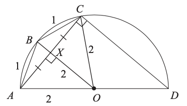

Triangle $OAC$ is isosceles and $OB$ bisects angle $AOC$ (because the chords $AB$ and $BC$ are equal and so subtend equal angles at the centre). Hence $OB$ is the perpendicular bisector of the base $AC$ of the isosceles triangle $AOC$. In other words, $AX=XC$ and $\sphericalangle AXO=90^\circ$, as shown in the diagram above.

Since angle $ACD$ is $90^\circ$ (angle in a semicircle) triangle $ACD$ is a right-angled triangle with $CD$, whose length we have to find, as one side. We know $AD=4$, so can find $CD$, using Pythagoras' theorem, from
$$
CD^2=AD^2-AC^2,\qquad (4.1)
$$
provided we can find the length of $AC$. We shall do this by using areas, but there are other methods.

Now consider isosceles triangle $OAB$ and let $N$ be the midpoint of $AB$, so that triangle $ANO$ is right-angled.

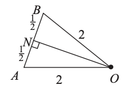

Then, from Pythagoras' theorem,
$$
NO^2=2^2-\left(\frac12\right)^2=\frac{15}{4},
$$
so that $NO=\frac{\sqrt{15}}{2}$. Hence the area of triangle $AOB$ is
$$
\frac12\times AB\times NO=\frac{\sqrt{15}}{4}.
$$
But the area of triangle $OAB$ is also $\frac12\times OB\times AX$. Therefore $AX=\frac{\sqrt{15}}{4}$ and so
$$
AC=2AX=\frac{\sqrt{15}}{2}.
$$
Using this value in equation (4.1). we get
$$
CD^2=AD^2-AC^2=4^2-\frac{15}{4}=\frac{49}{4}
$$
and hence $CD=\frac{7}{2}$.

**Solution-2**
Let $P$ be the intersection of $AB$ produced and $DC$ produced.

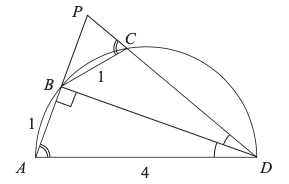

Now angles $ADB$ and $BDC$ are both angles at the circumference subtended by chords of length $1$. These angles are therefore equal. Also, $\sphericalangle ABD=90^\circ$ (angle in a semicircle). Therefore triangles $ABD$ and $PBD$ are congruent (ASA). Hence $BP=1$ and $PD=4$.

Further, in triangles $BCP$ and $DAP$, angle $P$ is common and $\sphericalangle BCP=\sphericalangle DAP$ (exterior angle of cyclic quadrilateral). These triangles are therefore similar and hence $PC:1=2:4$. So $PC=\frac12$ and $CD=PD-PC=4-\frac12=3\frac12$.
-->

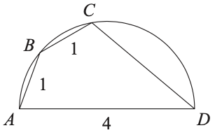{ width=126pt }

::: solution
**Atbilde:** `7/2`

**Atrisinājums-1:**  
Lai $O$ ir apļa centrs, tā ka $OA=OB=OC=2$, un lai horda $AC$ un rādiuss $OB$ krustojas punktā $X$.

{ width=162pt }

Trijstūris $OAC$ ir vienādsānu, un $OB$ pārgriež leņķi $AOC$ uz pusēm (jo hordas $AB$ un $BC$ ir vienādas un tāpēc apļa centrā nogriež vienādus leņķus). Tātad $OB$ ir vienādsānu trijstūra $AOC$ pamata $AC$ perpendikulārais dalītājs. Citiem vārdiem, $AX=XC$ un $\sphericalangle AXO=90^\circ$, kā parādīts iepriekšējā zīmējumā.

Tā kā leņķis $ACD$ ir $90^\circ$ (leņķis pusaplī), trijstūris $ACD$ ir taisnleņķa 
trijstūris, kurā viena mala ir $CD$, un tās garums mums jāatrod. Zinām, 
ka $AD=4$, tāpēc $CD$ var atrast, izmantojot Pitagora teorēmu:
$$CD^2=AD^2-AC^2,\qquad (4.1)$$
ja vien varam noteikt nogriežņa $AC$ garumu. To darīsim, izmantojot laukumus, bet pastāv arī citas metodes.

Tagad aplūkosim vienādsānu trijstūri $OAB$ un lai $N$ ir nogriežņa $AB$ viduspunkts, tā ka trijstūris $ANO$ ir taisnleņķa.

{ width=90pt }

Tad pēc Pitagora teorēmas

$$NO^2=2^2-\left(\frac12\right)^2=\frac{15}{4},$$

tāpēc $NO=\frac{\sqrt{15}}{2}$. Tātad trijstūra $AOB$ laukums ir

$$\frac12\times AB\times NO=\frac{\sqrt{15}}{4}.$$

Bet trijstūra $OAB$ laukums ir arī $\frac12\times OB\times AX$. Tāpēc $AX=\frac{\sqrt{15}}{4}$ un tādēļ

$$AC=2AX=\frac{\sqrt{15}}{2}.$$

Ievietojot šo vērtību vienādojumā (4.1)., iegūstam

$$CD^2=AD^2-AC^2=4^2-\frac{15}{4}=\frac{49}{4}$$

un līdz ar to $CD=\frac{7}{2}$.

**Atrisinājums-2:**  
Lai $P$ ir pagarināto taisņu $AB$ un $DC$ krustpunkts.

{ width=162pt }

Leņķi $ADB$ un $BDC$ abi ir riņķī ievilkti leņķi, ko balsta hordas 
ar garumu $1$. Tāpēc šie leņķi ir vienādi. Cits ievilkts leņķis 
$\sphericalangle ABD=90^\circ$, jo balstās uz diametru. 
Tāpēc trijstūri $ABD$ un $PBD$ ir kongruenti (pazīme $\ell m \ell$). 
Tātad $BP=1$ un $PD=4$.

Turklāt trijstūros $BCP$ un $DAP$ leņķis pie $P$ ir kopīgs un 
$\sphericalangle BCP=\sphericalangle DAP$ (ievilkta četrstūra ārējais leņķis). 
Tāpēc šie trijstūri ir līdzīgi, un no tā seko $PC:1=2:4$. 
Tātad $PC=\frac12$ un $CD=PD-PC=4-\frac12=3\frac{1}{2} = \frac{7}{2}$.
:::

## 11.uzdevums {-}

Četras vienādas vienādsānu trapeces novietotas tā, ka to garākās 
pamata malas veido kvadrāta $PQRS$ diagonāles, kā parādīts attēlā. 
Punkts $X$ dala $PQ$ attiecībā $3:1$. Kāda daļa no kvadrāta 
ir iekrāsota?

**(A)** $\frac{5}{16}$, **(B)** $\frac{3}{8}$, **(C)** $\frac{7}{16}$,
**(D)** $\frac{5}{12}$, **(E)** $\frac{1}{2}$.

<!--
UK.IMC.2013.13

Four congruent isosceles trapeziums are placed so that their longer
parallel sides form the diagonals of a square $PQRS$, as shown. The point $X$
divides $PQ$
in the ratio $3:1$. What fraction of the square is shaded?

**B** The diagram shows the top-right-hand portion of the square. The shaded trapezium is labelled $QXYZ$ and $W$ is the point at which $ZY$ produced meets $PQ$.

As $QXYZ$ is an isosceles trapezium, $\sphericalangle QZY=\sphericalangle ZQX=45^\circ$. Also, as $YX$ is parallel to $ZQ$, $\sphericalangle XYW=\sphericalangle WXY=45^\circ$. So $WYX$ and $WZQ$ are both isosceles right-angled triangles. As $\sphericalangle ZWQ=90^\circ$ and $Z$ is at the centre of square $PQRS$, we deduce that $W$ is the midpoint of $PQ$. Hence $WX=XQ=\frac14 PQ$. So the ratio of the side-lengths of similar triangles $WYX$ and $WZQ$ is $1:2$ and hence the ratio of their areas is $1:4$.

Therefore the area of trapezium $QXYZ=\frac34\times\text{area of triangle }ZWQ=\frac{3}{32}\times\text{area }PQRS$ since triangle $ZWQ$ is one-eighth of $PQRS$. So the fraction of the square which is shaded is $4\times\frac{3}{32}=\frac38$.

-->

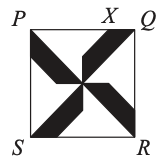{ width=108pt }

::: solution
**Atbilde:** `B`

**Atrisinājums:**  
Zīmējumā parādīta kvadrāta labā augšējā ceturtdaļa. 
Iekrāsotais trapecveida četrstūris ir apzīmēts ar $QXYZ$, 
un $W$ ir punkts, kurā pagarinājums $ZY$ krustojas ar $PQ$.

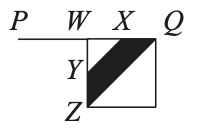{ width=108pt }

Tā kā $QXYZ$ ir vienādsānu trapece, $\sphericalangle QZY=\sphericalangle ZQX=45^\circ$. 
Taisnes $YX$ un $ZQ$ ir paralēlas, un $\sphericalangle XYW=\sphericalangle WXY=45^\circ$.
Tātad $WYX$ un $WZQ$ abi ir vienādsānu taisnleņķa trijstūri. 
Tā kā $\sphericalangle ZWQ=90^\circ$ un $Z$ atrodas kvadrāta $PQRS$ centrā, 
secinām, ka $W$ ir nogriežņa $PQ$ viduspunkts. Tāpēc $WX=XQ=\frac14 PQ$. 
Tātad līdzīgo trijstūru $WYX$ un $WZQ$ malu garumu attiecība ir $1:2$, 
un līdz ar to šo trijstūru laukumu attiecība ir $1:4$.

Tāpēc trapeces laukums $S_{QXYZ} = \frac34 \cdot S_{ZWQ} = \frac{3}{32} \cdot S_{PQRS}$, 
jo trijstūris $ZWQ$ ir viena astotā daļa no $PQRS$. 
Tātad iekrāsotā daļa no kvadrāta ir $4\times\frac{3}{32}=\frac{3}{8}$, 
kas ir atbilde **(B)**.
:::

## 12.uzdevums {-}

Trapeces perimetrs ir $5$ vienības un katras malas garums ir 
vesels skaitlis. Kādi ir divi mazākie trapeces leņķi?

**(A)** $30^{\circ}$ un $30^{\circ}$,
**(B)** $60^{\circ}$ un $60^{\circ}$,
**(C)** $45^{\circ}$ un $45^{\circ}$,
**(D)** $30^{\circ}$ un $60^{\circ}$,
**(E)** $45^{\circ}$ un $90^{\circ}$.

<!--
EU.GrayKangaroo.2013.9

The perimeter of a trapezium is 5 units and the length of each of its sides is an integer number
of units. What are the two smallest angles of the trapezium?
**(A)** $30^{\circ}$ and $30^{\circ}$,
**(B)** $60^{\circ}$ and $60^{\circ}$,
**(C)** $45^{\circ}$ and $45^{\circ}$,
**(D)** $30^{\circ}$ and $60^{\circ}$,
**(E)** $45^{\circ}$ and $90^{\circ}$.

**B** 

The situation as described must refer to an isosceles trapezium with three sides of length one unit and one side of length two units. Extend the two non-parallel sides of the trapezium to form a triangle as shown. Lines $PT$ and $QS$ are parallel. Hence, using corresponding angles, we know that $\sphericalangle TPR=\sphericalangle SQR$ and also that $\sphericalangle PTR=\sphericalangle QSR$. This shows that the two triangles $PRT$ and $QRS$ have equal angles and so are similar. Therefore
$$
\frac{x}{x+1}=\frac12
$$
which has solution $x=1$ and
$$
\frac{y}{y+1}=\frac12
$$
which has solution $y=1$. Hence triangle $QRS$ is equilateral and so its angles are all $60^\circ$. This means that the base angles of the trapezium are also both $60^\circ$.

-->

::: solution
**Atbilde:** `B`

**Atrisinājums:**  
Aprakstītā situācija atbilst vienādsānu trapecei ar trim malām, 
kuru garums ir viena vienība, un vienu malu, kuras garums ir 
divas vienības. 
Pagarinām abas trapeces sānu malas, lai izveidotu trijstūri, 
kā parādīts zīmējumā.

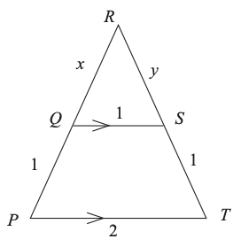{ width=126pt }

Taisnes $PT$ un $QS$ ir paralēlas. 
Tāpēc, izmantojot atbilstošos leņķus, zinām, ka $\sphericalangle TPR=\sphericalangle SQR$ 
un $\sphericalangle PTR=\sphericalangle QSR$. Tas parāda, ka trijstūriem $PRT$ un $QRS$ 
ir vienādi leņķi, tātad tie ir līdzīgi. 
Tāpēc $$\frac{x}{x+1}=\frac12$$
no kā iegūst $x=1$, un
$$\frac{y}{y+1}=\frac12$$
no kā iegūst $y=1$. Tātad trijstūris $QRS$ ir vienādmalu, un tā visi leņķi 
ir $60^\circ$. Tas nozīmē, ka arī leņķi pie trapeces pamata ir $60^\circ$.
:::

## 13.uzdevums {-}

Četrstūrī $PQRS$, $\sphericalangle PQR = 59^{\circ}$, 
$\sphericalangle RPQ = 60^{\circ}$, 
$\sphericalangle PRS = 61^{\circ}$ un 
$\sphericalangle RSP = 60^{\circ}$, kā redzams attēlā. 
Kurš no nogriežņiem ir garākais?
**(A)** $PQ$,
**(B)** $PR$, 
**(C)** $PS$, 
**(D)** $QR$, 
**(E)** $RS$.

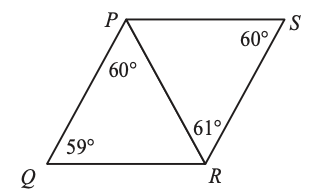{ width=126pt }

<!--
EU.PinkKangaroo.2013.15

In quadrilateral $PQRS$, $\sphericalangle PQR = 59^{\circ}$, 
$\sphericalangle RPQ = 60^{\circ}$, 
$\sphericalangle PRS = 61^{\circ}$ and 
$\sphericalangle RSP = 60^{\circ}$, as shown. 
Which of the following line segments is the longest?

**(A)** $PQ$,
**(B)** $PR$, 
**(C)** $PS$, 
**(D)** $QR$, 
**(E)** $RS$.

**A** 

The triangles are similar because they both contain angles of $59^\circ$, $60^\circ$, $61^\circ$. The smallest side of a triangle is always opposite the smallest angle, so line segment $PR$ is the smallest edge of triangle $PQR$, though it is not the smallest edge of triangle $PRS$; hence triangle $PQR$ is larger than triangle $PRS$ and must contain the longest line segment. The longest side in a triangle is opposite the largest angle, so side $PQ$ is the longest (opposite to $\sphericalangle PRQ$ which is $61^\circ$).
-->

::: solution
**Atbilde:** `A`

**Atrisinājums:**  
Trijstūri ir līdzīgi, jo abos ir leņķi $59^\circ$, $60^\circ$, $61^\circ$. 
Trijstūrī īsākā mala vienmēr atrodas pretī mazākajam leņķim, 
tāpēc nogrieznis $PR$ ir īsākā mala trijstūrī $PQR$, lai gan tas 
nav īsākā mala trijstūrī $PRS$; tātad trijstūris $PQR$ ir lielāks 
nekā trijstūris $PRS$ un tam jāietver garākais nogrieznis. 
Trijstūrī garākā mala atrodas pretī lielākajam leņķim, tāpēc mala 
$PQ$ ir garākā (pretī $\sphericalangle PRQ$, kas ir $61^\circ$).
:::

## 14.uzdevums {-}

Attēlā redzams trijstūris $XYZ$. Malām
$XY$, $YZ$ un $XZ$ ir attiecīgi garumi $2$, $3$ un $4$. 
Taisnes $AMB$, $PMQ$ un $SMT$ 
vilktas paralēli trijstūra malām tā, ka 
nogriežņu $AP$, $QS$ un $BT$ garumi ir vienādi.
Kāds ir $AP$ garums?
**(A)** $\frac{10}{11}$, **(B)** $\frac{11}{12}$, **(C)** $\frac{12}{13}$,
**(D)** $\frac{13}{14}$, **(E)** $\frac{14}{15}$.

<!--
UK.SMC.2015.21

The diagram shows a triangle $XYZ$. The sides
$XY$, $YZ$ and $XZ$ have lengths $2$, $3$ and $4$
respectively. The lines $AMB$, $PMQ$ and $SMT$ 
are drawn parallel to the sides of triangle
$XYZ$ so that $AP$, $QS$ and $BT$ are of equal length.
What is the length of $AP$?

**(A)** $\frac{10}{11}$, **(B)** $\frac{11}{12}$, **(C)** $\frac{12}{13}$,
**(D)** $\frac{13}{14}$, **(E)** $\frac{14}{15}$.

All of the triangles in the diagram are similar as they contain the same angles. The sides of each triangle are therefore in the ratio $2:3:4$. First consider triangle $APM$. Let $AP=x$, so that $AM=2x$. Now considering triangle $TBM$, as $BT=x$, $BM=\frac{4x}{3}$. The quadrilateral $AMSX$ is a parallelogram as $AM$ is parallel to $XS$ and $MS$ is parallel to $AX$. So $AM=XS=2x$. Similarly $QZ=BM=\frac{4x}{3}$. Considering the base of triangle $XYZ$, $XS+SQ+QZ=4$. So $2x+x+\frac{4x}{3}=4$ and therefore $x=\frac{12}{13}$.

-->

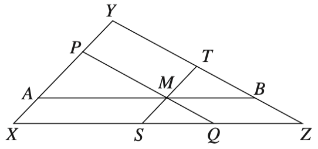{ width=180pt }

::: solution
**Atbilde:** `C`

**Atrisinājums:**  
Visi diagrammā redzamie trijstūri ir līdzīgi, jo tiem ir vienādi leņķi. 
Tāpēc katra trijstūra malu attiecība ir $2:3:4$. Vispirms aplūkosim 
trijstūri $APM$. Apzīmējam $AP=x$, tad $AM=2x$. Aplūkojot trijstūri $TBM$, 
no $BT=x$ seko $BM=\frac{4x}{3}$. Četrstūris $AMSX$ ir paralelograms, 
jo $AM$ ir paralēls $XS$ un $MS$ ir paralēls $AX$. Tātad $AM=XS=2x$. 
Līdzīgi $QZ=BM=\frac{4x}{3}$. Aplūkojot trijstūra $XYZ$ pamatu, 
$XS+SQ+QZ=4$. Tātad $2x+x+\frac{4x}{3}=4$ un līdz ar to $x=\frac{12}{13}$.
:::

## 15.uzdevums {-}

Attēlā dots trīsstūris $ABC$ ar laukumu $12~\mathrm{cm}^2$. 
Trijstūra malas ir pagarinātas līdz punktiem $P, Q, R, S, T$ 
un $U$ tā, kā parādīts, tā ka $PA = AB = BS$, 
$QA = AC = CT$ un $RB = BC = CU$.
Kāds ir sešstūra $PQRSTU$ laukums kvadrātcentimetros?

*Ierakstīt atbildē veselu skaitli vai parastu daļu P/Q.*

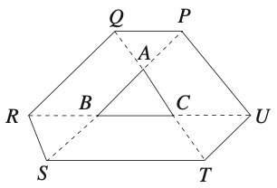{ width=144pt }

<!--
UK.SeniorKangaroo.2015.7

The diagram shows a triangle $ABC$ with area $12\text{ cm}^2$. 
The sides of the triangle are extended to points $P, Q, R, S, T$ 
and $U$ as shown so that $PA = AB = BS$, $QA = AC = CT$ and $RB = BC = CU$.

What is the area (in $\text{cm}^2$) of hexagon $PQRSTU$?

*Answer:* `156`

Consider triangles $ABC$ and $AST$. Angles $CAB$ and $TAS$ are equal because they are the same angle, $SA = 2BA$ and $TA = 2CA$. Hence triangles $ABC$ and $AST$ are similar. The ratio of their sides is $1:2$ and hence the ratio of their areas is $1:2^2 = 1:4$. Therefore the area of triangle $AST$ is $4 \times 12\ \mathrm{cm}^2 = 48\ \mathrm{cm}^2$ and hence the area of $BSTC$ is $(48 - 12)\ \mathrm{cm}^2 = 36\ \mathrm{cm}^2$. In a similar way, it can be shown that each of the areas of $CUPA$ and $AQRB$ is also $36\ \mathrm{cm}^2$. Next consider triangles $ABC$ and $APQ$. Angles $BAC$ and $PAQ$ are equal using vertically opposite angles, $AB = AP$ and $AC = AQ$. Hence triangles $ABC$ and $APQ$ are congruent (SAS) and so the area of triangle $APQ$ is $12\ \mathrm{cm}^2$. In a similar way, it can be shown that the each of areas of triangles $BRS$ and $CTU$ is also $12\ \mathrm{cm}^2$. Hence the total area of hexagon $PQRSTU$ in $\mathrm{cm}^2$ is $(3 \times 36 + 4 \times 12) = 156$.
-->

::: solution
**Atbilde:** `156`

**Atrisinājums:**  
Aplūkosim trijstūrus $ABC$ un $AST$. Leņķi $CAB$ un $TAS$ ir vienādi, 
jo tas ir tas pats leņķis, $SA = 2BA$ un $TA = 2CA$. 
Tādēļ trijstūri $ABC$ un $AST$ ir līdzīgi. To malu attiecība ir $1:2$, 
un to laukumu attiecība ir $1:2^2 = 1:4$. Tāpēc trijstūra $AST$ 
laukums ir $4 \times 12\ \mathrm{cm}^2 = 48\ \mathrm{cm}^2$, 
un tādēļ $BSTC$ laukums ir 
$(48 - 12)\ \mathrm{cm}^2 = 36\ \mathrm{cm}^2$. 

Līdzīgi var parādīt, ka katrs no laukumiem $CUPA$ un $AQRB$ 
arī ir $36\ \mathrm{cm}^2$. Aplūkosim trijstūrus $ABC$ un $APQ$. 
Leņķi $BAC$ un $PAQ$ ir vienādi kā krustleņķi, 
$AB = AP$ un $AC = AQ$. Tādēļ trijstūri $ABC$ un $APQ$ 
ir vienādi (pazīme $m\ell{}m$), un tāpēc trijstūra $APQ$ laukums ir 
$12\ \mathrm{cm}^2$. Līdzīgi var parādīt, ka 
$S_{BRS} = S_{CTU} = 12\ \mathrm{cm}^2$. 
Tādēļ sešstūra $PQRSTU$ laukums $\mathrm{cm}^2$ ir 
$(3 \times 36 + 4 \times 12) = 156$.
:::

## 16.uzdevums {-}

Taisnstūrī $JKLM$ leņķa $\sphericalangle KJM$ bisektrise krusto diagonāli 
$KM$ punktā $N$, kā parādīts. Attālumi no $N$ līdz malām $LM$ un 
$KL$ ir attiecīgi $8~\mathrm{cm}$ un $1~\mathrm{cm}$. Malas $KL$ garums 
ir $(a + \sqrt{b})~\mathrm{cm}$. Kāda ir $a + b$ vērtība?

*Ierakstīt atbildē veselu skaitli vai parastu noīsinātu daļu P/Q.*

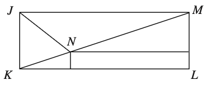{ width=162pt }

<!--
UK.SeniorKangaroo.2015.17

In rectangle $JKLM$, the bisector of angle $\sphericalangle KJM$ cuts the 
diagonal $KM$ at point $N$ as shown. The distances between $N$ and 
sides $LM$ and $KL$ are $8\text{ cm}$ and $1\text{ cm}$ respectively. 
The length of $KL$ is $(a + \sqrt{b})\text{ cm}$. What is the value of $a + b$?

16

Let points $P$ and $Q$ be the points where the perpendiculars from $N$ to $ML$ and $KL$ meet the lines, and extend line $PN$ so it meets $JK$ at $R$, as shown in the diagram. Since $JN$ is the bisector of angle $\sphericalangle MJK$, angle $\sphericalangle NJR = 45^\circ$. Since angle $\sphericalangle JRN$ is $90^\circ$, triangle $\triangle JRN$ is isosceles and $JR = RN$. Let the length of $RN$ be $b$ cm. Hence the lengths of $JR$ and $PM$ are also $x$ cm. Observe that triangles $\triangle NKQ$ and $\triangle MNP$ are similar since they have the same angles. Therefore $\frac{1}{x} = \frac{x}{8}$ and so $x = \sqrt{8}$ since $x$ is positive. The length of $KL$ is equal to the sum of the lengths of $NP$ and $NR$. Therefore, the length of $KL$ is $(8 + \sqrt{8})$ cm. Hence, the value of $a + b$ is $16$.
-->

::: solution
**Atbilde:** `16`

**Atrisinājums:**  
Ar $P$ un $Q$ apzīmējam punktus, kuros no $N$ novilktie perpendikuli 
pret taisnēm $ML$ un $KL$ krustojas ar šīm taisnēm, un pagarināsim 
taisni $PN$, lai tā krustotos ar $JK$ punktā $R$, kā parādīts attēlā. 

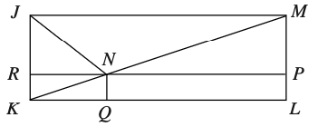

Tā kā $JN$ ir leņķa $\sphericalangle MJK$ bisektrise, tad 
$\sphericalangle NJR = 45^\circ$. 
Tā kā leņķis $\sphericalangle JRN$ ir $90^\circ$, trijstūris $\triangle JRN$ 
ir vienādsānu un $JR = RN$. Apzīmējam nogriežņa $RN$ garumu centimetros ar $x$. 
Tad nogriežņu $JR$ un $PM$ garumi arī ir $x$ cm. Ievērojiet, 
ka trijstūri $NKQ$ un $MNP$ ir līdzīgi, jo tiem ir vienādi leņķi. 
Tāpēc $\frac{1}{x} = \frac{x}{8}$, un tādēļ $x = \sqrt{8}$, 
jo $x$ ir pozitīvs. Nogriezņa $KL$ garums ir vienāds ar nogriežņu 
$NP$ un $NR$ garumu summu. Tāpēc nogriežņa $KL$ garums ir 
$(8 + \sqrt{8})$ cm. Tātad $a + b$ vērtība ir $16$.
:::

## 17.uzdevums {-}

Attēlā dots četrstūris $PQRS$, kas veidots no diviem līdzīgiem 
taisnleņķa trīsstūriem $PQR$ un $PRS$. Malas $PQ$ garums ir $3$, 
malas $QR$ garums ir $4$, un $\sphericalangle PRQ = \sphericalangle PSR$. 
Kāds ir četrstūra $PQRS$ perimetrs?
**(A)** $22$, **(B)** $22\frac{5}{6}$, **(C)** $27$, 
**(D)** $32$, **(E)** $45\frac{1}{3}$.

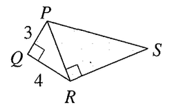{ width=108pt }

<!--
UK.IMC.2017.13

The diagram shows a quadrilateral $PQRS$ made from two similar right-angled triangles, $PQR$ and $PRS$. The length of $PQ$ is $3$, the length of $QR$ is $4$ and $\sphericalangle PRQ = \sphericalangle PSR$. What is the perimeter of $PQRS$?

**(A)** $22$, **(B)** $22\frac{5}{6}$, **(C)** $27$, 
**(D)** $32$, **(E)** $45\frac{1}{3}$.

**A**

Pythagoras' Theorem shows that $PR = \sqrt{3^2 + 4^2} = 5$. So the perimeter of triangle $PQR$ is $12$. Since the triangles are similar and $PR:PQ = 5:3$ we see that the perimeter of triangle $PRS$ is $20$. Hence the perimeter of $PQRS$ is $12 + 20 - 2 \cdot PR = 32 - 10 = 22$.
-->

::: solution
**Atbilde:** `A`

**Atrisinājums:**  
Pitagora teorēma rāda, ka $PR = \sqrt{3^2 + 4^2} = 5$. Tātad trijstūra 
$PQR$ perimetrs ir $12$. Tā kā trijstūri ir līdzīgi un $PR:PQ = 5:3$, 
redzam, ka trijstūra $PRS$ perimetrs ir $20$. Tādēļ $PQRS$ perimetrs 
ir $12 + 20 - 2 \cdot PR = 32 - 10 = 22$.
:::

## 18.uzdevums {-}

Attēlā dots trīsstūris $FHI$, un punkts $G$ atrodas uz nogriežņa $FH$ tā, ka $GH = FI$. Punkti $M$ un $N$ ir attiecīgi nogriežņu $FG$ un $HI$ viduspunkts. Leņķis $NMH = \alpha$. Kurš no sekojošajiem dod izteiksmi leņķim $\sphericalangle IFH$?  
**(A)** $2\alpha$, **(B)** $90^{^\circ} - \alpha$, **(C)** $45^{^\circ} + \alpha$,
**(D)** $90^{^\circ} - \tfrac12\alpha$, **(E)** $60^\circ$.

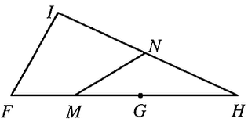{ width=144pt }

<!--
UK.PinkKangaroo.2017.25

The diagram shows a triangle $FHI$, and a point $G$ on $FH$ such that $GH = FI$. 
The points $M$ and $N$ are the midpoints of $FG$ and $HI$ respectively. 
Angle $NMH = \alpha$. Which of the following gives an expression for $\sphericalangle IFH$?

**(A)** $2\alpha$, **(B)** $90^{^\circ} - \alpha$, **(C)** $45^{^\circ} + \alpha$,
**(D)** $90^{^\circ} - \tfrac12\alpha$, **(E)** $60^\circ$.

**A** 

We start by drawing the line segment $IG$. Let $P$ be the point on $IG$ such that $PN$ is parallel to $FH$.

The angle $PNM$ is alternate to $NMH$ so $\sphericalangle PNM = \alpha$. Also, the triangle $PNI$ is similar to the triangle $GHI$ (the angles of each triangle are clearly the same); moreover since $N$ is the midpoint of $HI$, $PN=\tfrac12 GH$. Also $IP=\tfrac12 IG$, so $PG=\tfrac12 IG$. Since $MG=\tfrac12 FG$, the triangle $PMG$ is similar to $IFG$, and in particular, $PM=\tfrac12 IF$. However, we know $IF$ is equal in length to $GH$ so we have
$PN=\tfrac12 GH=\tfrac12 IF=PM$,
so triangle $MNP$ is isosceles and $\sphericalangle PMN=\sphericalangle PNM=\alpha$. Since triangles $PMG$ and $IFG$ are similar, we have
$\sphericalangle IFG=\sphericalangle PMG=\alpha+\alpha=2\alpha$.

*Alternative:*

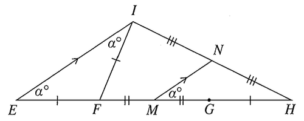

Extend the line $HF$ to the point $E$ so that $EF=GH$. Then, because $FM=MG$, $M$ is the midpoint of $EH$. Therefore, since $N$ is the midpoint of $IH$, the triangles $IHE$ and $NHM$ are similar. Hence $\sphericalangle IEH=\sphericalangle NMH=a^\circ$. Because $EF=GH=FI$, the triangle $EFI$ is isosceles. Therefore, $\sphericalangle FIE=\sphericalangle IEF=a^\circ$. Therefore, by the external angle theorem,
$\sphericalangle IFG=\sphericalangle IEF+\sphericalangle FIE=a^\circ+a^\circ=2a^\circ$.
-->

::: solution
**Atbilde:** `A`

**Atrisinājums-1:**  
Novelkam nogriezni $IG$. Ar $P$ apzīmējam tādu punktu uz $IG$, ka $PN$ ir paralēls $FH$.
Leņķi $PNM$ un $NMH$ ir iekšējie šķērsleņķi, tāpēc $\sphericalangle PNM=\alpha$. 
Turklāt trijstūris $PNI$ ir līdzīgs trijstūrim $GHI$ 
(abu trijstūru leņķi ir vienādi); tā kā $N$ ir nogriežņa $HI$ 
viduspunkts, tad $PN=\tfrac12 GH$. Arī $IP=\tfrac12 IG$, 
tātad $PG=\tfrac12 IG$. Tā kā $MG=\tfrac12 FG$, trijstūris $PMG$ 
ir līdzīgs $IFG$, un jo īpaši $PM=\tfrac12 IF$. Tā kā $IF = GH$, tāpēc
$PN=\tfrac12 GH=\tfrac12 IF=PM$,
tātad trijstūris $MNP$ ir vienādsānu un 
$\sphericalangle PMN=\sphericalangle PNM=\alpha$. 
Tā kā trijstūri $PMG$ un $IFG$ ir līdzīgi, iegūstam
$\sphericalangle IFG=\sphericalangle PMG=\alpha+\alpha=2\alpha$.

{ width=162pt }

**Atrisinājums-2:**  
Pagarinām taisni $HF$ līdz punktam $E$ tā, lai $EF=GH$. 
Zināms, ka $FM=MG$, tāpēc punkts $M$ ir nogriežņa $EH$ viduspunkts. 
Tā kā $N$ ir nogriežņa $IH$ viduspunkts, trijstūri $IHE$ un $NHM$ ir 
līdzīgi. Tātad $\sphericalangle IEH=\sphericalangle NMH=a^\circ$. Tā kā $EF=GH=FI$, 
trijstūris $EFI$ ir vienādsānu. Tāpēc $\sphericalangle FIE=\sphericalangle IEF=a^\circ$. 
Tādēļ pēc ārējā leņķa teorēmas
$\sphericalangle IFG=\sphericalangle IEF+\sphericalangle FIE=a^\circ+a^\circ=2a^\circ$.

{ width=180pt }
:::

## 19.uzdevums {-}

Attēlā dots kvadrāts $PQRS$ ar malu garumu $2$. Punkts $T$ ir malas $RS$ 
viduspunkts, un punkts $U$ atrodas uz nogriežņa $QR$ tā, ka $\sphericalangle SPT = \sphericalangle TPU$.
Kāds ir nogriežņa $UR$ garums?

*Ierakstīt atbildē veselu skaitli vai parastu daļu P/Q.*

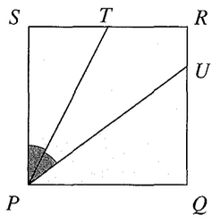{ width=108pt }

<!--
UK.Maklaurin.2017.4

The diagram shows a square $PQRS$ with sides of length $2$. The point 
$T$ is the midpoint of $RS$, and $U$ lies on $QR$ so that 
$\sphericalangle SPT = \sphericalangle TPU$.
What is the length of $UR$?

## Solution

Let $F$ be the point on $PU$ so that $\sphericalangle TFP = 90^\circ$ and join $T$ to $F$ and $U$, as shown.

Then triangles $PTS$ and $PTF$ are congruent (AAS), so that $TF = 1$.

Hence triangles $TUR$ and $TUF$ are congruent (RHS), so that $\sphericalangle RTU = \sphericalangle UTF$.

Now the four angles at $T$ are angles on the straight line $RTS$, so they add up to $180^\circ$. It follows that $\sphericalangle RTU = \sphericalangle SPT$.

Therefore triangles $RTU$ and $SPT$ are similar (AA), so that
$$
\frac{UR}{RT}=\frac{TS}{SP}=\frac{1}{2}.
$$

Thus $UR=\frac{1}{2}$.

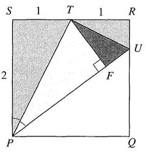
-->

::: solution
**Atbilde:** `1/2`

**Atrisinājums:**  
Ar $F$ apzīmējam punktu uz $PU$, kuram $\sphericalangle TFP = 90^\circ$, 
un savieno $T$ ar $F$ un $U$, kā parādīts zīmējumā.

{ width=108pt }

Tad trijstūri $PTS$ un $PTF$ ir kongruenti (pazīme $\ell{}m\ell$), tātad $TF = 1$.
Tāpēc trijstūri $TUR$ un $TUF$ ir kongruenti (kā taisnleņķa trijstūri 
ar vienādu hipotenūzu un kateti), tātad $\sphericalangle RTU = \sphericalangle UTF$.
Četri leņķi pie $T$ ir leņķi uz taisnes $RTS$, tāpēc to summa ir $180^\circ$. 
No šejienes seko, ka $\sphericalangle RTU = \sphericalangle SPT$.
Tādēļ trijstūri $RTU$ un $SPT$ ir līdzīgi (pazīme $\ell\ell$), un

$$\frac{UR}{RT}=\frac{TS}{SP}=\frac{1}{2}.$$

Tātad $UR=\frac{1}{2}$.
:::

## 20.uzdevums {-}

Attēlā dots kvadrāts $ABCD$ un taisnleņķa trījstūris $ABE$. 
Malas $BC$ garums ir $3$. Malas $BE$ garums ir $4$. 
Kāds ir iekrāsotās daļas laukums?
**(A)** $5\frac{1}{4}$, **(A)** $5\frac{3}{8}$, **(C)** $5\frac{1}{2}$,
**(D)** $5\frac{5}{8}$, **(E)** $5\frac{3}{4}$.

{ width=108pt }

<!--
UK.SMC.2017.6

The diagram shows a square $ABCD$ and a right-angled triangle $ABE$. The length of $BC$ is $3$. The length of $BE$ is $4$. What is the area of the shaded region?

**(A)** $5\frac{1}{4}$, **(A)** $5\frac{3}{8}$, **(C)** $5\frac{1}{2}$,
**(D)** $5\frac{5}{8}$, **(E)** $5\frac{3}{4}$.

**D** 

Let $F$ be the point of intersection of the lines $AE$ and $CD$. Let the length of $CF$ be $h$. Then, using similar triangles,
$$
\frac{CF}{CE}=\frac{BA}{BE},
$$
so
$$
\frac{h}{1}=\frac{3}{4}
$$
giving $h=\frac{3}{4}$.

The shaded region $ABCF$ is a trapezium, so has area
$$
\frac{1}{2}\left(3+\frac{3}{4}\right)\times 3=\frac{45}{8}
$$
which is $5\frac{5}{8}$.

-->

::: solution
**Atbilde:** `D`

**Atrisinājums:**  
Lai $F$ ir taišņu $AE$ un $CD$ krustpunkts. Lai nogriežņa $CF$ garums ir $h$. 
Tad, izmantojot līdzīgus trijstūrus,
$$\frac{CF}{CE}=\frac{BA}{BE},$$  
tātad  
$$\frac{h}{1}=\frac{3}{4},$$
no kā iegūst $h=\frac{3}{4}$.

Iekrāsotais apgabals $ABCF$ ir trapece, tāpēc tā laukums ir  
$$\frac{1}{2}\left(3+\frac{3}{4}\right)\times 3=\frac{45}{8},$$  
kas ir $5\frac{5}{8}$.

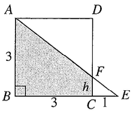{ width=126pt }
:::

