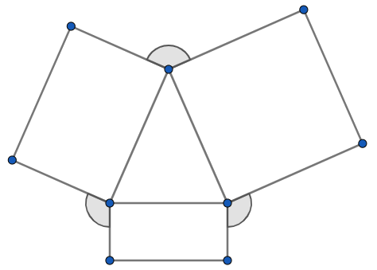
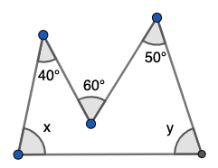
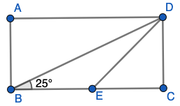
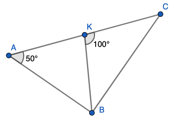
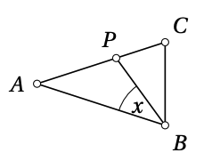

# <lo-sample/> EE.PK.2010TEST.7.6

Uz vienādsānu trijstūra $ABC$ pamata $BC$ izvēlas punktu $D$, bet uz
malas $AC$ pagarinājuma aiz punkta $C$ izvēlas punktu $E$ tā, lai $CD=CE$. 
Atrast $\sphericalangle BAC$, ja $\sphericalangle CED = 25^{\circ}$. 

{ width=250px }

*Ierakstīt veselu skaitli - leņķa $BAC$ lielumu grādos.*

# <lo-sample/> EE.PK.2010TEST.8.6

No vienādsānu trijstūra uz ārpusi konstruēti taisnstūri. 
Aprēķināt to leņķu lielumu summu, kas apzīmēti ar lociņiem.

{ width=250px }

*Ierakstīt veselu skaitli - leņķu summu grādos.*

# <lo-sample/> EE.PK.2011TEST.7.7

Zīmējumā attēloti divi vienādsānu trijstūri, kuriem leņķi pie virsotnes ir attiecīgi 
$40^{\circ}$ un $50^{\circ}$, un kuru pamati ir uz vienas taisnes. 
Aprēķināt leņķi $x$.

{ width=250px }

*Ierakstīt veselu skaitli - leņķa $x$ lielumu grādos.*

# <lo-sample/> EE.PK.2011TEST.9.7

Aprēķināt leņķu lielumu summu, kas zīmējumā apzīmēti ar $x$ un $y$. 

{ width=200px }

*Ierakstīt veselu skaitli - leņķu summu grādos.*

# <lo-sample/> EE.PK.2012TEST.7.8

Uz vienas no taisnstūra malām konstruēts vienādmalu trijstūris. Vienu no 
šī trijstūra malām pagarināja, kā parādīts zīmējumā. 
Atrast platā leņķa $\alpha$ lielumu, kas rodas starp trijstūra pagarināto malu un 
taisnstūra malu. 

{ width=200px }

*Ierakstīt veselu skaitli - leņķa $\alpha$ lielumu grādos.*

# <lo-sample/> EE.PK.2012TEST.8.6

Atrast $\sphericalangle BAC$ lielumu $\alpha$, ja $BD$ un
$CD$ ir šī trijstūra iekšējo leņķu bisektrises, un $\sphericalangle BDC$ lielums ir $5\alpha$.

{ width=300px }

*Ierakstīt veselu skaitli - leņķa $\alpha$ lielumu grādos.*

# <lo-sample/> EE.PK.2013TEST.8.6

Dots taisnstūris $ABCD$, kurā
$\sphericalangle CBD = 25^{\circ}$. 
Uz malas $BC$ izvēlas punktu $E$ tā, lai $CE = CD$. 
Atrast leņķa $BDE$ lielumu.

{ width=250px }

*Ierakstīt veselu skaitli - leņķa lielumu grādos.*

# <lo-sample/> EE.PK.2014TEST.7.8

Zīmējumā attēlotajā četrstūrī 
$AB = CD$. Atrast leņķa $\sphericalangle ABC$ lielumu. 

{ width=250px }

*Ierakstīt veselu skaitli - leņķa $ABC$ lielumu grādos.*

# <lo-sample/> EE.PK.2014TEST.8.7

$ABC$ ir taisnleņķa trijstūris, $\sphericalangle B = 90^{\circ}$. Punkts $K$
atrodas uz hipotenūzas $AC$ un $KB = 15\,\text{cm}$. Atrast
malas $AC$ garumu.

{ width=300px }

*Ierakstīt veselu skaitli - malas $AC$ garumu centimetros.*

# <lo-sample/> EE.PK.2015TEST.7.6

Trijstūrī $ABC$ malu $AB$ un $AC$ garumi ir vienādi un 
$\sphericalangle ACB = 70^{\circ}$. 
Uz malas $AC$ atzīmēja punktu $P$ tā, lai nogriežņi $BP$ un
$BC$ būtu vienādi. Aprēķināt ar $x$ apzīmēto leņķi. 

{ width=200px }

*Ierakstīt veselu skaitli - leņķa $x$ lielumu grādos.*

