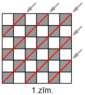
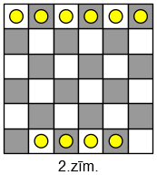

# <lo-sample/> LV.AVGTEST.2024C.7_8.1

Tumšā skapī ir zeķes $12$ krāsās -- pa $20$ zeķēm katrā no krāsām. Kāds mazākais 
zeķu skaits jāizvelk, lai starp tām noteikti atrastos divas zeķes vienādā krāsā?

<small>

* Answer:`13`

</small>

## Atrisinājums

Izvilktās zeķes ir objekti ("truši"), bet iespējamās krāsas ir grupas 
("būri"). Tā kā grupu ir tieši $N=12$, tad izvelkot $N+1=13$ 
zeķes, starp tām noteikti būs divas vienādā krāsā. Ar $12$ 
zeķēm nepietiek, jo var neveikties: katra no pirmajām $12$ zeķēm var būt citā krāsā.

# <lo-sample/> LV.AVGTEST.2024C.7_8.2

Rūpnīca ražo ķieģeļus, no kuriem neviens nav smagāks par $3~\mathrm{kg}$, 
neviens nav vieglāks par $2.9~\mathrm{kg}$.  Kāds mazākais ķieģeļu skaits 
jānopērk, lai starp tiem noteikti atrastos divi tādi, 
kuru masu starpība ir mazāka par $1~\mathrm{g}$ (masu starpību iegūst, 
no lielākās masas atņemot mazāko)?

<small>

* Answer:`102`

</small>

## Atrisinājums

Pārveidojam visas masas gramos. Tad intervālu $[2900;3000]$  
var pārklāt ar 101 maziem intervāliem $[2900.0;2900.5)$, 
$[2900.5;2901.5)$, $[2901.5;2902.5)$, utt., $[2999.5;3000.0]$. 
Katram intervālam izņemot pēdējo pieder kreisais galapunkts, 
bet nepieder labais galapunkts (ar apaļo iekavu). 

Ja izraudzīti jebkādi $102$ ķieģeļi, tad vismaz vienā no intervāliem 
nonāks divi ķieģeļi. Tā kā jebkurš intervāls (izņemot pirmo un pēdējo, 
kuri ir vēl īsāki) ir ar garumu $1$ un nesatur vienu galapunktu, 
tad abu ķieģeļu masu starpība būs mazāka par $1$ gramu. 

Ja izvēlas tieši $101$ ķieģeļus, tad var ņemt $2900$, $2901$, utt. 
līdz $3000$. (Visas masu atšķirības ir tieši $1$ grams.)

# <lo-sample/> LV.AVGTEST.2024C.7_8.3

Kāds mazākais skaits no astoņiem naturāliem skaitļiem $1,2,3,4,5,6,7,8$ 
jāizsvītro, lai starp palikušajiem skaitļiem neatrastos tādi divi, kuru summa ir $9$?

<small>

* Answer:`4`

</small>

## Atrisinājums

Ir pavisam $4$ "būrīši" $((1,8), (2,7), (3,6), (4,5))$, 
kuros esošie skaitļu pāri dod summā $9$. Izsvītrojot no katra vienu ir 
pietiekami. Ja svītro mazāk, tad paliek pāri būrītis ar diviem 
skaitļiem, kuri summā dod $9$.

# <lo-sample/> LV.AVGTEST.2024C.7_8.4

Uz galda ir $15$ spēļu kārtis. (Pīķi un kreici ir melni; erci un kāravi ir sarkani.)  
Kāds lielākais skaits no $15$ kārtīm noteikti ir vienā krāsā?

<small>

* Answer:`8`

</small>

Ja tikai septiņas būtu katrā no krāsām, tad to kopskaits nevarētu pārsniegt 
$2 \cdot 7 = 14$.  Tāpēc vismaz 8 ir vienādā krāsā (nav zināms kādā). 

Nav obligāti, lai lielāks skaits būtu vienādā krāsā, jo var būt $8$ kārtis 
vienā krāsā, bet $7$ kārtis - otrā krāsā.

# <lo-sample/> LV.AVGTEST.2024C.7_8.5

Tumšā skapī ir 100 melnas, 100 zilas un 100 zaļas zeķes. Kāds mazākais 
skaits zeķu neskatoties ir jāizvelk, lai noteikti starp tām būtu 
divas melnas vai divas zilas zeķes?

<small>

* Answer:`103`

</small>

Ar $102$ izvilktām zeķēm nepietiek, jo var gadīties $100$ zaļas, 
viena melna un viena zila. Ar 103 izvilktām zeķēm vienmēr pietiek, 
jo vismaz $3$ no tām nebūs zaļas un varēs lietot Dirihlē principu -- 
jebkādi piekārtojot $3$ zeķes divām krāsām,  divas no zeķēm nonāks vienā krāsā.

# <lo-sample/> LV.AVGTEST.2024C.7_8.6

Uz galda novietotas ļoti daudzas kartītes.  Uz katras kartītes rakstīta 
kāda 3-burtu virkne, kas satur burtus "A" un "B".  (Virknē vienādi burti 
drīkst atrasties blakus, piemēram, "AAA" vai "BBA"). Cik kartītes jāpaņem, 
lai uz divām no tām noteikti būtu divas vienādas virknītes.

<small>

* Answer:`9`

</small>

Ir pavisam $8$ dažādas $3$ burtu virknītes. Paņemot $9$ kartītes, 
vismaz viena no virknītēm atkārtosies.

# <lo-sample/> LV.AVGTEST.2024C.7_8.7

Auditorijā ir $10$ gari soli, uz kuriem kaut kā jau sasēdušās $100$ meitenes. 
Kādu lielāko skaitu zēnu var sasēdināt šajā auditorijā, ja nekādi divi 
zēni nedrīkst sēdēt blakus?

<small>

* Answer:`110`

</small>

Pirms meitenēm auditorijā bija $10$ "būrīši" (katrs no soliem), bet 
katras meitenes nosēdināšana "būrīšu" skaitu palielina par $1$ (pārdalot 
solu vai tā posmu divās daļās). Tādēļ būrīšu ir pavisam $110$. 
Lai nevienā būrītī nonāktu ne vairāk par vienu zēnu, to skaits nevar pārsniegt $110$.

$110$ zēnus var sasēdināt. Piemēram, var uz viena sola nosēdināt $11$ zēnus
un $10$ meitenes: $(Z,M,Z,M, \ldots ,M,Z,M,Z)$.

# <lo-sample/> LV.AVGTEST.2024C.7_8.8

Makā ir $25$ monētas (eiro vai centu). Kāds ir lielākais skaits monētu 
ar vienādu vērtību, ko no šī maka noteikti var izņemt?

<small>

* Answer:`4`

</small>

Pavisam ir astoņu vērtību monētas $1,2,5,10,20,50$ centu, $1$ eiro un $2$ eiro.

Ja nebūtu vismaz $4$ monētas ar vienādu vērtību (vienalga kādas vērtības), 
tad to kopskaits nevarētu pārsniegt $3 \cdot 8 = 24$. 

# <lo-sample/> LV.AVGTEST.2024C.7_8.9

Auto dīlerim ir $20$ Audi, $20$ BMW, $20$ VW un $20$ Volvo automašīnas. 
Kāds mazākais mašīnu skaits jānopērk, lai varētu apgalvot, ka ir 
nopirktas vismaz piecas vienas markas automašīnas?

<small>

* Answer:`17`

</small>

Ja nopirktas tikai $16$ mašīnas, tad var būt pa četrām no katras markas. 

Ja nopirktas $17$ mašīnas, tad nevar gadīties, ka no katras 
markas nopirktas mazāk kā piecas, jo $4 \cdot 4 < 17$. 

# <lo-sample/> LV.AVGTEST.2024C.7_8.10

Tortes dekorēšanai nepieciešami vai nu divi apelsīni, vai trīs āboli, 
vai piecas aprikozes, vai septiņi ķirši. Mazā Mija atnesa no veikala 
$n$ augļus, ikviens no kuriem  ir apelsīns, ābols, aprikoze vai ķirsis. 

Kādam mazākajam $n$ ar atnestajiem augļetriem noteikti pietiek tortes dekorēšanai?

<small>

* Answer:`14`

</small>

Skaits $n = (2-1)+(3-1)+(5-1)+(7-1)=2+3+5+7-4=13$ ir vislielākais, 
kuram var atnest augļus tā, lai katram no četriem paveidiem viens pietrūktu. 
Ja atnesīs par vienu vairāk, t.i. $14$, 
tad vismaz vienam paveidam tiks sasniegts vajadzīgais skaits.

# <lo-sample/> LV.AVGTEST.2024C.7_8.11

Klasē mācās $20$ skolēni. Katram skolēnam ir tieši divi  vectētiņi; 
turklāt katriem diviem skolēniem vismaz viens vectētiņš ir kopīgs. 
(Zināms arī, ka neeksistē visiem skolēniem kopīgs vectētiņš.) 
Kāds ir lielākais iespējamais šīs klases skolēnu vectētiņu skaits?

<small>

* Answer:`3`

</small>

## Atrisinājums

Trīs vectētiņi $A,B,C$, acīmredzot, ir iespējami - ja katram skolēnam 
vectētiņu pāris ir vai nu $(A,B)$, vai $(A,C)$, vai $(B,C)$, tad katriem 
diviem skolēniem kāds no vectētiņiem sakritīs (ja abu bērnu četrus 
vectētiņus var izvēlēties no trim, tad divi no tiem sakritīs).

Visi vectētiņu pāri $(A,B)$, $(A,C)$, $(B,C)$ noteikti tiek izmantoti 
(eksistē bērni, kam ir pāris $(A,B)$, un arī $(A,C)$ un arī $(B,C)$), 
jo ir zināms, ka nevar būt visiem kopīgais vectētiņš. 

Bet ceturto vectētiņu pievienot vairs nav iespējams, jo tad, ja 
parādās vēl kāds bērns, tad viņam nevar piešķirt jaunu vectētiņu "D", 
jo tad viņam var būt ne vairāk kā viens vectētiņš no saraksta $(A,B,C)$ - 
un tātad ar kādu no bērniem viņam nebūs kopīga vectētiņa.

*Piezīme:* Vectētiņu uzdevums ir Dirihlē principa variants, kur katrs 
objekts ieklasificējas uzreiz divās "kastēs" (jo katram cilvēkam ir 
divi vectētiņi). 

# <lo-sample/> LV.AVGTEST.2024C.7_8.12

Katrs no $36$ punktiem kvadrātiskā režģī 6×6, nejauši izvēloties, 
nokrāsots vai nu melns vai balts.  Kāds mazākais punktu skaits 
jānokrāso melni, lai noteikti atrastos horizontāla vai vertikāla 
taisne, uz kuras ir vismaz $4$ melni punkti?

<small>

* Answer:`19`

</small>

## Atrisinājums

Ja  19 punkti ir melni, tad tos kaut kā sazīmējot uz $6$ paralēlām 
taisnēm režģī (piemēram, horizontālajām) atradīsies $\left\lceil 19/6 \right\rceil=4$ 
punkti uz vienas horizontālās taisnes ($19/6$ noapaļojam uz augšu.)

Ja izvēlas tikai 18 baltos punktus, tad arī melno būs $18$ un tos 
režģī $6 \times 6$ varēs iekrāsot pārmaiņus līdzīgi šaha galdiņa 
krāsojumam. Uz katras horizontālas vai vertikālas taisnes nonāks 
tikai $3$ melni punkti.

# <lo-sample/> LV.AVGTEST.2024C.7_8.13

Klasē ir $12$ skolēni. Katrs no viņiem kaut kā izvēlas $n$ klasesbiedrus un nosūta 
katram no viņiem Jaungada apsveikumu. Kādam mazākajam $n$ var apgalvot,  
ka noteikti atradīsies divi tādi klasesbiedri, kas nosūtījuši apsveikumus viens otram?

<small>

* Answer:`6`

</small>

## Atrisinājums

Attēlosim klasesbiedrus kā punktus, kas izvietoti uz riņķa līnijas. 
Pavisam tos savieno $C^2_{12} = \frac{12 \cdot 11}{2} = 66$
šķautnes jeb vēstuļu sūtīšanas "kanāli". (Tik daudz diagonāļu ir 
$12$-stūrī, kas savieno kaut kādas divas virsotnes).

Ja tiek sūtītas $12 \cdot 6=72$ vēstules, tad katrai vēstulei 
nepietiek sava "kanāla"; divām jātiek sūtītām starp tām pašām 
virsotnēm - t.i. klasesbiedri nosūta vēstules viens otram.

# <lo-sample/> LV.AVGTEST.2024C.7_8.14

Istabā ir $10$ cilvēki; katri divi vai nu pazīst viens otru vai arī nepazīst. 
(Pazīšanās ir simetriska: ja $A$ pazīst $B$, tad arī $B$ pazīst $A$.)  
Izvēlamies cilvēku $X$ starp šiem $10$ cilvēkiem.

Kāds ir lielākais skaits cilvēku, kas vai nu visi pazīst $X$, 
vai arī visi nepazīst $X$?

<small>

* Answer:`5`

</small>

## Atrisinājums

Cilvēkam $X$ ir pavisam $9$ dažādi citi cilvēki.  Katru no tiem 
var pazīt vai nepazīt. Vismaz $5$ no šiem cilvēkiem būs attiecībā 
"pazīst" vai arī attiecībā "nepazīst". 
$9$ cilvēkus dala divu veidu "būrīšos" - un vismaz pieciem 
jābūt savstarpēji vienādiem.

# <lo-sample/> LV.AVGTEST.2024C.7_8.15

Vecmāmiņa kāpj pa trepēm $49$ pakāpienus uz augšu, ar vienu soli pārvarot 
vienu, divus vai trīs pakāpienus. Pavisam viņai nepieciešami 
$30$ soļi augšup. Ja vecmāmiņa piecreiz uzkāpj pa šīm trepēm, 
cik reižu viņa ciemojusies uz tā pakāpiena, uz kura viņa bijusi 
visbiežāk  (neskaitot pašu apakšējo - $0$-to un pašu augšējo - $49$-to)?

<small>

* Answer:`4`

</small>

## Atrisinājums

Pavisam ir $48$ pakāpieni (neskaitot apakšējo un augšējo). 
$0$-tajā solī vecmāmiņa ir uz apakšējā pakāpiena, bet $30$-tajā solī - uz 
augšējā. Tādēļ viņai katrā uzkāpšanas reizē ir $29$ soļi uz pakāpieniem 
kaut kur pa vidu. Iegūstam, $29 \cdot 5=145$. 
Sadalot $145$ uz $48$ "būrīšiem" iegūstam, ka vismaz vienā būrītī būs vismaz 
$\left\lceil 145/48 \right\rceil  = \left\lceil 3.02 \right\rceil =4$ 
objekti. (Noapaļo uz augšu.)

*Piezīme:* Spēja kāpt tieši pa $1$, $2$ vai $3$ pakāpieniem nav būtiska -- 
varētu atļaut kāpt arī lielāku skaitu pakāpienu, atbilde no tā nemainītos.

# <lo-sample/> LV.AVGTEST.2024C.7_8.16

Kādu lielāko skaitu laidņu var izvietot uz šaha galdiņa $6 \times 6$ tā, 
lai tie viens otru neapdraud (t.i. neatrodas uz vienas diagonāles)? 
Laidņu gājienus sk. zīmējumā - ja tie pārvietojas pa melnajiem lauciņiem. 
Ir arī laidņi, kas pārvietojas pa baltajiem lauciņiem.

{ width=300px }

<small>

* Answer:`10`

</small>

## Atrisinājums

Ir divu veidu laidņi - uz melnajām un uz baltajām diagonālēm. Ja aplūkojam 
melnās diagonāles, tad tām eksistē divi virzieni (no kreisā augšējā uz labo 
apakšējo stūri un no labā augšējā uz kreiso apakšējo). Dirihlē principa 
lietošanai izdevīgāks tas virziens uz kura ir mazāk diagonāļu ($5$ diagonāles 
nevis $6$). Uz katras no $5$ diagonālēm var novietot ne vairāk par vienu laidni. 

Tas pats sakāms arī par baltajām diagonālēm. Tādēļ laidņu nevar būt vairāk par $5+5=10$. 
Kā novietot tieši $10$ laidņus tā, lai tie viens otru neapdraud, attēlots zīmējumā

{ width=300px }