<!--
Invarianti(9) - vairāk!

uzd <- c(3,3,3,3,5, 3,3,3,3,3, 3,6,6,10,4)
-->

# Veselu skaitļu izteiksmju pārveidojumi (`al.manipulate.smallexpr`)

**Q-1-1** Zināms, ka veseli skaitļi $a$ un $b$ ņemti no saraksta $\{ 0,1,2,3,4,5,6,7,8,9,10 \}$ un $a+b = 10$. Atrodiet tādus $a$ un $b$, kuriem izteiksme $a^2 + b^2$ pieņem lielāko iespējamo vērtību. 

***Atbilde:*** Ierakstīt veselus skaitļus, kam $a^2+b^2$ ir vislielākais: $a =$ ______  $b =$ ______  

**Q-1-2** Zināms, ka veseli skaitļi $a$ un $b$ ņemti no saraksta $\{ 0,1,2,3,4,5,6,7,8,9,10 \}$ un $a+b = 10$. Atrodiet tādus $a$ un $b$, kuriem izteiksme $ab$ pieņem lielāko iespējamo vērtību. 

***Atbilde:*** Ierakstīt veselus nenegatīvus skaitļus, kam $ab$ ir vislielākais: $a =$ ______  $b =$ ______  

**Q-1-3** Skaitļu trijniekiem $(1; 5; 6)$ un $(2; 3; 7)$ ir vienādas gan summas, gan kvadrātu summas. 
$$ \left\{
\begin{array}{rcl}
1 + 5 + 6 & = & 2 + 3 + 7\\
1^2 + 5^2 + 6^2 & = & 2^2 + 3^2 + 7^2
\end{array}
\right.$$

 

Kāds izdomāja pieskaitīt visiem šiem skaitļiem $10$ un ieguva jaunus trijniekus $(11; 15; 16)$ un $(12; 13; 17)$. Kādas sakarības pastāv starp šo skaitļu summām un kvadrātu summām. (*Ja ir slinkums kāpināt lielus skaitļus, var atvērt iekavas izteiksmēs $(10+1)^2 + (10+5)^2 + (10+6)^2$ utml.*)

***Atbilde:***  
*I daļa:* Atzīmēt patieso apgalvojumu par summām:

$$ \left[
\begin{array}{crcl}
\mbox{(A)} & 11 + 15 + 16 & < & 12 + 13 + 17\\
\mbox{(B)} & 11 + 15 + 16 & = & 12 + 13 + 17\\
\mbox{(C)} & 11 + 15 + 16 & > & 12 + 13 + 17
\end{array}
\right.$$

*II.daļa:* Atzīmēt patieso apgalvojumu par kvadrātu summām:

$$ \left[
\begin{array}{crcl}
\mbox{(A)} & 11^2 + 15^2 + 16^2 & < & 12^2 + 13^2 + 17^2\\
\mbox{(B)} & 11^2 + 15^2 + 16^2 & = & 12^2 + 13^2 + 17^2\\
\mbox{(C)} & 11^2 + 15^2 + 16^2 & > & 12^2 + 13^2 + 17^2
\end{array}
\right.$$

# Progresijas un to ģeometriskas interpretācijas (`al.sym.progressions`)

**Q-2-1.** Skaitļus $1,3,6,10,\ldots$ iegūst, saskaitot arvien garākus naturālo skaitļu virknes sākumposmus:
$$
\begin{array}{rcl}
1 & = & 1\\
3 & = & 1 + 2\\
6 & = & 1 + 2 + 3\\
10 & = & 1 + 2 + 3 + 4\\
15 & = & 1 + 2 + 3 + 4 + 5
\end{array}
$$

Ierakstīt rūtiņās šīs virknes locekļu veidotos atlikumus, 
dalot ar skaitļiem $3$ un $4$; ierakstīt arī, pēc cik rūtiņām šie atlikumi sāk atkārtoties (t.i. atlikumu perioda garumu). 

***Atbilde:***  
*I daļa:* Virknes $1; 3; 6; 10; \ldots$ atlikumi, dalot ar $3$ (ierakstīt rūtiņās skaitļus $0$, $1$ vai $2$):  

  

Atlikumu periods, dalot ar $3$: ______  
(*t.i. pēc cik rūtiņām atlikumi sāk atkārtoties*)

*II daļa:* Virknes $1; 3; 6; 10; \ldots$ atlikumi, dalot ar $4$ (ierakstīt rūtiņās skaitļus $0$, $1$, $2$ vai $3$):  

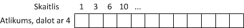  

Atlikumu periods, dalot ar $4$: ______

**Q-2-2.** Saskaita visus naturālos skaitļus no $1$ līdz $n$: $S_n = 1 + 2 + \ldots + n$. Atrast piecas mazākās $n$ vērtības, kurām $S_n$ dalās ar $7$.

  

***Atbilde:*** Piecas mazākās $n$ vērtības, kurām $S_n$ dalās ar $7$ (skaitļus atdala ar semikoliem (;)): ______

**Q-2-3.** Virkni $1;4;9;\ldots$ iegūst, saskaitot pirmos nepāru skaitļus:
$$
\begin{array}{rcl}
S_1 & = & 1\\
S_2 & = & 1 + 3\\
S_3 & = & 1 + 3 + 5
\end{array}
$$

Atrast piecas mazākās $n$ vērtības, kurām $S_n$ dalās ar $7$.

  

***Atbilde:*** Piecas mazākās $n$ vērtības, kam $7$ dala $S_n$ (skaitļus atdala ar semikoliem (;)): ______

# Maģiski kvadrāti 3x3 (`al.equation.expressvariable`)

Atšķirībā no kombinatorikā pazīstamajiem *maģiskajiem kvadrātiem*; šeit 
aplūkosim kvadrātus, kuros summas rindiņās, kolonnās un uz diagonālēm ir vienādas, 
bet (ja vien uzdevuma nosacījumos nav īpaši minēts) neprasīsim, lai visi $n \times n$
tabulā ierakstītie skaitļi būtu dažādi vai arī tie būtu no intervāla $[1;n^2]$. 

**Q-3-1.** Par maģisko kvadrātu $3 \times 3$ šajā uzdevumā sauksim jebkādu naturālu skaitļu izvietojumu 
tabulā $3 \times 3$ rūtiņas, kuram summas visās rindiņās un kolonnās kā arī 
uz abām diagonālēm ir vienādas ar vienu un to pašu skaitli $S$. (Nav obligāti jāizmanto atšķirīgi 
skaitļi vai arī skaitļi no $1$ līdz $9$.)   
Attēlā dotajam maģiskajam kvadrātam izteikt tabulas elementus un to summas 
($a_{11}$, $a_{12}$, $\ldots$, $a_{33}$) ar $S$. 
Piemēram, $a_{11}+a_{12}+a_{13} = 1 \cdot S$ (jo tāda ir maģiskā kvadrāta definīcija). 

  

***Atbilde:*** Visos piemēros ierakstīt trūkstošo reizinātāju pirms $S$ kā parastu daļskaitli $p/q$:  
**($\alpha$)** $a_{12} + a_{22} + a_{32} =$ ______ $\cdot S$  
**($\beta$)** Skaitļu summa uz $3$ sarkanajām horizontālajām līnijām attēlā ($\beta$):  
$(a_{11}+a_{12}+a_{13})+ (a_{21}+a_{22}+a_{23})+ (a_{31}+a_{32}+a_{33}) =$ ______ $\cdot S$  
**($\gamma$)** Skaitļu summa uz $4$ zilajām līnijām, kas iet caur kvadrāta centru attēlā ($\gamma$):  
$(a_{11}+a_{22}+a_{33})+ \ldots + (a_{13}+a_{22}+a_{31}) =$ ______ $\cdot S$  
**($\delta$)** Tabulas centra elements:  
$a_{22} =$ ______ $\cdot S$

**Q-3-2.** Aizpildīt tukšās rūtiņas kvadrātā ar naturāliem skaitļiem, 
ja zināms, ka skaitļu summas visās rindiņās, visās 
kolonnās un uz abām diagonālēm ir vienādas.
(*Ja vēlaties, varat vidējo rūtiņu apzīmēt ar $x$ un izmantot zināmo apgalvojumu, ka $3x$ ir tā summa, 
kas vienāda katrā rindiņā, kolonnā un diagonālē.*)

 

***Atbilde:*** Ierakstīt trūkstošās vērtības maģiskā kvadrāta rindiņās:

 

**Q-3-3.** Dots kvadrāts $3 \times 3$, kur summas visās rindiņās, visās kolonnās un uz abām 
diagonālēm ir vienādas. Noskaidrot, kāds skaitlis ir rakstīts jautājuma zīmes vietā. 
(*Ja vēlaties, varat vidējās rūtiņas skaitli apzīmēt ar $x$ un izmantot zināmo apgalvojumu, ka $3x$ ir tā summa, 
kas vienāda katrā rindiņā, kolonnā un diagonālē.*)

***Atbilde:*** Skaitlis otrās rindiņas trešajā kolonnā $a_{23}=$ ______

# Lineāri vienādojumi veselos skaitļos (`al.inequality.finitesearch`)

**Q-4-1.** Viena vista maksā $3$ dolārus; savukārt par $1$ dolāru var dabūt $3$ cāļus. Cik vistu un cik cāļu jāpērk, lai par $100$ dolāriem nopirktu $100$ putnus.

***Atbilde:*** Ierakstīt vistu un cāļu skaitu: $V=$ ______ , $C=$ ______

**Q-4-2.**  Karlsonam ir tikai $5$ ēru monētas, Bokas jaunkundzei ir tikai $19$ ēru monētas. Vai Karlsons var samaksāt Bokas jaunkundzei $1$ ēru? Vai Bokas jaunkundze var samaksāt Karlsonam $1$ ēru? (Atbildēs Karlsona samaksāto/izdoto monētu skaitu apzīmējam ar $K$, bet Bokas jaunkundzes samaksāto/izdoto monētu skaitu apzīmējam ar $B$.)

***Atbilde:***  
*I daļa:* Ja $5K-19B = 1$, tad $K=$ ______ un $B=$ ______.  

*II daļa:* Ja $19B - 5K = 1$, tad $K=$ ______ un $B=$ ______.  

**Q-4-3.** Karlsons sev pusdienām nopirka $8$ pīrādziņus un $15$ magoņmaizītes; un samaksāja 400 eirocentus. Ar kādu lielāko skaitli noteikti dalās magoņmaizītes cena eirocentos? 

***Atbilde:*** Ierakstīt skaitli: ______

# Skaitīšana Venna diagrammās (`co.fullsearch.opposite`)

**Q-5-1.** Cik ir tādu naturālu trīsciparu skaitļu, kas
dalās gan ar $11$, gan ar $5$?

***Atbilde:*** Ierakstīt skaitu: ______  

**Q-5-2.** Attēlā uzzīmēta Venna diagramma ar piemēriem, kas parāda visas iespējas, kā 
skaitļi intervālā $[1;100]$ var dalīties (vai nedalīties) ar $3$ vai $5$. 
(Piemēram, apgabalā $A$ ir skaitļi, kas dalās ar $3$ un ar $5$, t.i. tur 
ietilpst skaitļi $15;30;\ldots;90$. Apgabalā $D$ ir skaitļi, kas nedalās ne ar $3$, ne ar $5$ utt.)
Noskaidrot, cik skaitļu ir katrā Venna 
diagrammas apgabalā. 

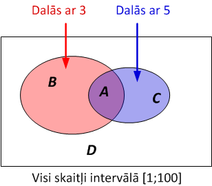

***Atbilde:*** Katrā no gadījumiem ierakstiet, cik ir naturālu skaitļu no intervāla $[1;100]$ ar minēto īpašību:  
**($\alpha$)** Dalās gan ar $3$, gan ar $5$: $|A|=$ ______  
**($\beta$)** dalās ar $3$, bet nedalās ar $5$: $|B|=$ ______  
**($\gamma$)** nedalās ar $3$, bet dalās ar $5$: $|C|=$ ______  
**($\delta$)** nedalās ne ar $3$, ne ar $5$: $|D|=$ ______  

**Q-5-3.** Cik ir tādu piecciparu skaitļu, kuru pierakstā ir vismaz viens nepāra cipars?
(*Var vispirms noskaidrot, cik ir tādu piecciparu skaitļu, kuru pierakstā visi ir pāru cipari.*)

***Atbilde:*** Ierakstīt skaitu: ______ 

**Q-5-4.** Virknē uzrakstītas simts parastas daļas, kam saucējā ir skaitlis $100$:
$$\frac{1}{100}, \frac{2}{100}, \frac{3}{100}, \ldots, \frac{99}{100}, \frac{100}{100}.$$
Cik no šīm $100$ daļām ir nesaīsināmas?

***Atbilde:*** Ierakstīt skaitu: ______ 

**Q-5-5.** Cik ir tādu naturālu skaitļu, kas nepārsniedz $100$ 
un kas dalās ar $2$ vai $3$ (vai tiem abiem), bet nedalās ar $4$. 

***Atbilde:*** Ierakstīt skaitu: ______ 

# Spēles un algoritmiski procesi (`co.games.strategy`)

**Q-6-1.** Spēles sākumā uz tāfeles uzrakstīts naturāls skaitlis. Divi spēlētāji pārmaiņus izdara gājienus: Ar 1 gājienu atļauts no skaitļa atņemt $1$, $2$ vai $3$ (pēc atņemšanas skaitlim jābūt pozitīvam vai nullei). Uzvar tas spēlētājs, pēc kura gājiena rodas nulle. Atzīmēt tos sākumskaitļus, pie kuriem uzvar 2.spēlētājs (ja abi spēlē pareizi). 

***Atbilde:*** Katrai $n$ vērtībai ierakstīt, kurš spēlētājs uzvar (ja abi spēlē pareizi) - t.i. ciparus "1" vai "2".

**Q-6-2.** Andris iedomājas  naturālu $n$; izrēķina reizinājumus $3n$, $5n$, $7n$, $11n$ un $13n$, patvaļīgi izvēlas vienu no šiem pieciem reizinājumiem un nosauc to Jurim. Vai Juris var viennozīmīgi pateikt, kuru skaitli $n$ Andris iedomājās, ja Andra nosauktais skaitlis ir $105$? $111$?

***Atbilde:***  
*I daļa.* Ja nosaukts $105$, tad atbilde ir (izvēlēties no "Jā" un "Nē"): ______ ("Jā" gadījumā $n=$ ______)   
*II daļa.* Ja nosaukts $111$, tad atbilde ir (izvēlēties no "Jā" un "Nē"): ______  ("Jā" gadījumā $n=$ ______)   

**Q-6-3.** Varis dzīvo punktā $A$ un viņam ir $n$ eiras. Viņš var šķērsot tiltu no $A$ uz $B$ un atpakaļ. Ejot no $A$ uz $B$ Velns divkāršo Varim piederošo naudas daudzumu, ejot no $B$ uz $A$ Varis maksā Velnam 8 eiras. Kas notiek Varim pietiekami daudzas reizes staigājot pa tiltu turp un atpakaļ, ja $n=7$? Ja $n=8$?

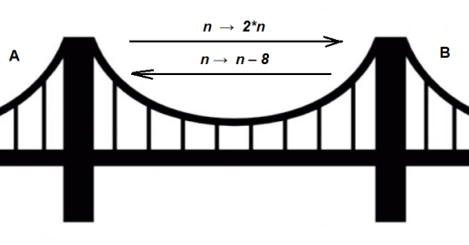  

***Atbilde:***  
*I daļa.* Atzīmēt, kas notiek ar Vara naudu, ja $n = 7$: 

$$ \left[
\begin{array}{cl}
\mbox{(A)} & \mbox{Vara naudas daudzums neierobežoti palielinās}\\
\mbox{(B)} & \mbox{Vara naudas daudzums visu laiku svārstās starp dažām vērtībām}\\
\mbox{(C)} & \mbox{Varim nauda izbeidzas, viņš kādā brīdī vairs nevar šķērsot tiltu atbilstoši noteikumiem}
\end{array}
\right.$$

*II daļa.* Atzīmēt, kas notiek ar Vara naudu, ja $n = 8$: 

$$ \left[
\begin{array}{cl}
\mbox{(A)} & \mbox{Vara naudas daudzums neierobežoti palielinās}\\
\mbox{(B)} & \mbox{Vara naudas daudzums visu laiku svārstās starp dažām vērtībām}\\
\mbox{(C)} & \mbox{Varim nauda izbeidzas, viņš kādā brīdī vairs nevar šķērsot tiltu atbilstoši noteikumiem}
\end{array}
\right.$$

# Masu centrs un spēka pleci (`nt.divisibility.barycenter`)

**Q-7-1.** Skolēnam ir viena atzīme "3" un vairākas atzīmes "9" (citu atzīmju viņam nav). Kāds ir mazākais atzīmju "9" skaits, lai visu skolēna atzīmju aritmētiskais vidējais būtu vismaz "8".

 

***Atbilde:*** Ierakstīt skaitu: ______  

**Q-7-2.** Ir trīs apelsīni (viena apelsīna vidējā masa ir $150$ g) un septiņi greipfrūti (viena greipfrūta vidējā masa ir $180$ grami). Kāda ir visu desmit objektu vidējā masa? (Atsevišķo 
apelsīnu un greipfrūtu masas nav zināmas.)

***Atbilde:*** Ierakstīt vidējo masu gramos: ______ 

**Q-7-3.** Klasē mācās $m$ meitenes un $z$ zēni. Katram no viņiem noteica garumu veselos centimetros. Zēnu vidējais garums bija $178$ centimetri, bet meiteņu vidējais garums bija $172$ centimetri. Savukārt visas klases bērnu vidējais garums bija $174.5$ centimetri. Ar kādu skaitli noteikti dalās zēnu skaits $z$?

***Atbilde:*** Ierakstīt skaitli, ar kuru dalās $n$: ______ 

# Pirmskaitļu un to daudzkārtņu izvietojums (`nt.divisibility.multiples`)

**Q-8-1.** Zināms, ka $x(x+2)(x+4)(x+6)$ dalās ar $n$. Vai kāds no reizinātājiem $x$, $x+2$, $x+4$, $x+6$ noteikti dalās ar $n$? Aplūkot $n$ vērtības $49$, $81$, $125$, $135$, $175$. 

***Atbilde:*** Dažādām $n$ vērtībām ierakstīt rūtiņās "Jā" vai "Nē":  

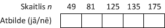  

**Q-8-2.** Zināms, ka $x(x+1)(x+2)(x+3)$ dalās ar $144$. Vai kāds no reizinātājiem noteikti dalās ar $8$? Vai kāds no reizinātājiem noteikti dalās ar $9$?

***Atbilde:***  
*I daļa:* Vai kāds reizinātājs noteikti dalās ar $8$ (Jā/Nē): ______  
*II daļa:* Vai kāds reizinātājs noteikti dalās ar $9$ (Jā/Nē): ______  

**Q-8-3.** Dots $10$ pēc kārtas ņemtu skaitļu reizinājums: $P = x(x+1)\ldots(x+9)$. Vai šis reizinājums noteikti dalās ar $7$, $9$, $11$, $15$, $17$, $19$, $21$, $25$, $49$, $81$?

***Atbilde:*** Katram no skaitļiem tabuliņā ierakstiet Jā/Nē:

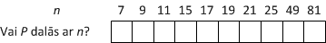  

# Atlikumi un invarianti (`nt.remainder.invariant`)

**Q-9-1.**  Vai pa apli var uzrakstīt $n$ naturālus skaitļus tā, lai jebkuru blakus esošu skaitļu starpība (no lielākā skaitļa atņemot mazāko) būtu $6$, $10$, $14$ vai $18$? Aplūkot divus gadījumus: $n=12$ un $n=13$. 

***Atbilde:***  
*I daļa.* Ja skaitļu skaits $n=12$, tad atbilde ir (izvēlēties no "Jā" un "Nē"): ______  
*II daļa.* Ja skaitļu skaits $n=13$, tad atbilde ir (izvēlēties no "Jā" un "Nē"): ______  

**Q-9-2.** Vai skaitli $1000$ var iegūt, saskaitot $n$ nepāru skaitļu kvadrātus (t.i. skaitļus $1,9,25,49,\ldots$).
Saskaitāmajiem nav noteikti jābūt dažādiem. Aplūkot vērtības $n = 1, 2, 3, 5, 8$?

***Atbilde:***  
*I daļa.* Ja $n=1$ (izvēlēties no "Jā" un "Nē"): ______  
*II daļa.* Ja $n=2$ (izvēlēties no "Jā" un "Nē"): ______  
*III daļa.* Ja $n=3$ (izvēlēties no "Jā" un "Nē"): ______  
*IV daļa.* Ja $n=5$ (izvēlēties no "Jā" un "Nē"): ______  
*V daļa.* Ja $n=8$ (izvēlēties no "Jā" un "Nē"): ______  

**Q-9-3.** Uz tāfeles pa reizei uzrakstīti visi naturālie skaitļi no $1$ līdz $8$ ieskaitot. Ar vienu
gājienu var izvēlēties uz tāfeles uzrakstītus skaitļus $a$ un $b$, nodzēst tos, un to
vietā uzrakstīt $|a-b|$. Pēc četriem šādiem gājieniem uz tāfeles būs palikuši četri skaitļi. 
Cik no tiem var būt nepāru skaitļi? 

***Atbilde:*** Ierakstīt pretī skaitļu skaitam "Jā", ja tas ir iespējams nepāru skaitļu skaits. 

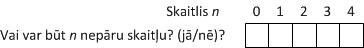  

# Decimālpieraksts kā izteiksme ar cipariem (`nt.decnotation.expressions`)

**Q-10-1.** Skaitļa $n$ decimālpierakstu (sākot no labās puses) sagriež gabalos pa $3$ cipariem
katrā gabalā. Ja ciparu skaits nedalās ar $3$, skaitļa sākumā pieraksta vienu vai divas nulles. 
Visus 3-ciparu gabalus saskaita un iegūst summu $S$. (Sk. piemēru attēlā, kur 
skaitli $n = 65329605$ pārveido par $S = 605 + 329 + 065$.)
Kuriem $p$ ir spēkā "dalāmības pazīme": $n$ dalās ar $p$ tad un tikai tad, ja summa $S$ dalās ar $p$? 

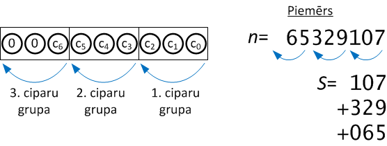  

***Atbilde:*** 
Atzīmēt visas atbildes $p$, kam der šī "dalāmības pazīme":

$$ \left[
\begin{array}{cl}
\mbox{[A]} & 9\\
\mbox{[B]} & 11\\
\mbox{[C]} & 99\\
\mbox{[D]} & 101\\
\mbox{[E]} & 999\\
\mbox{[F]} & 1001
\end{array}
\right.$$

**Q-10-2.** Atrast mazāko četrciparu skaitli, kurš dalās ar $11$ un kam visi cipari ir dažādi. 

***Atbilde:*** Ierakstīt skaitli: ______

**Q-10-3.** Zināms, ka $2^{125} = 42535295865117307932921825928971026432$.   
Aplūkojam visas divnieka pakāpes līdz tam: $A = \{ 2^0, 2^1, \ldots, 2^{124} \}$
Vai vairāk ir tādu divnieka pakāpju, kuru decimālpieraksts 
sākas ar ciparu "1", vai arī tādu, kuru decimālpieraksts sākas ar cipariem "2" vai "3"?

***Atbilde:*** Atzīmēt patiesu apgalvojumu par $125$ divnieka pakāpēm kopā $A$. 

$$ \left[
\begin{array}{cl}
\mbox{(A)} & \mbox{Vairāk to, kas sākas ar ciparu "1", nekā to, kas sākas ar "2" vai "3"}\\
\mbox{(B)} & \mbox{Vairāk to, kas sākas ar "2" vai "3", nekā to, kas sākas ar ciparu "1"}\\
\mbox{(C)} & \mbox{To, kas sākas ar "1" un to, kas sākas ar "2" vai "3", ir vienāds skaits}
\end{array}
\right.$$

# Par pirmskaitļiem (`nt.primes.small`)

**Q-11-1.** Kuriem skaitļiem $n$ vienmēr ir spēkā apgalvojums: 
Ja reizinājums $ab$ dalās ar $n$, tad $a$ vai $b$ (vai tie abi) dalās ar $n$.

***Atbilde:*** Tabulā esošos nepāru skaitļus atzīmēt ar "Jā" vai "Nē" - atkarībā no tā, 
vai apgalvojums ir spēkā. 

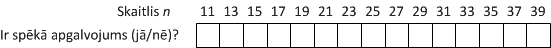 

**Q-11-2.** Zināms, ka visas daļas $1/n, \ldots,(n-1)/n$ ir nesaīsināmas. Kāds var būt $n$?

***Atbilde:*** Tabulā esošos nepāru skaitļus atzīmēt ar "Jā" vai "Nē" - atkarībā no tā, 
vai apgalvojums ir spēkā. 

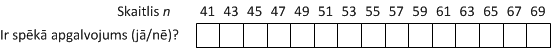 

**Q-11-3.**  Zināms, ka skaitļa $n$ kvadrātam $a = n^2$ ir tieši $3$ dažādi dalītāji 
(ieskaitot $1$ un pašu skaitli $a$). Kāds var būt $n$?  

***Atbilde:*** Tabulā esošos nepāru skaitļus atzīmēt ar "Jā" vai "Nē" - atkarībā no tā, 
vai apgalvojums ir spēkā. 

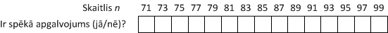 

# Dalāmība ar 11 (`nt.factorization.divisibilityrules`)

**Q-12-1.** Pēterītis aprēķināja $1/7$ kā decimāldaļu: $1/7 = 0.(142857)$. Iekavas te apzīmē to, ka ciparu "142857" veidotais periods atkārtojas bezgalīgi daudz reižu: $0.(142857)(142857)\ldots$. Pēc tam Miķelītis pareizināja periodu $142857$ ar $7$ un ieguva $999999$. Atrast mazāko skaitli $N$, kura decimālpieraksts sastāv tikai no vieniniekiem un kas dalās ar $7$.

***Atbilde:*** $N=$ ______

**Q-12-2.** Dalījums $1/13 = 0.(076923)(076923)0769\ldots$ ir periodiska decimāldaļa (cipari "076923" bezgalīgi daudzas reizes atkārtojas). Kurš no dotajiem skaitļiem noteikti dalās ar $13$? 

***Atbilde:*** 
Atzīmēt skaitli, kurš dalās ar $13$:

$$ \left[
\begin{array}{cl}
\mbox{(A)} & 10^3 - 1\\
\mbox{(B)} & 10^4 - 1\\
\mbox{(C)} & 10^5 - 1\\
\mbox{(D)} & 10^6 - 1\\
\mbox{(E)} & 10^7 - 1\\
\mbox{(F)} & 10^8 - 1\\
\end{array}
\right.$$

**Q-12-3.** 6-ciparu skaitlis $N = \overline{abcabc}$ iegūts, uzrakstot tos pašus ciparus $a,b,c$ divas reizes. Ar kuru skaitli noteikti dalās $N$: 

***Atbilde:*** Atzīmēt vienu atbildi:

$$ \left[
\begin{array}{cl}
\mbox{(A)} & 99\\
\mbox{(B)} & 101\\
\mbox{(C)} & 111\\
\mbox{(D)} & 999\\
\mbox{(E)} & 1001\\
\mbox{(F)} & 999999
\end{array}
\right.$$

**Q-12-4.**  Skaitli sauc par *palindromu*, ja tā decimālpieraksts nemainās, skaitli pierakstot no otra gala. Kuri no palindromiem dalās ar $11$?  
*Var izmantot dalāmības pazīmi ar $11$: ciparu summa pāru pozīcijās un ciparu summa nepāru pozīcijās sakrīt, vai arī dalās ar $11$*.

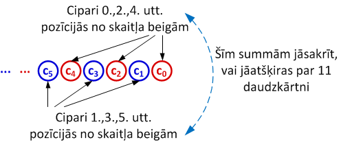  

***Atbilde:*** 
Atzīmēt visas atbildes:

$$ \left[
\begin{array}{cl}
\mbox{[A]} & 111\\
\mbox{[B]} & 121\\
\mbox{[C]} & 1001\\
\mbox{[D]} & 1111\\
\mbox{[E]} & 123321
\end{array}
\right.$$

**Q-12-5.** Atrast mazāko $5$-ciparu palindromu (skaitli, kas vienādi lasāms no abiem galiem, t.i. 
1.cipars sakrīt ar 5.ciparu un 2.cipars sakrīt ar 4.ciparu), kurš dalās ar $11$. 

***Atbilde:*** Ierakstīt 5-ciparu skaitli: ______

**Q-12-6.** Skaitli $B$ ieguva no skaitļa $A$,  $A$ decimālpierakstā samainot vietām ciparus, 
kuru attālums ir tieši $5$ pozīcijas. Piemēram, no skaitļa $100002$ var iegūt skaitli $200001$. 
Ar kuru skaitli noteikti dalās starpība $A-B$?

***Atbilde:*** 
Atzīmēt visas atbildes (skaitļus, ar ko noteikti dalās $A-B$, neatkarīgi no $A$ izvēles un cipariem, kuri tika mainīti):

$$ \left[
\begin{array}{cl}
\mbox{[A]} & 7\\
\mbox{[B]} & 9\\
\mbox{[C]} & 11\\
\mbox{[D]} & 13\\
\mbox{[E]} & 41
\end{array}
\right.$$

  
# Taisne rūtiņu plaknē (`nt.gcd.chineseremainders`)

**Q-13-1.**  Caurspīdīgi ķieģelīši ar izmēriem $4 \times 5$ rūtiņas ir salikti grēdā. 
Dažiem no tiem $45$ grādu leņķī pret to malām 
spīd cauri gaismas stars, kurš, ejot pāri ķieģelīšu robežai, ikreiz maina 
krāsu. Ja stara šķērsotos ķieģelīšus saliek vienu aiz otra, var atzīmēt, 
kādā secībā stars šķērso rūtiņu virsotnes - kā attēlots palielināti attēla labajā pusē. 
(Ja rūtiņu virsotne atrodas uz ķieģelīšu 
robežas, uzskatām, ka tā pieder ķieģelīša kreisajai vai apakšējai malai, nevis labajai vai augšējai).  
Ar kuru kārtas numuru stars šķērsos rūtiņu virsotni $(4;2)$, kas attēlā apzīmēta ar jautājuma zīmi?

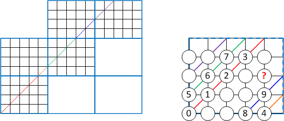

***Atbilde:*** Ierakstīt naturālu skaitli: ______

**Q-13-2.** Atrast piemēru skaitlim, kurš dalot ar $2$ dod atlikumu $1$; dalot ar $3$ dod atlikumu $2$; 
dalot ar $4$ dod atlikumu $3$; dalot ar $5$ dod atlikumu $4$, un dalot ar $6$ dod atlikumu $5$. 

***Atbilde:*** Ierakstīt skaitļa piemēru: ______

**Q-13-3.** Par skaitli $n$ zināms, ka tas dod atlikumu $3$, dalot ar $4$, un atlikumu $2$, dalot ar $7$. 
Kādu atlikumu dod skaitlis $n$, ja to dala ar $28$? 

***Atbilde:*** Ierakstīt atlikumu (no $0$ līdz $27$): ______

**Q-13-4.** Dots taisnstūris, ko veido $9 \times 22$ 
kvadrātveida rūtiņas; tam novilkta diagonāle. Cik rūtiņu šķērso
šī diagonāle (pieskaršanos rūtiņas stūrim 
neuzskatām par šķērsošanu). 

  

***Atbilde:*** Atzīmēt vienu atbildi:

$$ \left[
\begin{array}{cl}
\mbox{(A)} & 28\\
\mbox{(B)} & 29\\
\mbox{(C)} & 30\\
\mbox{(D)} & 31\\
\mbox{(E)} & 32\\
\mbox{(F)} & 33\\
\mbox{(G)} & 34
\end{array}
\right.$$

**Q-13-5.** Dots taisnstūris, ko veido $9 \times 21$ 
kvadrātveida rūtiņas; tam novilkta diagonāle. Cik rūtiņu šķērso
šī diagonāle (pieskaršanos rūtiņas stūrim neuzskatām 
par šķērsošanu). 

  

***Atbilde:*** Izvēlēties vienu pareizo atbildi:

$$ \left[
\begin{array}{cl}
\mbox{(A)} & 27\\
\mbox{(B)} & 28\\
\mbox{(C)} & 29\\
\mbox{(D)} & 30\\
\mbox{(E)} & 31\\
\mbox{(F)} & 32\\
\mbox{(G)} & 33
\end{array}
\right.$$

**Q-13-6.** Taisnstūrī ar izmēriem $m \times n$ rūtiņas novilkta diagonāle. 
Cik rūtiņas šī diagonāle šķērso? (Rūtiņu saucam par šķēŗsotu, ja diagonāle
to sagriež divās daļās.). Aplūkot 
divus taisnstūru izmērus: $37 \times 63$ un $39 \times 63$. 

***Atbilde:***  
*I daļa.* Taisnstūrī $37 \times 63$ šķērsoto rūtiņu skaits: ______  
*II daļa.* Taisnstūrī $39 \times 63$ šķērsoto rūtiņu skaits: ______

# Dalīšana pirmreizinātājos (`nt.factorization.plain`)

<!--
6: Dalīšana pirmreizinātājos. nt.factor
-->

**Q-14-1.** Kurš ir mazākais pilnais kvadrāts, kas dalās ar trim dažādiem pirmskaitļiem? (Skaitli sauc par *pilnu kvadrātu*, ja tas ir $n^2$ kādam naturālam $n$.)

***Atbilde:*** Ierakstīt skaitli: ______

**Q-14-2.** Skolas orķestris noskaidroja, ka viņi var sarindoties $6$, $7$ vai $8$ vienādās rindās tā, lai neviens nepaliek pāri. 
Kāds ir mazākais skolēnu skaits šajā orķestrī?

***Atbilde:*** Ierakstīt skaitli: ______

**Q-14-3.** Kāds ir mazākais veselais skaitlis, kurš dalās ar 7, bet dod atlikumu 1, ja to dala ar jebkuru skaitli no 2 līdz 6? 

***Atbilde:*** Ierakstīt skaitli: ______

**Q-14-4.** Divi velosipēdisti sāk braukt no kopīgas 
starta līnijas 12:15. 
Vienam velosipēdistam vajag $12$ minūtes, lai apbrauktu apli, 
kamēr otrs velosipēdists apbrauc apli katras $16$ minūtes. 
Pieņemot, ka viņu ātrumi ir nemainīgi, kad būs nākamais brīdis, 
kad viņi abi reizē šķērsos šo starta līniju? 

***Atbilde:*** Ierakstīt pulksteņa laiku formā $hh:mm$: ______

**Q-14-5.** Divus skaitļus $a$ un $b$ sauc par "savstarpējiem
pirmskaitļiem", ja to lielākais kopīgais dalītājs 
ir $1$ (jeb daļa $a/b$ ir nesaīsināma). Cik daudzi veselie
skaitļi no $1$ līdz $28$ ir 
savstarpēji pirmskaitļi ar $28$?

***Atbilde:*** Ierakstīt skaitu: ______

**Q-14-6.** Atrast piecus mazākos skaitļa $8$ daudzkārtņus, kuri ir pilni kvadrāti. 

***Atbilde:*** Ierakstīt 5 skaitļus, atdalot ar semikoliem: ______  

**Q-14-7.** Atrast piecus mazākos pilnos kvadrātus, kas dalās ar $6$.

***Atbilde:*** Ierakstīt 5 skaitļus, atdalot ar semikoliem: ______  

**Q-14-8.**  Burvju kases aparāts pašā sākumā izdrukāja mazāko 
skaitļa $20$ daudzkārtni, 
kas ir pilns kvadrāts (izsakāms kā $n^2$ veselam $n$); pašās beigās 
tas izdrukāja mazāko skaitļa $20$ daudzkārtni, 
kas ir pilns kubs (izsakāms kā $n^3$ veselam $n$) un pa vidu tiem - arī 
visus skaitļa $20$ daudzkārtņus, 
kuri atrodas starp šiem abiem skaitļiem.
Cik skaitļu kases aparāts izdrukāja? 

***Atbilde:*** Ierakstīt izdrukāto skaitļu skaitu: ______

**Q-14-9.**  Kurš ir mazākais četrciparu skaitlis, kurš dalās ar 
$2$, $3$, $4$, $5$, $6$ un $7$?

***Atbilde:*** Ierakstīt četrciparu skaitli: ______ 

**Q-14-10.**  Atrast mazāko četrciparu skaitli, kas dalās ar katru no četriem mazākajiem pirmskaitļiem. 

***Atbilde:*** Ierakstīt četrciparu skaitli: ______

# Skaitļa dalītāju struktūra (`nt.factorization.structure`)

<!--
8 Skaitļa dalītāju struktūra; nt.divisor-structure
-->

**Q-15-1.** Planētām $X$, $Y$ un $Z$ vajag attiecīgi 
$360$, $450$ un $540$ dienas, lai veiktu pilnu apli ap to pašu 
sauli. Ja visas trīs planētas sākumā ir sarindojušās uz 
tā paša stara (kuram saule ir sākumpunkts), 
kāds ir mazākais pozitīvais dienu skaits, 
pirms viņas nonāks šajā pašā stāvoklī? 

***Atbilde:*** Ierakstīt veselu skaitli: ______  

**Q-15-2.** Cik daudzi no skaitļa $168$ pozitīvajiem 
dalītājiem ir pāru skaitļi?

***Atbilde:*** Ierakstīt dalītāju skaitu: ______

**Q-15-3.** Cik daudzi no skaitļa $5400$ dalītājiem nav daudzkārtņi nevienam pilnam kvadrātam lielākam par $1$?

***Atbilde:*** Ierakstīt dalītāju skaitu: ______

**Q-15-4.** Ar $A$ apzīmējam visu to skaitļu kopu, kurus var izteikt kā triju pēc kārtas sekojošu naturālu skaitļu summu. 
Kāds ir lielākais kopīgais dalītājs visiem skaitļiem kopā $A$? 

***Atbilde:*** Ierakstīt veselu skaitli: ______ 

