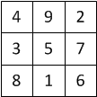
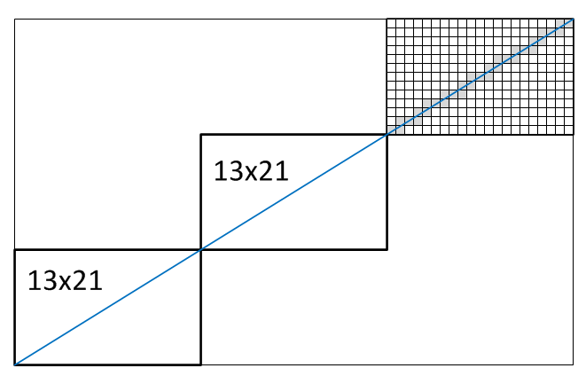

Tests atspoguļo skaitļu teorijas prasmes agrāko gadu (2000.-2016.g.) 7.-8.kl. **No** un **Ao** uzdevumos. Tas galvenokārt iedvesmojies no NMS arhīva materiāliem, kas apkopoti PDF dokumentā - sk. <http://www.dudajevagatve.lv/nt/nt-7-8.html> (*7.-8.klašu novadu olimpiādes: Skaitļu teorija (pasniedzēja materiāls)*). Tests, ko piedāvā pulciņā pirms **Ao**, varētu sastāvēt no $8$ jautājumiem, ko skolēni risinātu aptuveni $20$ minūtes.
Šajā sarakstā ir vairāk jautājumu, jo var izrādīties, ka daļa jautājumu ir piemērotāki 9.-10.klasei vai arī 
ir jāpārstrādā. Katrai no $15$ tēmām pievienots klasifikators (piemēram `al.manipulate.smallexpr`), 
ar kuru apzīmēsim arī teorijas tēmas 
un olimpiāžu uzdevumus, kuru matemātiskais saturs ir līdzīgs.

<!--
Invarianti(9) - vairāk!

uzd <- c(3,3,3,3,5, 3,3,3,3,3, 3,6,6,10,4)
-->

# Veselu skaitļu izteiksmju pārveidojumi (`al.manipulate.smallexpr`)

**Q-1-1** Zināms, ka veseli skaitļi $a$ un $b$ ņemti no saraksta $\{ 0,1,2,3,4,5,6,7,8,9,10 \}$ un $a+b = 10$. Atrodiet tādus $a$ un $b$, kuriem izteiksme $a^2 + b^2$ pieņem lielāko iespējamo vērtību. 

***Atbilde:*** Ierakstīt veselus skaitļus, kam $a^2+b^2$ ir vislielākais: $a =$ ______  $b =$ ______  

*1. atrisinājums:* Var izvēlēties $a=10$ un $b=0$ (vai otrādi). To, ka $a^2 + b^2$ pieņem lielāko iespējamo vērtību $100$ var pārbaudīt vai nu ar pilno pārlasi ($6$ gadījumi, kā izvēlēties saskaitāmos, neskaitot tos, kur $a$ un $b$ apmainīti vietām).

$2. atrisinājums:* Vispārīgā gadījumā var uzrakstīt 
$(a + b)^2 = a^2 + 2ab + b^2$ jeb $(a+b)^2 - 2ab = a^2 + b^2$. Fiksētam $(a+b)^2$ izteiksmes labā puse būs vislielākā tad, ja $2ab$ ir iespējami mazs. Mūsu gadījumā - vienāds ar $0$, jo $a,b$ nevar būt negatīvi. Tādēļ viens skaitlis ir $0$, bet otrs ir $10$.

**Q-1-2** Zināms, ka veseli skaitļi $a$ un $b$ ņemti no saraksta $\{ 0,1,2,3,4,5,6,7,8,9,10 \}$ un $a+b = 10$. Atrodiet tādus $a$ un $b$, kuriem izteiksme $ab$ pieņem lielāko iespējamo vērtību. 

***Atbilde:*** Ierakstīt veselus nenegatīvus skaitļus, kam $ab$ ir vislielākais: $a =$ ______  $b =$ ______  

*1. atrisinājums:* Var izvēlēties $a=5$ un $b=5$, ko var pārbaudīt ar pilno pārlasi, aplūkojot dažādus skaitļu pārīšus, kas summā dod $10$.  

*2. atrisinājums:* Izsakām $b = 10-a$, tad $ab = a(10-a) = -a^2 + 10a$
un $-a^2 + 10a$ grafiks ir parabola, kuras zari vērsti uz leju. Līdz 
ar to šī kvadrātfunkcija savu lielāko vērtību sasniedz punktā, 
kas ir parabolas virsotne, tas ir $a_0 = \frac{-10}{-2}=5$. 
Tātad arī $b = 5$. 

*3. atrisinājums:* Var uzrakstīt $(a + b)^2 = (a-b)^2 + 4ab$ jeb $(a+b)^2 - (a-b)^2 = 4ab$. Fiksētam $(a+b)^2$ izteiksmes labā puse būs vislielākā tad, ja $(a-b)^2$ ir iespējami mazs. T.i. jāizvēlas $a = b$, kas nozīmē, ka $a = b = 5$. 

**Q-1-3** Skaitļu trijniekiem $(1; 5; 6)$ un $(2; 3; 7)$ ir vienādas gan summas, gan kvadrātu summas. 
$$ \left\{
\begin{array}{rcl}
1 + 5 + 6 & = & 2 + 3 + 7\\
1^2 + 5^2 + 6^2 & = & 2^2 + 3^2 + 7^2
\end{array}
\right.$$

 

Kāds izdomāja pieskaitīt visiem šiem skaitļiem $10$ un ieguva jaunus trijniekus $(11; 15; 16)$ un $(12; 13; 17)$. Kādas sakarības pastāv starp šo skaitļu summām un kvadrātu summām. (*Ja ir slinkums kāpināt lielus skaitļus, var atvērt iekavas izteiksmēs $(10+1)^2 + (10+5)^2 + (10+6)^2$ utml.*)

***Atbilde:***  
*I daļa:* Atzīmēt patieso apgalvojumu par summām:

$$ \left[
\begin{array}{crcl}
\mbox{(A)} & 11 + 15 + 16 & < & 12 + 13 + 17\\
\mbox{(B)} & 11 + 15 + 16 & = & 12 + 13 + 17\\
\mbox{(C)} & 11 + 15 + 16 & > & 12 + 13 + 17
\end{array}
\right.$$

*II.daļa:* Atzīmēt patieso apgalvojumu par kvadrātu summām:

$$ \left[
\begin{array}{crcl}
\mbox{(A)} & 11^2 + 15^2 + 16^2 & < & 12^2 + 13^2 + 17^2\\
\mbox{(B)} & 11^2 + 15^2 + 16^2 & = & 12^2 + 13^2 + 17^2\\
\mbox{(C)} & 11^2 + 15^2 + 16^2 & > & 12^2 + 13^2 + 17^2
\end{array}
\right.$$

*Atrisinājums:* Abos gadījumos abas puses ir savstarpēji vienādas. Pirmajā gadījumā tas ir viegli redzams, jo abos gadījumos izteiksmei pieskaita to pašu lielumu ($3 \cdot 10$). 
Otrajā gadījumā varam atvērt iekavas un grupēt: 
$$(10+1)^2 + (10+5)^2 + (10+6)^2 = (100 + 100 + 100) + 2\cdot 10 (1 + 5 + 6) + (1^2 + 5^2 + 6^2)$$ To pašu izdara arī ar otru pusi un pārliecinās, ka viss noīsinās. 

# Progresijas un to ģeometriskas interpretācijas (`al.sym.progressions`)

**Q-2-1.** Skaitļus $1,3,6,10,\ldots$ iegūst, saskaitot arvien garākus naturālo skaitļu virknes sākumposmus:
$$
\begin{array}{rcl}
1 & = & 1\\
3 & = & 1 + 2\\
6 & = & 1 + 2 + 3\\
10 & = & 1 + 2 + 3 + 4\\
15 & = & 1 + 2 + 3 + 4 + 5
\end{array}
$$

Ierakstīt rūtiņās šīs virknes locekļu veidotos atlikumus, 
dalot ar skaitļiem $3$ un $4$; ierakstīt arī, pēc cik rūtiņām šie atlikumi sāk atkārtoties (t.i. atlikumu perioda garumu). 

***Atbilde:***  
*I daļa:* Virknes $1; 3; 6; 10; \ldots$ atlikumi, dalot ar $3$ (ierakstīt rūtiņās skaitļus $0$, $1$ vai $2$):  

  

Atlikumu periods, dalot ar $3$: ______  
(*t.i. pēc cik rūtiņām atlikumi sāk atkārtoties*)

*II daļa:* Virknes $1; 3; 6; 10; \ldots$ atlikumi, dalot ar $4$ (ierakstīt rūtiņās skaitļus $0$, $1$, $2$ vai $3$):  

  

Atlikumu periods, dalot ar $4$: ______

*Atrisinājums:* Dalot ar $3$, rodas atlikumu virkne $1;0;0;1;0;0;1;0;0;\ldots$ ar periodu $3$.  
Dalot ar $4$, rodas atlikumu virkne $1;3;2;2;3;1;0;0;\ldots$ ar periodu $8$. 

**Q-2-2.** Saskaita visus naturālos skaitļus no $1$ līdz $n$: $S_n = 1 + 2 + \ldots + n$. Atrast piecas mazākās $n$ vērtības, kurām $S_n$ dalās ar $7$.

  

***Atbilde:*** Piecas mazākās $n$ vērtības, kurām $S_n$ dalās ar $7$ (skaitļus atdala ar semikoliem (;)): ______

*Atrisinājums:* Ņemot vērā to, ka trepīte ir puse no taisnstūra $n(n+1)$, secinām, ka $n$ vai $n+1$ jādalās ar $7$. Iegūstam, ka der $n=6;7;13;14;20;\ldots$.

**Q-2-3.** Virkni $1;4;9;\ldots$ iegūst, saskaitot pirmos nepāru skaitļus:
$$
\begin{array}{rcl}
S_1 & = & 1\\
S_2 & = & 1 + 3\\
S_3 & = & 1 + 3 + 5
\end{array}
$$

Atrast piecas mazākās $n$ vērtības, kurām $S_n$ dalās ar $7$.

  

***Atbilde:*** Piecas mazākās $n$ vērtības, kam $7$ dala $S_n$ (skaitļus atdala ar semikoliem (;)): ______

*Atrisinājums:* Tā kā pirmo $n$ nepāru skaitļu summa ir $n^2$, iegūstam, ka $n$ dalās ar $7$. Iegūstam, ka der $n=7;14;21;28;35;\ldots$.

# Maģiski kvadrāti 3x3 (`al.equation.expressvariable`)

Atšķirībā no kombinatorikā pazīstamajiem *maģiskajiem kvadrātiem*; šeit 
aplūkosim kvadrātus, kuros summas rindiņās, kolonnās un uz diagonālēm ir vienādas, 
bet (ja vien uzdevuma nosacījumos nav īpaši minēts) neprasīsim, lai visi $n \times n$
tabulā ierakstītie skaitļi būtu dažādi vai arī tie būtu no intervāla $[1;n^2]$. 

**Q-3-1.** Par maģisko kvadrātu $3 \times 3$ šajā uzdevumā sauksim jebkādu naturālu skaitļu izvietojumu 
tabulā $3 \times 3$ rūtiņas, kuram summas visās rindiņās un kolonnās kā arī 
uz abām diagonālēm ir vienādas ar vienu un to pašu skaitli $S$. (Nav obligāti jāizmanto atšķirīgi 
skaitļi vai arī skaitļi no $1$ līdz $9$.)   
Attēlā dotajam maģiskajam kvadrātam izteikt tabulas elementus un to summas 
($a_{11}$, $a_{12}$, $\ldots$, $a_{33}$) ar $S$. 
Piemēram, $a_{11}+a_{12}+a_{13} = 1 \cdot S$ (jo tāda ir maģiskā kvadrāta definīcija). 

  

***Atbilde:*** Visos piemēros ierakstīt trūkstošo reizinātāju pirms $S$ kā parastu daļskaitli $p/q$:  
**($\alpha$)** $a_{12} + a_{22} + a_{32} =$ ______ $\cdot S$  
**($\beta$)** Skaitļu summa uz $3$ sarkanajām horizontālajām līnijām attēlā ($\beta$):  
$(a_{11}+a_{12}+a_{13})+ (a_{21}+a_{22}+a_{23})+ (a_{31}+a_{32}+a_{33}) =$ ______ $\cdot S$  
**($\gamma$)** Skaitļu summa uz $4$ zilajām līnijām, kas iet caur kvadrāta centru attēlā ($\gamma$):  
$(a_{11}+a_{22}+a_{33})+ \ldots + (a_{13}+a_{22}+a_{31}) =$ ______ $\cdot S$  
**($\delta$)** Tabulas centra elements:  
$a_{22} =$ ______ $\cdot S$

*Atrisinājums:*  
**($\alpha$)** Koeficients pirms $S$ summai šajā kolonnā ir $1$ (maģiskā kvadrāta definīcija).  
**($\beta$)** Koeficients pirms $S$ ir $3$, jo katrā no $3$ rindiņām summa ir $S$.  
**($\gamma$)** Koeficients pirms $S$ ir $4$, jo tur ietilpst $4$ vienādas summas.  
**($\delta$)** No **($\gamma$)** atņemam **($\beta$)**. Visi tabulas elementi noīsinās, izņemot vidējo. 
Iegūstam, $3a_{22} = S$ jeb $a_{22} = (1/3)S$, t.i. koeficients ir $1/3$.

**Q-3-2.** Aizpildīt tukšās rūtiņas kvadrātā ar naturāliem skaitļiem, 
ja zināms, ka skaitļu summas visās rindiņās, visās 
kolonnās un uz abām diagonālēm ir vienādas.
(*Ja vēlaties, varat vidējo rūtiņu apzīmēt ar $x$ un izmantot zināmo apgalvojumu, ka $3x$ ir tā summa, 
kas vienāda katrā rindiņā, kolonnā un diagonālē.*)

 

***Atbilde:*** Ierakstīt trūkstošās vērtības maģiskā kvadrāta rindiņās:

 

*Atrisinājums:* Rūtiņa tabulas kreisajā augšējā stūrī vienāda gan ar $3x-11$ 
(lai kreisajā kolonnā $(3x -11) + 3 + 8 = 3x$), gan arī $2x - 6$ (lai uz diagonāles
$(2x-6) + x + 6 = 3x$). Iegūstam vienādojumu: 
$$3x-11 = 2x - 6\;\;\Rightarrow\;\;x=5$$
Zinot, ka kvadrāta vidū $x=5$ un visas summas ir $3 \cdot 5 = 15$, pārējās tabulas
rūtiņas var viegli aizpildīt. 

 

**Q-3-3.** Dots kvadrāts $3 \times 3$, kur summas visās rindiņās, visās kolonnās un uz abām 
diagonālēm ir vienādas. Noskaidrot, kāds skaitlis ir rakstīts jautājuma zīmes vietā. 
(*Ja vēlaties, varat vidējās rūtiņas skaitli apzīmēt ar $x$ un izmantot zināmo apgalvojumu, ka $3x$ ir tā summa, 
kas vienāda katrā rindiņā, kolonnā un diagonālē.*)

***Atbilde:*** Skaitlis otrās rindiņas trešajā kolonnā $a_{23}=$ ______

*Atrisinājums:* Apzīmējam skaitli tabulas vidū ar $x$. Tad visus citus tabulas skaitļus var izteikt ar šo $x$
(sk. attēlu). 

Pēc 3 soļiem iegūstam, ka labajā kolonnā skaitļi ir $2x - 13$, nezināms $y$ (kurš šajā uzdevumā jāatrod), 
kā arī $x + 11$. Iegūstam sakarību: 
$$(2x-13)+y+(x+11)=3x\;\;\Rightarrow\;\;3x+y-2=3x$$
Pēc $3x$ saīsināšanas abās pusēs iegūstam $y-2=0$ jeb $y=2$. Tātad meklētais skaitlis ir $2$ (Sal. **Ao2014.7.4**).

# Lineāri vienādojumi veselos skaitļos (`al.inequality.finitesearch`)

**Q-4-1.** Viena vista maksā $3$ dolārus; savukārt par $1$ dolāru var dabūt $3$ cāļus. Cik vistu un cik cāļu jāpērk, lai par $100$ dolāriem nopirktu $100$ putnus.

***Atbilde:*** Ierakstīt vistu un cāļu skaitu: $V=$ ______ , $C=$ ______

*Atrisinājums:* Apzīmēsim: $V$ - tik vistu jānopērk, $C$ - tik cāļu 
jānopērk. Tad no dotā $V+C=100$ un $3V + \frac{1}{3}C = 100$. 
Pareizinot pēdējā vienādojuma abas puses ar $3$, iegūstam 
$9V + C = 300$. Pārrakstām pēdējo vienādojumu formā 
$8V + (V+C) = 300$. Tā kā $V+C = 100$, tad iegūstam
$8V = 200$ jeb $V = 25$. Līdz ar to $C=75$. 

**Q-4-2.**  Karlsonam ir tikai $5$ ēru monētas, Bokas jaunkundzei ir tikai $19$ ēru monētas. Vai Karlsons var samaksāt Bokas jaunkundzei $1$ ēru? Vai Bokas jaunkundze var samaksāt Karlsonam $1$ ēru? (Atbildēs Karlsona samaksāto/izdoto monētu skaitu apzīmējam ar $K$, bet Bokas jaunkundzes samaksāto/izdoto monētu skaitu apzīmējam ar $B$.)

***Atbilde:***  
*I daļa:* Ja $5K-19B = 1$, tad $K=$ ______ un $B=$ ______.  

*II daļa:* Ja $19B - 5K = 1$, tad $K=$ ______ un $B=$ ______.  

*Atrisinājums:* Atrisinājumu ir ļoti daudz (esošu atrisinājumu var pārveidot, aizstājot $K$ ar $K+19$, bet $B$ ar $B+5$). Bet nelieliem skaitļiem var izvēlēties $K=4$ un $B=1$, tad $5K-19B = 1$.  
Otrajā daļā var izvēlēties $K=15$ un $B=4$, tad $19B - 5K = 1$. 

**Q-4-3.** Karlsons sev pusdienām nopirka $8$ pīrādziņus un $15$ magoņmaizītes; un samaksāja 400 eirocentus. Ar kādu lielāko skaitli noteikti dalās magoņmaizītes cena eirocentos? 

***Atbilde:*** Ierakstīt skaitli: ______

*Atrisinājums:* Apzīmējam pīrādziņa cenu ar $P$ un magoņmaizītes cenu ar $M$. 
Rakstām vienādojumu $8P + 15M = 400$ jeb $15M = 400 - 8P$, no kā iegūstam 
$15M = 8(50 - P)$. Ievērojam, k avienādojuma labā puse dalās ar $8$, 
tādēļ arī vienādojuma kreisā puse jeb $15M$ dalās ar $8$. 
Tā kā $15$ un $8$ nav kopīgu dalītāju, secinām, ka arī $M$ dalās ar $8$.  
Vienlaikus, $8$ ir lielākais skaitlis, ar ko noteikti dalās $M$, 
jo var izvēlēties $M=8$ (tad $P=35$). 

# Skaitīšana Venna diagrammās (`co.fullsearch.opposite`)

**Q-5-1.** Cik ir tādu naturālu trīsciparu skaitļu, kas
dalās gan ar $11$, gan ar $5$?

***Atbilde:*** Ierakstīt skaitu: ______  

*Atrisinājums:* Trīsciparu skaitļi ir visi skaitļi intervālā $[100;999]$. 
Gan ar $11$, gan ar $5$ dalās visi tie skaitļi, kas dalās ar $55$. 
Tātad ir jāatrod visas tādas naturālas $n$ vērtības, ka $55 \cdot n$ 
ir trīsciparu skaitlis. Ievērojam, ka mazākā $n$ vērtība vavr būt $2$
(tad iegūštam trīsciparu skaitli $110$), bet lielākā - $18$ 
(tad iegūstam trīsciparu skaitli $990$). Tātad pavisam kopā 
iespējamas $17$ dažādas $n$ vērtības jeb pavisam ir $17$ tādi naturāli 
trīsciparu skaitļi, kas dalās gan ar $11$, gan ar $5$. 

**Q-5-2.** Attēlā uzzīmēta Venna diagramma ar piemēriem, kas parāda visas iespējas, kā 
skaitļi intervālā $[1;100]$ var dalīties (vai nedalīties) ar $3$ vai $5$. 
(Piemēram, apgabalā $A$ ir skaitļi, kas dalās ar $3$ un ar $5$, t.i. tur 
ietilpst skaitļi $15;30;\ldots;90$. Apgabalā $D$ ir skaitļi, kas nedalās ne ar $3$, ne ar $5$ utt.)
Noskaidrot, cik skaitļu ir katrā Venna 
diagrammas apgabalā. 

***Atbilde:*** Katrā no gadījumiem ierakstiet, cik ir naturālu skaitļu no intervāla $[1;100]$ ar minēto īpašību:  
**($\alpha$)** Dalās gan ar $3$, gan ar $5$: $|A|=$ ______  
**($\beta$)** dalās ar $3$, bet nedalās ar $5$: $|B|=$ ______  
**($\gamma$)** nedalās ar $3$, bet dalās ar $5$: $|C|=$ ______  
**($\delta$)** nedalās ne ar $3$, ne ar $5$: $|D|=$ ______  

*Atrisinājums:* Apgabalā $A$ ir $6$ skaitļi: $\{ 15; 30; 45; 60; 75; 90 \}$.  
Skaitļu, kas dalās ar $3$ pavisam ir $33$ (no $3$ līdz $99$ - visi, kas 
dalās ar $3$).
Tā kā seši no tiem dalās arī ar $5$, tad apgabalā $B$ ir $33 - 6 = 27$ skaitļi.  
Skaitļu, kas dalās ar $5$ šajā intervālā ir $20$. No tiem $20-6 = 14$ dalās tikai ar $5$, bet ne ar $3$.  
Visbeidzot visu pārējo skaitļu (kas nedalās ne ar $3$, ne ar $5$) ir $100 - 6 - 27 - 14 = 53$. 

**Q-5-3.** Cik ir tādu piecciparu skaitļu, kuru pierakstā ir vismaz viens nepāra cipars?
(*Var vispirms noskaidrot, cik ir tādu piecciparu skaitļu, kuru pierakstā visi ir pāru cipari.*)

***Atbilde:*** Ierakstīt skaitu: ______ 

*Atrisinājums:* Piecciparu skaitļu pavisam ir $90000$ (no $10000$ līdz $99999$). 
Tādu, kuru pierakstā ir tikai pāru cipari, ir $4 \cdot 5 \cdot 5 \cdot 5 \cdot 5$
(te jāņem vērā, ka pāru ciparu ir pieci - $0,2,4,6,8$, bet pirmajā vietā nevar likt
nulli, jo citādi nesanāk piecciparu skaitlis). 

Atņemot no visu piecciparu skaitļu skaita tos, kuri neder, iegūstam: $90000 - 2500 = 87500$. 

**Q-5-4.** Virknē uzrakstītas simts parastas daļas, kam saucējā ir skaitlis $100$:
$$\frac{1}{100}, \frac{2}{100}, \frac{3}{100}, \ldots, \frac{99}{100}, \frac{100}{100}.$$
Cik no šīm $100$ daļām ir nesaīsināmas?

***Atbilde:*** Ierakstīt skaitu: ______ 

*Atrisinājums:* Nesaīsināmas ir tās daļas, kuru skaitītājā ir skaitlis, kas nedalās 
ne ar $2$, ne ar $5$. Intervālā $[1;100]$ pavisam ir $50$ skaitļi, kuri nedalās ar $2$ - tie 
ir visi nepāru skaitļi. No tiem ir $10$ tādi, kas dalās ar $5$ ($5; 15; 25; \ldots; 95$). 
Paliek pāri $50-10 = 40$ skaitļu $n$, kam daļa $n/100$ ir nesaīsināma.

**Q-5-5.** Cik ir tādu naturālu skaitļu, kas nepārsniedz $100$ 
un kas dalās ar $2$ vai $3$ (vai tiem abiem), bet nedalās ar $4$. 

***Atbilde:*** Ierakstīt skaitu: ______ 

*Atrisinājums:* 
No pirmajiem $100$ naturāliem skaitļiem ar $2$ dalās $50$ skaitļi, 
ar $4$ dalās $25$ skaitļi, tātad skaitļu, kas dalās ar $2$, 
bet nedalās ar $4$, ir $50-25=25$. Starp šiem $25$ skaitļiem, 
kas dalās ar $2$, ir ieskaitīti arī tādi, kas dalās arī ar $3$. 
Vēl jāpieskaita tādi skaitļi, kas dalās ar $3$, bet nedalās ar $2$. 
No pirmajiem $100$ naturālajiem skaitļiem $33$ skaitļi dalās ar $3$. 
Ar $2$ un $3$ jeb ar $6$ dalās $16$ skaitļi, tātad ir $33-16=17$ 
skaitļi, kas dalās ar $3$, bet nedalās ar $2$. Tātad pavisam kopā ir 
$25+17=42$ skaitļi, kas apmierina uzdevuma prasības.

# Spēles un algoritmiski procesi (`co.games.strategy`)

**Q-6-1.** Spēles sākumā uz tāfeles uzrakstīts naturāls skaitlis. Divi spēlētāji pārmaiņus izdara gājienus: Ar 1 gājienu atļauts no skaitļa atņemt $1$, $2$ vai $3$ (pēc atņemšanas skaitlim jābūt pozitīvam vai nullei). Uzvar tas spēlētājs, pēc kura gājiena rodas nulle. Atzīmēt tos sākumskaitļus, pie kuriem uzvar 2.spēlētājs (ja abi spēlē pareizi). 

***Atbilde:*** Katrai $n$ vērtībai ierakstīt, kurš spēlētājs uzvar (ja abi spēlē pareizi) - t.i. ciparus "1" vai "2".

*Atrisinājums:* Ja sākumā uzrakstīts skaitlis, kurš dalās ar $4$, tad uzvar 2.spēlētājs. 
Visos citos gadījumos uzvar 1.spēlētājs (un uzvarošā stratēģija ir - ikreiz atņemt tādu skaitli, lai 
rezultāts dalītos ar $4$). Ņemot vērā atļautos gājienus, viens no spēlētājiem vienmēr 
būs spiests pārveidot skaitli, kurš dalās ar $4$ par tādu skaitli, kurš nedalās ar $4$; savukārt 
viņa pretinieks atkal varēs atjaunot dalāmību ar $4$. Un galarezultātā viņš varēs sasniegt 
mazāko atļauto skaitli, kurš dalās ar $4$ (t.i. nulli). 

**Q-6-2.** Andris iedomājas  naturālu $n$; izrēķina reizinājumus $3n$, $5n$, $7n$, $11n$ un $13n$, patvaļīgi izvēlas vienu no šiem pieciem reizinājumiem un nosauc to Jurim. Vai Juris var viennozīmīgi pateikt, kuru skaitli $n$ Andris iedomājās, ja Andra nosauktais skaitlis ir $105$? $111$?

***Atbilde:***  
*I daļa.* Ja nosaukts $105$, tad atbilde ir (izvēlēties no "Jā" un "Nē"): ______ ("Jā" gadījumā $n=$ ______)   
*II daļa.* Ja nosaukts $111$, tad atbilde ir (izvēlēties no "Jā" un "Nē"): ______  ("Jā" gadījumā $n=$ ______)   

*Atrisinājums.* Skaitlis $105$ dalās gan ar $3$, gan ar $5$, gan ar $7$. Tādēļ $n$ var pieņemt attiecīgi vērtības $35$, $21$ vai $15$, t.i. $n$ nevar viennozīmīgi noteikt.  

Savukārt $111$ dalās tikai ar vienu no reizinātājiem no kopas $\{ 3,5,7,11,13 \}$, t.i. ar $3$. Un $n = 37$. 

**Q-6-3.** Varis dzīvo punktā $A$ un viņam ir $n$ eiras. Viņš var šķērsot tiltu no $A$ uz $B$ un atpakaļ. Ejot no $A$ uz $B$ Velns divkāršo Varim piederošo naudas daudzumu, ejot no $B$ uz $A$ Varis maksā Velnam 8 eiras. Kas notiek Varim pietiekami daudzas reizes staigājot pa tiltu turp un atpakaļ, ja $n=7$? Ja $n=8$?

  

***Atbilde:***  
*I daļa.* Atzīmēt, kas notiek ar Vara naudu, ja $n = 7$: 

$$ \left[
\begin{array}{cl}
\mbox{(A)} & \mbox{Vara naudas daudzums neierobežoti palielinās}\\
\mbox{(B)} & \mbox{Vara naudas daudzums visu laiku svārstās starp dažām vērtībām}\\
\mbox{(C)} & \mbox{Varim nauda izbeidzas, viņš kādā brīdī vairs nevar šķērsot tiltu atbilstoši noteikumiem}
\end{array}
\right.$$

*II daļa.* Atzīmēt, kas notiek ar Vara naudu, ja $n = 8$: 

$$ \left[
\begin{array}{cl}
\mbox{(A)} & \mbox{Vara naudas daudzums neierobežoti palielinās}\\
\mbox{(B)} & \mbox{Vara naudas daudzums visu laiku svārstās starp dažām vērtībām}\\
\mbox{(C)} & \mbox{Varim nauda izbeidzas, viņš kādā brīdī vairs nevar šķērsot tiltu atbilstoši noteikumiem}
\end{array}
\right.$$

*Atrisinājums:* Ja Varim sākumā ir $7$ eiras, tad iegūstam virkni $7; 14; 6; 12; 4; 8; 0$. Tālāk turpināt 
gājienus vairs nevar - Varim jāpaliek tilta pusē $A$.  
Ja Varim sākumā ir $8$ eiras, tad iegūstam virkni $16; 8; 16; 8; \ldots$, kas bezgalīgi svārstās starp 
divām vērtībām. 

# Masu centrs un spēka pleci (`nt.divisibility.barycenter`)

**Q-7-1.** Skolēnam ir viena atzīme "3" un vairākas atzīmes "9" (citu atzīmju viņam nav). Kāds ir mazākais atzīmju "9" skaits, lai visu skolēna atzīmju aritmētiskais vidējais būtu vismaz "8".

 

***Atbilde:*** Ierakstīt skaitu: ______  

*Atrisinājums:* Nogrieznis $[3,8]$ ir piecas reizes garāks
kā nogrieznis $[8,9]$. Tādēļ, lai $8$ būtu līdzsvara 
punkts, atzīmēm "9" jābūt piecas reizes vairāk - 
uz vienu atzīmi "3" vajadzīgas piecas atzīmes "8". 
Šajā gadījumā tiešām: 

$$\frac{3 + 9 + 9 + 9 + 9 + 9}{6} = \frac{48}{6} = 8$$

**Q-7-2.** Ir trīs apelsīni (viena apelsīna vidējā masa ir $150$ g) un septiņi greipfrūti (viena greipfrūta vidējā masa ir $180$ grami). Kāda ir visu desmit objektu vidējā masa? (Atsevišķo 
apelsīnu un greipfrūtu masas nav zināmas.)

***Atbilde:*** Ierakstīt vidējo masu gramos: ______ 

*Atrisinājums:* Lai nebūtu pārāk lieli skaitļi, no katra augļa masas gramos atņemsim $150$. Šajā gadījumā trim apelsīnu skaitļiem aritmētiskais vidējais ir $0$, bet greipfrūtu skaitļu aritmētiskais vidējais ir $30$. Ja greipfrūtu ir $7$, tad $3 \cdot 0 + 7 \cdot 30 = 210$ (t.i. apelsīnu vidējo skaitli trīskāršojam, bet greipfrūtu vidējo skaitli septiņkāršojam). Iegūstam, ka vidējais skaitlis ir $210/10 = 21$, kas atbilst masai $21 + 150 = 171$ grami.

**Q-7-3.** Klasē mācās $m$ meitenes un $z$ zēni. Katram no viņiem noteica garumu veselos centimetros. Zēnu vidējais garums bija $178$ centimetri, bet meiteņu vidējais garums bija $172$ centimetri. Savukārt visas klases bērnu vidējais garums bija $174.5$ centimetri. Ar kādu skaitli noteikti dalās zēnu skaits $z$?

***Atbilde:*** Ierakstīt skaitli, ar kuru dalās $n$: ______ 

*Atrisinājums:* Nogriežņu $[172,174.5]$ un $[174.5,178]$ garumu attiecība ir $\frac{2.5}{3.5} = \frac{5}{7}$. Smaguma centrs ir šādi novietots vienīgi tad, ja meiteņu/zēnu skaita attiecība ir $7$ pret $5$. Tā kā tie abi ir savstarpēji pirmskaitļi, tad $z$ jādalās ar $5$. 

# Pirmskaitļu un to pakāpju daudzkārtņu izvietojums (`nt.divisibility.multiples`)

**Q-8-1.** Zināms, ka $x(x+2)(x+4)(x+6)$ dalās ar $n$. Vai kāds no reizinātājiem $x$, $x+2$, $x+4$, $x+6$ noteikti dalās ar $n$? Aplūkot $n$ vērtības $49$, $81$, $125$, $135$, $175$. 

***Atbilde:*** Dažādām $n$ vērtībām ierakstīt rūtiņās "Jā" vai "Nē":  

  

*Atrisinājums:* Ja $n=49$ un $n=125$, tad atbilde ir "Jā", 
visur citur atbilde "Nē". 
Ja reizinājums dalās ar $49$ vai $125$ (t.i. pirmskaitļu pakāpēm), tad kāds no reizinātājiem dalās ar $7$ (vai attiecīgi ar $5$). Bet tādā gadījumā neviens cits no reizinātājiem ar $7$ (attiecīgi ar $5$) dalīties nevar, 
jo reizinātāju starpības ir $2,4,6$ (nedalās ar $7$ vai $5$). Tas nozīmē, ka tam pašam reizinātājam ir jādalās ar 
augstāku pirmskaitļa pakāpi ($49$ vai $125$). 

Ja $n=135=3^3 \cdot 5$, $n=175 = 5^2 \cdot 7$ (t.i. dalītājs satur dažādu pirmskaitļu pakāpes), tad apgalvojums par dalīšanos nav spēkā, jo var gadīties, ka $x$ dalās ar viena pirmskaitļa attiecīgo pakāpi, bet $x+2$ - ar cita
pirmskaitļa pakāpi.

Arī pie $n=81$ apgalvojums nav spēkā, jo var gadīties, ka $x$ dalās ar $27$, bet $x+6$ dalās ar $3$. Tad reizinājums 
dalīsies ar $81$, lai gan neviens no reizinātājiem nedalījās ar $81$.

**Q-8-2.** Zināms, ka $x(x+1)(x+2)(x+3)$ dalās ar $144$. Vai kāds no reizinātājiem noteikti dalās ar $8$? Vai kāds no reizinātājiem noteikti dalās ar $9$?

***Atbilde:***  
*I daļa:* Vai kāds reizinātājs noteikti dalās ar $8$ (Jā/Nē): ______  
*II daļa:* Vai kāds reizinātājs noteikti dalās ar $9$ (Jā/Nē): ______  

*Atrisinājums:* Ievērojam, ka $144 = 3^2 \cdot 2^4$. 

*1. daļa:* Jā, kāds no reizinātājiem noteikti dalās ar $8$. 
No skaitļiem $x,x+1,x+2,x+3$ ir tieši divi pāru skaitļi, bet ne vairāk kā viens 
no tiem dalās ar $4$. Tātad viens no pāru skaitļiem satur pirmreizinātāju $2$ pirmajā pakāpē. 
Tas nozīmē, ka otrajam pāru skaitlim jāsatur pirmreizinātājs $2$ trešajā pakāpē, lai 
$2^1 \cdot 2^3 = 2^4$ un rezultāts dalītos ar $16$. Secinām, ka viens no reizinātājiem 
tiešām dalās ar $8$. 

*2. daļa:* Nē, ne noteikti. Ja $x$ un $x+3$ abi dalās ar $3$, tad to reizinājums 
dalās ar $9$, kaut arī neviens no reizinātājiem nedalās ar $9$.

**Q-8-3.** Dots $10$ pēc kārtas ņemtu skaitļu reizinājums: $P = x(x+1)\ldots(x+9)$. Vai šis reizinājums noteikti dalās ar $7$, $9$, $11$, $15$, $17$, $19$, $21$, $25$, $49$, $81$?

***Atbilde:*** Katram no skaitļiem tabuliņā ierakstiet Jā/Nē:

  

*Atrisinājums:* Ar $7$ un $9$ dalās tādēļ, ka vismaz kāds no $x, \ldots, x+9$ 
dalās ar $7$ (vai attiecīgi ar $9$).  
Ar $15$, $21$ dalās tādēļ, ka vismaz kāds no $x, \ldots, x+9$ dalās ar $3$, 
un kāds (varbūt cits) no 
tās pašas virknītes $x, \ldots, x+9$ dalās ar $5$ (attiecīgi ar $7$).  
Ar $25$ dalās tādēļ, ka virknītē $x, \ldots, x+9$ ir vismaz divi skaitļi, kas dalās ar $5$.  
Ar $81$ dalās tādēļ, ka virknītē $x, \ldots, x+9$ ir vismaz viens, kas dalās ar $9$,  
un vēl divi citi skaitļi, kas dalās ar $3$.  

Ar $11$, $17$, $19$ var nedalīties, jo virknīte $x, \ldots, x+9$ var nesaturēt nevienu, kas
dalītos ar kādu no šiem pirmskaitļiem.  
Ar $49$ var nedalīties, ja virknītē $x, \ldots, x+9$ ir tikai viens skaitlis, 
kas dalās ar $7$.

# Atlikumi un invarianti (`nt.remainder.invariant`)

**Q-9-1.**  Vai pa apli var uzrakstīt $n$ naturālus skaitļus tā, lai jebkuru blakus esošu skaitļu starpība (no lielākā skaitļa atņemot mazāko) būtu $6$, $10$, $14$ vai $18$? Aplūkot divus gadījumus: $n=12$ un $n=13$. 

***Atbilde:***  
*I daļa.* Ja skaitļu skaits $n=12$, tad atbilde ir (izvēlēties no "Jā" un "Nē"): ______  
*II daļa.* Ja skaitļu skaits $n=13$, tad atbilde ir (izvēlēties no "Jā" un "Nē"): ______  

*Atrisinājums:* Pie $n=12$ atbilde ir "Jā": pietiek izveidot virkni, kurai pamīšus ir divas vērtības: $1; 7; 1; 7; \ldots$. Pie $n=13$ atbilde ir "Nē". Katriem diviem blakusesošiem skaitļiem viņu atlikumi, dalot ar $4$, atšķiras par $2$. Veicot nepāra skaitu šādu pāreju no $a_1$ uz $a_2$, no $a_2$ uz $a_3$, utt., no $a_{13}$ uz $a_1$, iegūsim, ka $a_1$ (apļa sākumā) un $a_1$ (apļa beigās) arī dot dažādus atlikumus, dalot ar $4$. Pretruna.

**Q-9-2.** Vai skaitli $1000$ var iegūt, saskaitot $n$ nepāru skaitļu kvadrātus (t.i. skaitļus $1,9,25,49,\ldots$).
Saskaitāmajiem nav noteikti jābūt dažādiem. Aplūkot vērtības $n = 1, 2, 3, 5, 8$?

***Atbilde:***  
*I daļa.* Ja $n=1$ (izvēlēties no "Jā" un "Nē"): ______  
*II daļa.* Ja $n=2$ (izvēlēties no "Jā" un "Nē"): ______  
*III daļa.* Ja $n=3$ (izvēlēties no "Jā" un "Nē"): ______  
*IV daļa.* Ja $n=5$ (izvēlēties no "Jā" un "Nē"): ______  
*V daļa.* Ja $n=8$ (izvēlēties no "Jā" un "Nē"): ______  

*Atrisinājums:* Ikviens nepāru skaitļu kvadrāts dod atlikumu $1$, dalot ar $8$. Tā kā $0$ un $1000$ dalās ar $8$, 
tad saskaitāmo skaitam jādalās ar $8$. 
Astoņiem saskaitāmajiem atrisinājums eksistē, piemēram, $1000 = 31^2 + 4 \times 3^2 + 3 \times 1^2$. 

**Q-9-3.** Uz tāfeles pa reizei uzrakstīti visi naturālie skaitļi no $1$ līdz $8$ ieskaitot. Ar vienu
gājienu var izvēlēties uz tāfeles uzrakstītus skaitļus $a$ un $b$, nodzēst tos, un to
vietā uzrakstīt $|a-b|$. Pēc četriem šādiem gājieniem uz tāfeles būs palikuši četri skaitļi. 
Cik no tiem var būt nepāru skaitļi? 

***Atbilde:*** Ierakstīt pretī skaitļu skaitam "Jā", ja tas ir iespējams nepāru skaitļu skaits. 

  

*Atrisinājums:* Ir iespējami $0$, $2$ vai $4$ nepāru skaitļi. Sākumā ir četri nepāru skaitļi. 
Pēc katra gājiena nepāru skaitļu skaits var palikt nemainīgs (ja $a$ un $b$ ir abi pāru, vai arī 
viens no tiem ir pāru), vai arī samazināties par divi (ja $a$ un $b$ ir abi nepāru). 
Tādēļ nepāru skaitļu skaita paritāte nemainās.

# Decimālpieraksts kā izteiksme ar cipariem (`nt.decnotation.expressions`)

**Q-10-1.** Skaitļa $n$ decimālpierakstu (sākot no labās puses) sagriež gabalos pa $3$ cipariem
katrā gabalā. Ja ciparu skaits nedalās ar $3$, skaitļa sākumā pieraksta vienu vai divas nulles. 
Visus 3-ciparu gabalus saskaita un iegūst summu $S$. (Sk. piemēru attēlā, kur 
skaitli $n = 65329605$ pārveido par $S = 605 + 329 + 065$.)
Kuriem $p$ ir spēkā "dalāmības pazīme": $n$ dalās ar $p$ tad un tikai tad, ja summa $S$ dalās ar $p$? 

  

***Atbilde:*** 
Atzīmēt visas atbildes $p$, kam der šī "dalāmības pazīme":

$$ \left[
\begin{array}{cl}
\mbox{[A]} & 9\\
\mbox{[B]} & 11\\
\mbox{[C]} & 99\\
\mbox{[D]} & 101\\
\mbox{[E]} & 999\\
\mbox{[F]} & 1001
\end{array}
\right.$$

*Atrisinājums:* Dalāmības pazīme der skaitļiem $9$ un $999$. Jo decimālciparu $c$ pārvietojot 
par $3$ pozīcijām, skaitlis samazinās par $999c$ vai $9990c$ utt. (līdzīgi var izspriest, kas
notiek ja decimālciparu $c$ pārvieto par $6, 9, \ldots$ pozīcijām).  
Visiem citiem skaitļiem (ja tie nav $999$ dalītāji) šo dalāmības pazīmi var apgāzt. 
Teiksim, skaitlis $1111$ dalās ar $11$, bet $111+1=112$ nedalās ar $11$, utt. 

**Q-10-2.** Atrast mazāko četrciparu skaitli, kurš dalās ar $11$ un kam visi cipari ir dažādi. 

***Atbilde:*** Ierakstīt skaitli: ______

*Atrisinājums:* Mazākais četrciparu skaitlis varētu sākties ar cipariem "12" (mazāki cipari skaitļa
sākumā nevar būt, lai tas būtu četrciparu). Ja trešais cipars būtu "3", tad pēdējam ciparam būtu 
jābūt "2" ($1232$ dalās ar $11$), bet tas neatbilst noteikumiem.  
Tādēļ trešais cipars ir "4" un pēdējais cipars ir "3". Skaitlis $1243$ dalās ar $11$. 

**Q-10-3.** Zināms, ka $2^{125} = 42535295865117307932921825928971026432$.   
Aplūkojam visas divnieka pakāpes līdz tam: $A = \{ 2^0, 2^1, \ldots, 2^{124} \}$
Vai vairāk ir tādu divnieka pakāpju, kuru decimālpieraksts 
sākas ar ciparu "1", vai arī tādu, kuru decimālpieraksts sākas ar cipariem "2" vai "3"?

***Atbilde:*** Atzīmēt patiesu apgalvojumu par $125$ divnieka pakāpēm kopā $A$. 

$$ \left[
\begin{array}{cl}
\mbox{(A)} & \mbox{Vairāk to, kas sākas ar ciparu "1", nekā to, kas sākas ar "2" vai "3"}\\
\mbox{(B)} & \mbox{Vairāk to, kas sākas ar "2" vai "3", nekā to, kas sākas ar ciparu "1"}\\
\mbox{(C)} & \mbox{To, kas sākas ar "1" un to, kas sākas ar "2" vai "3", ir vienāds skaits}
\end{array}
\right.$$

*Atrisinājums:* Pakāpes var sadalīt pāros: $(1;2)$, $(16;32)$, $(128;256)$, utt. Katrā pārī 
ir viena pakāpe, kas sākas ar ciparu "1" (tāda ir jebkuram ciparu skaitam, jo reizinot ar $2$
nevar uzreiz aizlēkt uz skaitli, kas sākas ar "2" vai lielāku ciparu). 
Savukārt divreiz lielāka par šo ir tāda pakāpe, kas sākas ar ciparu "2" vai "3" (tas ir 
otrais skaitlis katrā pārī). Tātad šo pakāpju ir vienāds skaits. 

Ņemot vērā, ka $2^{125}$ ir $38$-ciparu skaitlis, kas sākas ar ciparu "4", pirms tam 
bija $38$ pakāpes, kas sākās ar ciparu "1" un $38$ pakāpes, kas sākās ar cipariem "2" vai "3". 
(Un kopā $A$ atliek vēl $125 - 38 - 38 = 49$ pakāpes, kas sākas ar citiem cipariem.)

# Par pirmskaitļiem (`nt.primes.small`)

**Q-11-1.** Kuriem skaitļiem $n$ vienmēr ir spēkā apgalvojums: 
Ja reizinājums $ab$ dalās ar $n$, tad $a$ vai $b$ (vai tie abi) dalās ar $n$.

***Atbilde:*** Tabulā esošos nepāru skaitļus atzīmēt ar "Jā" vai "Nē" - atkarībā no tā, 
vai apgalvojums ir spēkā. 

 

*Atrisinājums:* Minētais nosacījums ir t.s. Eiklīda lemma - tas ir spēkā pirmskaitļiem 
(un nav spēkā saliktiem skaitļiem). 

**Q-11-2.** Zināms, ka visas daļas $1/n, \ldots,(n-1)/n$ ir nesaīsināmas. Kāds var būt $n$?

***Atbilde:*** Tabulā esošos nepāru skaitļus atzīmēt ar "Jā" vai "Nē" - atkarībā no tā, 
vai apgalvojums ir spēkā. 

 

*Atrisinājums:* Minētais nosacījums nozīmē, ka skaitlim $n$ nav kopīgu reizinātāju (lielāku par $1$)
starp skaitļiem $1;\ldots;n-1$. T.i. $n$ ir pirmskaitlis. 

**Q-11-3.**  Zināms, ka skaitļa $n$ kvadrātam $a = n^2$ ir tieši $3$ dažādi dalītāji 
(ieskaitot $1$ un pašu skaitli $a$). Kāds var būt $n$?  

***Atbilde:*** Tabulā esošos nepāru skaitļus atzīmēt ar "Jā" vai "Nē" - atkarībā no tā, 
vai apgalvojums ir spēkā. 

 

*Atrisinājums:* Ja $n$ ir pirmskaitlis, tad tā kvadrātam ir tieši trīs dalītāji 
($1$, $n$ un $n^2$). Visu salikto skaitļu kvadrātiem ir vairāk dalītāju. 
Tādēļ jāatzīmē visi pirmskaitļi. 

# Dalāmība ar 11 (`nt.factorization.divisibilityrules`)

**Q-12-1.** Pēterītis aprēķināja $1/7$ kā decimāldaļu: $1/7 = 0.(142857)$. Iekavas te apzīmē to, ka ciparu "142857" veidotais periods atkārtojas bezgalīgi daudz reižu: $0.(142857)(142857)\ldots$. Pēc tam Miķelītis pareizināja periodu $142857$ ar $7$ un ieguva $999999$. Atrast mazāko skaitli $N$, kura decimālpieraksts sastāv tikai no vieniniekiem un kas dalās ar $7$.

***Atbilde:*** $N=$ ______

*Atrisinājums:* Ja $999999$ dalās ar $7$, tad arī $111111$ dalās ar $7$. Ja ar $7$ dalītos skaitlis ar mazāku 
vieninieku skaitu ($11111$ vai $1111$), tad arī starpība $111111 - 11111$ (attiecīgi $111111 - 1111$) dalītos
ar $7$. Bet viegli pārbaudīt, ka ne $11$, ne $111$ ar $7$ nedalās (un arī pēc reizināšanas ar desmitnieka
pakāpi nedalās). 

**Q-12-2.** Dalījums $1/13 = 0.(076923)(076923)0769\ldots$ ir periodiska decimāldaļa (cipari "076923" bezgalīgi daudzas reizes atkārtojas). Kurš no dotajiem skaitļiem noteikti dalās ar $13$? 

***Atbilde:*** 
Atzīmēt skaitli, kurš dalās ar $13$:

$$ \left[
\begin{array}{cl}
\mbox{(A)} & 10^3 - 1\\
\mbox{(B)} & 10^4 - 1\\
\mbox{(C)} & 10^5 - 1\\
\mbox{(D)} & 10^6 - 1\\
\mbox{(E)} & 10^7 - 1\\
\mbox{(F)} & 10^8 - 1\\
\end{array}
\right.$$

*Atrisinājums:* Periodā esošos ciparus $076923$ reizinot ar $13$, iegūsim $999999$. Tātad atbilde (D) der. 
Savukārt citas atbildes neder, jo tad attiecīgo skaitļu starpības ar $999999$ dalīsies ar $13$. 
Mēs iegūtu, ka $99$ vai $999$ (piereizināti ar desmitnieka pakāpēm) dalās ar $13$. Pretruna.

**Q-12-3.** 6-ciparu skaitlis $N = \overline{abcabc}$ iegūts, uzrakstot tos pašus ciparus $a,b,c$ divas reizes. Ar kuru skaitli noteikti dalās $N$: 

***Atbilde:*** Atzīmēt vienu atbildi:

$$ \left[
\begin{array}{cl}
\mbox{(A)} & 99\\
\mbox{(B)} & 101\\
\mbox{(C)} & 111\\
\mbox{(D)} & 999\\
\mbox{(E)} & 1001\\
\mbox{(F)} & 999999
\end{array}
\right.$$

*Atrisinājums:* $N = \overline{abcabc} = 1001 \cdot \overline{abc}$. Iegūstam, ka skaitlis $N$ 
dalās ar $1001$, bet ne ar kādu citu fiksētu skaitli tam nav jādalās, jo 
trīsciparu skaitlis $\overline{abc}$ var būt jebkāds.

**Q-12-4.**  Skaitli sauc par *palindromu*, ja tā decimālpieraksts nemainās, skaitli pierakstot no otra gala. Kuri no palindromiem dalās ar $11$?  
*Var izmantot dalāmības pazīmi ar $11$: ciparu summa pāru pozīcijās un ciparu summa nepāru pozīcijās sakrīt, vai arī dalās ar $11$*.

  

***Atbilde:*** 
Atzīmēt visas atbildes:

$$ \left[
\begin{array}{cl}
\mbox{[A]} & 111\\
\mbox{[B]} & 121\\
\mbox{[C]} & 1001\\
\mbox{[D]} & 1111\\
\mbox{[E]} & 123321
\end{array}
\right.$$

*Atrisinājums:* Tie palindromi, kuros ir pāra skaits ciparu, vienmēr dalās ar $11$, jo viens no 
simetriskajiem cipariem nonāks pāru pozīcijā, otrs - nepāru pozīcijā. Savukārt palindromi ar 
nepāru skaitu ciparu jāpārbauda atsevišķi. Pārbaudot dalāmības pazīmi, 
iegūstam, ka $111$ nedalās ar $11$, bet visi pārējie 
skaitļi dalās ar $11$. 

**Q-12-5.** Atrast mazāko $5$-ciparu palindromu (skaitli, kas vienādi lasāms no abiem galiem, t.i. 
1.cipars sakrīt ar 5.ciparu un 2.cipars sakrīt ar 4.ciparu), kurš dalās ar $11$. 

***Atbilde:*** Ierakstīt 5-ciparu skaitli: ______

*Atrisinājums:* Neviens 5-ciparu skaitlis nevar būt mazāks par $\overline{10abc}$ 
(skaitli, kas sākas ar cipariem "10"). 
Simetrijas dēļ, iegūstam, ka palindromā jābūt $\overline{10a01}$.
Ja $a = 9$, tad $10901$ dalās ar $11$, jo ciparu summa pāru pozīcijās (sākot skaitīt ar 0.-to pozīciju)
ir $11$, bet ciparu summa nepāru pozīcijās ir $0$. Un $11 - 0$ dalās ar $11$. Var pārbaudīt
arī bez pazīmes - ar dalīšanas algoritmu. 

**Q-12-6.** Skaitli $B$ ieguva no skaitļa $A$,  $A$ decimālpierakstā samainot vietām ciparus, 
kuru attālums ir tieši $5$ pozīcijas. Piemēram, no skaitļa $100002$ var iegūt skaitli $200001$. 
Ar kuru skaitli noteikti dalās starpība $A-B$?

***Atbilde:*** 
Atzīmēt visas atbildes (skaitļus, ar ko noteikti dalās $A-B$, neatkarīgi no $A$ izvēles un cipariem, kuri tika mainīti):

$$ \left[
\begin{array}{cl}
\mbox{[A]} & 7\\
\mbox{[B]} & 9\\
\mbox{[C]} & 11\\
\mbox{[D]} & 13\\
\mbox{[E]} & 41
\end{array}
\right.$$

*Atrisinājums:* Mainot ciparus $a$ un $b$, kas atrodas $5$ pozīciju attālumā (ja cipars $b$ atrodas
skaitļa pašās beigās), skaitlis mainās par 
$(100000a + b) - (100000b+a) = 99999(a-b)$. Ja $b$ neatrodas pašās beigās, tad 
attiecīgā starpība ir $999990$, $9999900$, utt. T.i. piereizināts ar $10$ pakāpi. 

Iegūstam, ka $A-B$ visos gadījumos būs $99999$ daudzkārtnis. Sadalām pirmreizinātājos: $99999 = 3^2 \cdot 41 \cdot 271$.  
Varam secināt, ka $A-B$ noteikti dalās ar $9$ un $41$. Ar citiem skaitļiem šī starpība var nedalīties; 
var aplūkot piemēru ar jau minētajiem skaitļiem $100002$ un $200001$. 

  
  
  

# Taisne rūtiņu plaknē (`nt.gcd.chineseremainders`)

**Q-13-1.**  Caurspīdīgi ķieģelīši ar izmēriem $4 \times 5$ rūtiņas ir salikti grēdā. 
Dažiem no tiem $45$ grādu leņķī pret to malām 
spīd cauri gaismas stars, kurš, ejot pāri ķieģelīšu robežai, ikreiz maina 
krāsu. Ja stara šķērsotos ķieģelīšus saliek vienu aiz otra, var atzīmēt, 
kādā secībā stars šķērso rūtiņu virsotnes - kā attēlots palielināti attēla labajā pusē. 
(Ja rūtiņu virsotne atrodas uz ķieģelīšu 
robežas, uzskatām, ka tā pieder ķieģelīša kreisajai vai apakšējai malai, nevis labajai vai augšējai).  
Ar kuru kārtas numuru stars šķērsos rūtiņu virsotni $(4;2)$, kas attēlā apzīmēta ar jautājuma zīmi?

***Atbilde:*** Ierakstīt naturālu skaitli: ______

*Atrisinājums:* Gaismas staram nepieciešami $5$ soļi, lai atgrieztos tanī pašā horizontālā 
pozīcijā. Zem jautājumzīmes ir divi aplīši, kurus stars apciemoja attiecīgi 4. solī un 9. solī. 
Tātad virsotnē ar jautājuma zīmi stars nonāks 14. solī. 
Par to var pārliecināties arī skaitli $14$ dalot ar atlikumu: dalot ar $5$ atlikums ir $4$, bet dalot ar $4$
atlikums ir $2$. 

**Q-13-2.** Atrast piemēru skaitlim, kurš dalot ar $2$ dod atlikumu $1$; dalot ar $3$ dod atlikumu $2$; 
dalot ar $4$ dod atlikumu $3$; dalot ar $5$ dod atlikumu $4$, un dalot ar $6$ dod atlikumu $5$. 

***Atbilde:*** Ierakstīt skaitļa piemēru: ______

*Atrisinājums:* Ja skaitlim $n$ piemīt minētās īpašības, tad $n+1$ dalās bez atlikuma ar $2,3,4,5,6$. 
Mazākais kopīgais dalāmais šiem skaitļiem ir $60$. Tādēļ, piemēram, $59$ izpildīs vajadzīgos nosacījumus.

**Q-13-3.** Par skaitli $n$ zināms, ka tas dod atlikumu $3$, dalot ar $4$, un atlikumu $2$, dalot ar $7$. 
Kādu atlikumu dod skaitlis $n$, ja to dala ar $28$? 

***Atbilde:*** Ierakstīt atlikumu (no $0$ līdz $27$): ______

*Atrisinājums:* Intervālā $[0;27]$ ir tikai nedaudzi skaitļi, kas dod atlikumu $2$, dalot ar $7$. 
Tie ir $\{ 2; 9; 16; 23 \}$. No minētajiem skaitļiem tikai $23$ dod atlikumu $3$, dalot ar $4$. 
(Pieskaitot $28$ daudzkārtņus, varam iegūt arī citus skaitļus ar minēto īpašību, piemēram, 
$51; 79; \ldots$, bet tiem būs tāds pats atlikums, dalot ar $28$.) $23$ ir vienīgā atbilde.

**Q-13-4.** Dots taisnstūris, ko veido $9 \times 22$ 
kvadrātveida rūtiņas; tam novilkta diagonāle. Cik rūtiņu šķērso
šī diagonāle (pieskaršanos rūtiņas stūrim 
neuzskatām par šķērsošanu). 

  

***Atbilde:*** Atzīmēt vienu atbildi:

$$ \left[
\begin{array}{cl}
\mbox{(A)} & 28\\
\mbox{(B)} & 29\\
\mbox{(C)} & 30\\
\mbox{(D)} & 31\\
\mbox{(E)} & 32\\
\mbox{(F)} & 33\\
\mbox{(G)} & 34
\end{array}
\right.$$

**Q-13-5.** Dots taisnstūris, ko veido $9 \times 21$ 
kvadrātveida rūtiņas; tam novilkta diagonāle. Cik rūtiņu šķērso
šī diagonāle (pieskaršanos rūtiņas stūrim neuzskatām 
par šķērsošanu). 

  

***Atbilde:*** Izvēlēties vienu pareizo atbildi:

$$ \left[
\begin{array}{cl}
\mbox{(A)} & 27\\
\mbox{(B)} & 28\\
\mbox{(C)} & 29\\
\mbox{(D)} & 30\\
\mbox{(E)} & 31\\
\mbox{(F)} & 32\\
\mbox{(G)} & 33
\end{array}
\right.$$

*Atrisinājums:* Lielākais kopīgais dalītājs skaitļiem $9$ un $21$ ir $3$. 
Tas nozīmē, ka taisnstūra $9 \times 21$ diagonāle taisnstūra iekšienē 
divas reizes iet caur rūtiņu virsotnēm. Uz lielā taisnstūra diagonāles
var iezīmēt $3$ mazākus taisnstūrus $3 \times 7$. Katrā no šiem mazākajiem 
taisnstūriem diagonāle šķērso $9$ rūtiņas. Jo diagonāle iezīmē taisnstūra kreiso 
apakšējo stūri, turklāt tai $3-1$ reizes jābrauc uz augšu un $7-1$ reizes jābrauc
pa labi; tādēļ pavisam šķērsotas $1 + (3-1) + (7-1) = 9$.
Visos trijos taisnstūrīšos kopā tiks šķērsotas $3 \cdot 9 = 27$. 

**Q-13-6.** Taisnstūrī ar izmēriem $m \times n$ rūtiņas novilkta diagonāle. 
Cik rūtiņas šī diagonāle šķērso? (Rūtiņu saucam par šķēŗsotu, ja diagonāle
to sagriež divās daļās.). Aplūkot 
divus taisnstūru izmērus: $37 \times 63$ un $39 \times 63$. 

***Atbilde:***  
*I daļa.* Taisnstūrī $37 \times 63$ šķērsoto rūtiņu skaits: ______  
*II daļa.* Taisnstūrī $39 \times 63$ šķērsoto rūtiņu skaits: ______

*Atrisinājums:* Taisnstūra $37 \times 63$ izmēri ir savstarpēji pirmskaitļi; 
tādēļ diagonāle neies cauri nevienai rūtiņu virsotnei taisnstūra iekšienē. 
Varam uztvert diagonāles šķērsotās rūtiņas kā izvietotas uz šaha karaļa ceļa, 
kas katrā gājienā drīkst virzīties uz augšu vai pa labi. 
Iespējamo gājienu uz augšu ir $36$, gājienu pa labi ir $62$. Ieskaitot sākumrūtiņu, 
šķērsoto rūtiņu skaits ir $1 + 36 + 62 = 99$. 

Taisnstūra $39 \times 63$ izmēru LKD ir $3$, t.i. diagonāle taisnstūra 
iekšpusē šķērsos divas rūtiņu virsotnes (sk. attēlu). Tādēļ var aplūkot 
atsevišķi trīs mazākus taisnstūrus $13 \times 21$. Analizējot tos tāpat kā iepriekšējā piemērā, 
diagonāle šķērsos $13 + 21 - 1 = 33$ rūtiņas katrā no tiem. 
Savukārt visos trijos taisnstūros $13 \times 21$ diagonāle 
šķērsos $3 \times 33 = 99$ rūtiņas. 
(Turpinot analoģiju par šaha karali - šajā gadījumā karalis drīkst izdarīt divus gājienus pa
diagonāli uz ziemeļaustrumiem, tādēļ šķērsoto rūtiņu skaits ir nevis $39 + 63 - 1$ (t.i. 
līdzīgi iepriekšējam gadījumam), bet gan par $2$ mazāks.)

  

# Dalīšana pirmreizinātājos (`nt.factorization.plain`)

<!--
6: Dalīšana pirmreizinātājos. nt.factor
-->

**Q-14-1.** Kurš ir mazākais pilnais kvadrāts, kas dalās ar trim dažādiem pirmskaitļiem? (Skaitli sauc par *pilnu kvadrātu*, ja tas ir $n^2$ kādam naturālam $n$.)

***Atbilde:*** Ierakstīt skaitli: ______

*Atrisinājums:* Trīs mazākie pirmskaitļi ir $2;3;5$, tādēļ šis skaitlis būs $2^2 3^2 5^2 = 900$. Varētu izvēlēties arī citus pirmskaitļus, bet tad rezultāts sanāks lielāks.

**Q-14-2.** Skolas orķestris noskaidroja, ka viņi var sarindoties $6$, $7$ vai $8$ vienādās rindās tā, lai neviens nepaliek pāri. 
Kāds ir mazākais skolēnu skaits šajā orķestrī?

***Atbilde:*** Ierakstīt skaitli: ______

*Atrisinājums:* Skolēnu skaits orķestrī dalās ar $6$, $7$, $8$. Mazākais šāds skaitlis būs $6$, $7$, $8$ lielākais kopīgais dalāmais. T.i. $3 \cdot 7 \cdot 8 = 168$. 

**Q-14-3.** Kāds ir mazākais veselais skaitlis, kurš dalās ar 7, bet dod atlikumu 1, ja to dala ar jebkuru skaitli no 2 līdz 6? 

***Atbilde:*** Ierakstīt skaitli: ______

*Atrisinājums:* Ja skaitlis $n$ dod atlikumu $1$, to dalot ar skaitļiem no $2$ līdz $6$, tad
$n-1$ dalās ar šiem pašiem skaitļiem bez atlikuma. T.i. $n-1$ ir skaitļu $\{ 2;3;4;5;6 \}$ mazākā 
kopīgā dalāmā daudzkārtnis. T.i. $n-1$ ir skaitļa $60$ daudzkārtnis, jeb $n = 60k + 1$.  
Aplūkojam dažādas iespējas: $n = 1$ nedalās ar $7$ (atl.$1$), $n = 61$ nedalās ar $7$ (atl. $5$), 
Katrs nākamais skaitlis būs par $60$ lielāks, t.i. atlikumi pieaugs par $4$ (tāds ir $60$ atlikums, 
dalot ar $7$).

Iegūstam atlikumu virknīti $1,5,2,6,3,0$. T.i. $n = 60 \cdot 5 + 1 = 301$ der. Tiešām - $301$ dalās ar $7$, 
bet, dalot ar mazākiem skaitļiem intervālā $[2;6]$, dod atlikumu $1$. 

**Q-14-4.** Divi velosipēdisti sāk braukt no kopīgas 
starta līnijas 12:15. 
Vienam velosipēdistam vajag $12$ minūtes, lai apbrauktu apli, 
kamēr otrs velosipēdists apbrauc apli katras $16$ minūtes. 
Pieņemot, ka viņu ātrumi ir nemainīgi, kad būs nākamais brīdis, 
kad viņi abi reizē šķērsos šo starta līniju? 

***Atbilde:*** Ierakstīt pulksteņa laiku formā $hh:mm$: ______

*Atrisinājums:* Satikšanās uz tās pašas starta līnijas būs tad, kad
pagājušo minūšu skaits būs $12$ un $16$ mazākais kopīgais dalāmais
(t.i. $48$ minūtes). Šajā laikā viens velosipēdists būs apbraucis $4$ 
pilnus apļus, bet otrs - $3$ pilnus apļus. 
No laika brīža 12:15 šīs $48$ minūtes būs pagājušas 13:03. 

**Q-14-5.** Divus skaitļus $a$ un $b$ sauc par "savstarpējiem
pirmskaitļiem", ja to lielākais kopīgais dalītājs 
ir $1$ (jeb daļa $a/b$ ir nesaīsināma). Cik daudzi veselie
skaitļi no $1$ līdz $28$ ir 
savstarpēji pirmskaitļi ar $28$?

***Atbilde:*** Ierakstīt skaitu: ______

*Atrisinājums:* Skaitlis nedrīkst dalīties ar $2$ vai $7$. Atrodam 
visus nepāru skaitļus (no tiem atskaitām vēl arī $7$ un $21$, kuri gan ir nepāru skaitļi, 
bet dalās ar $7$). Tādēļ savstarpēju pirmskaitļu ar $28$ intervālā $[1;28]$ būs 
$28/2 - 2 = 12$ (izteiksme $28/2$ atrod nepāru skaitļus). 

**Q-14-6.** Atrast piecus mazākos skaitļa $8$ daudzkārtņus, kuri ir pilni kvadrāti. 

***Atbilde:*** Ierakstīt 5 skaitļus, atdalot ar semikoliem: ______  

*Atrisinājums:* Lai pilns kvadrāts dalītos ar $8$, tam jādalās ar $16$. 
Aplūkojam $1 \cdot 16$, $4 \cdot 16$, 
$9 \cdot 16$, $16 \cdot 16$, $25 \cdot 16$. (Reizinot $16$ ar skaitli, kurš nav
pilns kvadrāts, arī rezultāts nebūs pilns kvadrāts, tādēļ tos neaplūkojam.)
Tātad vajadzīgā virkne ir $16;64;144;256;400$. 

**Q-14-7.** Atrast piecus mazākos pilnos kvadrātus, kas dalās ar $6$.

***Atbilde:*** Ierakstīt 5 skaitļus, atdalot ar semikoliem: ______  

*Atrisinājums:* Ar $6$ dalās visi tie pilnie kvadrāti, kas sadalījumā pirmreizinātājos
satur gan $2^2$, gan $3^2$, t.i. dalās ar $36$. Tie ir $1 \cdot 36$, $4 \cdot 36$, 
$9 \cdot 36$, $16 \cdot 36$, $25 \cdot 36$. (Reizinot $36$ ar skaitli, kurš nav
pilns kvadrāts, arī rezultāts nebūs pilns kvadrāts, tādēļ tos neaplūkojam.)
Tātad vajadzīgā skaitļu virkne ir $36;144;324;576;900$. 

**Q-14-8.**  Burvju kases aparāts pašā sākumā izdrukāja mazāko 
skaitļa $20$ daudzkārtni, 
kas ir pilns kvadrāts (izsakāms kā $n^2$ veselam $n$); pašās beigās 
tas izdrukāja mazāko skaitļa $20$ daudzkārtni, 
kas ir pilns kubs (izsakāms kā $n^3$ veselam $n$) un pa vidu tiem - arī 
visus skaitļa $20$ daudzkārtņus, 
kuri atrodas starp šiem abiem skaitļiem.
Cik skaitļu kases aparāts izdrukāja? 

***Atbilde:*** Ierakstīt izdrukāto skaitļu skaitu: ______

*Atrisinājums:* Katrs $20$ daudzkārtnis satur gan $2$, gan $5$ kā pirmreizinātāju. 
Tādēļ mazākais $20$ daudzkārtnis, kurš ir pilns kvadrāts būs $2^2 \cdot 5^2 = 100$, 
bet mazākais pilnais kubs būs $2^3 \cdot 5^3 = 1000$. 
Ja kases aparāts drukāja arī visus $20$ daudzkārtņus, tad 
pilna izdrukātā virkne bija šāda: $100, 120, 140, \ldots, 980, 1000$. 
Tajā ir pavisam $(1000-100)/20 + 1 = 45 + 1 = 46$ locekļi. 

**Q-14-9.**  Kurš ir mazākais četrciparu skaitlis, kurš dalās ar 
$2$, $3$, $4$, $5$, $6$ un $7$?

***Atbilde:*** Ierakstīt četrciparu skaitli: ______ 

*Atrisinājums:* Mazākais kopīgais dalāmais skaitļiem $2; 3; 4; 5; 6; 7$ ir $4 \cdot 3 \cdot 5 \cdot 7 = 420$. 
Lai kāds skaitlis dalītos ar $2; 3; 4; 5; 6; 7$ ir nepieciešami un pietiekami, lai tas dalītos ar $420$. 
Mazākais četrciparu skaitlis, kas ir $420$ daudzkārtnis, ir $3 \cdot 420 =  1260$. 

**Q-14-10.**  Atrast mazāko četrciparu skaitli, kas dalās ar katru no četriem mazākajiem pirmskaitļiem. 

***Atbilde:*** Ierakstīt četrciparu skaitli: ______

*Atrisinājums:* Mazākais kopīgais dalāmais pirmskaitļiem $2, 3, 5, 7$ ir šo skaitļu reizinājums jeb $210$.
Lai kāds skaitlis dalītos ar $2, 3, 5, 7$ ir nepieciešami un pietiekami, lai tas dalītos ar $210$. 
Mazākais četrciparu skaitlis, kas ir $210$ daudzkārtnis, ir $5 \cdot 210 =  1050$. 

# Skaitļa dalītāju struktūra (`nt.factorization.structure`)

<!--
8 Skaitļa dalītāju struktūra; nt.divisor-structure
-->

**Q-15-1.** Planētām $X$, $Y$ un $Z$ vajag attiecīgi 
$360$, $450$ un $540$ dienas, lai veiktu pilnu apli ap to pašu 
sauli. Ja visas trīs planētas sākumā ir sarindojušās uz 
tā paša stara (kuram saule ir sākumpunkts), 
kāds ir mazākais pozitīvais dienu skaits, 
pirms viņas nonāks šajā pašā stāvoklī? 

***Atbilde:*** Ierakstīt veselu skaitli: ______  

*Atrisinājums:* Atrodam minētajiem trim skaitļiem mazāko kopīgo dalāmo $M$. Pēc $M$ dienām 
visas trīs planētas būs veikušas veselu skaitu apļu ap savas saulessistēmas centru.
Dalām visus $3$ skaitļus pirmreizinātājos: 
$$\begin{array}{rcl}
360 & = & 2^3 \cdot 3^2 \cdot 5^1\\
450 & = & 2^1 \cdot 3^2 \cdot 5^2\\
540 & = & 2^2 \cdot 3^3 \cdot 5^1
\end{array}$$

Mazākais kopīgais dalāmais satur tos pašus pirmreizinātājus $2,3,5$, bet to 
pakāpes ir maksimums no pakāpēm, ar kurām tās ieiet triju planētu periodos. 
T.i. $M = 2^3 \cdot 3^3 \cdot 5^2 = 5400$. 

Var risināt arī no otra gala - ievērot, ka visi planētu periodi dalās ar $90$; 
pēc dalīšanas paliek pāri skaitļi $4,5,6$. Šo skaitļu MKD ir $60$. Piereizinot 
atpakaļ $90$, iegūsim $5400$. 

**Q-15-2.** Cik daudzi no skaitļa $168$ pozitīvajiem 
dalītājiem ir pāru skaitļi?

***Atbilde:*** Ierakstīt dalītāju skaitu: ______

*Atrisinājums:* Atbildēsim uz pretējo jautājumu: Cik daudzi no $168$ pozitīvajiem dalītājiem NAV pāru skaitļi? 
Sadalām pirmreizinātājos: $168 = 2^3 \cdot 3 \cdot 7$. 
Ir divi nepāru pirmreizinātāji (katrs ieiet pirmajā pakāpē): $3$ un $7$. Nepāru reizinātāji tātad ir skaitlis $1$, 
abi šie pirmskaitļi un arī viņu reizinājums: $\{ 1;3;7;21 \}$. 

Savukārt skaitlim $168$ ir pavisam $(3+1)(1+1)(1+1) = 16$ dalītāji (katra pirmreizinātāja pakāpei pieskaitām $1$ 
un sareizinām). Tātad $16-4 = 12$ no šiem dalītājiem būs pāru skaitļi.

**Q-15-3.** Cik daudzi no skaitļa $5400$ dalītājiem nav daudzkārtņi nevienam pilnam kvadrātam lielākam par $1$?

***Atbilde:*** Ierakstīt dalītāju skaitu: ______

*Atrisinājums:* $5400$ satur trīs dažādus pirmreizinātājus - $2$, $3$ un $5$. Lai veidotos tāds $5400$ dalītājs $d$, 
kurš nav daudzkārtnis pilnam kvadrātam, neviens no šiem pirmreizinātājiem nedrīkst $d$ dalījumā pirmreizinātājos ieiet vairāk kā vienu reizi. Tādēļ dalītājs $d$ var būt vai nu $1$, vai nu kāds no pirmskaitļiem $2,3,5$, vai divu (vai visu trīs) šo pirmskaitļu reizinājums. Iegūstam $8$ atbildes. Kombinatorikā pazīstamajā *reizināšanas likumā*: par katru no trim pirmskaitļiem varam atsevišķi pieņemt divus lēmumus - ņemt to starp $d$ pirmreizinātājiem vai neņemt. Tādēļ iespējamo kombināciju skaits ir $2 \cdot 2 \cdot 2 = 8$. 

Šie astoņi dalītāji ir sekojoši: $\{ 1; 2; 3; 5; 6; 10; 15; 30 \}$. 

**Q-15-4.** Ar $A$ apzīmējam visu to skaitļu kopu, kurus var izteikt kā triju pēc kārtas sekojošu naturālu skaitļu summu. 
Kāds ir lielākais kopīgais dalītājs visiem skaitļiem kopā $A$? 

***Atbilde:*** Ierakstīt veselu skaitli: ______ 

*Atrisinājums:* Šie skaitļi ir $1+2+3 = 6$, $2+3+4=9$, utt. Viegli redzēt, ka to kopīgais dalītājs nevar būt lielāks par $3$. No otras puses, visi tie dalās ar $3$, jo $n+(n+1)+(n+2)=3n+3$. 
